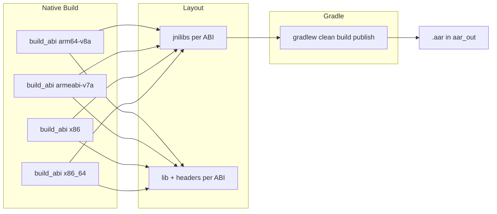

# Plan: ONNX Runtime Android-Build mit AAR-Ausgabe

*(Umgesetzt. Skript: [build_onnxruntime_android_aar.sh](react-native-sherpa-onnx/third_party/onnxruntime_prebuilt/build_onnxruntime_android_aar.sh).)*

## Ziel

Ein Aufruf von [build_onnxruntime_android_aar.sh](react-native-sherpa-onnx/third_party/onnxruntime_prebuilt/build_onnxruntime_android_aar.sh) soll:

- Alle vier ABIs mit **CPU, XNNPACK, Java-Bridge** bauen; **NNAPI** für armeabi-v7a, x86, x86_64; **QNN** nur für arm64-v8a (NNAPI für arm64-v8a weiterhin aus).
- Am Ende eine **.aar** erzeugen (Java-API + alle nativen Libs), sodass die App nur diese eine Runtime nutzt und **ohne pickFirst** auskommt.

## Ablauf (Überblick)

## 1. Native-Build-Flags in `build_onnxruntime_android_aar.sh`

**Datei:** [third_party/onnxruntime_prebuilt/build_onnxruntime_android_aar.sh](react-native-sherpa-onnx/third_party/onnxruntime_prebuilt/build_onnxruntime_android_aar.sh)

- **Für alle ABIs** zu den bestehenden `build.sh`-Argumenten ergänzen:
  - `--use_xnnpack`
  - `--build_java`
- Bestehende Logik unverändert lassen:
  - NNAPI nur für armeabi-v7a, x86, x86_64 (arm64-v8a ohne NNAPI).
  - QNN nur für arm64-v8a mit `--use_qnn=static_lib` und `--qnn_home "$QNN_SDK_ROOT"`.

Damit entsteht pro ABI unter `$ORT_SRC/build/android-$ABI/Release/` neben `libonnxruntime.so` auch `libonnxruntime4j_jni.so`.

## 2. Pro ABI beide .so kopieren und jnilibs füllen

**In der Funktion `build_abi` (nach erfolgreichem Build):**

- **Bestehendes beibehalten:**  
`libonnxruntime.so` und Headers wie bisher nach `$OUTPUT_BASE/$ABI/lib/` bzw. `$OUTPUT_BASE/$ABI/headers/` kopieren (für sherpa-onnx und andere Native-Consumer).
- **Ergänzen:**
  - Prüfen, ob `$BUILD_DIR/Release/libonnxruntime4j_jni.so` existiert; wenn ja, ebenfalls nach `$OUTPUT_BASE/$ABI/lib/` kopieren.
  - **jnilibs-Struktur für Gradle:** Verzeichnis `$OUTPUT_BASE/jnilibs/$ABI/` anlegen und darin ablegen (Kopie oder Symlink):
    - `libonnxruntime.so`
    - `libonnxruntime4j_jni.so`  
    Quelle: `$BUILD_DIR/Release/`.  
    Layout wie in [build_aar_package.py](react-native-sherpa-onnx/third_party/onnxruntime/tools/ci_build/github/android/build_aar_package.py) (Zeilen 126–136): ein Ordner pro ABI mit genau diesen beiden Libs.

## 3. Gradle-AAR-Schritt nach allen ABIs

**Nach der Schleife über alle ABIs** (wenn alle vier Builds erfolgreich waren):

- **Umgebung:**  
`ANDROID_HOME` (oder `ANDROID_SDK`) setzen, damit der Android-Gradle-Plugin-Build funktioniert (bereits im Script vorhanden).
- **Gradle ausführen** aus dem ORT-Java-Verzeichnis `$ORT_SRC/java/`:
  - Wrapper: `$ORT_SRC/java/gradlew` (unter Windows: `gradlew.bat`).
  - Aufruf wie in [build_aar_package.py](react-native-sherpa-onnx/third_party/onnxruntime/tools/ci_build/github/android/build_aar_package.py) (Zeilen 161–186):
    - `-b=build-android.gradle`
    - `-c=settings-android.gradle`
    - `-DjniLibsDir=$OUTPUT_BASE/jnilibs`
    - `-DbuildDir=$OUTPUT_BASE/aar_build` (Gradle-Build-Ausgabe)
    - `-DheadersDir=$OUTPUT_BASE/arm64-v8a/headers` (oder ein anderer ABI-Headers-Ordner; Inhalt ist gleich)
    - `-DpublishDir=$OUTPUT_BASE/aar_out`
    - `-DminSdkVer=24` (oder an `ANDROID_API` anpassen, z. B. 24–27; Abgleich mit ORT-Default 24)
    - `-DtargetSdkVer=34`
    - `-DreleaseVersionSuffix=$RELEASE_VERSION_SUFFIX` (optional, leer wenn nicht gesetzt)
  - **Falls `ENABLE_QNN=ON`:** QNN-Version aus `$QNN_SDK_ROOT/sdk.yaml` auslesen (Zeile mit `version:`, Format z. B. `2.26.0`; nur major.minor.patch verwenden) und `-DqnnVersion=<version>` an Gradle übergeben (wie in build_aar_package.py Zeilen 181–183), damit die AAR als QNN-Variante benannt wird und das POM konsistent ist.
  - Nacheinander ausführen: `clean`, `build`, `publish`.
- **Ergebnis:**  
Die .aar landet im Maven-Layout unter `$OUTPUT_BASE/aar_out/` (z. B. `$OUTPUT_BASE/aar_out/com/microsoft/onnxruntime/onnxruntime-android-qnn/<version>/onnxruntime-android-qnn-<version>.aar` bei QNN-Build, sonst ohne `-qnn`).  
Optional: Am Ende eine Zeile ausgeben, die den genauen Pfad zur .aar angibt (z. B. über `find` oder festen Pfad aus `VERSION_NUMBER`), um die „eine AAR“ klar zu dokumentieren.

## 4. Optionale Steuerung (empfohlen)

- `**--no-aar`** (oder vergleichbar): Wenn gesetzt, wird der Gradle-Schritt (Schritt 3) übersprungen. Dann verhält sich das Script wie heute „nur Native“ (plus XNNPACK/Java-Build), mit Ausgabe nur unter `$OUTPUT_BASE/<abi>/lib` und `.../headers` sowie `$OUTPUT_BASE/jnilibs/`.  
So können Nutzer, die nur sherpa-onnx bauen oder die AAR extern packen wollen, den AAR-Schritt weglassen.

## 5. Dokumentation und Hinweise im Script

- **Kopfkommentar:**  
Erwähnen, dass das Script optional eine .aar baut (wenn nicht `--no-aar`), mit XNNPACK und Java-Bridge; NNAPI für arm64-v8a deaktiviert; Ausgabe der AAR unter `$OUTPUT_BASE/aar_out/`.
- **Am Ende:**  
Kurze Ausgabe: „Prebuilts in $OUTPUT_BASE//lib und .../headers; AAR in $OUTPUT_BASE/aar_out/ (falls gebaut).“

## 6. Abhängigkeiten / Voraussetzungen

- **Java/Gradle:** Gradle-Wrapper liegt unter `$ORT_SRC/java/`; `JAVA_HOME` sollte gesetzt sein, damit `gradlew` läuft.
- **ORT-VERSION:** `$ORT_SRC/VERSION_NUMBER` wird von [build-android.gradle](react-native-sherpa-onnx/third_party/onnxruntime/java/build-android.gradle) (rootProject.file('../VERSION_NUMBER')) gelesen; kein eigener VERSION_NUMBER nötig.

## 7. Nicht im Scope dieses Plans

- **NNAPI arm64-v8a (Duplicate Symbol):** Wird bewusst nicht geändert; arm64-v8a bleibt ohne NNAPI.
- **pickFirst / App-Anbindung:** Die spätere Umstellung der App (bzw. [android/build.gradle](react-native-sherpa-onnx/android/build.gradle)) auf ausschließlich diese .aar und Entfernen der Maven-ORT-Abhängigkeit sowie von pickFirst ist ein separater Schritt (nach Verfügbarkeit der AAR).

## Kurz-Checkliste Implementierung

| Schritt | Inhalt                                                                                                                      |
| ------- | --------------------------------------------------------------------------------------------------------------------------- |
| 1       | In `build_abi` für alle ABIs `--use_xnnpack` und `--build_java` an `build.sh` übergeben                                     |
| 2       | Nach Build: `libonnxruntime4j_jni.so` aus `$BUILD_DIR/Release/` prüfen und nach `$OUTPUT_BASE/$ABI/lib/` kopieren           |
| 3       | `$OUTPUT_BASE/jnilibs/$ABI/` anlegen und beide .so dorthin kopieren (oder symlinken)                                        |
| 4       | Nach allen ABIs: Gradle mit jniLibsDir/buildDir/headersDir/publishDir/minSdkVer/targetSdkVer (und ggf. qnnVersion) aufrufen |
| 5       | Optional: `--no-aar` einführen und Gradle nur ausführen, wenn AAR gewünscht                                                 |
| 6       | Kommentar und Echo am Ende anpassen (AAR-Pfad, Verhalten)                                                                   |

