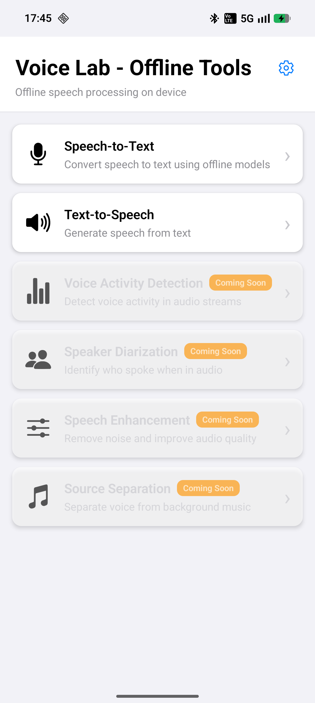
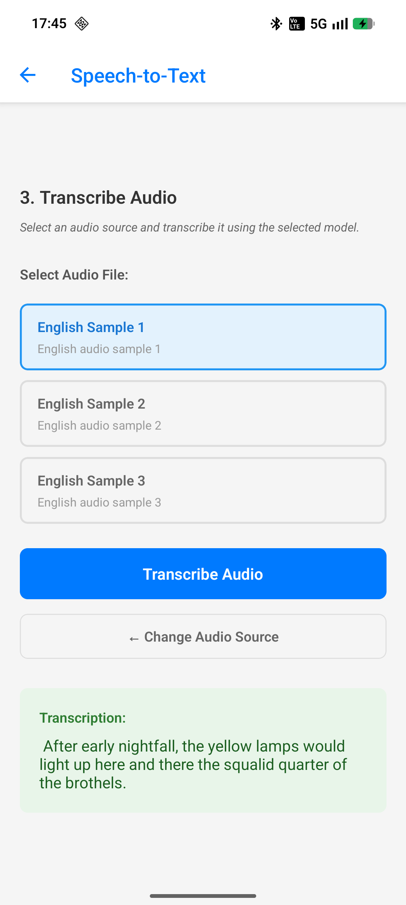
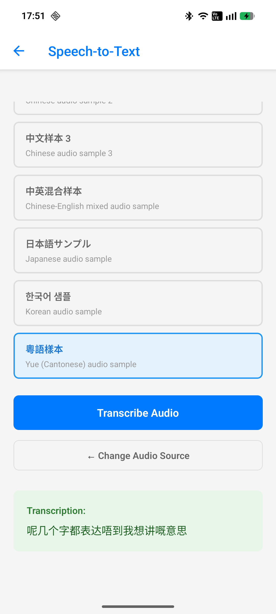
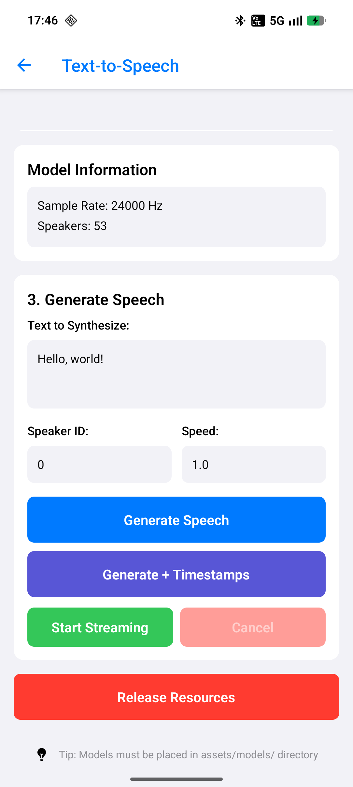
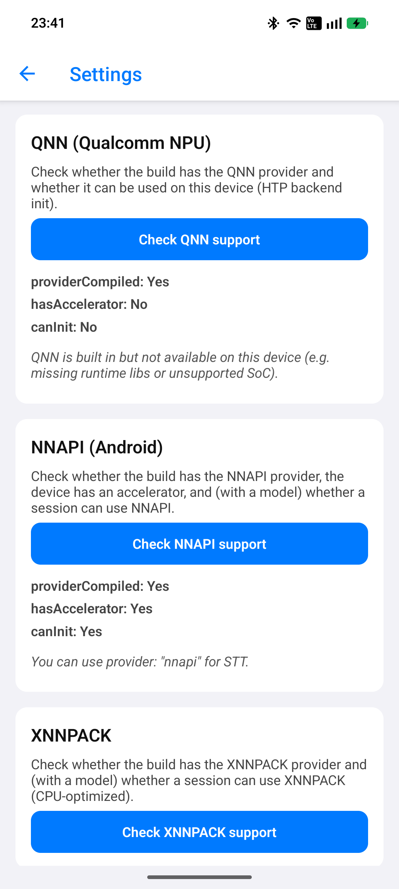

# react-native-sherpa-onnx

React Native SDK for sherpa-onnx - providing offline speech processing capabilities

<div align="center">
  
</div>

<div align="center">

[](https://www.npmjs.com/package/react-native-sherpa-onnx)
[](https://www.npmjs.com/package/react-native-sherpa-onnx)
[](https://www.npmjs.com/package/react-native-sherpa-onnx)
[](https://www.android.com/)
[](https://www.apple.com/ios/)

</div>

A React Native TurboModule that provides offline speech processing capabilities using [sherpa-onnx](https://github.com/k2-fsa/sherpa-onnx). The SDK aims to support all functionalities that sherpa-onnx offers, including offline speech-to-text, text-to-speech, speaker diarization, speech enhancement, source separation, and VAD (Voice Activity Detection).

## Feature Support

| Feature | Status |
|---------|--------|
| Offline Speech-to-Text | ✅ **Supported** |
| Text-to-Speech | ✅ **Supported** |
| Execution providers (CPU, NNAPI, XNNPACK, Core ML, QNN) | ✅ **Supported** (see [Execution provider support](./docs/execution-providers.md)) |
| Play Asset Delivery (PAD) | ✅ **Supported** (Android; see [Model Setup](./docs/MODEL_SETUP.md)) |
| Speaker Diarization | ❌ Not yet supported |
| Speech Enhancement | ❌ Not yet supported |
| Source Separation | ❌ Not yet supported |
| VAD (Voice Activity Detection) | ❌ Not yet supported |

## Platform Support Status

| Platform | Status | Notes |
|----------|--------|-------|
| **Android** | ✅ **Production Ready** | Fully tested, CI/CD automated, multiple models supported |
| **iOS** | 🟡 **Beta / Experimental** | XCFramework + Podspec ready<br/>**Full support soon** |

## Supported Model Types

### Speech-to-Text (STT) Models

| Model Type               | `modelType` Value | Description                                                                              | Download Links                                                                                   |
| ------------------------ | ----------------- | ---------------------------------------------------------------------------------------- | ------------------------------------------------------------------------------------------------ |
| **Zipformer/Transducer** | `'transducer'`    | Requires `encoder.onnx`, `decoder.onnx`, `joiner.onnx`, and `tokens.txt`                 | [Download](https://k2-fsa.github.io/sherpa/onnx/pretrained_models/offline-transducer/index.html) |
| **Paraformer**           | `'paraformer'`    | Requires `model.onnx` (or `model.int8.onnx`) and `tokens.txt`                            | [Download](https://k2-fsa.github.io/sherpa/onnx/pretrained_models/offline-paraformer/index.html) |
| **NeMo CTC**             | `'nemo_ctc'`      | Requires `model.onnx` (or `model.int8.onnx`) and `tokens.txt`                            | [Download](https://k2-fsa.github.io/sherpa/onnx/pretrained_models/offline-ctc/nemo/index.html)   |
| **Whisper**              | `'whisper'`       | Requires `encoder.onnx`, `decoder.onnx`, and `tokens.txt`                                | [Download](https://k2-fsa.github.io/sherpa/onnx/pretrained_models/whisper/index.html)            |
| **WeNet CTC**            | `'wenet_ctc'`     | Requires `model.onnx` (or `model.int8.onnx`) and `tokens.txt`                            | [Download](https://k2-fsa.github.io/sherpa/onnx/pretrained_models/offline-ctc/wenet/index.html)  |
| **SenseVoice**           | `'sense_voice'`   | Requires `model.onnx` (or `model.int8.onnx`) and `tokens.txt`                            | [Download](https://k2-fsa.github.io/sherpa/onnx/pretrained_models/sense-voice/index.html)        |
| **FunASR Nano**          | `'funasr_nano'`   | Requires `encoder_adaptor.onnx`, `llm.onnx`, `embedding.onnx`, and `tokenizer` directory | [Download](https://k2-fsa.github.io/sherpa/onnx/pretrained_models/funasr-nano/index.html)        |

### Text-to-Speech (TTS) Models

| Model Type       | `modelType` Value | Description                                                                                          | Download Links                                                                      |
| ---------------- | ----------------- | ---------------------------------------------------------------------------------------------------- | ----------------------------------------------------------------------------------- |
| **VITS**         | `'vits'`          | Fast, high-quality TTS. Includes Piper, Coqui, MeloTTS, MMS variants. Requires `model.onnx`, `tokens.txt` | [Download](https://github.com/k2-fsa/sherpa-onnx/releases/tag/tts-models)          |
| **Matcha**       | `'matcha'`        | High-quality acoustic model + vocoder. Requires `acoustic_model.onnx`, `vocoder.onnx`, `tokens.txt` | [Download](https://k2-fsa.github.io/sherpa/onnx/tts/pretrained_models/matcha.html) |
| **Kokoro**       | `'kokoro'`        | Multi-speaker, multi-language. Requires `model.onnx`, `voices.bin`, `tokens.txt`, `espeak-ng-data/` | [Download](https://github.com/k2-fsa/sherpa-onnx/releases/tag/tts-models)          |
| **KittenTTS**    | `'kitten'`        | Lightweight, multi-speaker. Requires `model.onnx`, `voices.bin`, `tokens.txt`, `espeak-ng-data/`    | [Download](https://github.com/k2-fsa/sherpa-onnx/releases/tag/tts-models)          |
| **Zipvoice**     | `'zipvoice'`      | Voice cloning capable. Requires `encoder.onnx`, `decoder.onnx`, `vocoder.onnx`, `tokens.txt`        | [Download](https://k2-fsa.github.io/sherpa/onnx/tts/pretrained_models/zipvoice.html) |
| **Pocket**       | `'pocket'`        | Flow-matching TTS. Requires `lm_flow.onnx`, `lm_main.onnx`, `encoder.onnx`, `decoder.onnx`, `text_conditioner.onnx`, `vocab.json`, `token_scores.json` | [Download](https://github.com/k2-fsa/sherpa-onnx/releases/tag/tts-models) |

## Features

- ✅ **Offline Speech-to-Text** – No internet connection required for speech recognition
- ✅ **Multiple STT model types** – Zipformer/Transducer, Paraformer, NeMo CTC, Whisper, WeNet CTC, SenseVoice, FunASR Nano
- ✅ **Multiple TTS model types** – VITS (Piper, Coqui, etc.), Matcha, Kokoro, KittenTTS, Zipvoice, Pocket
- ✅ **Model type detection** – `detectSttModel()` and `detectTtsModel()` let you query the model type for a path **automatically**. See [Model Setup: Model type detection](./docs/MODEL_SETUP.md#model-type-detection-without-initialization).
- ✅ **Model quantization** – Automatic detection and preference for quantized (int8) models
- ✅ **Flexible model loading** – Asset models, file system models, or auto-detection
- ✅ **Execution providers** – CPU, NNAPI (Android), XNNPACK, Core ML (iOS), QNN (Android, optional). See [Execution provider support](./docs/execution-providers.md).
- ✅ **Android** – Fully supported; native libs and optional QNN via [sherpa-onnx-prebuilt](third_party/sherpa-onnx-prebuilt/README.md)
- ✅ **iOS** – Fully Supported;
- ✅ **TypeScript** – Full TypeScript definitions included
- ✅ **Play Asset Delivery (PAD)** – Ship large models in an Android asset pack; [Model Setup](./docs/MODEL_SETUP.md) covers PAD, debug with Metro, and release

## Installation

```sh
npm install react-native-sherpa-onnx
```

If your project uses Yarn (v3+) or Plug'n'Play, configure Yarn to use the Node Modules linker to avoid postinstall issues:

```yaml
# .yarnrc.yml
nodeLinker: node-modules
```

Alternatively, set the environment variable during install:

```sh
YARN_NODE_LINKER=node-modules yarn install
```

### Android

No additional setup required. The library automatically handles native dependencies via Gradle. For execution provider support (CPU, NNAPI, XNNPACK, QNN) and optional QNN setup, see [Execution provider support](./docs/execution-providers.md). For building Android native libs yourself, see [sherpa-onnx-prebuilt](third_party/sherpa-onnx-prebuilt/README.md).


### iOS

The sherpa-onnx **XCFramework is not shipped in the repo or npm** (size ~80MB). It is **downloaded automatically** when you run `pod install`; no manual steps are required. The version used is pinned in `third_party/sherpa-onnx-prebuilt/IOS_RELEASE_TAG` and the archive is fetched from [GitHub Releases](https://github.com/XDcobra/react-native-sherpa-onnx/releases?q=framework).

#### Setup

```sh
cd your-app/ios
bundle install
bundle exec pod install
```

The podspec runs `scripts/setup-ios-framework.sh`, which downloads the XCFramework (and, if needed, libarchive sources) so the Pod builds correctly. Libarchive is compiled from source as part of the Pod; its version is pinned in `third_party/libarchive_prebuilt/IOS_RELEASE_TAG`.

#### For Advanced Users: Building the Framework Locally
#### Advanced: Building the iOS framework yourself

If you need a custom sherpa-onnx build (e.g. different version or patches), you can build the XCFramework and place it in `ios/Frameworks/` before running `pod install`. The repo does not include an iOS build script; use one of:

- **This repo's CI:** The [build-sherpa-onnx-ios-framework](.github/workflows/build-sherpa-onnx-ios-framework.yml) workflow produces the XCFramework and publishes it as a GitHub Release. You can run equivalent steps locally or inspect the workflow for the exact build and merge steps (including `libsherpa-onnx-cxx-api.a` and libarchive).
- **Version and layout:** Pinned version and release layout are documented in [third_party/sherpa-onnx-prebuilt](third_party/sherpa-onnx-prebuilt/README.md) (Android focus; for iOS, see `IOS_RELEASE_TAG` and the [iOS framework workflow](.github/workflows/build-sherpa-onnx-ios-framework.yml)).

The XCFramework must include the C++ API (`libsherpa-onnx-cxx-api.a` merged or linked) so that the iOS Obj-C++ code can use `sherpa_onnx::cxx::*`. The workflow's build script ensures this; if you use upstream `build-ios.sh` from sherpa-onnx, you may need to merge the C++ API into the static library yourself.

- [Text-to-Speech (TTS)](./docs/tts.md)
- [Execution provider support (QNN, NNAPI, XNNPACK, Core ML)](./docs/execution-providers.md) – Checking and using acceleration backends
- [Voice Activity Detection (VAD)](./docs/vad.md)
- [Speaker Diarization](./docs/diarization.md)
- [Speech Enhancement](./docs/enhancement.md)
- [Source Separation](./docs/separation.md)
- [Model Setup](./docs/MODEL_SETUP.md) – Bundled assets, Play Asset Delivery (PAD), model discovery APIs, and troubleshooting
- [Model Download Manager](./docs/download-manager.md)

Note: For when to use `listAssetModels()` vs `listModelsAtPath()` and how to combine bundled and PAD/file-based models, see [Model Setup](./docs/MODEL_SETUP.md).

## Requirements

- React Native >= 0.70
- Android API 24+ (Android 7.0+)
- iOS 13.0+

## Breaking changes (upgrading to 0.3.0)

If you are upgrading from an earlier version to **0.3.0**, plan for the following migration steps.

### Instance-based API (TTS + STT)

TTS and STT now use an instance-based factory pattern instead of module-level singletons. Each call to `createTTS()` / `createSTT()` returns an independent engine instance. You **must** call `.destroy()` when done to free native resources.

**TTS Before:**

```ts
initializeTTS({ modelPath: { type: 'asset', path: 'models/vits' } });
const audio = await generateSpeech('Hello');
await unloadTTS();
```

**TTS After:**

```ts
const tts = await createTTS({ modelPath: { type: 'asset', path: 'models/vits' } });
const audio = await tts.generateSpeech('Hello');
await tts.destroy();
```

**STT Before:**

```ts
await initializeSTT({ modelPath: { type: 'asset', path: 'models/whisper' } });
const result = await transcribeFile('/audio.wav');
await unloadSTT();
```

**STT After:**

```ts
const stt = await createSTT({ modelPath: { type: 'asset', path: 'models/whisper' } });
const result = await stt.transcribeFile('/audio.wav');
await stt.destroy();
```

### Speech-to-Text (STT)

- **`transcribeFile`** now returns `Promise<SttRecognitionResult>` (an object with `text`, `tokens`, `timestamps`, `lang`, `emotion`, `event`, `durations`) instead of `Promise<string>`. For text only, use `(await transcribeFile(path)).text`.
- **`initializeSTT`** supports two additional optional options: `hotwordsFile` and `hotwordsScore`. The native TurboModule methods were renamed from `initializeSherpaOnnx` / `unloadSherpaOnnx` to `initializeStt` / `unloadStt`.
- **Removed deprecated type:** `TranscriptionResult` has been removed. Use `SttRecognitionResult` instead (same shape).

### Text-to-Speech (TTS)

- **Instance-based API:** Use `createTTS()` to get a `TtsEngine`; call `tts.generateSpeech()`, `tts.generateSpeechStream()`, etc., then `tts.destroy()`. See [Instance-based API (TTS + STT)](#instance-based-api-tts--stt) above. If you call the **TurboModule directly**, all instance-bound methods now take `instanceId` as the first parameter (see [docs/tts.md – Mapping to Native API](./docs/tts.md#mapping-to-native-api)).
- **TTS model-specific options (breaking for versions &lt; 0.3.0):**  
  Init and update no longer use flat `noiseScale`, `noiseScaleW`, and `lengthScale` on the options object. Use **`modelOptions`** instead, with one block per model type (aligned with the STT `modelOptions` design):
  - **`createTTS` (init):** Replace flat `noiseScale`, `noiseScaleW`, `lengthScale` with `modelOptions`. Only the block for the loaded model type is applied.  
    **Before (old API):** `initializeTTS({ modelPath, modelType: 'vits', noiseScale: 0.667, noiseScaleW: 0.8, lengthScale: 1.0 })`  
    **After:** `createTTS({ modelPath, modelType: 'vits', modelOptions: { vits: { noiseScale: 0.667, noiseScaleW: 0.8, lengthScale: 1.0 } } })`
  - **`tts.updateParams`:** Replace flat `noiseScale` / `noiseScaleW` / `lengthScale` with `modelOptions` (and optionally `modelType`). When `modelType` is omitted, the engine uses the type from `createTTS()`.  
    **Before (old API):** `updateTtsParams({ noiseScale: 0.7, lengthScale: 1.2 })`  
    **After:** `tts.updateParams({ modelOptions: { vits: { noiseScale: 0.7, lengthScale: 1.2 } } })` or `tts.updateParams({ modelType: 'vits', modelOptions: { vits: { ... } } })`
  - Types: `TtsModelOptions`, `TtsVitsModelOptions`, `TtsMatchaModelOptions`, `TtsKokoroModelOptions`, `TtsKittenModelOptions`, `TtsPocketModelOptions` are exported from the TTS module. See [docs/tts.md](./docs/tts.md) for details.
- **Removed deprecated type:** `SynthesisOptions` has been removed. Use `TtsGenerationOptions` instead (same shape).

## Example Apps

We provide example applications to help you get started with `react-native-sherpa-onnx`:

### Example App (Audio to Text)

The example app included in this repository demonstrates basic audio-to-text transcription capabilities. It includes:

- Multiple model type support (Zipformer, Paraformer, NeMo CTC, Whisper, WeNet CTC, SenseVoice, FunASR Nano)
- Model selection and configuration
- Audio file transcription
- Test audio files for different languages

**Getting started:**

```sh
cd example
yarn install
yarn android  # or yarn ios
```

<div align="center">
<table>
<tr>
<td></td>
<td></td>
<td></td>
</tr>
<tr>
<td></td>
<td></td>
</tr>
</table>
</div>

### Video to Text Comparison App

A comprehensive comparison app that demonstrates video-to-text transcription using `react-native-sherpa-onnx` alongside other speech-to-text solutions:

**Repository:** [mobile-videototext-comparison](https://github.com/XDcobra/mobile-videototext-comparison)

**Features:**

- Video to audio conversion (using native APIs)
- Audio to text transcription
- Video to text (video --> WAV --> text)
- Comparison between different STT providers
- Performance benchmarking

This app showcases how to integrate `react-native-sherpa-onnx` into a real-world application that processes video files and converts them to text.

<div align="center">
  
  
  
</div>

## Contributing

- [Development workflow](CONTRIBUTING.md#development-workflow)
- [Sending a pull request](CONTRIBUTING.md#sending-a-pull-request)
- [Code of conduct](CODE_OF_CONDUCT.md)

## License

MIT

---

Made with [create-react-native-library](https://github.com/callstack/react-native-builder-bob)
