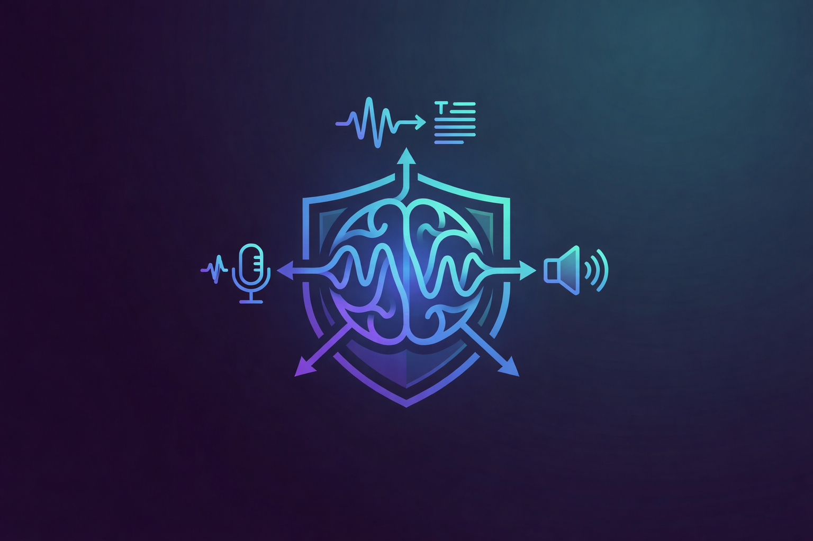
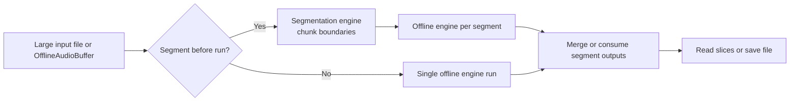
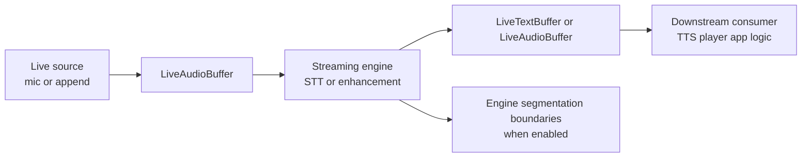
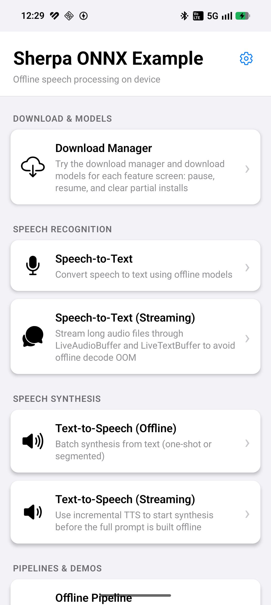
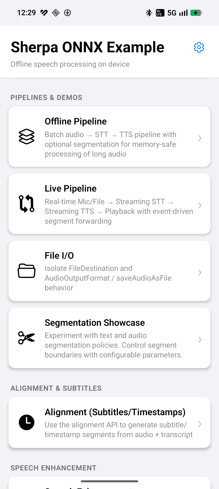
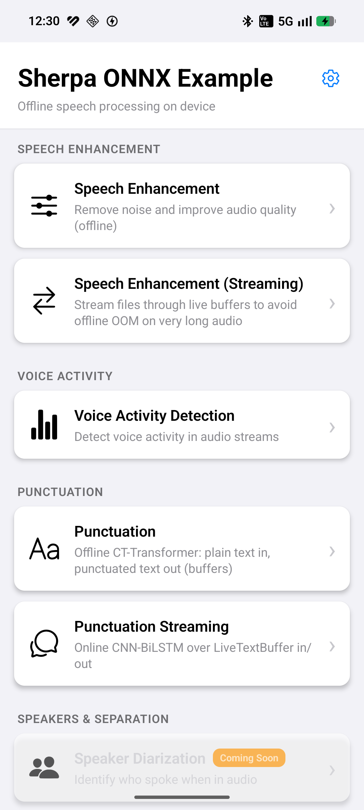

# react-native-sherpa-onnx

React Native SDK for sherpa-onnx – offline and streaming speech processing

<div align="center">
  
</div>

<div align="center">

[](https://www.npmjs.com/package/react-native-sherpa-onnx)
[](https://www.npmjs.com/package/react-native-sherpa-onnx)
[](https://www.npmjs.com/package/react-native-sherpa-onnx)
[](https://www.android.com/)
[](https://www.apple.com/ios/)

<a href="https://www.buymeacoffee.com/xdcobra" target="_blank"></a>

</div>

> **⚠️ SDK 1.0.0 – Breaking changes from 0.4.0**
> This project started as a side hobby. In practice I kept hitting the same wall: sherpa-onnx (and other React Native speech libraries) struggle with **long audio on real mobile devices**—OOM crashes, UI stalls, and brittle one-shot pipelines. Fixing that properly meant redesigning the SDK structure and internal architecture from the ground up, which caused a large breaking change. The result is a more stable SDK built for low-end and mid-range phones, with significantly better performance and a cleaner, more consistent public API.

A high-performance React Native TurboModule for on-device speech AI powered by [sherpa-onnx](https://github.com/k2-fsa/sherpa-onnx).

**More than a raw C++ wrapper:** Unlike simple 1:1 model bindings that crash on large files or stall the UI thread, this SDK is a complete **native audio & AI orchestration engine**. It brings native-to-native pipeline buffers, memory-mapped I/O, automated segmentation, and cross-stage streaming so you can run heavy offline and streaming models (STT, TTS, VAD, Keyword Spotting, Audio Tagging, Speaker Diarization, SID, Spoken Language Identification, Speech Enhancement, Source Separation, Punctuation, and Alignment) reliably even on resource-constrained, low-end mobile devices; not just high-end flagship smartphones.

## Installation

```sh
npm install react-native-sherpa-onnx
```

### Android

No additional setup required.

Optional: if you want Qualcomm acceleration, see QNN setup in [Execution provider support](./docs/execution-providers.md).

### iOS

```sh
cd your-app/ios
bundle install
bundle exec pod install
```

#### Model download (optional)

If you use the [download manager](docs/download-manager.md) to fetch models at runtime, install the peer dependency:

```sh
npm install @dr.pogodin/react-native-fs
```

Setup, resume behavior, and optional `configureDownloadManager`: [Download manager – Setup (iOS & Android)](docs/download-manager.md#setup-ios--android).

## Feature Support

Full doc index: [docs/README.md](./docs/README.md). New to models? See [How to start](#how-to-start).

### Speech & media features

- ✅ Speech-to-Text (STT): [Offline](./docs/stt-offline.md) · [Streaming](./docs/stt-streaming.md) · [Hotwords](./docs/hotwords.md)
- ✅ Text-to-Speech (TTS): [Offline](./docs/tts-offline.md) · [Live overload](./docs/tts-live.md)
- ✅ Android system TTS engine: [Register as device-wide engine](./docs/android-system-tts.md) *(Android only, Kotlin, opt-in)*
- ✅ Speech Enhancement: [Offline](./docs/enhancement-offline.md) · [Streaming](./docs/enhancement-streaming.md)
- ✅ Source separation: [Offline](./docs/separation-offline.md) · [Live overload](./docs/separation-live.md)
- ✅ Punctuation: [Offline](./docs/punctuation-offline.md) · [Streaming](./docs/punctuation-streaming.md)
- ✅ VAD: [Streaming](./docs/vad-streaming.md)
- ✅ Alignment / timestamps: [Offline](./docs/alignment-offline.md)
- ✅ Speaker identification: [Offline](./docs/speaker-identification-offline.md) · [Live overload](./docs/speaker-identification-live.md)
- ✅ Speaker diarization: [Offline](./docs/diarization-offline.md) · [Streaming](./docs/diarization-streaming.md)
- ✅ Speaker identification × Speaker diarization: [Named timeline](./docs/diarization-named-timeline.md)
- ✅ Spoken language identification (SLID): [Offline](./docs/language-identification-offline.md) · [Live overload](./docs/language-identification-live.md)
- ✅ Keyword spotting (KWS): [Streaming](./docs/kws-streaming.md)
- ✅ Audio tagging / sound event detection: [Offline](./docs/audio-tagging-offline.md) · [Live overload](./docs/audio-tagging-live.md)
- ❌ Diacritization: *(Planned for a future release)*

### Pipeline & orchestration

- ✅ Offline pipeline buffers: [Audio](./docs/audiobuffer-offline.md) · [Text](./docs/textbuffer-offline.md) · [Segment](./docs/segmentbuffer-offline.md)
- ✅ Live pipeline buffers: [Audio](./docs/audiobuffer-streaming.md) · [Text](./docs/textbuffer-streaming.md) · [Segment](./docs/segmentbuffer-streaming.md)
- ✅ Native chaining & recipes: [Feature pipelines](./docs/feature-pipelines.md) · [Streaming pipeline lifecycle](./docs/streaming-pipelines-overview.md)
- ✅ Long audio & OOM mitigation: [Segmentation engine](./docs/segmentation-engine.md)
- ✅ Audio session and routing: [Pipeline Audio Session](./docs/audio-session.md)
- ✅ File and conversion I/O: [File I/O](./docs/fileio.md) · [Audio save / conversion](./docs/audio-conversion.md)

### Playback, models & platform

- ✅ Playback & visualization: [PCM Player](./docs/pcm-player.md) · [Audio visualization](./docs/audio-visualization.md)
- ✅ Model setup & detection: [Model setup](./docs/model-setup.md) · [Model detection & init](./docs/model-detect.md) · [Model languages](./docs/model-languages.md)
- ✅ Runtime model delivery: [Download manager](./docs/download-manager.md) · [Extraction API](./docs/extraction.md) · [PAD & ODR](./docs/model-delivery-pad-odr.md)
- ✅ Acceleration & diagnostics: [Execution providers](./docs/execution-providers.md) · [Native diagnostics](./docs/native-diagnostics.md) · [Memory planning](./docs/memory-and-models.md)
- ✅ Build optimization: [Disable FFmpeg](./docs/disable-ffmpeg.md) · [Disable libarchive](./docs/disable-libarchive.md)

## How to start

Every feature needs **model files on disk** and a way to point the SDK at them. Read these guides **in order** before diving into STT, TTS, VAD, or any other feature doc:

| Step | Doc | You learn |
| --- | --- | --- |
| **1** | [Model setup](./docs/model-setup.md) | Where models live (bundled app assets, downloads, PAD/ODR), how **`FileSource`** works, expected folder layouts |
| **2** | [Model detection & init](./docs/model-detect.md) | Cheap preflight with `detect*Model`, **`auto` vs `custom`** init, required-file validation |
| **3** | [Feature pipelines](./docs/feature-pipelines.md) | End-to-end recipes and how features chain (buffers, segmentation, live overload) |
| **4** | Your **feature doc** | Quick start + API for the engine you need — see below |

**Optional, depending on your app:**

| Need | Read |
| --- | --- |
| Large models shipped outside the main APK/IPA | [PAD & ODR delivery](./docs/model-delivery-pad-odr.md) (after step 1) |
| Download models at runtime | [Download manager](./docs/download-manager.md) |
| Long audio or offline-only models on low-end devices (OOM risk) | [Segmentation engine](./docs/segmentation-engine.md) — process bounded chunks instead of one monolithic pass; essential on modest RAM when a full-file load would exhaust memory |
| RAM planning for large files or chained engines | [Memory and models](./docs/memory-and-models.md) |
| Other apps should use your TTS voices (Maps, accessibility, system settings) | [Android system TTS](./docs/android-system-tts.md) — Kotlin `TextToSpeechService`; deliver model via PAD/extract in RN |

Full doc index: [docs/README.md](./docs/README.md).


## Built for Low-End & Real-World Mobile Devices

*Sherpa-onnx loads weights natively - this wrapper minimizes how much you need in RAM at once.*

**This SDK is built around that constraint.** Pipelines, buffers, and orchestration aim for a **low peak-RAM profile** so you can:

- run **one feature** (STT, TTS, enhancement, punctuation, …) performantly on phones that are not flagships, and  
- **chain features**—offline batch or live streaming—with **shared buffer contracts** and less duplicate loading than one-off native glue.

**How the wrapper helps (without changing sherpa-onnx physics):**

| Approach / Capability | Generic / Raw Wrappers | What react-native-sherpa-onnx buys you |
|---|---|---|
| **Segmentation engine (Long-form audio)** | ❌ Crashes with OOM on files > 2–3 minutes; monolithic single-pass load | ✅ **Hour-long audio processing:** Offline models run segment-by-segment with a predictable memory ceiling; multi-hour podcasts and meetings run reliably even on modest devices (≤ 2 GB RAM). [Segmentation engine](./docs/segmentation-engine.md) |
| **Zero-copy pipeline buffers (Bridge performance)** | ❌ Serializes huge base64 strings or Float32 arrays across JS bridge, causing UI thread lag | ✅ **Zero-copy native pipeline buffers:** Audio, text, and segment data stay in C++; only lightweight handle IDs cross the bridge. [Offline audio](./docs/audiobuffer-offline.md) · [Live audio](./docs/audiobuffer-streaming.md) |
| **Pipeline & feature recipes (Native chaining)** | ❌ Audio must round-trip through JS and re-serialize between every model step | ✅ **Native-to-native composite chaining:** Explicit stage lifetimes and direct C++ pipelines (e.g. `Enhancement ➔ STT ➔ Punctuation ➔ Alignment`). [SDK pipeline logic](#sdk-pipeline-logic) · [Feature pipelines](./docs/feature-pipelines.md) |
| **mmap & file-backed buffers (RAM footprint)** | ❌ Giant memory spikes (1.5–3× entire uncompressed audio file loaded into RAM heap) | ✅ **Kernel memory mapping (`mmap`):** Long offline audio stays on disk; native code reads exact slices on demand, keeping peak RAM flat. [Offline audio buffer](./docs/audiobuffer-offline.md) |
| **Live ring + optional spool (Streaming & live overload)** | ❌ Unbounded memory growth during extended mic capture or live sessions | ✅ **Bounded ring buffers with disk spooling:** Streaming sessions keep a bounded window in memory; optional spool persists growth without giant memory buffers. [Live audio buffer](./docs/audiobuffer-streaming.md) |
| **Model detection & quantization parity** | ❌ Manual file path juggling and hardcoded model parameters | ✅ **Automatic architecture detection** across 10 domains with universal quantization (`'int8'`, `'fp16'`, `'int4'`, etc.). [Model detection & init](./docs/model-detect.md) |

**Key rules of thumb for mobile speech AI:**
- **Native heap accounting:** ONNX weights live in C++ memory and count against your OS process limit, not the JS heap.
- **Activation tensors:** Peak RAM during inference is typically **1.2–1.5× the weight size** (especially on encoder-decoder models like Whisper or Kokoro).
- **Quantization:** Prefer quantized models (`quantization: 'int8'`, auto-selected by default).
- **Prompt cleanup:** Always call `engine.release()` when a job or session completes to reclaim native memory.
- **Low-RAM devices (≤ 2 GB RAM):** Avoid loading heavy models (Whisper large, Kokoro, wav2vec2 alignment) concurrently.

→ Full memory planning guide & model size matrix: [docs/memory-and-models.md](./docs/memory-and-models.md)

## SDK pipeline logic

The SDK is built around TurboModule entry points and native pipeline buffers. In practice there are two execution styles:

- **Offline (batch):** complete inputs are processed to completion, then consumed downstream.
- **Streaming (live):** workers run continuously while producers and consumers exchange data through live buffers.

For named end-to-end recipes across features, see [Feature pipelines](./docs/feature-pipelines.md).

### Offline pipeline (batch)

Best when you already have complete input (file or full in-memory data) and want deterministic, one-shot output.


```mermaid
flowchart LR
  A[Large input file or OfflineAudioBuffer] --> B{Segment before run?}
  B -- Yes --> C[Segmentation engine\nchunk boundaries]
  C --> D[Offline engine per segment]
  B -- No --> E[Single offline engine run]
  D --> F[Merge or consume segment outputs]
  E --> F
  F --> G[Read slices or save file]
```

For offline-only model families and large inputs, segmenting first is often the safer default on phones: it bounds peak native RAM by running the same offline engine repeatedly on smaller chunks. That is how **hour-long** files and jobs on **less powerful** handsets stay within reach without loading the whole recording at once. See [Segmentation engine](./docs/segmentation-engine.md) and [Memory and models](./docs/memory-and-models.md#segmentation-engine-offline-only-models-and-oom-mitigation).

**Characteristics**
- Simple lifecycle (`create` -> `run` -> `read` -> `release`)
- Predictable completion semantics (`Promise<void>` when job is done)
- Good for file transcription, subtitle generation, and export jobs

### Streaming pipeline (live)

Best when data arrives over time (mic/live feed) or when low-latency chaining is needed.


```mermaid
flowchart LR
  A[Live source\nmic or append] --> B[LiveAudioBuffer]
  B --> C[Streaming engine\nSTT or enhancement]
  C --> D[LiveTextBuffer or LiveAudioBuffer]
  D --> E[Downstream consumer\nTTS player app logic]
  C --> F[Engine segmentation boundaries\nwhen enabled]
```

In streaming mode, multiple pipeline parts can run **at the same time**:
- upstream appends to live buffers
- current worker drains and processes
- downstream worker or consumer reads new units immediately

Where segmentation is enabled in streaming-capable APIs, boundary metadata is emitted by the engine and can be forwarded to downstream stages without duplicating large payloads. See [Segmentation engine](./docs/segmentation-engine.md).

**Advantages**
- Lower end-to-end latency (first results before full input is finished)
- Native-native chaining with less JS bridge traffic for steady-state data flow
- Better fit for real-time UX (partial STT, incremental TTS, live enhancement)

**Trade-offs**
- More lifecycle orchestration (`start/flush/reset/stop`, finalization order)
- Buffer/sample-rate compatibility must be managed carefully across stages
- Debugging timing/state issues can be more complex than batch mode

### Decision guide: offline vs streaming

Prefer **offline** when:
- input is already complete (audio file, full text)
- you need simple control flow and deterministic completion
- latency is less important than straightforward processing
- you can segment large offline jobs to keep native peak RAM bounded

Prefer **streaming** when:
- input arrives continuously (microphone/live feed)
- you need low time-to-first-result / low perceived latency
- you want concurrent stage execution (e.g. STT -> text buffer -> TTS -> audio buffer)
- the model family supports streaming and real-time output is required

## Supported Model Types

<details>
<summary>Speech-to-Text (STT) models</summary>

| Model Type               | `modelType` Value | Description                                                                              | Download Links                                                                                   |
| ------------------------ | ----------------- | ---------------------------------------------------------------------------------------- | ------------------------------------------------------------------------------------------------ |
| **Auto Detect**          | `'auto'`          | Automatically detects model layout/type from files in the model folder and picks the best supported STT type. | n/a |
| **Zipformer/Transducer** | `'transducer'`    | Encoder–decoder–joiner (e.g. icefall). Good balance of speed and accuracy. Folder name should contain **zipformer** or **transducer** for auto-detection. | [Download](https://k2-fsa.github.io/sherpa/onnx/pretrained_models/offline-transducer/index.html) |
| **LSTM Transducer**      | `'transducer'`    | Same layout as Zipformer (encoder–decoder–joiner). LSTM-based streaming ASR; detected as transducer. Folder name may contain **lstm**. | [Download](https://k2-fsa.github.io/sherpa/onnx/pretrained_models/online-transducer/lstm-transducer-models.html) |
| **Paraformer**           | `'paraformer'`    | Single-model non-autoregressive ASR; fast and accurate. Detected by `model.onnx`; no folder token required. | [Download](https://k2-fsa.github.io/sherpa/onnx/pretrained_models/offline-paraformer/index.html) |
| **NeMo CTC**             | `'nemo_ctc'`      | NeMo CTC; good for English and streaming. Folder name should contain **nemo** or **parakeet**. | [Download](https://k2-fsa.github.io/sherpa/onnx/pretrained_models/offline-ctc/nemo/index.html)   |
| **Whisper**              | `'whisper'`       | Multilingual, encoder–decoder; strong zero-shot. Detected by encoder+decoder (no joiner); folder token optional. | [Download](https://k2-fsa.github.io/sherpa/onnx/pretrained_models/whisper/index.html)            |
| **WeNet CTC**            | `'wenet_ctc'`     | CTC from WeNet; compact. Folder name should contain **wenet**. | [Download](https://k2-fsa.github.io/sherpa/onnx/pretrained_models/offline-ctc/wenet/index.html)  |
| **SenseVoice**           | `'sense_voice'`   | Multilingual with emotion/punctuation. Folder name should contain **sense** or **sensevoice**. | [Download](https://k2-fsa.github.io/sherpa/onnx/pretrained_models/sense-voice/index.html)        |
| **FunASR Nano**          | `'funasr_nano'`   | Lightweight LLM-based ASR. Folder name should contain **funasr** or **funasr-nano**. | [Download](https://k2-fsa.github.io/sherpa/onnx/pretrained_models/funasr-nano/index.html)        |
| **Qwen3 ASR**            | `'qwen3_asr'`     | Encoder–decoder ASR (Qwen3-ASR ONNX: conv frontend, encoder, decoder, tokenizer). Folder name should contain **qwen3**. Optional `modelOptions.qwen3Asr` (e.g. comma-separated hotwords). | [Download](https://github.com/k2-fsa/sherpa-onnx/releases/tag/asr-models) |
| **Cohere Transcribe**    | `'cohere_transcribe'` | Cohere Transcribe ONNX (encoder, decoder, `tokens.txt`). Folder name should contain **cohere**. Optional `modelOptions.cohereTranscribe` (language, punctuation, ITN). | [Download](https://github.com/k2-fsa/sherpa-onnx/releases/tag/asr-models) |
| **Moonshine (v1)**        | `'moonshine'`     | Four-part streaming-capable ASR (preprocess, encode, uncached/cached decode). Folder name should contain **moonshine**. | [Download](https://k2-fsa.github.io/sherpa/onnx/moonshine/index.html) |
| **Moonshine (v2)**        | `'moonshine_v2'`   | Two-part Moonshine (encoder + merged decoder); `.onnx` or `.ort`. Folder name should contain **moonshine** (v2 preferred if both layouts present). | [Download](https://k2-fsa.github.io/sherpa/onnx/moonshine/index.html) |
| **Fire Red ASR**         | `'fire_red_asr'`  | Fire Red encoder–decoder ASR. Folder name should contain **fire_red** or **fire-red**. | [Download](https://k2-fsa.github.io/sherpa/onnx/FireRedAsr/index.html) |
| **Dolphin**              | `'dolphin'`       | Single-model CTC. Folder name should contain **dolphin**. | [Download](https://k2-fsa.github.io/sherpa/onnx/Dolphin/index.html) |
| **Canary**               | `'canary'`        | NeMo Canary multilingual. Folder name should contain **canary**. | [Download](https://k2-fsa.github.io/sherpa/onnx/nemo/canary.html) |
| **Omnilingual**          | `'omnilingual'`   | Omnilingual CTC. Folder name should contain **omnilingual**. | [Download](https://k2-fsa.github.io/sherpa/onnx/omnilingual-asr/index.html) |
| **MedASR**               | `'medasr'`        | Medical ASR CTC. Folder name should contain **medasr**. | [Download](https://github.com/k2-fsa/sherpa-onnx) |
| **Telespeech CTC**       | `'telespeech_ctc'`| Telespeech CTC. Folder name should contain **telespeech**. | [Download](https://k2-fsa.github.io/sherpa/onnx/pretrained_models/telespeech/index.html) |
| **Tone CTC (t-one)**     | `'tone_ctc'`      | Lightweight streaming CTC (e.g. t-one). Folder name should contain **t-one**, **t_one**, or **tone** (as word). | [Download](https://k2-fsa.github.io/sherpa/onnx/pretrained_models/online-ctc/index.html) |

For **real-time (streaming) recognition** from a microphone or audio stream, use streaming-capable model types: `transducer`, `paraformer`, `zipformer2_ctc`, `nemo_ctc`, or `tone_ctc`. See [Streaming (Online) Speech-to-Text](./docs/stt-streaming.md).

</details>

<details>
<summary>Text-to-Speech (TTS) models</summary>

| Model Type       | `modelType` Value | Description                                                                                          | Download Links                                                                      |
| ---------------- | ----------------- | ---------------------------------------------------------------------------------------------------- | ----------------------------------------------------------------------------------- |
| **Auto Detect**   | `'auto'`              | Automatically detects the TTS model layout from files in the model folder and selects the matching supported type. | n/a |
| **VITS**         | `'vits'`          | Fast, high-quality TTS (Piper, Coqui, MeloTTS, MMS). Folder name should contain **vits** if used with other voice models. | [Download](https://github.com/k2-fsa/sherpa-onnx/releases/tag/tts-models)          |
| **Matcha**       | `'matcha'`        | High-quality acoustic model + vocoder. Detected by acoustic_model + vocoder; no folder token required. | [Download](https://k2-fsa.github.io/sherpa/onnx/tts/pretrained_models/matcha.html) |
| **Kokoro**       | `'kokoro'`        | Multi-speaker, multi-language. Folder name should contain **kokoro** (not kitten) for auto-detection. | [Download](https://github.com/k2-fsa/sherpa-onnx/releases/tag/tts-models)          |
| **KittenTTS**    | `'kitten'`        | Lightweight, multi-speaker. Folder name should contain **kitten** (not kokoro) for auto-detection. | [Download](https://github.com/k2-fsa/sherpa-onnx/releases/tag/tts-models)          |
| **Zipvoice**     | `'zipvoice'`      | Standard TTS with **`sid`**. **Voice cloning** (reference audio + `referenceText`): batch via **`generateSpeech`** only—streaming TTS does not support reference audio for Zipvoice. Default **`numSteps`** when omitted is **5** on **Android and iOS** (matches sherpa-onnx `GenerationConfig` / Kotlin helper). Cloning is **supported on Android & iOS**. Encoder + decoder + vocoder. | [Download](https://k2-fsa.github.io/sherpa/onnx/tts/pretrained_models/zipvoice.html) |
| **Pocket**       | `'pocket'`        | Flow-matching TTS. **Voice cloning** on **Android:** batch and streaming TTS. **iOS:** cloning is experimental. Detected by lm_flow, lm_main, text_conditioner, vocab/token_scores. | [Download](https://github.com/k2-fsa/sherpa-onnx/releases/tag/tts-models) |
| **Supertonic**    | `'supertonic'`        | Lightning-fast, on-device text-to-speech system designed for extreme performance with minimal computational overhead. | [Download](https://github.com/k2-fsa/sherpa-onnx/releases/tag/tts-models) |

For **live TTS pipelines** (segment-driven synthesis from live text), use `createTTS().synthesize(LiveTextBuffer, LiveAudioBuffer, { segmentation })`. See [Offline Text-to-Speech](./docs/tts-offline.md) ("Live overload on offline TTS").

To expose on-device voices as a **device-wide Android TTS engine** (system settings, other apps), see [Android system TTS](./docs/android-system-tts.md). Kotlin integration, opt-in — not enabled by installing the SDK alone.

</details>

<details>
<summary>Punctuation models</summary>

Punctuation supports an offline CT-Transformer path and a streaming CNN-BiLSTM path.

| Model Type | `modelType` Value | Runtime path | Description | Download Links |
| --- | --- | --- | --- | --- |
| **Auto Detect** | `'auto'` | Detection only | Detects punctuation layout and resolves whether the model is offline CT-Transformer or streaming CNN-BiLSTM. | n/a |
| **CT-Transformer** | `'ct_transformer'` | Offline | Batch punctuation over offline text buffers. | [Download](https://github.com/k2-fsa/sherpa-onnx/releases/tag/punctuation-models) |
| **CNN-BiLSTM** | `'cnn_bilstm'` | Streaming | Online punctuation over live text buffers. | [Download](https://github.com/k2-fsa/sherpa-onnx/releases/tag/punctuation-models) |

APIs and initialization: [offline batch](./docs/punctuation-offline.md), [streaming (live text)](./docs/punctuation-streaming.md).

</details>

<details>
<summary>Speech Enhancement models</summary>

Speech enhancement improves noisy or degraded speech using ONNX models from the sherpa-onnx **speech-enhancement-models** release. Detection looks for **`.onnx`** filenames containing **`gtcrn`** or **`dpdfnet`** (case-insensitive). With **`'auto'`**, **GTCRN** is preferred when both are present in the same folder.

| Model Type   | `modelType` Value | Description                                                                 | Download Links                                                                 |
| ------------ | ----------------- | --------------------------------------------------------------------------- | -------------------------------------------------------------------------------- |
| **Auto Detect** | `'auto'`       | Picks **GTCRN** if a matching `.onnx` exists, otherwise **DPDFNet** if found. | n/a                                                                              |
| **GTCRN**    | `'gtcrn'`         | Lightweight speech enhancement (e.g. `gtcrn_simple.onnx`).                  | [Download](https://github.com/k2-fsa/sherpa-onnx/releases/tag/speech-enhancement-models) |
| **DPDFNet**  | `'dpdfnet'`       | Deep speech enhancement variants (e.g. `dpdfnet2.onnx`, `dpdfnet4.onnx`, `dpdfnet8.onnx`, `dpdfnet_baseline.onnx`, `dpdfnet2_48khz_hr.onnx`). | [Download](https://github.com/k2-fsa/sherpa-onnx/releases/tag/speech-enhancement-models) |

APIs and initialization: [offline batch](./docs/enhancement-offline.md), [streaming (live buffers)](./docs/enhancement-streaming.md).

</details>

<details>
<summary>Alignment models</summary>

Alignment uses timing modes with different model requirements:

| Mode | Needs model download? | Model requirements | Download |
| --- | --- | --- | --- |
| `proportional` | No | No alignment model; uses text and full audio duration | n/a |
| `estimated` | No | No alignment model; uses text + `segmentSampleCounts` timeline | n/a |
| `accurate` | Yes | wav2vec2 forced-alignment ONNX | [Download](https://github.com/XDcobra/react-native-sherpa-onnx/releases/tag/alignment-models) |
| `accurate_auto_asr` | Yes | wav2vec2 alignment model + speech anchors + ASR hypothesis timestamps | [Download](https://github.com/XDcobra/react-native-sherpa-onnx/releases/tag/alignment-models) |
| `accurate_auto_forced` | Yes | wav2vec2 alignment model + speech anchors (no ASR hypothesis dependency) | [Download](https://github.com/XDcobra/react-native-sherpa-onnx/releases/tag/alignment-models) |
| `vad` | No (alignment model) | VAD speech anchors from `seg_off_*` (requires a VAD model) | [VAD models](https://github.com/k2-fsa/sherpa-onnx/releases/tag/vad-models) |

For mode behavior, setup, and constraints, see [Alignment (offline)](./docs/alignment-offline.md) and [Model setup](./docs/model-setup.md).

</details>

<details>
<summary>Voice Activity Detection (VAD) models</summary>

VAD detects speech boundaries on live or offline audio. Detection resolves **Silero** vs **Ten VAD** from the model pack layout.

| Model Type | `modelType` Value | Description | Download Links |
| --- | --- | --- | --- |
| **Auto Detect** | `'auto'` | Picks Silero or Ten VAD from files in the model folder. | n/a |
| **Silero VAD** | `'silero_vad'` | Widely used speech activity detector (`silero_vad.onnx`). | [Download](https://github.com/k2-fsa/sherpa-onnx/releases/tag/vad-models) |
| **Ten VAD** | `'ten_vad'` | Alternative VAD pack (`ten_vad.onnx`). | [Download](https://github.com/k2-fsa/sherpa-onnx/releases/tag/vad-models) |

APIs and initialization: [VAD (streaming)](./docs/vad-streaming.md).

</details>

<details>
<summary>Keyword Spotting (KWS) models</summary>

Keyword spotting / wake-word listens continuously and fires on configured phrases. Use dedicated **KWS zipformer** packs (not arbitrary streaming STT zipformer packs). Detection resolves transducer layout + `keywords.txt`.

| Model Type | `modelType` Value | Description | Download Links |
| --- | --- | --- | --- |
| **Auto Detect** | `'auto'` / folder scan | Finds encoder / decoder / joiner / `tokens.txt` / `keywords.txt` in the model folder. | n/a |
| **Transducer (zipformer2)** | `'transducer'` | Online KWS pack (e.g. WenetSpeech zh, GigaSpeech en, zh+en). | [Download](https://github.com/k2-fsa/sherpa-onnx/releases/tag/kws-models) |

APIs and initialization: [Keyword spotting (streaming)](./docs/kws-streaming.md). Custom init: `initMode: 'custom'` with explicit path slots (`encoder`, `decoder`, `joiner`, `tokens`, `keywords`).

</details>

<details>
<summary>Audio Tagging models</summary>

Audio tagging / sound-event detection ranks AudioSet-style labels for a clip (or per segmentation window). Use dedicated packs from the sherpa-onnx **audio-tagging-models** release — **not** ASR or KWS zipformer packs. Detection requires exactly one of CED or Zipformer ONNX plus `class_labels_indices.csv`. Detect via `detectAudioTaggingModel`; public API is `createAudioTagging`. Prefer **ced-mini** for mobile size.

| Model Type | `modelType` Value | Description | Download Links |
| --- | --- | --- | --- |
| **Auto Detect** | `'auto'` / folder scan | Finds CED or Zipformer ONNX + labels CSV in the model folder. | n/a |
| **CED** | `'ced'` | Conditional Event Detection (tiny / mini / small / base). | [Download](https://github.com/k2-fsa/sherpa-onnx/releases/tag/audio-tagging-models) |
| **Zipformer** | `'zipformer'` | Zipformer audio-tagging packs (full / small). | [Download](https://github.com/k2-fsa/sherpa-onnx/releases/tag/audio-tagging-models) |

APIs and initialization: [Offline](./docs/audio-tagging-offline.md) · [Live overload](./docs/audio-tagging-live.md). Custom init: `initMode: 'custom'` with path slots (`model`, `labels`).

</details>

<details>
<summary>Source Separation models</summary>

Source separation splits mixed audio into stems (e.g. vocals / accompaniment).

| Model Type | `modelType` Value | Description | Download Links |
| --- | --- | --- | --- |
| **Auto Detect** | `'auto'` | Detects Spleeter vs UVR layout from files in the model folder. | n/a |
| **Spleeter** | `'spleeter'` | Two-stem pack (`vocals` + `accompaniment` ONNX). | [Download](https://github.com/k2-fsa/sherpa-onnx/releases/tag/source-separation-models) |
| **UVR** | `'uvr'` | Single-model UVR-style separator. | [Download](https://github.com/k2-fsa/sherpa-onnx/releases/tag/source-separation-models) |

APIs and initialization: [offline batch](./docs/separation-offline.md), [live overload](./docs/separation-live.md).

</details>

<details>
<summary>Speaker Embedding / Identification models</summary>

Speaker identification uses **speaker-embedding** ONNX packs (WeSpeaker, 3D-Speaker, NeMo). Detect via `detectSpeakerEmbeddingModel`; public enroll/identify API is `createSpeakerIdentification`.

| Model Type | `modelType` Value | Description | Download Links |
| --- | --- | --- | --- |
| **Auto Detect** | `'auto'` | Detects embedding family from files in the model folder. | n/a |
| **WeSpeaker** | `'wespeaker'` | WeSpeaker embedding extractor. | [Download](https://github.com/k2-fsa/sherpa-onnx/releases/tag/speaker-recongition-models) |
| **3D-Speaker** | `'3d-speaker'` | 3D-Speaker embedding extractor. | [Download](https://github.com/k2-fsa/sherpa-onnx/releases/tag/speaker-recongition-models) |
| **NeMo** | `'nemo'` | NeMo speaker embedding extractor. | [Download](https://github.com/k2-fsa/sherpa-onnx/releases/tag/speaker-recongition-models) |

APIs: [Speaker identification (offline)](./docs/speaker-identification-offline.md) · [Live overload](./docs/speaker-identification-live.md).

</details>

<details>
<summary>Speaker Diarization models</summary>

Speaker diarization determines who spoke when in multi-speaker audio recordings (anonymous cluster indices). Supports both offline batch clustering (Pyannote segmentation + speaker embedding) and real-time streaming (NeMo Sortformer). Detect via `detectDiarizationModel`.

| Model Type | `modelType` Value | Runtime Path | Description | Download Links |
| --- | --- | --- | --- | --- |
| **Auto Detect** | `'auto'` | Detection only | Detects Pyannote, Reverb, or Sortformer layout from files in the model folder. | n/a |
| **Pyannote** | `'pyannote'` | Offline | Pyannote segmentation model (e.g. `sherpa-onnx-pyannote-segmentation-3-0`), paired with a speaker embedding model. | [Download](https://github.com/k2-fsa/sherpa-onnx/releases/tag/speaker-segmentation-models) |
| **Reverb** | `'reverb'` | Offline | Reverb segmentation model for diarization. | [Download](https://github.com/k2-fsa/sherpa-onnx/releases/tag/speaker-segmentation-models) |
| **Sortformer** | `'sortformer'` | Streaming | Real-time multi-speaker streaming diarization (e.g. `diar_streaming_sortformer_4spk-v2.1`). | [Download](https://github.com/k2-fsa/sherpa-onnx/releases/tag/speaker-segmentation-models) |

APIs and guides: [Offline batch diarization](./docs/diarization-offline.md) · [Real-time streaming diarization](./docs/diarization-streaming.md) · [Named speaker timeline (Diarization × SID)](./docs/diarization-named-timeline.md).

</details>

<details>
<summary>Spoken Language Identification (SLID) models</summary>

SLID uses **Whisper** only (`encoder` + `decoder`). You can reuse the **same Whisper model packs as STT** — no separate SLID download — as long as the pack is **multilingual** (`is_multilingual == 1`). English-only Whisper variants and aishell fine-tunes are **not** supported. Detect via `detectLanguageIdModel`; public API is `createLanguageIdentification`. Prefer tiny/base for mobile.

| Model Type | `modelType` Value | Description | Download Links |
| --- | --- | --- | --- |
| **Whisper (multilingual)** | `'whisper'` | Same layout as STT Whisper packs above; metadata must be multilingual Whisper. | [Whisper models](https://k2-fsa.github.io/sherpa/onnx/pretrained_models/whisper/index.html) |

APIs and initialization: [Offline](./docs/language-identification-offline.md) · [Live overload](./docs/language-identification-live.md).

</details>

## Audio visualization

The SDK exposes a public API for native spectrum profiles (`react-native-sherpa-onnx/visualization`) — static `levels` and optional timeline `frames` for previews and animation, without sending PCM through JS. You render the UI in your app; the [example app](./example/README.md#audio-visualization-showcase) shows Static, Heatmap, and pseudo-3D patterns.

<table>
<tr>
<td align="center"></td>
<td align="center"></td>
<td align="center"></td>
</tr>
<tr>
<td align="center"><sub>Static · <code>levels</code></sub></td>
<td align="center"><sub>Heatmap · <code>frames</code></sub></td>
<td align="center"><sub>3D demo · app Skia UI</sub></td>
</tr>
</table>

Full guide: [Audio visualization](./docs/audio-visualization.md).

## Requirements

- React Native >= 0.70
- Android API 24+ (Android 7.0+)
- iOS 13.0+

## Bundled sherpa-onnx version

| Platform | Version |
|----------|---------|
| Android | 1.13.8 |
| iOS | 1.13.8 |

## Known issues

- **[Pocket TTS (voice cloning)](docs/KNOWN_ISSUES.md#pocket-tts-voice-cloning-fragile-eos-and-cross-platform-drift)** — voice cloning: **Android** supported; **iOS** experimental. Heuristic EOS and **iOS vs Android drift** (length/quality); not a React Native–only issue.

## Example Apps

We provide example applications to help you get started with `react-native-sherpa-onnx`:

### Example App (Monorepo SDK Showcase)

The `example/` app in this monorepo is the SDK integration and feature showcase for `react-native-sherpa-onnx`. It is designed for validating end-to-end pipelines, model setup flows, runtime behavior, and platform-specific integration details.

It includes:

- Multiple model type support (Zipformer, Paraformer, NeMo CTC, Whisper, WeNet CTC, SenseVoice, FunASR Nano, Qwen3 ASR, Cohere Transcribe, Moonshine, and more)
- Model selection and configuration
- **Speech & media features**: STT (offline/streaming), TTS (offline/streaming), enhancement (offline/streaming), separation (offline/live overload), punctuation (offline/streaming), VAD, keyword spotting (KWS streaming), audio tagging (offline + live overload), alignment/timestamps, speaker identification (offline + live overload), spoken language identification (offline + live overload), and speaker diarization (offline)
- **Pipeline showcase**: native buffer chaining and live/offline composition patterns used across SDK docs
- **Model lifecycle workflows**: download manager, extraction/model setup, model detection, and provider checks
- **Settings and diagnostics**: execution provider support and runtime environment checks
- Test audio files for different languages

For detailed screen-by-screen documentation, see [example/README.md](./example/README.md).

**Getting started:**

```sh
cd example
yarn install
yarn android  # or yarn ios
```

<div align="center">
<table>
<tr>
<td></td>
<td></td>
<td></td>
</tr>
<tr>
<td></td>
<td></td>
<td></td>
</tr>
</table>
</div>

### Community Example Apps

Built something with `react-native-sherpa-onnx`? We'd love to showcase it here.

Real-world apps help others see what the SDK can do beyond the monorepo integration demo — production UX, model delivery choices, and feature combinations we don't cover in `example/`. If you ship (or are building) a React Native app that uses this SDK, consider adding a short entry below.

**What to include:** app name, one-line description, link (App Store / Play Store / website / public repo if applicable), and which SDK features you use (e.g. offline STT, streaming TTS, PAD, separation).

**How to get listed:** open a pull request that adds your app to this section, or [open an issue](https://github.com/XDcobra/react-native-sherpa-onnx/issues/new) if you prefer maintainers to add it for you.

*No community entries yet — yours could be the first.*

## Contributing

- [Development workflow](CONTRIBUTING.md#development-workflow)
- [Sending a pull request](CONTRIBUTING.md#sending-a-pull-request)
- [Code of conduct](CODE_OF_CONDUCT.md)

## License

MIT

## Third-Party Libraries

This SDK includes the following open source components:

- [sherpa-onnx (Apache License 2.0)](/THIRD_PARTY_LICENSES/sherpa-onnx.txt): https://github.com/k2-fsa/sherpa-onnx

- [ONNX Runtime (MIT License)](/THIRD_PARTY_LICENSES/onnxruntime.txt): https://github.com/microsoft/onnxruntime

- [FFmpeg (LGPL v2.1)](/THIRD_PARTY_LICENSES/ffmpeg.txt): https://ffmpeg.org

- [Shine MP3 Encoder (LGPL)](/THIRD_PARTY_LICENSES/shine.txt): https://github.com/toots/shine

- [Opus Codec (BSD License)](/THIRD_PARTY_LICENSES/opus.txt): https://opus-codec.org

- [Zstandard (zstd) (BSD License)](/THIRD_PARTY_LICENSES/zstd.txt): https://github.com/facebook/zstd

- [libarchive (BSD License)](/THIRD_PARTY_LICENSES/libarchive.txt): https://github.com/libarchive/libarchive

Full license texts are available in the [THIRD_PARTY_LICENSES](/THIRD_PARTY_LICENSES/) directory.

### LGPL Notice

This SDK includes LGPL-licensed components such as FFmpeg and Shine.  
Applications using this SDK must ensure compliance with LGPL requirements when distributing binaries.

FFmpeg source code can be obtained at: https://ffmpeg.org

### Qualcomm QNN Support

This SDK supports optional integration with Qualcomm AI Runtime (QNN).

QNN is proprietary software provided by Qualcomm and is not included in this SDK.  
To use QNN acceleration, users must obtain and include the required QNN libraries separately and comply with Qualcomm's license terms:

https://softwarecenter.qualcomm.com/

### Responsibility

By using this SDK, you are responsible for complying with all third-party licenses included in this project.

---

Made with [create-react-native-library](https://github.com/callstack/react-native-builder-bob)

