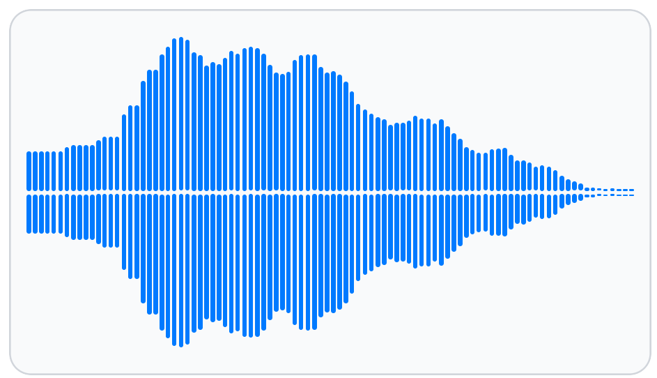
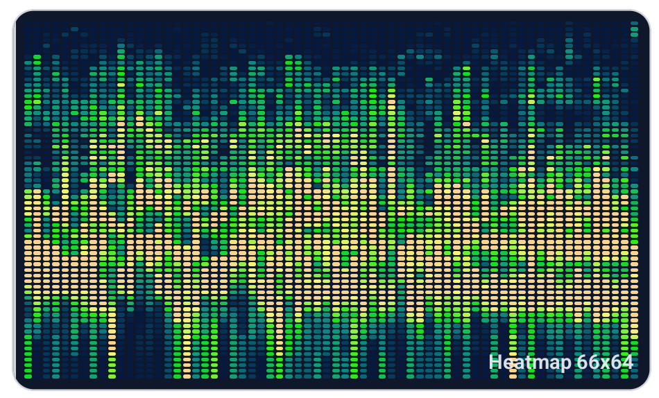
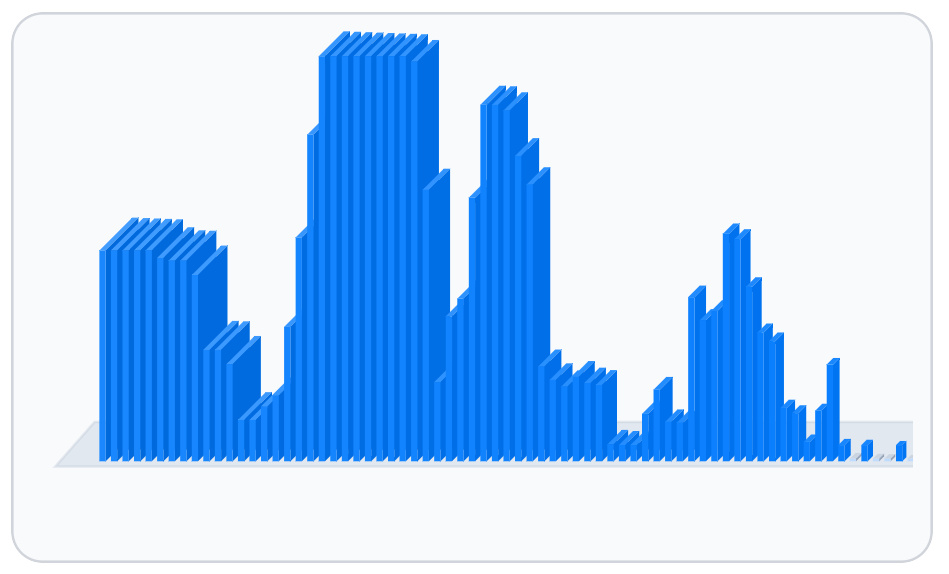

# Audio visualization (`react-native-sherpa-onnx/visualization`)

## Introduction

Import from `react-native-sherpa-onnx/visualization`. The SDK computes spectrum data natively and returns normalized numbers — **no built-in React Native widgets**. Your app draws bars, heatmaps, scrubbers, or custom Skia views from:

- `levels`: one global spectrum (2D preview/thumbnail)
- `frames`: timeline spectrum series (animation/scrub/heatmap/3D-style UI)

|  |  |  |
| --- | --- | --- |
| Static · `levels` | Heatmap · `frames` | 3D tab · example Skia UI from `frames` |

The screenshots are from the [example app](../example/README.md#audio-visualization-showcase) (`AudioVisualizationScreen`). The 3D view is **demo UI only** — isometric bars rendered with `@shopify/react-native-skia` from timeline frame data, not a native 3D API.

Input can be one of:

- `FileSource` (file picker / history)
- Offline audio buffer reference or id (`off_*`)
- Finalized live handle (`live_*`)

## Why this exists

- Keep visualization compute native and avoid sending PCM through JS.
- Keep one API for file/offline/live paths.
- Support both simple static bars and advanced timeline-driven animation.

## Quick start

### Static 2D spectrum (`levels`)

```ts
import { computeAudioVisualizationProfile } from 'react-native-sherpa-onnx/visualization';

const profile = await computeAudioVisualizationProfile(
  { kind: 'file', source: { kind: 'fs', path: '/tmp/audio.wav' } },
  {
    barCount: 96,
    minHz: 60,
    timeAggregate: 'max_hold',
  }
);

console.log(profile.levels.length, profile.frameCount); // 96, 0
```

### Timeline spectrum (`frames`)

```ts
import { computeAudioVisualizationProfile } from 'react-native-sherpa-onnx/visualization';

const profile = await computeAudioVisualizationProfile(
  { kind: 'offline', buffer: resultBufferRef },
  {
    barCount: 96,
    includeTimeline: true,
    frameDurationMs: 500,
  }
);

console.log(profile.frameCount, profile.frameDurationMs, profile.frames?.length);
```

## Rendering patterns (app-side)

Use one profile per asset, then branch on what you need to draw. The example app (`example/src/screens/audio-visualization/`) uses a single timeline-enabled compute and switches views in JS.

### Static bars (`levels`)


Global `levels` are enough for thumbnails, list rows, or a whole-file waveform. No timeline allocation.

```tsx
const profile = await computeAudioVisualizationProfile(fileInput, {
  barCount: 96,
  timeAggregate: 'mean',
});

// Render: map profile.levels[b] (0..1) to bar height
profile.levels.map((level, b) => (
  <View key={b} style={{ height: `${level * 100}%` }} />
));
```

Reference: `example/src/components/SpectrumBarsView.tsx` (mirrored bars, optional resampling).

### Heatmap (`frames`)


With `includeTimeline: true`, read the row-major tensor: `frames[t * barCount + b]`. Color each cell by magnitude; downsample rows/columns in UI if `frameCount` or `barCount` is large.

```tsx
const { frames, frameCount, barCount } = profile;
if (!frames) return null;

const valueAt = (t: number, b: number) => frames[t * barCount + b] ?? 0;

// Nested loops: t in [0, frameCount), b in [0, barCount)
```

Reference: `example/src/components/SpectrumHeatmapView.tsx`.

### Timeline playback and pseudo-3D (`frames`)


**Animated** bars and the example **3D** tab both index into `frames` by time (playback position or auto-advance). Reuse the same `frameAt` helper for any per-frame view:

```ts
const frameAt = (positionMs: number): Float32Array | null => {
  if (!profile.frames || profile.frameCount <= 0) return null;
  const index = Math.max(
    0,
    Math.min(
      profile.frameCount - 1,
      Math.floor(positionMs / profile.frameDurationMs)
    )
  );
  const offset = index * profile.barCount;
  return profile.frames.subarray(offset, offset + profile.barCount);
};
```

```tsx
// Animated bars or pseudo-3D: pass frameAt(playheadMs) to your renderer
const frameLevels = frameAt(playheadMs);
if (frameLevels) {
  <SpectrumBarsView levels={frameLevels} />;
}
```

Reference: `SpectrumBarsView` (animated tab), `Spectrum3DView` (Skia isometric bars — not an SDK feature).

## API reference

### `computeAudioVisualizationProfile(input, options?)`

```ts
export function computeAudioVisualizationProfile(
  input: AudioVisualizationInput,
  options?: AudioVisualizationOptions
): Promise<AudioVisualizationProfile>;
```

Parameters:

- `input`: `AudioVisualizationInput`
  - `FileSource`
  - `{ kind: 'file', source: FileSource }`
  - `{ kind: 'offline', buffer: PipelineAudioBufferIdSource }`
  - `{ kind: 'live', handle: LiveAudioBufferHandleFinished }`
- `options`: `AudioVisualizationOptions`
  - `kind?: 'spectrum_bars'` (default: `spectrum_bars`)
  - `barCount?: number` (default `96`, range `8..512`)
  - `minHz?: number` (default `60`, minimum `10`)
  - `maxHz?: number` (default auto, Nyquist-safe)
  - `timeAggregate?: 'max_hold' | 'mean'` (applies to global `levels`)
  - `includeTimeline?: boolean`
  - `frameCount?: number`
  - `frameDurationMs?: number`
  - `maxAnalysisDurationMs?: number`
  - `levelsMaxStftFrames?: number` (static `levels` only; default `1024`)
  - `analysisSampleRateHz?: number` (file / live-spool decode only; default `0` = source rate)
    - e.g. `8000` forces mono decode at 8 kHz before STFT — less resample/decode work for viz-only previews
    - range `4000..96000`; does **not** re-decode existing `off_*` offline buffers

Returns:

- `AudioVisualizationProfile`
  - `kind: 'spectrum_bars'`
  - `sampleRate`
  - `durationMs`
  - `barCount`
  - `levels: number[]` (always present, length = `barCount`)
  - `frameCount: number` (`0` when timeline is disabled)
  - `frameDurationMs: number` (`0` when timeline is disabled)
  - `frames?: Float32Array` (present when timeline is enabled)

## `levels` vs `frames`

- `levels`: one spectrum over the whole analyzed audio using `timeAggregate` (`max_hold` or `mean`).
- `frames`: row-major timeline tensor for animation/scrub/3D.
  - Index formula: `frames[t * barCount + b]`
  - Values are normalized to `0..1`

## Timeline resolution rules

| Input | Result |
| --- | --- |
| No timeline flags | `frameCount=0`, no `frames` |
| `includeTimeline: true` only | `frameDurationMs=500`, `frameCount=ceil(durationMs/500)` |
| Only `frameCount` | `frameDurationMs=durationMs/frameCount` |
| Only `frameDurationMs` | `frameCount=ceil(durationMs/frameDurationMs)` |
| Both set | `frameCount` wins; `frameDurationMs` derived from duration |

## Transport model (TurboModule + JSI)

Compute stays async in TurboModule; large timeline payload is transferred via JSI `ArrayBuffer`.

1. TurboModule computes native profile.
2. Promise resolves with metadata, `levels`, and an internal transfer id.
3. Wrapper calls JSI `takeVisualizationFrames(transferId)`.
4. Wrapper attaches `frames: Float32Array` to the returned profile.

This avoids serializing large `frames` arrays through bridge numbers/`NSNumber` boxing.

## Native algorithm

- STFT with `fftSize=2048`, Hann window; `hopSize` default 1024 for timeline, or **dynamic** for static `levels` (see Performance).
- Local shared C++ radix-2 FFT implementation.
- Log-spaced bar mapping from `minHz` to `maxHz`.
- `levels`: aggregate over full analyzed range using `timeAggregate`.
- `frames`: per-timeline-bucket `max_hold` aggregation.
- Per-row normalization (`levels` and each timeline frame): linear power → dB, then map between the 8th and 92nd percentile of that row (~40 dB span), then gamma (~1.65) for display contrast. Avoids clipping loud audio to all `1.0`.
- When `includeTimeline` is enabled, `levels` are derived from the normalized timeline frames (`mean` or `max_hold` across time per bar, per `timeAggregate`), not a separate whole-file max-hold that can flatten low-frequency bars.

## Input-path behavior

- `offline`: reads chunks from `OfflineEntry` (mmap-friendly).
- `file`: decodes in streaming callbacks; no offline buffer registration required. Honors `analysisSampleRateHz` on the decode path.
- `live`: reads finalized live data from spool/ring according to live buffer state. Spool file decode honors `analysisSampleRateHz`.
- `offline`: reads PCM at the buffer’s native sample rate (`analysisSampleRateHz` ignored).

## Progress (`onProgress`)

Long files benefit from a two-phase progress callback on `computeAudioVisualizationProfile`:

| Phase | Meaning | Typical input |
| --- | --- | --- |
| `decode` | Container decode + resample to analysis rate | `kind: 'file'`, live spool path |
| `analysis` | STFT windows / bar aggregation | All paths |

```ts
await computeAudioVisualizationProfile(
  { kind: 'file', source: fileSource },
  {
    analysisSampleRateHz: 8000,
    onProgress: ({ phase, phasePercent, framesDecoded, stftWindowsDone }) => {
      if (phase === 'decode') {
        console.log('decode', phasePercent, framesDecoded);
      } else {
        console.log('analysis', phasePercent, stftWindowsDone);
      }
    },
  }
);
```

Events are delivered on the `visualizationProgress` native event (filtered by an internal `operationId`, same pattern as `decodeProgress` on `createOfflineAudioBufferFromFile`). For `kind: 'file'`, decode and analysis can both advance while PCM chunks stream — use `phase` to drive separate UI indicators.

`kind: 'offline'` reports **`analysis` only** (PCM is already decoded).

## Performance (static `levels` vs timeline)

### Static `levels` (no timeline)

Native STFT already works as **window → hop → window → hop** across the PCM stream: each step advances by `hopSize` samples (default 1024 at 48 kHz ≈ 21 ms per window). For a long file, cost scales with the number of hops, not only wall-clock duration.

For static-only requests (`includeTimeline: false`), the implementation sizes the hop from the **full** input length:

```text
hopSize ≈ totalSamples / levelsMaxStftFrames   (default levelsMaxStftFrames = 1024, min hop 2048)
```

Example: 30 minutes at 48 kHz → ~86M samples → hop ≈ 84k → ~1024 FFTs over the **entire** file instead of ~84k. The returned `levels` are still a **max_hold / mean aggregate over the whole file**; time resolution is coarser, which is appropriate for a single preview waveform.

Set `levelsMaxStftFrames` lower (e.g. `512`) for faster previews, or higher (e.g. `2048`) for more detail.

For **`kind: 'file'`** (and finalized live spool paths), the dominant cost is often **full-file decode**, not FFT count. Use `analysisSampleRateHz` (e.g. `8000`) to downsample during decode — waveform shape is still useful for previews; keep `maxHz` at or below Nyquist (`sampleRate / 2`). Playback buffers (`createOfflineAudioBufferFromFile`) are unchanged unless you pass the same rate there.

Prefer `kind: 'offline'` with an existing `off_*` buffer when the pipeline already decoded once — no second decode.

### Timeline (`frames`)

| Goal | Options | Cost |
| --- | --- | --- |
| Animated / heatmap / scrub | `includeTimeline: true` + `frameDurationMs` or `frameCount` | One spectrum row per timeline bucket; use timeline only when needed |
| Hard time cap (optional) | `maxAnalysisDurationMs` | Stops decode/analysis after the first N ms — **not** required for static previews when using `levelsMaxStftFrames` |

### Optional truncate

`maxAnalysisDurationMs` caps how much audio is decoded and analyzed (first N ms only). Use this when you explicitly want a partial preview, not when you need a full-file static waveform (prefer `levelsMaxStftFrames` instead).

## Limits

- `frameCount`: `8..512`
- `frameDurationMs`: `50..10000`
- `frameCount * barCount <= 131072` (otherwise `AUDIO_VISUALIZATION_PAYLOAD_TOO_LARGE`)
- `maxAnalysisDurationMs` can cap analysis to first `N` ms

## Types and constants

```ts
import { computeAudioVisualizationProfile } from 'react-native-sherpa-onnx/visualization';

import type {
  AudioVisualizationInput,
  AudioVisualizationKind,
  AudioVisualizationOptions,
  AudioVisualizationProfile,
  AudioVisualizationTimeAggregate,
  VisualizationProgressEvent,
  VisualizationProgressPhase,
} from 'react-native-sherpa-onnx/visualization';
```

## Error codes

| Code | Meaning |
| --- | --- |
| `AUDIO_VISUALIZATION_INVALID_INPUT` | Input shape or handle/source is invalid. |
| `AUDIO_VISUALIZATION_INVALID_OPTIONS` | Options are invalid (kind/ranges/finiteness). |
| `AUDIO_VISUALIZATION_PAYLOAD_TOO_LARGE` | Timeline payload exceeds max allowed size. |
| `AUDIO_BUFFER_NOT_FOUND` | Offline/live buffer id not found. |
| `AUDIO_INVALID_STATE` | Live buffer is not finalized. |
| `BUFFER_INVALIDATED` | Live buffer id invalidated after transfer/disposal. |
| `VISUALIZATION_INTERNAL_ERROR` | Native processing failed unexpectedly. |

Other `AUDIO_*`, `DECODE_*`, and file-resolution errors may still surface from dependent paths.

## Use case examples

<details>
<summary>Static bars for file-picker preview</summary>

```ts
const profile = await computeAudioVisualizationProfile(
  {
    kind: 'file',
    source: {
      kind: 'contentUri',
      uri: pickedUri,
      displayName: pickedName,
    },
  },
  {
    barCount: 72,
    minHz: 80,
    timeAggregate: 'mean',
  }
);
```

</details>

<details>
<summary>Animation frame index from playback position</summary>

```ts
const profile = await computeAudioVisualizationProfile(input, {
  includeTimeline: true,
  frameDurationMs: 250,
  barCount: 96,
});

const frameAt = (positionMs: number) => {
  if (!profile.frames || profile.frameCount <= 0) return null;
  const index = Math.max(
    0,
    Math.min(profile.frameCount - 1, Math.floor(positionMs / profile.frameDurationMs))
  );
  const offset = index * profile.barCount;
  return profile.frames.subarray(offset, offset + profile.barCount);
};
```

</details>

## Native crash diagnostics

If native code fails or the app crashes but the tombstone shows only a UI/GPU thread, inspect the SDK last-activity ring buffer (enabled by default when the native library loads). Full details: [native-diagnostics.md](./native-diagnostics.md) - Android log tag `SherpaNativeDiag`; iOS subsystem `com.sherpaonnx.diag`. Optional JS: `getNativeDiagnosticSnapshot` / `configureNativeDiagnostics` from `react-native-sherpa-onnx/diagnostics`.
