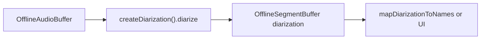

# Speaker diarization (offline)

**Status:** Android ✅ · iOS ✅ · Example app ✅

## Introduction

On-device **batch** speaker diarization: who spoke when in a recording, as anonymous cluster indices. Uses a **pyannote / reverb** segmentation model plus a separate **speaker-embedding** model and agglomerative clustering. Segmentation packs from the `speaker-segmentation-models` release contain **only** the pyannote/reverb ONNX — you must supply a speaker-embedding model separately (same packs as [speaker identification](speaker-identification-offline.md)).

Import path: **`react-native-sherpa-onnx/diarization`**.

## Quick start

```ts
import {
  createDiarization,
  detectDiarizationModel,
} from 'react-native-sherpa-onnx/diarization';
import {
  createEmptyOfflineSegmentBuffer,
  getOfflineSegmentBufferSegments,
} from 'react-native-sherpa-onnx/segmentbuffer';

const detect = await detectDiarizationModel({
  kind: 'fs',
  path: '/path/to/sherpa-onnx-pyannote-segmentation-3-0',
});

const diar = await createDiarization({
  segmentation: {
    modelSource: { kind: 'fs', path: detect.paths!.model! },
  },
  embedding: {
    modelSource: {
      kind: 'fs',
      path: '/path/to/3dspeaker_speech_eres2net_base_sv_zh-cn_3dspeaker_16k.onnx',
    },
  },
  clustering: { threshold: 0.5 },
});

const segmentOut = await createEmptyOfflineSegmentBuffer({
  sourceAudioBufferId: audioIn,
});

const result = await diar.diarize(audioIn, segmentOut, {
  onProgress: (p) => console.log(p.fraction),
});

const segments = await getOfflineSegmentBufferSegments(segmentOut, 0, 4096);
// segments[i].kind === 'diarization'
// segments[i].payload.speaker === cluster id

await diar.destroy();
```

## Buffer matrix

| Role | Type | Notes |
| --- | --- | --- |
| **Audio in** | [`OfflineAudioBuffer`](audiobuffer-offline.md) | Mono PCM |
| **Segments out** | [`OfflineSegmentBuffer`](segmentbuffer-offline.md) | Empty buffer; segments written with `kind: 'diarization'` |
| **Engine** | `DiarizationEngine` via `createDiarization` | `diarize`, `recluster`, `getClusterEmbeddings`, `destroy` |

## Models

| `modelType` | Required files | Custom-init keys |
| --- | --- | --- |
| `pyannote` | `model.onnx` (or `model.int8.onnx`) | `model` |
| `reverb` | `model.onnx` (or `model.int8.onnx`) | `model` |

Validate category: **`diarization`**. Offline also needs a separate speaker-embedding ONNX (`ModelCategory.SpeakerEmbedding`). Detection: [model-detect.md](model-detect.md) · downloads: [download-manager.md](download-manager.md) (`ModelCategory.Diarization`).

## API reference

### `detectDiarizationModel(source, options?)`

Detects `pyannote` / `reverb` / `sortformer` packs (prefers `model.onnx` over `model.int8.onnx`). Use before `createDiarization` to confirm pack layout. Unified detection: [model-detect.md](model-detect.md).

```ts
function detectDiarizationModel(
  source: FileSource,
  options?: { modelType?: DiarizationModelKind | 'auto'; assetName?: string; debug?: boolean }
): Promise<DiarizationDetectResult>;
```

```ts
const det = await detectDiarizationModel({
  kind: 'fs',
  path: '/path/to/sherpa-onnx-pyannote-segmentation-3-0',
});
if (!det.success) throw new Error(det.error ?? 'Detection failed');
```

### `createDiarization(options)`

Creates a `DiarizationEngine`. Requires separate segmentation ONNX and speaker-embedding ONNX. Optional clustering tuning.

```ts
function createDiarization(
  options: DiarizationInitializeOptions
): Promise<DiarizationEngine>;
```

```ts
const diar = await createDiarization({
  segmentation: {
    modelSource: { kind: 'fs', path: '/path/to/pyannote-seg-model' },
  },
  embedding: {
    modelSource: { kind: 'fs', path: '/path/to/speaker-embedding.onnx' },
  },
  clustering: { threshold: 0.5, computeConfidence: true },
});
```

### `engine.diarize(audioIn, segmentOut, options?)`

Runs the full pipeline and writes `{start, end, speaker}` into `segmentOut` natively (`kind: 'diarization'`, payload `{ source: 'diarization', speaker }`). When `clustering.computeConfidence` is `true`, each segment also gets `confidence` in `[-1, 1]`. If confidence was not requested or could not be computed, the field is omitted.

`segmentOut` must be an **empty** offline segment buffer (`seg_off_*`).

```ts
diarize(
  audioIn: OfflineAudioBufferIdSource,
  segmentOut: OfflineSegmentBufferIdSource,
  options?: DiarizeOptions
): Promise<DiarizeResult>;
```

```ts
const result = await diar.diarize(audioIn, segmentOut, {
  onProgress: (p) => console.log(`${(p.fraction * 100).toFixed(0)}%`),
  signal: abortController.signal,
});
console.log(result.numSpeakers, result.segmentCount);
```

### `engine.recluster(options?)`

Re-runs clustering on the **cached** embeddings from the last `diarize` — no re-inference. `computeConfidence` overrides the session flag when provided; otherwise the previous setting is kept.

```ts
recluster(options?: DiarizationReclusterOptions): Promise<DiarizeResult>;
```

```ts
const result = await diar.recluster({ numClusters: 3 });
console.log(result.numSpeakers, result.segments);
```

### `engine.getClusterEmbeddings()`

Mean embedding per cluster after the last `diarize` / `recluster`. Use these centroids to match enrolled SID names (who-spoke-when with labels), either via **`mapDiarizationToNames`** or manually with `sid.search(embedding)`.

```ts
getClusterEmbeddings(): Promise<DiarizationClusterEmbedding[]>;
```

```ts
const embeddings = await diar.getClusterEmbeddings();
// embeddings[i].speaker, embeddings[i].embedding (Float32Array)
```

End-to-end example (3 enrolled speakers + meeting with an unknown guest): **[diarization-named-timeline.md](./diarization-named-timeline.md)**.

### `engine.destroy()`

Releases the native diarization instance. Methods throw after this call.

```ts
destroy(): Promise<void>;
```

```ts
await diar.destroy();
```

### `mapDiarizationToNames(diar, sid, diarizationSegments, options?)`

Composes `getClusterEmbeddings` + `sid.search` + reading the buffer filled by `diarize` into `{ clusterToName, timeline }`. See [diarization-named-timeline.md](./diarization-named-timeline.md).

```ts
function mapDiarizationToNames(
  diar: DiarizationEngine,
  sid: DiarizationNameSearch,
  diarizationSegments: OfflineSegmentBufferIdSource,
  options?: MapDiarizationToNamesOptions
): Promise<MapDiarizationToNamesResult>;
```

```ts
const { clusterToName, timeline } = await mapDiarizationToNames(
  diar, sid, segmentOut, { threshold: 0.5 }
);
timeline.forEach((s) => console.log(s.name ?? 'Unknown', s.startSec, s.endSec));
```

## Diarization payload (`source: 'diarization'`)

`diarize` writes each speaker turn into `segmentOut` as `kind: 'diarization'` (not `speech`) with this payload. Downstream code (e.g. `mapDiarizationToNames`) filters on `payload.source === 'diarization'`.

```ts
{ source: 'diarization'; speaker: number }
```

`speaker` is the anonymous 0-based cluster id. Optional per-segment `confidence` (when `clustering.computeConfidence: true`) lives on the segment meta, not inside the payload. See [segmentbuffer-offline.md](segmentbuffer-offline.md).

## Pipeline composition

### Typical upstream

| Source / feature | Buffer or handle | Notes |
| --- | --- | --- |
| File decode path | `OfflineAudioBuffer` (`off_*`) | Meeting / podcast clip via `createOfflineAudioBufferFromFile(...)`. |
| Sample ingestion path | `OfflineAudioBuffer` (`off_*`) | App-owned PCM via `createOfflineAudioBufferFromSamples(...)`. |

### Typical downstream

| Destination / feature | Buffer or handle | Notes |
| --- | --- | --- |
| Anonymous speaker turns | `OfflineSegmentBuffer` (`seg_off_*`) | `kind: 'diarization'`, `payload.source: 'diarization'`. |
| Named timeline | `mapDiarizationToNames(...)` + SID | Cluster ids → enrolled names; see [diarization-named-timeline.md](diarization-named-timeline.md). |
| Streaming diarization | Sortformer path | [diarization-streaming.md](diarization-streaming.md) (no live overload of offline pyannote). |



## JS Events

| Callback | Payload | Fires when | Notes |
| --- | --- | --- | --- |
| `onProgress` | `OrchestrationProgress` | during `diarize` pipeline steps | optional on `DiarizeOptions`; coarse fraction-based |

```ts
const result = await diar.diarize(audioIn, segmentOut, {
  onProgress: (p) => console.log(`${(p.fraction * 100).toFixed(0)}%`),
});
```

## Types

### Core diarization types (`react-native-sherpa-onnx/diarization`)

| Type | Description |
| --- | --- |
| `DiarizationModelKind` | `'pyannote' \| 'reverb' \| 'sortformer'` |
| `DIARIZATION_MODEL_KINDS` | Readonly runtime list of model kinds |
| `DiarizationConcreteModelType` | Alias of `DiarizationModelKind` |
| `DiarizationDetectResult` | Return of `detectDiarizationModel()` |
| `DiarizationInitializeOptions` | `{ segmentation, embedding, clustering?, minDurationOn?, minDurationOff?, numThreads?, provider?, debug? }` |
| `DiarizationSegmentationOptions` | `{ modelSource: FileSource; quantization?; windowShiftRatio? }` |
| `DiarizationEmbeddingOptions` | `{ modelSource: FileSource; quantization? }` |
| `DiarizationClusteringOptions` | `{ numClusters?; threshold?; computeConfidence? }` — when `numClusters > 0`, threshold is ignored; `computeConfidence` enables silhouette confidence per segment (default `false`) |
| `DiarizeOptions` | `{ onProgress?; signal?; includeOverlap? }` |
| `DiarizeResult` | `{ status, numSpeakers, segmentCount, sampleRate, processingTimeMs, speakersPerFrame?, segments? }` |
| `DiarizationReclusterOptions` | `{ numClusters?; threshold?; computeConfidence? }` |
| `DiarizationClusterEmbedding` | `{ speaker: number; embedding: Float32Array }` |
| `DiarizationEngine` | `diarize`, `recluster`, `getClusterEmbeddings`, `destroy` |
| `DiarizationNameSearch` | Duck-typed SID gallery — `{ search(embedding, options?): Promise<string \| null> }` |
| `MapDiarizationToNamesOptions` | `{ threshold?: number }` — cosine similarity threshold, default `0.5` |
| `MapDiarizationToNamesResult` | `{ clusterToName: Map<number, string \| null>; timeline: NamedDiarizationSpan[] }` |
| `NamedDiarizationSpan` | `{ startSample, endSample, sampleRate, startSec, endSec, clusterId, name }` |
| `DiarizationErrorCode` | Error code object (`INVALID_ARGUMENT`, `INIT_ERROR`, `NOT_INITIALIZED`, `CANCELLED`, `BUFFER_NOT_FOUND`) |
| `OrchestrationProgress` | Shared offline progress payload (`currentSegment`, `totalSegments`, `fraction`, …) |

### Related buffer types

| Type | Description |
| --- | --- |
| `OfflineAudioBufferIdSource` | Offline audio ref passed to `diarize` |
| `OfflineSegmentBufferIdSource` | Offline segment buffer for `segmentOut` |

See [audiobuffer-offline.md](audiobuffer-offline.md) · [segmentbuffer-offline.md](segmentbuffer-offline.md).

---

## Error codes

| Code | Typical reason |
| --- | --- |
| `DIARIZATION_INVALID_ARGUMENT` | Missing/malformed args (e.g. wrong buffer kind) |
| `DIARIZATION_INIT_ERROR` | Engine init failed (missing model / ORT) |
| `DIARIZATION_NOT_INITIALIZED` | Operation on uninitialized engine/instance |
| `DIARIZATION_CANCELLED` | Operation cancelled |
| `DIARIZATION_BUFFER_NOT_FOUND` | Audio or segment buffer id missing/released |
| `DETECT_ERROR` | Model detection failed or pack layout invalid |

## Architecture note

The native core is a **shared C++** pipeline (Android + iOS): pyannote ONNX via
ORT, powerset decode, timeline stitch, sherpa C-API embedding extractor (refcounted
registry), and own agglomerative clustering (optional silhouette confidence,
ported from upstream `compute_confidence`). It does **not** wrap the upstream
`SherpaOnnxOfflineSpeakerDiarization` monolith (`_Exit` risk). See
[internal/speaker-embedding-foundation.md](./internal/speaker-embedding-foundation.md) §10.

## Status

- Offline batch: Android / iOS
- Streaming diarization: not shipped — see [diarization-streaming.md](./diarization-streaming.md)
  (true streaming planned; **live overload intentionally not planned**)
- `speech_pyannote_segmentation` evaluator for the shared segmentation engine: **shipped** (offline union spans; see [segmentation-engine.md](./segmentation-engine.md))

## Use case examples

<details>
<summary>Diarize a recording into speaker cluster segments</summary>

Provide pyannote/reverb segmentation plus a speaker-embedding pack, then read `kind: 'diarization'` rows from the output segment buffer.

```ts
import { createDiarization } from 'react-native-sherpa-onnx/diarization';
import {
  createOfflineAudioBufferFromFile,
  releasePipelineAudioBuffer,
} from 'react-native-sherpa-onnx/audiobuffer';
import {
  createEmptyOfflineSegmentBuffer,
  getOfflineSegmentBufferSegments,
  releasePipelineSegmentBuffer,
} from 'react-native-sherpa-onnx/segmentbuffer';

const diar = await createDiarization({
  segmentation: { modelSource: { kind: 'fs', path: '/path/to/pyannote-seg' } },
  embedding: { modelSource: { kind: 'fs', path: '/path/to/speaker-embedding.onnx' } },
  clustering: { threshold: 0.5 },
});
const audioIn = await createOfflineAudioBufferFromFile({ kind: 'fs', path: '/path/to/meeting.wav' });
const segmentOut = await createEmptyOfflineSegmentBuffer({ sourceAudioBufferId: audioIn });

await diar.diarize(audioIn, segmentOut, { onProgress: (p) => console.log(p.fraction) });
const segments = await getOfflineSegmentBufferSegments(segmentOut, 0, 4096);
for (const s of segments) {
  if (s.kind === 'diarization') console.log(s.payload?.speaker, s.startSample, s.endSample);
}

await releasePipelineSegmentBuffer(segmentOut);
await releasePipelineAudioBuffer(audioIn);
await diar.destroy();
```

</details>

<details>
<summary>Tune clustering at init time</summary>

Raise/lower the clustering threshold (and optionally compute confidence) when initializing the engine for noisier or cleaner meetings.

```ts
const diar = await createDiarization({
  segmentation: { modelSource: { kind: 'fs', path: '/path/to/pyannote-seg' } },
  embedding: { modelSource: { kind: 'fs', path: '/path/to/speaker-embedding.onnx' } },
  clustering: { threshold: 0.6, computeConfidence: true },
});
```

</details>

<details>
<summary>Export a who-spoke-when timeline for UI/clipboard</summary>

After `diarize`, map segment rows into a simple timeline list the app can render or copy.

```ts
const segments = await getOfflineSegmentBufferSegments(segmentOut, 0, 4096);
const timeline = segments
  .filter((s) => s.kind === 'diarization')
  .map((s) => ({
    speaker: s.payload?.speaker,
    startSample: s.startSample,
    endSample: s.endSample,
    confidence: s.payload?.confidence,
  }));
console.log(JSON.stringify(timeline, null, 2));
```

</details>

## See also

- [diarization-named-timeline.md](./diarization-named-timeline.md) — SID enroll + diarize → named who-spoke-when
- [diarization-streaming.md](./diarization-streaming.md) — streaming plans; why no live overload
- [speaker-identification-offline.md](./speaker-identification-offline.md) — named-speaker gallery
- [segmentation-engine.md](./segmentation-engine.md) — `speech_pyannote_segmentation` (union speech spans only)

## Native crash diagnostics

If native code fails or the app crashes but the tombstone shows only a UI/GPU thread,
inspect the SDK **last-activity ring buffer**. Full details:
[native-diagnostics.md](./native-diagnostics.md).
