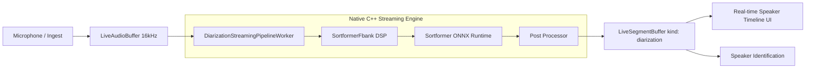

# Speaker diarization (streaming)

**Status:** Android ✅ · iOS ✅

## Introduction

On-device **true streaming** speaker diarization: continuously identifies "who spoke when"
in real-time audio. Powered by **NeMo Sortformer** running natively on **ONNX Runtime (ORT)**
with high-performance C++ DSP (Radix-2 FFT + sparse Mel filterbanks) and bounded memory
via NeMo smart cache compression.

| Role | Type | Notes |
| --- | --- | --- |
| **Input** | [`LiveAudioBuffer`](audiobuffer-streaming.md) | Mono PCM audio buffer (`live_*`) drained by native worker |
| **Output** | [`LiveSegmentBuffer`](segmentbuffer-streaming.md) | Live segment buffer (`seg_live_*`); native worker appends segments with `kind: 'diarization'` |
| **Engine** | `StreamingDiarizationEngine` via `createStreamingDiarization` | Starts pipeline, exposes model properties, manual feed/flush/reset |
| **Pipeline Handle** | `DiarizationPipelineHandle` via `engine.startPipeline(...)` | `stop`, `flush`, `reset`, `getStatus`, `completed` |

Import path: `react-native-sherpa-onnx/diarization`

In this guide:
- **`engine`** refers to the `StreamingDiarizationEngine` instance.
- **`pipeline`** refers to the `DiarizationPipelineHandle` returned by `engine.startPipeline(...)`.

For **offline batch diarization** (pyannote + embedding clustering), see [Speaker diarization (offline)](diarization-offline.md).  
For **named speaker timelines** (mapping diarization clusters to enrolled identities via SID), see [Named diarization timeline](diarization-named-timeline.md).

---

## Streaming pipeline system

Calling `engine.startPipeline(audioIn, segmentOut)` registers a **native background worker thread** (`DiarizationStreamingPipelineWorker`):

1. **Drains audio** directly from the native `LiveAudioBuffer` (`PaLiveEntry` on iOS, `LiveEntry` on Android) using cursor handles in chunks (`chunkSize`, default 4096 samples).
2. **Computes Mel spectrograms** using high-performance, zero-allocation C++ DSP (`SortformerFbank`).
3. **Runs Sortformer inference** in ONNX Runtime with persistent FIFO buffers and bounded speaker cache.
4. **Applies post-processing** (channel-wise median filtering + hysteresis thresholding) into time-aligned speaker turns.
5. **Appends segments** directly into the native `LiveSegmentBuffer` (`seg_live_append_segment` on iOS, `outputEntry.appendSegment` on Android) with `kind: 'diarization'` and payload `{"source":"diarization","speaker":S}`.

Shared lifecycle semantics of **`stop` / `flush` / `reset` / `getStatus` / `completed`** are described in **[Streaming pipelines — shared lifecycle](streaming-pipelines-overview.md)**.

---

## Quick start

All buffer parameters accept buffer refs directly or raw string IDs.

```ts
import {
  createStreamingDiarization,
  detectDiarizationModel,
} from 'react-native-sherpa-onnx/diarization';
import {
  createEmptyLiveAudioBuffer,
  startMicToLiveAudioBuffer,
  stopMicToLiveAudioBuffer,
  releasePipelineAudioBuffer,
} from 'react-native-sherpa-onnx/audiobuffer';
import {
  createEmptyLiveSegmentBuffer,
  getLiveSegmentBufferSegments,
  releasePipelineSegmentBuffer,
} from 'react-native-sherpa-onnx/segmentbuffer';

// 1. Detect or provide model source
const det = await detectDiarizationModel({
  kind: 'fs',
  path: '/path/to/diar_streaming_sortformer_4spk-v2.1',
});
if (!det.success || !det.isStreaming) {
  throw new Error('Expected streaming diarization model');
}

// 2. Initialize the streaming diarization engine
const engine = await createStreamingDiarization({
  modelSource: {
    kind: 'fs',
    path: '/path/to/diar_streaming_sortformer_4spk-v2.1',
  },
  modelType: 'sortformer',
  onset: 0.5,
  offset: 0.5,
  minDurationOff: 0.5, // Merge turns from the same speaker separated by <= 0.5s
});

console.log('Model properties:', {
  sampleRate: engine.sampleRate,       // 16000
  maxSpeakers: engine.maxSpeakers,     // 4
  feedSamples: engine.feedSamples,     // 160000 (10.0s window)
  strideSamples: engine.strideSamples, // 158720 (9.92s stride)
  latencySeconds: engine.latencySeconds, // ~10.0s
});

// 3. Set up pipeline buffers
const audioIn = await createEmptyLiveAudioBuffer({ sampleRate: engine.sampleRate });
const segmentOut = await createEmptyLiveSegmentBuffer({
  sourceAudioBufferId: audioIn,
  onSegmentAppended: (e) => {
    console.log(`Speaker ${e.segment.payload?.speaker}: ${e.segment.startSample} -> ${e.segment.endSample}`);
  },
});

// 4. Start the streaming pipeline
const pipeline = await engine.startPipeline(audioIn, segmentOut, {
  chunkSize: 4096, // Drain step size from audioIn
});

// 5. Ingest live audio (e.g. from mic)
await startMicToLiveAudioBuffer(audioIn);

// ... recording session ...

// 6. Stop recording and flush final tail segments
await stopMicToLiveAudioBuffer();
await pipeline.flush();
await pipeline.stop();
await pipeline.completed;

// 7. Clean up
await releasePipelineSegmentBuffer(segmentOut);
await releasePipelineAudioBuffer(audioIn);
await engine.release();
```

---

## Pipeline flow

| Step | Method | Result |
| --- | --- | --- |
| 1 | `detectDiarizationModel(source)` | Validates Sortformer model files |
| 2 | `createStreamingDiarization(options)` | Allocates C++ DSP & ORT session (`StreamingDiarizationEngine`) |
| 3 | `createEmptyLiveAudioBuffer(...)` | Prepares input live audio buffer (`live_*`) |
| 4 | `createEmptyLiveSegmentBuffer(...)` | Prepares output live segment buffer (`seg_live_*`) |
| 5 | `engine.startPipeline(audioIn, segmentOut, options?)` | Starts native worker thread (`DiarizationPipelineHandle`) |
| 6 | `startMicToLiveAudioBuffer(audioIn)` / file ingest | Audio drains natively into DSP & ORT |
| 7 | `onSegmentAppended` / segment buffer reads | Live speaker turns emitted in real time |
| 8 | `pipeline.flush()` $\rightarrow$ `pipeline.stop()` $\rightarrow$ `pipeline.completed` | Flushes trailing audio and halts worker |
| 9 | `releasePipeline*Buffer(...)` + `engine.release()` | Frees buffers and unloads ONNX model |

---

## Models & metadata

Streaming diarization uses **NeMo Sortformer** ONNX models (e.g. `diar_streaming_sortformer_4spk-v2.1`).

### Archive & folder structure

```
diar_streaming_sortformer_4spk-v2.1/
├── model.onnx          # or model.int8.onnx (required)
├── metadata.json       # optional streaming constants
└── LICENSE             # model license
```

### Dynamic metadata extraction & fallback

The C++ streaming engine dynamically configures its tensor shapes and parameters (`chunk_len`, `right_context`, `fifo_len`, `spkcache_len`, `max_speakers`, `feature_dim`, `sample_rate`) via:
1. **`metadata.json`** file if provided alongside the model.
2. **Embedded ONNX `metadata_props`** fallback if `metadata.json` is missing.
3. Default Sortformer v2.1 constants if neither is present.

### Download Manager integration

Sortformer models can be discovered and downloaded via the built-in [Download Manager](download-manager.md):

```ts
import { downloadModel, getModelById, ModelCategory } from 'react-native-sherpa-onnx/download';

const model = await getModelById('diar_streaming_sortformer_4spk-v2.1', ModelCategory.Diarization);
const downloaded = await downloadModel(model, {
  onProgress: (p) => console.log(`Downloading: ${(p.fraction * 100).toFixed(1)}%`),
});
```

---

## API reference

All signatures below are exported from **`react-native-sherpa-onnx/diarization`**.

### Detection

#### `detectDiarizationModel(source, options?)`

```ts
function detectDiarizationModel(
  source: FileSource,
  options?: {
    modelType?: DiarizationModelKind | 'auto';
    assetName?: string;
    debug?: boolean;
  }
): Promise<DiarizationDetectResult>;
```

Inspects the provided file source. For Sortformer streaming models, returns `isStreaming: true` and populates `paths.model` and optional `paths.metadata`.

```ts
const det = await detectDiarizationModel({
  kind: 'fs',
  path: '/data/models/diar_streaming_sortformer_4spk-v2.1',
});
console.log(det.isStreaming); // true
console.log(det.modelType);   // 'sortformer'
```

---

### Initialization

#### `createStreamingDiarization(options)`

```ts
function createStreamingDiarization(
  options: StreamingDiarizationInitializeOptions
): Promise<StreamingDiarizationEngine>;
```

Creates and initializes the native streaming diarization engine.

Supports two initialization modes:

##### 1. Auto Mode (`StreamingDiarizationAutoInitializeOptions`)
Resolves model paths automatically from `modelSource` using `detectDiarizationModel`.

```ts
const engine = await createStreamingDiarization({
  modelSource: { kind: 'fs', path: '/path/to/sortformer-folder' },
  modelType: 'sortformer', // or 'auto'
});
```

##### 2. Custom Mode (`StreamingDiarizationCustomInitializeOptions`)
Explicitly specifies paths for the ONNX model and optional metadata.

```ts
const engine = await createStreamingDiarization({
  initMode: 'custom',
  modelType: 'sortformer',
  customConfig: {
    model: { kind: 'fs', path: '/path/to/sortformer.onnx' },
    metadata: { kind: 'fs', path: '/path/to/metadata.json' }, // optional
  },
});
```

##### Shared Tuning Options (`StreamingDiarizationInitOptionsShared`)

| Option | Type | Default | Description |
| --- | --- | --- | --- |
| `onset` | `number` | `0.5` | Hysteresis onset threshold for speech turn activation (0.0 to 1.0) |
| `offset` | `number` | `0.5` | Hysteresis offset threshold for speech turn deactivation (0.0 to 1.0) |
| `padOnset` | `number` | `0.0` | Seconds to pad before detected speech start |
| `padOffset` | `number` | `0.0` | Seconds to pad after detected speech end |
| `minDurationOn` | `number` | `0.0` | Minimum duration in seconds of a speaker turn to retain |
| `minDurationOff` | `number` | `0.5` | Maximum gap in seconds between consecutive turns of the same speaker to merge |
| `medianWindow` | `number` | `11` | Window size for temporal median filtering of frame predictions |
| `numThreads` | `number` | `1` | Number of threads for ONNX Runtime inference |
| `provider` | `string` | `'cpu'` | ONNX Runtime execution provider |
| `debug` | `boolean` | `false` | Enable verbose native logging |

---

### Engine instance (`StreamingDiarizationEngine`)

#### Read-Only Properties

* **`instanceId`** (`string`): Unique native instance identifier (e.g. `diar_stream_1`).
* **`sampleRate`** (`number`): Audio sample rate required by the model (always `16000` for Sortformer).
* **`maxSpeakers`** (`number`): Maximum number of concurrent speaker channels tracked by the model (e.g. `4`).
* **`feedSamples`** (`number`): Number of audio samples required per forward pass window (`160000` = 10.0s).
* **`strideSamples`** (`number`): Number of audio samples advanced between successive window steps (`158720` = 9.92s).
* **`latencySeconds`** (`number`): Algorithmic latency in seconds (`~10.0s`).

#### `engine.startPipeline(audioIn, segmentOut, options?)`

```ts
startPipeline(
  audioIn: LiveAudioBufferIdSource,
  segmentOut: LiveSegmentBufferIdSource,
  options?: StreamingDiarizationOptions
): Promise<DiarizationPipelineHandle>;
```

Starts a native background worker thread draining `audioIn` and appending speaker turns to `segmentOut`.

* **`audioIn`**: Live audio buffer (`live_*`). Must be in `recording` state.
* **`segmentOut`**: Live segment buffer (`seg_live_*`).
* **`options.chunkSize`**: Number of samples drained per cursor read step (default `4096` = 256ms at 16kHz).

```ts
const pipeline = await engine.startPipeline(audioIn, segmentOut, { chunkSize: 4096 });
```

---

#### `engine.feed(audioIn)`

```ts
feed(
  audioIn: OfflineAudioBufferIdSource
): Promise<Array<{ start: number; end: number; speaker: number }>>;
```

Manually feeds an offline audio buffer to the engine's accumulation buffer. If enough audio has accumulated ($\ge 10.0\text{s}$), triggers one or more window forward steps and returns any newly finalized segments.

```ts
const segments = await engine.feed(offlineAudioBuf);
```

---

#### `engine.flush()`

```ts
flush(): Promise<Array<{ start: number; end: number; speaker: number }>>;
```

Flushes any remaining trailing audio in the accumulation buffer (zero-padding to window size), post-processes final predictions, and returns final segments.

```ts
const tailSegments = await engine.flush();
```

---

#### `engine.reset()`

```ts
reset(): Promise<void>;
```

Resets internal streaming state: clears the FIFO buffer, speaker cache, silence tracking profile, and audio accumulator.

```ts
await engine.reset();
```

---

#### `engine.release()`

```ts
release(): Promise<void>;
```

Unloads the native ONNX Runtime session, frees C++ DSP scratch buffers, and unregisters the native instance.

```ts
await engine.release();
```

---

### Pipeline handle (`DiarizationPipelineHandle`)

Returned by `engine.startPipeline(...)`. Controls the background native worker thread.

#### `pipeline.stop()`

```ts
stop(): Promise<void>;
```

Signals the worker thread to stop and unregisters the pipeline. Call before releasing the associated audio and segment buffers.

---

#### `pipeline.flush()`

```ts
flush(): Promise<void>;
```

Forces an in-band flush of any buffered audio while the pipeline continues running.

---

#### `pipeline.reset()`

```ts
reset(): Promise<void>;
```

Resets the native engine state in-band without stopping the pipeline worker.

---

#### `pipeline.getStatus()`

```ts
getStatus(): Promise<StreamingPipelineStatus>;
```

Returns current metrics for the pipeline worker:

```ts
interface StreamingPipelineStatus {
  pipelineId: string;
  isRunning: boolean;
  chunksProcessed: number;
  unitsRead: number;
  unitsWritten: number;
  error: string | null;
}
```

---

#### `pipeline.completed`

```ts
readonly completed: Promise<StreamingPipelineCompletion>;
```

A Promise that settles when the worker loop exits (normally or via error). Resolves with `StreamingPipelineCompletion`:

```ts
interface StreamingPipelineCompletion {
  pipelineId: string;
  reason: 'completed' | 'stopped' | 'error';
  chunksProcessed: number;
  unitsRead: number;
  unitsWritten: number;
  error: string | null;
}
```

---

## Pipeline buffers (audio input + segment output)

### Audio input (`LiveAudioBuffer`)

```ts
import {
  createEmptyLiveAudioBuffer,
  startMicToLiveAudioBuffer,
  stopMicToLiveAudioBuffer,
  releasePipelineAudioBuffer,
} from 'react-native-sherpa-onnx/audiobuffer';
```

- Must be created with `sampleRate: 16000` (Sortformer's expected rate).
- Can be fed by the microphone (`startMicToLiveAudioBuffer`) or upstream file ingestion (`startFileIngestToLiveAudioBuffer`).
- See [audiobuffer — live / streaming](audiobuffer-streaming.md).

### Segment output (`LiveSegmentBuffer`)

```ts
import {
  createEmptyLiveSegmentBuffer,
  getLiveSegmentBufferSegments,
  releasePipelineSegmentBuffer,
} from 'react-native-sherpa-onnx/segmentbuffer';
```

- Segments are appended with `kind: 'diarization'`.
- `payloadJson` contains `{"source":"diarization","speaker":S}` where `S` is an integer index ($0$ to $\text{maxSpeakers}-1$).
- See [segmentbuffer — live / streaming](segmentbuffer-streaming.md).

#### Observing committed speaker segments

Committed speaker turns are emitted as segments on the output `LiveSegmentBuffer`. Subscribe to `onSegmentAppended` (or `streamEvents.segmentAppended`):

```ts
const segmentOut = await createEmptyLiveSegmentBuffer({
  sourceAudioBufferId: audioIn,
  onSegmentAppended: (e) => {
    const speaker = e.segment.payload?.speaker;
    console.log(`[Speaker ${speaker}] ${e.segment.startSample} -> ${e.segment.endSample} (${e.segment.durationMs}ms)`);
  },
});
```

---

## Pipeline composition

### Typical upstream

| Source / feature | Buffer or handle | Notes |
| --- | --- | --- |
| Mic live ingestion | `LiveAudioBuffer` (`live_*`) | Microphone feeds audio directly to input buffer |
| File live ingestion | `startFileIngestToLiveAudioBuffer` | Real-time file playback into live buffer |
| Denoised audio | `StreamingEnhancementEngine` | Clean speech output feeds diarization input |

### Typical downstream

| Destination / feature | Buffer or handle | Notes |
| --- | --- | --- |
| Speaker turn events | `LiveSegmentBuffer.onSegmentAppended` | Real-time speaker activity detection |
| Named timeline mapping | `mapDiarizationToNames` | Combines diarization clusters with SID enrollment gallery |
| UI timeline rendering | `LiveSegmentBuffer` reads | Renders live speaker diarization ribbons in the UI |



---

## Types and constants

```ts
import type {
  StreamingDiarizationConcreteModelType,
  StreamingDiarizationModelType,
  StreamingDiarizationInitOptionsShared,
  StreamingDiarizationAutoInitializeOptions,
  StreamingDiarizationCustomInitializeOptions,
  StreamingDiarizationInitializeOptions,
  StreamingDiarizationOptions,
  DiarizationPipelineHandle,
  StreamingDiarizationEngine,
  DiarizationDetectResult,
} from 'react-native-sherpa-onnx/diarization';
import type {
  StreamingPipelineCompletion,
  StreamingPipelineStatus,
} from 'react-native-sherpa-onnx/audiobuffer';
```

- **`StreamingDiarizationConcreteModelType`**: `'sortformer'`
- **`StreamingDiarizationModelType`**: `'sortformer' | 'auto'`

---

## Platform notes

- **Android**:
  - Worker thread runs in `DiarizationStreamingPipelineWorker.kt`.
  - Audio drained from `LiveEntry` cursor $\rightarrow$ JNI $\rightarrow$ `StreamingDiarizationWrapper` $\rightarrow$ `LiveSegmentEntry.appendSegment(...)`.
  - Runs on ONNX Runtime mobile library with CPU or NNAPI/QNN providers.
- **iOS**:
  - Worker thread runs in `DiarizationStreamingPipelineWorker.mm`.
  - Audio drained from `PaLiveEntry` cursor $\rightarrow$ C++ `StreamingDiarizationWrapper` $\rightarrow$ `seg_live_append_segment(...)`.
  - Direct C++ memory access.
- **DSP & Inference**:
  - 100% portable C++ DSP (`SortformerFbank`): Radix-2 FFT with precomputed twiddle tables, periodic Hann window, and sparse Slaney Mel filterbank.
  - Zero dynamic heap allocation in steady-state streaming loops.
  - NeMo Smart Cache Compression bounds RAM usage to constant size over infinite streaming sessions.

---

## Error codes

| Error code | Explanation |
| --- | --- |
| `DETECT_ERROR` | Model detection failed or input directory is invalid. |
| `DIARIZATION_INIT_ERROR` | Engine initialization failed (missing model file, invalid ONNX structure, or ORT initialization error). |
| `DIARIZATION_ERROR` | General streaming runtime error (e.g. pipeline start failure, invalid state transition). |
| `DIARIZATION_BUFFER_NOT_FOUND` | Referenced audio or segment buffer ID does not exist or was already released. |
| `DIARIZATION_NOT_INITIALIZED` | An operation was invoked on an engine or native instance that is not initialized. |
| `DIARIZATION_INVALID_ARGUMENT` | Missing or malformed parameters (e.g. non-live buffer passed to `startPipeline`). |
| `STREAMING_PIPELINE_ERROR` | Fatal pipeline worker thread exception. |

---

## Live overload — intentionally out of scope

Diarization will **not** receive a live-overload API (offline weights on live buffers via the shared segmentation engine), and that is **not** planned for the future.

### Why

- Offline diarization already runs **pyannote sliding windows** internally inside one `diarize` call. The segmentation engine is not needed to keep model inputs window-sized or prevent OOM.
- Live overload commits slices and runs the **offline** feature per commit (as with SID). Per-slice `diarize` yields **local** cluster IDs without stable speaker identity across the session (e.g. cluster 0 in chunk A could be speaker 2 in chunk B), resulting in poor live tracking.
- Solving that would require session-wide re-clustering or maintaining custom cross-chunk state — an entirely different architecture that is fundamentally what true streaming models like Sortformer do.

### What to use instead

| Need | Path |
| --- | --- |
| Batch who-spoke-when | Offline `createDiarization` / `diarize` ([diarization-offline.md](./diarization-offline.md)) |
| Live / low-latency diarization | True streaming Sortformer via `createStreamingDiarization` (this guide) |
| Named speakers on an offline timeline | [Named diarization timeline (SID × Diarization)](./diarization-named-timeline.md) |

*(Contrast: SID **does** provide live overload (`labelLiveSegments`) because each speech utterance is independently matched against a fixed enrollment gallery — a composition that does not apply to anonymous unsupervised clustering).*
