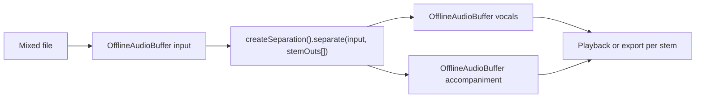
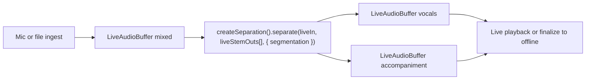
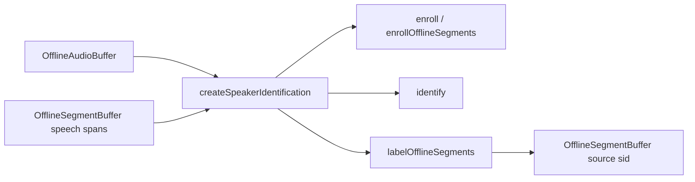
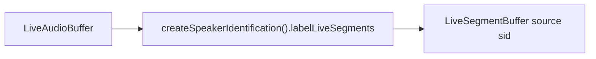
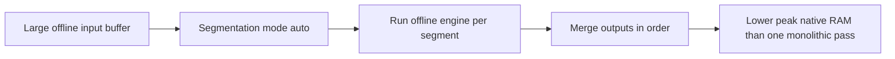

# Feature pipelines

## Introduction

This guide is a pipeline composition cookbook for real, reusable end-to-end flows in `react-native-sherpa-onnx`.

It focuses on public buffer contracts (`OfflineAudioBuffer`, `LiveAudioBuffer`, `OfflineTextBuffer`, `LiveTextBuffer`, `OfflineSegmentBuffer`, `LiveSegmentBuffer`) and public feature APIs, rather than internal implementation details.

Use this file to pick a proven chain quickly. For full per-feature API details, follow the linked feature docs. For **shared streaming pipeline handle** semantics (`stop` / `flush` / `reset` / `getStatus` / `completed`) across STT, enhancement, separation live overload, VAD, TTS live overload, and punctuation, see **[streaming-pipelines-overview.md](streaming-pipelines-overview.md)**.

## Table of contents

- [Buffer and composition glossary](#buffer-and-composition-glossary)
- [STT offline patterns](#stt-offline-patterns)
- [STT streaming patterns](#stt-streaming-patterns)
- [TTS offline patterns](#tts-offline-patterns)
- [TTS streaming patterns](#tts-streaming-patterns)
- [Enhancement offline patterns](#enhancement-offline-patterns)
- [Enhancement streaming patterns](#enhancement-streaming-patterns)
- [Separation offline patterns](#separation-offline-patterns)
- [Separation live overload patterns](#separation-live-overload-patterns)
- [Punctuation offline patterns](#punctuation-offline-patterns)
- [Punctuation streaming patterns](#punctuation-streaming-patterns)
- [VAD streaming patterns](#vad-streaming-patterns)
- [Speaker identification offline patterns](#speaker-identification-offline-patterns)
- [Speaker identification live patterns](#speaker-identification-live-patterns)
- [Alignment offline patterns](#alignment-offline-patterns)
- [Segmentation for offline memory control](#segmentation-for-offline-memory-control)

## Buffer and composition glossary

| Public concept | Typical producers | Typical consumers | Notes |
| --- | --- | --- | --- |
| `OfflineAudioBuffer` (`off_*`) | `createOfflineAudioBufferFromFile`, `createOfflineAudioBufferFromSamples`, offline feature outputs | `createSTT().transcribe`, `createEnhancement().enhance`, `createSeparation().separate`, `createAlignment().alignTextToAudio`, `saveAudioAsFile` | Batch input/output; deterministic completion |
| `LiveAudioBuffer` (`live_*`) | `createEmptyLiveAudioBuffer`, mic capture, file ingest, streaming feature outputs | `createStreamingSTT().transcribe`, `createStreamingEnhancement().enhance`, `createSeparation().separate` (live overload), VAD `process`, `labelLiveSegments`, PCM player | Continuous stream; supports running pipelines |
| `OfflineTextBuffer` (`txt_off_*`) | `createOfflineTextBufferFromText`, offline STT output, offline punctuation output | `createTTS().synthesize`, `createAlignment().alignTextToAudio`, offline punctuation input | Batch text handoff |
| `LiveTextBuffer` (`txt_live_*`) | app commits, streaming STT output, streaming punctuation output | `createTTS().synthesize` (live overload), streaming punctuation input | Partial + committed segments |
| `OfflineSegmentBuffer` (`seg_off_*`) | offline alignment output, offline VAD/segmentation outputs, SID `labelOfflineSegments` | subtitle/timestamp export, anchor input for advanced alignment modes | Segment metadata for post-processing |
| `LiveSegmentBuffer` (`seg_live_*`) | streaming VAD output, live segmentation attachments, SID `labelLiveSegments` | gating, timeline UI, downstream orchestration | Event-driven segment stream |
| Segmentation engine (`react-native-sherpa-onnx/segment`) | attached to text/audio streams or offline orchestrators | STT/TTS/enhancement/separation/punctuation/alignment chunk orchestration | Use to bound peak memory on offline-heavy workloads |

## STT offline patterns

```mermaid
flowchart LR
  A[FileSource or samples] --> B[OfflineAudioBuffer]
  B --> C[createSTT().transcribe]
  C --> D[OfflineTextBuffer]
  D --> E[Read text or pass to offline punctuation or offline TTS]
```

When to use:
- File-based transcription jobs with deterministic batch completion.
- Stable text output before downstream processing.

Related docs:
- [stt-offline.md](stt-offline.md)
- [audiobuffer-offline.md](audiobuffer-offline.md)
- [textbuffer-offline.md](textbuffer-offline.md)

## STT streaming patterns

```mermaid
flowchart LR
  A[Mic or file ingest] --> B[LiveAudioBuffer]
  B --> C[createStreamingSTT().transcribe]
  C --> D[LiveTextBuffer]
  D --> E[Partial or committed transcript UI]
```

When to use:
- Low-latency speech-to-text where incremental results matter.
- Continuous pipelines where upstream and downstream run concurrently.

Related docs:
- [stt-streaming.md](stt-streaming.md)
- [audiobuffer-streaming.md](audiobuffer-streaming.md)
- [textbuffer-streaming.md](textbuffer-streaming.md)

## TTS offline patterns

```mermaid
flowchart LR
  A[OfflineTextBuffer] --> B[createTTS().synthesize]
  B --> C[OfflineAudioBuffer]
  C --> D[PCM playback or saveAudioAsFile]
```

When to use:
- Full text is available and one-shot output audio is needed.
- Export-focused jobs (save WAV/MP3/Opus after synthesis).

Related docs:
- [tts-offline.md](tts-offline.md)
- [audio-conversion.md](audio-conversion.md)
- [pcm-player.md](pcm-player.md)

## TTS streaming patterns

```mermaid
flowchart LR
  A[App commits text segments] --> B[LiveTextBuffer]
  B --> C[createTTS().synthesize Live overload]
  C --> D[LiveAudioBuffer]
  D --> E[PCM playback or finalize to offline audio]
```

When to use:
- Start speaking before the full prompt is assembled.
- Interactive voice UX with low time-to-first-audio.

Related docs:
- [tts-offline.md](tts-offline.md)
- [textbuffer-streaming.md](textbuffer-streaming.md)
- [audiobuffer-streaming.md](audiobuffer-streaming.md)

## Enhancement offline patterns

```mermaid
flowchart LR
  A[Noisy file] --> B[OfflineAudioBuffer input]
  B --> C[createEnhancement().enhance]
  C --> D[OfflineAudioBuffer clean]
  D --> E[Offline STT or file export]
```

When to use:
- Batch denoise before transcription or archival export.
- Controlled quality pass over complete recordings.

Related docs:
- [enhancement-offline.md](enhancement-offline.md)
- [stt-offline.md](stt-offline.md)

## Enhancement streaming patterns

```mermaid
flowchart LR
  A[LiveAudioBuffer noisy] --> B[createStreamingEnhancement().enhance]
  B --> C[LiveAudioBuffer clean]
  C --> D[Streaming STT or live playback]
```

When to use:
- Long or live streams where you want denoise in the same live pipeline.
- Cases where offline full-buffer enhancement may exceed memory budgets.

Related docs:
- [enhancement-streaming.md](enhancement-streaming.md)
- [stt-streaming.md](stt-streaming.md)

## Separation offline patterns



When to use:
- Batch stem extraction from a complete mix (vocals vs accompaniment).
- Long mixes where `segmentation.mode: 'auto'` bounds peak RAM per chunk.

Related docs:
- [separation-offline.md](separation-offline.md)
- [segmentation-engine.md](segmentation-engine.md)
- [memory-and-models.md](memory-and-models.md)

## Separation live overload patterns



When to use:
- Long or live streams where monolithic offline separation would OOM.
- Mandatory `continuous_frames` segmentation on the live overload path.

Related docs:
- [separation-offline.md](separation-offline.md)
- [streaming-pipelines-overview.md](streaming-pipelines-overview.md)
- [audiobuffer-streaming.md](audiobuffer-streaming.md)

## Punctuation offline patterns

```mermaid
flowchart LR
  A[OfflineTextBuffer plain text] --> B[createOfflinePunctuation().punctuate]
  B --> C[OfflineTextBuffer punctuated]
  C --> D[Offline TTS or alignment]
```

When to use:
- Restore punctuation before offline TTS or subtitle pipelines.
- Batch text cleanup with deterministic output.

Related docs:
- [punctuation-offline.md](punctuation-offline.md)
- [tts-offline.md](tts-offline.md)
- [alignment-offline.md](alignment-offline.md)

## Punctuation streaming patterns

```mermaid
flowchart LR
  A[LiveTextBuffer plain segments] --> B[createStreamingPunctuation().punctuate]
  B --> C[LiveTextBuffer punctuated segments]
  C --> D[Streaming TTS or live transcript UI]
```

When to use:
- Incremental text streams that need punctuation while running.
- Pipelines where downstream consumers should read punctuated committed segments.

Related docs:
- [punctuation-streaming.md](punctuation-streaming.md)
- [tts-offline.md](tts-offline.md)

## VAD streaming patterns

```mermaid
flowchart LR
  A[LiveAudioBuffer] --> B[createStreamingVAD().process]
  B --> C[LiveSegmentBuffer speech events]
  A --> D[createStreamingSTT().transcribe]
  D --> E[LiveTextBuffer]
```

When to use:
- Speech boundary tracking in parallel with streaming STT.
- Timeline, gating, and activity-aware UX around a shared audio stream.

Related docs:
- [vad-streaming.md](vad-streaming.md)
- [stt-streaming.md](stt-streaming.md)
- [segmentbuffer-streaming.md](segmentbuffer-streaming.md)

## Speaker identification offline patterns



When to use:
- Named-speaker enroll and identify against offline PCM clips.
- Label VAD (or manual) speech spans with enrolled names into a new segment Out buffer.
- App-filtered enroll spans (e.g. every other interview turn) via `enrollOfflineSegments`.

Related docs:
- [speaker-identification-offline.md](speaker-identification-offline.md)
- [segmentbuffer-offline.md](segmentbuffer-offline.md)
- [audiobuffer-offline.md](audiobuffer-offline.md)
- [diarization.md](diarization.md)

## Speaker identification live patterns



When to use:
- Label live mic/file audio with enrolled speaker names as utterances commit.
- SID owns speech segmentation (`speech_energy_silence` / `speech_vad_model`); enroll offline first.

Related docs:
- [speaker-identification-live.md](speaker-identification-live.md)
- [speaker-identification-offline.md](speaker-identification-offline.md)
- [segmentbuffer-streaming.md](segmentbuffer-streaming.md)
- [audiobuffer-streaming.md](audiobuffer-streaming.md)
- [streaming-pipelines-overview.md](streaming-pipelines-overview.md)

## Alignment offline patterns

```mermaid
flowchart LR
  A[OfflineTextBuffer transcript] --> C[createAlignment().alignTextToAudio]
  B[OfflineAudioBuffer waveform] --> C
  C --> D[OfflineSegmentBuffer alignment segments]
  D --> E[Subtitle or timestamp export]
```

When to use:
- Subtitle and timing extraction from existing text + audio.
- Post-processing workflows that require structured alignment segments.
- Optional coarse progress UI with `onProgress: (p: OrchestrationProgress) => void` on alignment options.

Related docs:
- [alignment-offline.md](alignment-offline.md)
- [segmentbuffer-offline.md](segmentbuffer-offline.md)

## Segmentation for offline memory control



When to use:
- Offline-only or offline-first models on mobile devices with limited memory.
- Long recordings or large text jobs that risk `OFFLINE_OOM` in one-shot runs.

Read the full segmentation and memory guidance:
- [segmentation-engine.md](segmentation-engine.md)
- [memory-and-models.md](memory-and-models.md)

## Native crash diagnostics

If native code fails or the app crashes but the tombstone shows only a UI/GPU thread, inspect the SDK **last-activity ring buffer** (enabled by default when the native library loads). Full details: [native-diagnostics.md](./native-diagnostics.md) — Android log tag `SherpaNativeDiag`; iOS subsystem `com.sherpaonnx.diag`. Optional JS: `getNativeDiagnosticSnapshot` / `configureNativeDiagnostics` from `react-native-sherpa-onnx/diagnostics`.

