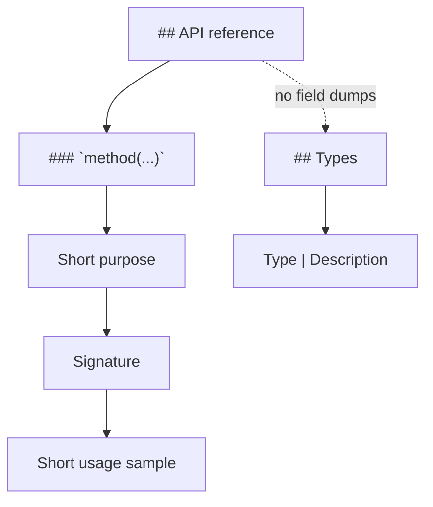

# Batch 2: API reference + Types (Speech/Media)

Gold standard: [docs/tts-offline.md](docs/tts-offline.md) — `## API reference` with flat `### \`apiName\``, then `## Types` as Type|Description tables.

**User rules for this batch:**
- Keep API entries as **(1) heading (2) short purpose prose (3) signature (4) short usage sample**.
- **Drop** long `// field → …` result dumps under APIs; document shapes in **`## Types`** instead.
- Rename `## Types and constants` → **`## Types`** (TTS title). Constants (`DEFAULT_*`, error code objects) stay as table rows with short descriptions.
- Do **not** rewrite buffer/infra docs (audiobuffer, textbuffer, segmentbuffer, model-setup, …) — Batch 3 later.
- Leave [docs/tts-live.md](docs/tts-live.md) stub as-is. Leave [docs/diarization-named-timeline.md](docs/diarization-named-timeline.md) as recipe guide (no forced full API reference).



---

## Per-API template (apply everywhere)

```markdown
### `detectX(source, options?)`

One–three sentences: what it does, when to call it, link to model-detect if relevant.

```ts
function detectX(...): Promise<XDetectResult>
```

```ts
const det = await detectX({ kind: 'fs', path: '...' });
if (!det.success) throw new Error(det.error ?? '...');
```
```

- Flatten nested `### Detection` / `#### \`api\`` → flat `### \`api\``.
- Split engine **interface dumps** into separate methods (`### \`engine.tag(...)\``, `### \`engine.destroy()\``) with prose + signature + sample (like TTS `synthesize` / `destroy`).
- Keep models/required-files, custom-init, segmentation, events as **sibling sections** outside the per-method API entries (TTS already does this).

---

## Types template

```markdown
## Types

### Core X types (`react-native-sherpa-onnx/x`)

| Type | Description |
| --- | --- |
| `XResult` | `{ … }` one-line shape or role |
| `DEFAULT_X_POLICY` | Runtime constant — … |

### Related buffer types (optional short table)

Link to buffer docs; only list IdSource/Ref aliases this feature returns.
```

- Live docs: **live-only** types here + link to offline `## Types` for shared engine/detect types (pattern: [docs/separation-live.md](docs/separation-live.md)).
- Offline docs: own core types; do **not** dump live-only types into offline (fix AT offline if needed).

---

## File order (Batch 2)

| Order | Docs | Focus |
| --- | --- | --- |
| 1 | [audio-tagging-offline.md](docs/audio-tagging-offline.md) + [audio-tagging-live.md](docs/audio-tagging-live.md) | Fresh AT docs → first full TTS template (pilot) |
| 2 | [language-identification-offline.md](docs/language-identification-offline.md) + [language-identification-live.md](docs/language-identification-live.md) | Same SLID/AT family |
| 3 | [speaker-identification-offline.md](docs/speaker-identification-offline.md) + [speaker-identification-live.md](docs/speaker-identification-live.md) | Split enroll/identify/label methods |
| 4 | [separation-offline.md](docs/separation-offline.md) + [separation-live.md](docs/separation-live.md) | Flatten + Types tables |
| 5 | [stt-offline.md](docs/stt-offline.md) + [stt-streaming.md](docs/stt-streaming.md) | Flatten Detection/factory; Types tables |
| 6 | [vad-streaming.md](docs/vad-streaming.md) + [kws-streaming.md](docs/kws-streaming.md) | KWS needs Types section added |
| 7 | [enhancement-offline.md](docs/enhancement-offline.md) + [enhancement-streaming.md](docs/enhancement-streaming.md) | Same |
| 8 | [punctuation-offline.md](docs/punctuation-offline.md) + [punctuation-streaming.md](docs/punctuation-streaming.md) | Same |
| 9 | [alignment-offline.md](docs/alignment-offline.md) | Rename Core types → Types; flesh sparse API samples |
| 10 | [diarization-offline.md](docs/diarization-offline.md) + [diarization-streaming.md](docs/diarization-streaming.md) | Offline: rename `## API` → `## API reference`, add signatures/examples + Types |
| 11 | [tts-offline.md](docs/tts-offline.md) | Consistency only: strip long `// det.* →` block under `detectTtsModel` (fields already in Types) |

Source of truth for type names/shapes: each feature’s `src/<feature>/types.ts` (and related exports), not inventing fields.

---

## Out of scope

- Buffer/infra docs, README catalog, example app
- Changing public API / TypeScript types
- Full rewrite of Quick start / Troubleshooting / Use cases beyond what’s needed to avoid duplicating Types content
- `diarization-named-timeline.md` recipe structure
