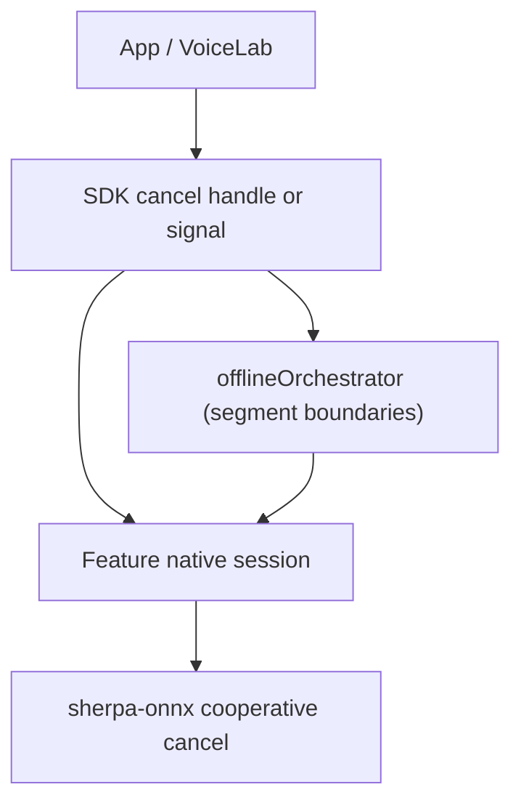

# Native offline inference cancellation (future work)

**Status:** Clean cut completed (2026-08) — orchestrator-level “fake” cancel removed. **Blocked on sherpa-onnx upstream** for mid-inference native cancel before a central SDK layer can ship.  
**Related (done):** [Cancel clean cut plan](../../.cursor/plans/cancel_clean_cut_bc779d12.plan.md) (SDK + example app + VoiceLab).  
**Archival context:** Pre-removal API design lives in `docs/migration/**` (orchestrator ADRs, segmentation transfer plans). Those records are **historical**; current user-facing docs no longer mention offline `abortSignal` or `'cancelled'` result status.

---

## 1. Summary

The SDK previously exposed **offline batch cancellation** via JavaScript `AbortSignal` on STT, TTS, separation, enhancement, VAD, and punctuation options, plus a shared orchestrator that could return `status: 'cancelled'`.

That layer was **not native cancellation**. It only stopped **between orchestrator segments** (or before the next native call). Once a sherpa-onnx offline inference call was in flight, **no cooperative abort** existed in the C++ runtime — the JS thread could not interrupt ONNX session execution.

Because the SDK is **unreleased**, we removed this surface entirely (**clean cut**, no deprecation). Consumers must not reintroduce segment-polling `abortSignal` as a substitute for real cancel.

**What still works today** is every path where cancellation is **genuine**: I/O and lifecycle teardown (see §3).

---

## 2. What was removed

### 2.1 Public TypeScript API

| Area | Removed |
|------|---------|
| Option types | `abortSignal?` on `SttTranscribeOptions`, `TtsSynthesisOptions`, `SeparateOptions`, `EnhanceOptions`, `VADOfflineRunOptions`, `OfflinePunctuateOptions` |
| Result types | `'cancelled'` from `status` unions on `SttTranscribeResult`, `TtsSynthesisResult`, `SeparationResult`, `EnhancementResult`, `OfflinePunctuateResult` |
| VAD errors | `VAD_ABORTED` / pre-segment abort checks in `src/vad/engine.ts` |

### 2.2 Shared offline orchestrator (`src/pipeline/offlineOrchestrator.ts`)

- `OrchestrationConfig.abortSignal`
- Helpers: `isAbortRequested`, `shouldReturnPartialOnCancel`
- Session state `'cancelled'`, `OrchestrationSession.cancel()`, `'cancelled'` on `OrchestrationResult.status`
- Abort / cancelled branches in all four pipeline loops:
  - `runOfflineAudioToTextPipeline`
  - `runOfflineTextToAudioPipeline`
  - `runOfflineTextToTextPipeline`
  - `runOfflineAudioMultiOutputPipeline`

### 2.3 Feature wrappers

Stopped forwarding `abortSignal` into the orchestrator from:

- `src/stt/index.ts`
- `src/tts/orchestrate.ts`
- `src/separation/orchestrate.ts`
- `src/enhancement/orchestrate.ts`
- `src/punctuation/orchestrate.ts`

### 2.4 Docs and tests

- User-facing docs: `docs/tts-offline.md`, `docs/vad-streaming.md` (no offline batch cancel references)
- Tests trimmed in orchestrator, separation, enhancement, and VAD offline segmentation suites

### 2.5 Consumers (outside this repo)

- **Example app:** batch separation Stop / `abortSignal`; offline pipeline showcase Cancel button
- **VoiceLab:** SDK-bound `abortSignal` on offline executors; Cancel button gated so it is **hidden during offline batch inference** (except decode/ingest, TTS, and live/streaming plans)

---

## 3. What was kept (real cancellation)

These paths **interrupt actual work** (I/O, threads, pipeline lifecycle) and remain supported:

| Layer | Mechanism | Examples |
|-------|-----------|----------|
| Audio ingest / decode | `AbortSignal`, `.cancel()` on ingest handles | `cancelDecode`, session audio ingest |
| File I/O | encode/save/download abort | `cancelFileIO`, download pause/stop, archive extraction abort |
| Mic / live capture | stop ingest | `stopMicToLiveAudioBuffer` |
| Streaming pipelines | pipeline lifecycle | `StreamingPipelineHandle.stop()`, `pipeline.stop()`, `stopStreamingPipeline` (STT, TTS, VAD, separation live overload, …) |
| App teardown | scope / controller abort | VoiceLab `BufferScope.dispose`, run `AbortController` (live runs, decode phase, navigation cleanup) |

**Rule:** If cancel does not reach native code or a dedicated worker with a stop hook, do not expose it as “Cancel inference” in product UI.

---

## 4. Why upstream work is required

sherpa-onnx offline engines today are largely **synchronous batch calls** from the binding’s point of view:

1. JS/TS schedules work on a native module thread (or blocks until completion).
2. ONNX Runtime runs the full forward pass for the current utterance / segment.
3. Control returns to JS only after the native call finishes.

Segmentation in `offlineOrchestrator` splits long inputs into **multiple** native calls. The removed `abortSignal` could only skip **upcoming** segments — it could not stop an **in-flight** graph run. That produced a misleading UX (“Cancel” appeared to do nothing for seconds) and duplicated partial-result policy in JS without native guarantees.

**Live/streaming** paths are different: workers already support **stop / flush / teardown** between chunks. That is why streaming cancel stays.

---

## 5. Upstream prerequisites (sherpa-onnx)

Before reintroducing offline inference cancel in this SDK, sherpa-onnx (and our pinned native builds) need **cooperative cancellation** inside or below the feature facades. Exact API shape is an upstream design choice; minimally we need:

### 5.1 Per-feature or shared cancel token

A native handle or flag checked **inside** long-running loops (not only between orchestrator segments), for at least:

- Offline STT (transducer / paraformer / whisper batch paths)
- Offline TTS (including multi-segment / long-form synthesis)
- Offline enhancement & source separation
- Offline VAD batch passes
- Offline punctuation (CT transformer batch)

### 5.2 Defined semantics on abort

Document and implement consistent behaviour when cancel is requested mid-run:

| Outcome | When |
|---------|------|
| **Hard abort** | Throw / error code; no partial output committed |
| **Partial commit** | Return completed segments / audio frames so far; stable error or status bit |
| **Best-effort drain** | Finish current micro-batch only, then stop (TTS latency-sensitive) |

The old SDK `'cancelled'` status mixed these policies with `errorRecovery` (`abort` vs `skip` vs `partial_result`) **purely in JS**. A future design should align orchestrator policy with **native** capabilities per feature.

### 5.3 Thread safety

- Cancel may be invoked from the **JS thread** while native runs on a **worker / module thread**.
- No use-after-free on session handles, buffers, or ORT sessions after cancel.
- Idempotent cancel (second call is a no-op).

### 5.4 ONNX Runtime interaction

Depending on upstream approach:

- ORT **Run** cancellation hooks / session termination, or
- Chunked inference with explicit boundary checks, or
- Separate process / isolate for batch jobs (heavier; likely out of scope for mobile RN)

We should track upstream issues/PRs in [k2-fsa/sherpa-onnx](https://github.com/k2-fsa/sherpa-onnx) and bump vendored binaries only after cancel semantics are tested on **Android and iOS** for our bound features.

---

## 6. Proposed future SDK design (after upstream)

**Goal:** One **central cancellation model** wired from TS through JNI/Obj-C++ to native, instead of per-feature `AbortSignal` copies in the orchestrator.

### 6.1 Layering

1. **Native first:** each offline engine exposes `requestCancel()` or checks a shared `CancelToken` during inference.
2. **Orchestrator second:** on cancel, stop scheduling new segments **and** propagate cancel to the active native session.
3. **TypeScript last:** public API (e.g. `CancelToken`, `run.cancel()`, or a single `AbortSignal` mapped to native — name TBD) documented once across features.

### 6.2 Result model

Reintroduce a terminal cancelled/partial outcome **only if** native defines it, e.g.:

- `status: 'cancelled' | 'partial'` with explicit fields (`completedSegments`, retained buffers), or
- thrown error with `code: 'INFERENCE_CANCELLED'` and optional partial payload

Avoid duplicating the pre-2026 JS-only `'cancelled'` without native backing.

### 6.3 Feature parity matrix (target)

| Feature | Offline batch cancel | Streaming stop (today) |
|---------|----------------------|-------------------------|
| STT | Future native | ✅ `pipeline.stop()` |
| TTS | Future native (highest priority for UX) | ✅ streaming stop |
| Separation | Future native | ✅ live overload stop |
| Enhancement | Future native | ✅ streaming stop |
| VAD | Future native | ✅ pipeline stop |
| Punctuation | Future native | ✅ live text path stop |

### 6.4 Consumer UX

When native offline cancel ships:

- VoiceLab can show Cancel during offline `engineRunning` for features that support it.
- Example app batch screens can restore Stop **only** if bound to the new SDK cancel handle.
- Re-enable SDK tests for cancel + partial paths using **native** simulation (mock native cancel callback), not `AbortController.abort()` between mocked instant segments only.

---

## 7. Implementation checklist (when unblocked)

- [ ] Upstream sherpa-onnx: cancel API + tests for at least one offline feature (TTS or STT pilot).
- [ ] Vendor bump in `react-native-sherpa-onnx` Android/iOS native deps.
- [ ] JNI / Swift bridge: propagate cancel token into existing engine handles.
- [ ] Restore orchestrator integration (segment loop + active session cancel).
- [ ] Unified TS types + one doc section in [streaming-pipelines-overview.md](../streaming-pipelines-overview.md) / per-feature offline docs.
- [ ] Example app + VoiceLab: wire Cancel to SDK; remove temporary gating where native cancel exists.
- [ ] Platform tests: cancel during long batch on mid-range Android device (logcat proves native abort, not just JS early return).

---

## 8. Out of scope / non-goals

- Re-adding JS-only `abortSignal` without native checks.
- Process-kill or isolate-based “cancel” as the primary mobile UX.
- Changing migration archive documents under `docs/migration/**` (historical record only).

---

## 9. Related documents

- [Cancel clean cut plan (completed)](../../.cursor/plans/cancel_clean_cut_bc779d12.plan.md)
- [Streaming pipelines overview](../streaming-pipelines-overview.md) — live `stop()` semantics (unchanged)
- [Audiobuffer streaming](../audiobuffer-streaming.md) — decode cancel (`DECODE_CANCELLED`)
- Migration (historical): `docs/migration/segmentationEngine/sub-04-transfer-offline-orchestration.md`, `docs/migration/OrchestrationProgressVADAli/ADR-002-vad-offline-segmentation-progress-strategy.md`
