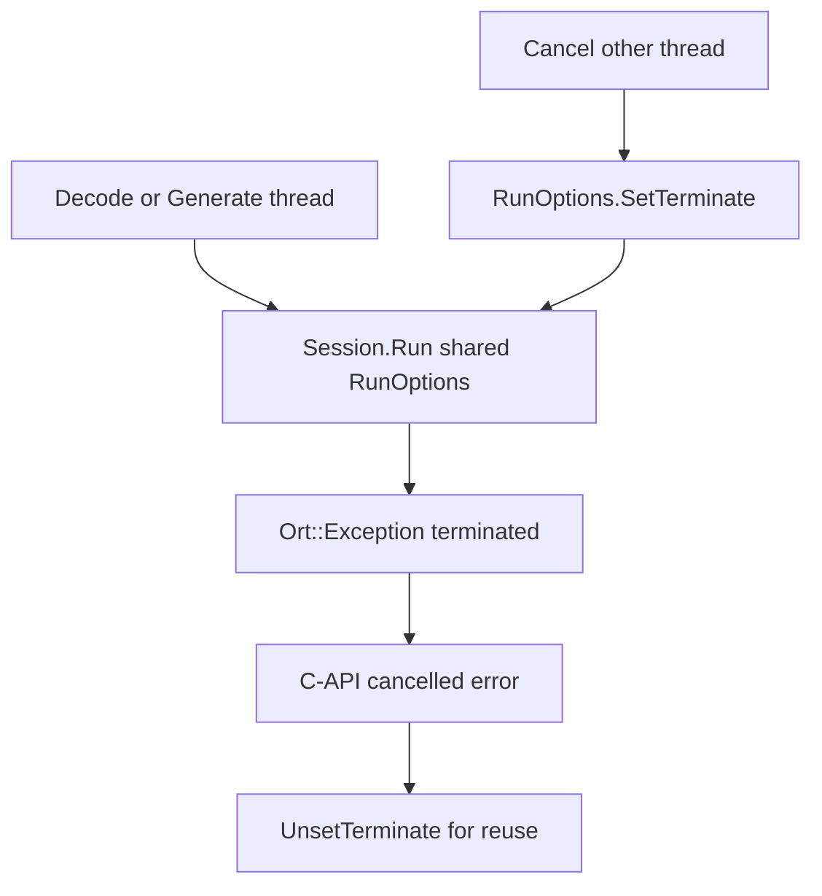
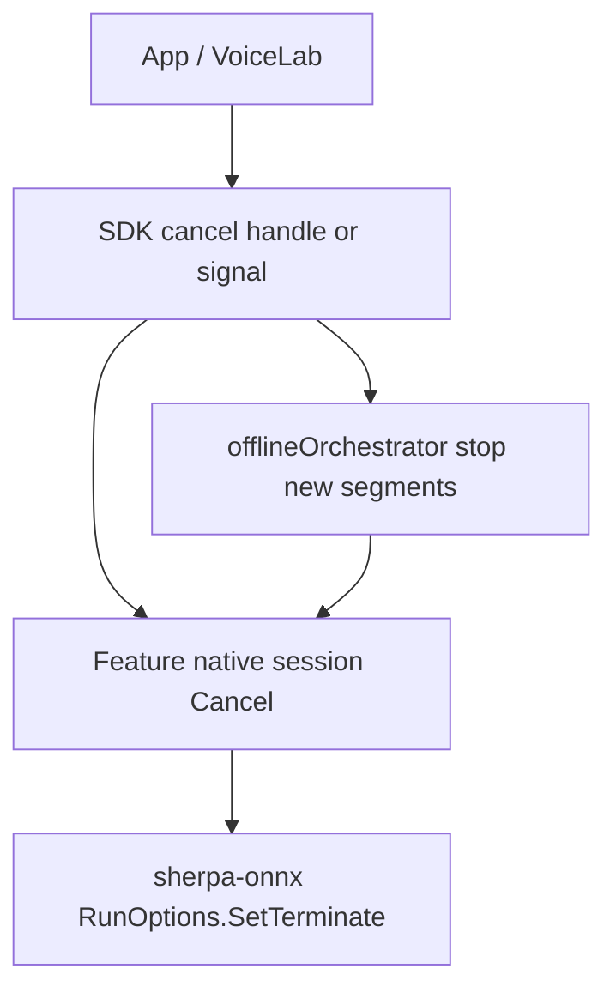

# Native offline inference cancellation (future work)

**Status:** Clean cut completed (2026-08) — orchestrator-level “fake” cancel removed. **Blocked on sherpa-onnx upstream** for mid-inference native cancel before a central SDK layer can ship.  
**Upstream decision (2026-09):** Target is **hard mid-ORT cancel** via ONNX Runtime `RunOptions::SetTerminate` — **not** callback / between-batch cooperative cancel as the product solution. Work starts **core-first** (C++ + C-API); language bindings follow after the C contract is stable.  
**Related (done):** [Cancel clean cut (internal)](../internal/cancel-clean-cut.md) — SDK, example app, and VoiceLab.  
**Archival context:** Pre-removal API design lives in `docs/migration/**` (orchestrator ADRs, segmentation transfer plans). Those records are **historical**; current user-facing docs no longer mention offline `abortSignal` or `'cancelled'` result status.

---

## 1. Summary

The SDK previously exposed **offline batch cancellation** via JavaScript `AbortSignal` on STT, TTS, separation, enhancement, VAD, and punctuation options, plus a shared orchestrator that could return `status: 'cancelled'`.

That layer was **not native cancellation**. It only stopped **between orchestrator segments** (or before the next native call). Once a sherpa-onnx offline inference call was in flight, **no cooperative abort** existed in the C++ runtime — the JS thread could not interrupt ONNX session execution.

Because the SDK is **unreleased**, we removed this surface entirely (**clean cut**, no deprecation). Consumers must not reintroduce segment-polling `abortSignal` as a substitute for real cancel.

**What still works today** is every path where cancellation is **genuine**: I/O and lifecycle teardown (see §3).

**Product goal going forward:** cancel must abort an **in-flight ORT `Session::Run`**, not only skip the next segment or return `0` from a TTS audio callback.

---

## 2. What was removed

### 2.1 Public TypeScript API

| Area | Removed |
|------|---------|
| Option types | `abortSignal?` on `SttTranscribeOptions`, `TtsSynthesisOptions`, `SeparateOptions`, `EnhanceOptions`, `VADOfflineRunOptions`, `OfflinePunctuateOptions` |
| Result types | `'cancelled'` from `status` unions on `SttTranscribeResult`, `TtsSynthesisResult`, `SeparationResult`, `EnhancementResult`, `OfflinePunctuateResult` |
| VAD errors | `VAD_ABORTED` / pre-segment abort checks in `src/vad/engine.ts` |

### 2.2 Shared offline orchestrator (`src/pipeline/offlineOrchestrator.ts`)

- `OrchestrationConfig.abortSignal`
- Helpers: `isAbortRequested`, `shouldReturnPartialOnCancel`
- Session state `'cancelled'`, `OrchestrationSession.cancel()`, `'cancelled'` on `OrchestrationResult.status`
- Abort / cancelled branches in all four pipeline loops:
  - `runOfflineAudioToTextPipeline`
  - `runOfflineTextToAudioPipeline`
  - `runOfflineTextToTextPipeline`
  - `runOfflineAudioMultiOutputPipeline`

### 2.3 Feature wrappers

Stopped forwarding `abortSignal` into the orchestrator from:

- `src/stt/index.ts`
- `src/tts/orchestrate.ts`
- `src/separation/orchestrate.ts`
- `src/enhancement/orchestrate.ts`
- `src/punctuation/orchestrate.ts`

### 2.4 Docs and tests

- User-facing docs: `docs/tts-offline.md`, `docs/vad-streaming.md` (no offline batch cancel references)
- Tests trimmed in orchestrator, separation, enhancement, and VAD offline segmentation suites

### 2.5 Consumers (outside this repo)

- **Example app:** batch separation Stop / `abortSignal`; offline pipeline showcase Cancel button
- **VoiceLab:** SDK-bound `abortSignal` on offline executors; Cancel button gated so it is **hidden during offline batch inference** (except decode/ingest, TTS, and live/streaming plans)

---

## 3. What was kept (real cancellation)

These paths **interrupt actual work** (I/O, threads, pipeline lifecycle) and remain supported:

| Layer | Mechanism | Examples |
|-------|-----------|----------|
| Audio ingest / decode | `AbortSignal`, `.cancel()` on ingest handles | `cancelDecode`, session audio ingest |
| File I/O | encode/save/download abort | `cancelFileIO`, download pause/stop, archive extraction abort |
| Mic / live capture | stop ingest | `stopMicToLiveAudioBuffer` |
| Streaming pipelines | pipeline lifecycle | `StreamingPipelineHandle.stop()`, `pipeline.stop()`, `stopStreamingPipeline` (STT, TTS, VAD, separation live overload, …) |
| App teardown | scope / controller abort | VoiceLab `BufferScope.dispose`, run `AbortController` (live runs, decode phase, navigation cleanup) |

**Rule:** If cancel does not reach native code or a dedicated worker with a stop hook, do not expose it as “Cancel inference” in product UI.

---

## 4. Why upstream work is required

sherpa-onnx offline engines today are largely **synchronous batch calls** from the binding’s point of view:

1. JS/TS schedules work on a native module thread (or blocks until completion).
2. ONNX Runtime runs the full forward pass for the current utterance / segment.
3. Control returns to JS only after the native call finishes.

Segmentation in `offlineOrchestrator` splits long inputs into **multiple** native calls. The removed `abortSignal` could only skip **upcoming** segments — it could not stop an **in-flight** graph run. That produced a misleading UX (“Cancel” appeared to do nothing for seconds) and duplicated partial-result policy in JS without native guarantees.

**Live/streaming** paths are different: workers already support **stop / flush / teardown** between chunks. That is why streaming cancel stays.

### 4.1 What already exists upstream (and why it is not enough)

| Mechanism | Where | Why it is **not** our target |
|-----------|--------|------------------------------|
| TTS `generateWithCallback` / progress callback return `0` | C / Kotlin / Java / … | Stops **between** sentence/batch chunks after a `Process`/`Run` finishes — not mid-ORT |
| Diarization progress callback | Upstream return value often ignored; RN has its own between-phase `atomic` | Between phases only |
| Online ASR “stop” | Stop feeding / `Reset` / pipeline `stop()` | App loop control, not ORT terminate |
| Offline ASR `Decode` | Fully blocking, no cancel API | Must get hard ORT cancel |

Wiring TTS callbacks in RN alone would restore a **half-solution** UX. We explicitly **reject** that as the shipped cancel story for offline inference.

---

## 5. Upstream decision: hard mid-ORT cancel, core-first

### 5.1 Chosen approach

Use ONNX Runtime’s existing cancel hook:

1. Hold a **long-lived** `Ort::RunOptions` on the offline engine/model (not ephemeral `Run({},)` / `Ort::RunOptions{nullptr}` as today).
2. Pass **that same** `RunOptions` into every `Session::Run` / RunWithBinding for the in-flight job.
3. From another thread, call `RunOptions::SetTerminate()`.
4. ORT aborts the run with an error (typically surfaces as `Ort::Exception` with terminate messaging).
5. Map to a stable **cancelled** error in the C-API; then `UnsetTerminate()` before the engine is reused.

This is an **architecture refactor of the inference layer**, not a thin facade method. Today sherpa-onnx has **no** shared `RunOptions` helper; offline ASR/TTS alone have on the order of **~70+ `Run` sites** across **~30 model files**.

### 5.2 Semantics (fixed)

| Topic | Decision |
|-------|----------|
| Outcome | **Hard abort** — no partial audio/text from the aborted graph committed as success |
| Partial JS orchestrator policy | Only after native defines cancelled; do **not** revive pre-2026 JS-only `'cancelled'` |
| Latency expectation | Abort is **fast**, not necessarily instantaneous mid-kernel: ORT checks terminate **between execution steps**; a single large op may finish before exit |
| Non-ORT EPs | QNN / RKNN / Ascend / etc. need a **separate** cancel story; initial scope is standard ORT CPU/mobile EP builds we pin (e.g. 1.28.x) |
| Concurrency | One in-flight Decode/Generate per engine instance (RN pattern). One shared `RunOptions` cancels all Sessions that used it for that job |

### 5.3 Scope: core first — not “Kotlin + iOS only”

| Layer | Role |
|-------|------|
| **C++ core + C-API (required first)** | Own `RunOptions`, `Cancel()`, exception → cancelled mapping, tests. Without this, bindings are forks. |
| **CXX-API** | Follow C-API once stable (thin). |
| **Language bindings** | **After** C-API: one upstream PR per language (maintainer preference). For this SDK: **JNI/Kotlin** and **ObjC++/Swift** next. Go/Dart/C#/… optional later, same contract. |

Do **not** ship cancel only inside RN wrappers or only on two bindings without upstream core — that creates unmaintainable fork debt.

### 5.4 Rollout inside core (still hard-ORT only)

Staff **coverage**, not **mechanism**:

1. **Shared infrastructure** — `RunOptions` ownership + `Cancel` + error mapping (+ helper so models cannot keep calling `Run({},)`).
2. **Pilot** — one Offline ASR model (prefer single-session, e.g. SenseVoice/Paraformer) **and** one Offline TTS model; prove terminate on **Android and iOS** with logs.
3. **Sweep** — rewire remaining offline `Run` sites (all ASR models, all TTS, then enhancement / separation / VAD / punctuation as needed for SDK parity).

Pilot ≠ soft cancel. Every step still uses `SetTerminate`.

### 5.5 Complexity / risk

| Scope | Effort | Notes |
|-------|--------|-------|
| Shared `RunOptions` + C-API cancel + exception mapping | Medium–large | Prerequisite for everything |
| Pilot ASR + TTS (hard ORT) on Android/iOS | Medium | Proof of UX + EP behavior |
| All offline ASR/TTS model files | Large | Mechanical but high blast radius |
| Full feature matrix (STT, TTS, sep, enhance, VAD, punct) | Very large | Weeks–months; requires the shared helper |

**Risks:** C-API today often has no try/catch around Decode/Generate (terminate would escape); session reuse after cancel; formal data race on ORT’s terminate bool (documented cross-thread API nonetheless); multi-session models must all use the same options instance.

### 5.6 Explicitly rejected for the product cancel path

- JS-only / orchestrator-only `abortSignal` (already removed).
- TTS callback return `0` / progress-callback abort as the **shipped** offline cancel story.
- Atomic flags checked only **between** sherpa loops without ORT terminate.
- Process-kill / isolate kill as primary mobile UX.
- Binding-only patches (Kotlin/Swift) without C++/C-API.

Existing TTS callbacks may remain as optional streaming/progress APIs; they are **not** a substitute for §5.1.

---

## 6. Proposed future SDK design (after upstream)

**Goal:** One **central cancellation model** wired from TS through JNI/Obj-C++ to sherpa-onnx **hard ORT cancel**, instead of per-feature `AbortSignal` copies in the orchestrator.

### 6.1 Layering

1. **Upstream core first:** engines expose `Cancel()` backed by `SetTerminate`.
2. **Bindings:** Kotlin/JNI + Swift/ObjC++ map to C-API.
3. **Orchestrator:** on cancel, stop scheduling new segments **and** call active session `Cancel()`.
4. **TypeScript last:** public API (e.g. `CancelToken`, `run.cancel()`, or `AbortSignal` mapped to native — name TBD) documented once across features.

### 6.2 Result model

Reintroduce a terminal cancelled outcome **only if** native defines it, e.g.:

- thrown / rejected error with `code: 'INFERENCE_CANCELLED'`, or
- `status: 'cancelled'` with **no** fabricated partial success from the aborted run

Avoid duplicating the pre-2026 JS-only `'cancelled'` without native backing. Do not mix in “partial commit from mid-ORT” unless ORT/upstream later defines a safe partial contract (out of initial scope).

### 6.3 Feature parity matrix (target)

| Feature | Offline batch cancel (hard ORT) | Streaming stop (today) |
|---------|----------------------------------|-------------------------|
| STT | Future native | ✅ `pipeline.stop()` |
| TTS | Future native (high UX priority; hard ORT, not callback-only) | ✅ streaming stop |
| Separation | Future native | ✅ live overload stop |
| Enhancement | Future native | ✅ streaming stop |
| VAD | Future native | ✅ pipeline stop |
| Punctuation | Future native | ✅ live text path stop |

### 6.4 Consumer UX

When native offline cancel ships:

- VoiceLab can show Cancel during offline `engineRunning` for features that support it.
- Example app batch screens can restore Stop **only** if bound to the new SDK cancel handle.
- Re-enable SDK tests that prove **native** abort (logcat / native trace of terminate), not only JS early return between mocked segments.

---

## 7. Implementation checklist (when unblocked)

### Upstream (sherpa-onnx) — core

- [ ] Shared long-lived `Ort::RunOptions` pattern + ban ephemeral `Run({},)` for cancellable offline paths.
- [ ] Facade `Cancel()` + C-API entry points; try/catch Decode/Generate → cancelled error; `UnsetTerminate` on reuse.
- [ ] Pilot: one Offline ASR + one Offline TTS model; Android + iOS smoke with terminate proven in logs.
- [ ] Sweep remaining offline ORT `Run` sites for SDK-relevant features.
- [ ] Docs: cancel semantics, thread rules, EP caveats.

### Upstream — bindings (after C-API)

- [ ] JNI/Kotlin cancel surface (own PR).
- [ ] Swift/ObjC++ cancel surface (own PR).
- [ ] Other languages optional, same contract, separate PRs.

### This SDK

- [ ] Vendor bump Android/iOS native deps.
- [ ] Bridge cancel into engine handles; restore orchestrator (stop new segments + native `Cancel()`).
- [ ] Unified TS types + docs; Example app + VoiceLab Cancel wiring; remove temporary gating.
- [ ] Platform tests: long batch cancel on mid-range Android (native abort, not JS-only).

---

## 8. Out of scope / non-goals

- Re-adding JS-only `abortSignal` without native ORT terminate.
- Shipping TTS callback / between-batch cancel as the primary offline cancel UX.
- Process-kill or isolate-based “cancel” as the primary mobile UX.
- Binding-only or RN-only cancel without upstream C++/C-API.
- Guaranteeing abort **inside** a single ORT kernel op (only between ORT steps).
- Non-ORT backend cancel (QNN/RKNN/…) in the initial core PR.
- Changing migration archive documents under `docs/migration/**` (historical record only).

---

## 9. Related documents

- [Cancel clean cut (completed, internal)](../internal/cancel-clean-cut.md)
- [Streaming pipelines overview](../streaming-pipelines-overview.md) — live `stop()` semantics (unchanged)
- [Audiobuffer streaming](../audiobuffer-streaming.md) — decode cancel (`DECODE_CANCELLED`)
- Migration (historical): `docs/migration/segmentationEngine/sub-04-transfer-offline-orchestration.md`, `docs/migration/OrchestrationProgressVADAli/ADR-002-vad-offline-segmentation-progress-strategy.md`
- Upstream ORT: `Ort::RunOptions::SetTerminate` / `UnsetTerminate` (pinned ORT ~1.28.x in sherpa-onnx / RN prebuilts)
