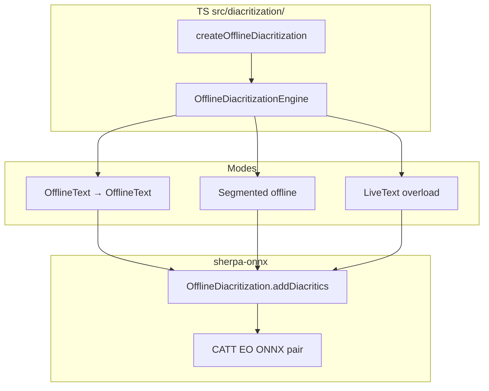

# Offline Diacritization: Kotlin API parity (+ deferred SDK research)

**Status:** Waiting on upstream Kotlin API (or equivalent packaging). SDK feature work is **deferred**.  
**Priority:** Prerequisite before any `createOfflineDiacritization` / LiveText work in this SDK.  
**Research date:** 2026-09-11  
**Upstream:** [k2-fsa/sherpa-onnx#3647](https://github.com/k2-fsa/sherpa-onnx/pull/3647) (C/C++/Python), [k2-fsa/sherpa-onnx#3669](https://github.com/k2-fsa/sherpa-onnx/pull/3669) (Java only).  
**Matrix:** `docs/internal/sdk-feature-support-matrix.md` — Diacritization offline Yes upstream / SDK No.

---

## Part A — Upstream Kotlin API (do this first)

### A.1 Guiding principle (non-negotiable)

When implementing or reviewing the Kotlin bindings:

1. **Primary goal = parity with the existing `java-api`**, not with this RN SDK’s buffer/pipeline shape.
2. Mirror **`OfflinePunctuation.kt` ↔ `OfflinePunctuation.java`** (and AudioTagging): same types, same JNI entry points, same lifecycle (`newFromFile` / `newFromAsset` / `delete` / `addDiacritics`).
3. Keep the Kotlin surface **idiomatic and clean** (data classes / builders consistent with the rest of `kotlin-api/`), but **do not** invent RN-specific methods, buffer IDs, segmentation hooks, or LiveText concepts in upstream.
4. This SDK (and any other consumer) adapts **after** a complete upstream Kotlin API exists — never the other way around.

### A.2 Problem

| Layer | Status (`v1.13.7` / `v1.13.8` / `master`) |
| --- | --- |
| C / CXX API | ✅ |
| JNI (`offline-diacritization.cc`) | ✅ `Java_com_k2fsa_sherpa_onnx_OfflineDiacritization_*` |
| **`java-api/`** | ✅ since **`v1.13.3`** — `OfflineDiacritization` + Config / ModelConfig |
| **`kotlin-api/`** | ❌ no `OfflineDiacritization.kt` (no diacrit mentions at all) |

Our Maven AAR (`com.xdcobra.sherpa:sherpa-onnx:**1.13.7-1**`, verified 2026-09-02 publish — not a stale extract) builds **`kotlin-api` → `classes.jar` by default**:

| AAR layer | OfflineDiacritization? |
| --- | --- |
| `jni/*/libsherpa-onnx-jni.so` | ✅ |
| `c-api/c-api.h` / `cxx-api.h` | ✅ |
| `classes.jar` | ❌ **0** classes (Punctuation / AudioTagging **are** present) |

Gap = **java vs kotlin API asymmetry**, not “missing sherpa version”. Bumping to `v1.13.8` alone does **not** fix it.

Java reference surface (example `java-api-examples/OfflineAddDiacritics.java`):

```java
OfflineDiacritizationModelConfig modelConfig =
  OfflineDiacritizationModelConfig.builder()
    .setCattEncoder("./catt_eo_model_onnx/encoder.onnx")
    .setCattDecoder("./catt_eo_model_onnx/decoder.onnx")
    .setNumThreads(1)
    .setDebug(true)
    .build();
OfflineDiacritizationConfig config =
  OfflineDiacritizationConfig.builder().setModel(modelConfig).build();
OfflineDiacritization diacrt = new OfflineDiacritization(config);
String out = diacrt.addDiacritics(text);
```

C-API (iOS / non-Kotlin): Create → `SherpaOfflineDiacritizationAddDiacritics` → FreeText → Destroy (already in our xcframework).

### A.3 Goal (upstream only)

Add under `sherpa-onnx/kotlin-api/`:

```text
OfflineDiacritization.kt
OfflineDiacritizationConfig.kt   // or nested in same file — match kotlin-api conventions
OfflineDiacritizationModelConfig.kt
```

Expose the **same contract** as Java/JNI:

- `cattEncoder` / `cattDecoder` / `numThreads` / `provider` / `debug`
- `addDiacritics(text: String): String`
- `release()` / finalizer pattern consistent with siblings

Then rebuild + publish Maven so `classes.jar` contains the new classes.

### A.4 Preferred path

1. **Upstream PR** to k2-fsa (or temporary fork): Kotlin files = faithful port of Java + JNI names; style peer-reviewed against `OfflinePunctuation.kt`.
2. Bump `third_party/sherpa-onnx`, rebuild via `third_party/sherpa-onnx-prebuilt`, publish `com.xdcobra.sherpa:sherpa-onnx`.
3. Verify `jar tf …/classes.jar | grep OfflineDiacritization`; device smoke with Arabic sample strings (parity with Java example).

**Acceptance (Part A):**

- [ ] Kotlin types on upstream `master` (or fork) with **java-api behavioral parity**
- [ ] No RN/SDK concepts in upstream Kotlin API
- [ ] Published Maven `classes.jar` includes the classes; JNI still resolves
- [ ] Android smoke: undiacritized Arabic → diacritized string

### A.5 Fallbacks (packaging only — still not SDK-shaped)

| Option | Notes |
| --- | --- |
| **A. Patch kotlin-api in our build tree** | Add `.kt` files before `kotlin-api-build`; still write them as **java-parity** wrappers; contribute upstream after |
| **B. Ship `java-api` classes into AAR** | `--java` / `--both`; usable but diverges from “Kotlin is default `classes.jar`” |
| **C. Thin JNI wrappers inside the RN module** | Last resort; duplicates upstream; avoid |

Do **not** reimplement CATT via raw ORT.

### A.6 Non-goals for Part A

- RN `createOfflineDiacritization`, detect/collect, LiveText overload, example screen  
- Changing JNI / C-API contracts for SDK convenience  
- CATT ED packs / inventing `OnlineDiacritization`

---

## Part B — Deferred SDK feature research (archive)

> **Do not start Part B until Part A acceptance is green.**  
> Research below was drafted 2026-09-11 as an internal plan; kept here so we do not re-discover upstream behaviour, models, and pipeline shape.

### B.1 What diacritization is

Arabic *tashkeel*: restore short-vowel / diacritic marks on undiacritized text via CATT EO (`addDiacritics(plain) → diacritized`). Typical chain: **STT (ar) → diacritization → TTS (ar)** (upstream PR motivation: better TTS with diacritics).

| Question | Answer |
| --- | --- |
| Offline upstream? | **Yes** — `OfflineDiacritization*` |
| Online / streaming? | **No** — no `OnlineDiacritization` |
| Core op | Batch string in → string out |
| SDK template | **Offline punctuation** (text→text + optional live overload) — **not** KWS |

### B.2 Models / licenses / collect

- Weights today: [abjadai/catt `v2` `eo_model_onnx.zip`](https://github.com/abjadai/catt/releases/download/v2/eo_model_onnx.zip) → `encoder.onnx` + `decoder.onnx`  
- Config paths: `catt_encoder` / `catt_decoder`  
- License: **Apache-2.0** (was CC-BY-NC; verify NOTICE in CSV)  
- **No** `diacritization-models` tag on k2-fsa as of research → prefer later k2-fsa/Maven mirror tag; interim collect from `abjadai/catt`  
- ED zip exists but **not** wired in sherpa EO API — out of MVP  
- Do **not** piggyback punctuation/ASR license CSVs

### B.3 Runtime semantics

1. Load EO ONNX pair → construct engine → `addDiacritics` → release  
2. Arabic-only; no tokens/timestamps from core API  
3. Long text → segment (like offline punctuation), not one unbounded string  

### B.4 Intended SDK shape (after Part A)

| Mode | I/O |
| --- | --- |
| Offline oneshot | OfflineText → OfflineText (+ optional `diacritizeString`) |
| Offline segmented | Long OfflineText + segmentation (punctuation parity) |
| Live overload | LiveText → LiveText (offline weights per commit — punctuation live overload pattern) |

- Factory: `createOfflineDiacritization` — **no** `createStreamingDiacritization` in MVP  
- Module sketch: `src/diacritization/` (`offline.ts`, `detect.ts`, `live.ts`, …)  
- Import: `react-native-sherpa-onnx/diacritization`  
- Docs later: `diacritization-offline.md` + `diacritization-live.md`  
- Analog: API/orchestration → offline punctuation; collect → dedicated stream like AT/punctuation  
- iOS: C-API already in xcframework; Android: Kotlin class from Part A  



### B.5 Phased SDK delivery (reminder)

| Phase | Focus |
| --- | --- |
| **0** | Part A complete + Maven pin with Kotlin classes |
| **1** | Category, detect, collect, licenses |
| **2** | Native bridges + offline oneshot |
| **3** | Offline segmentation |
| **4** | Live overload |
| **5** | Example showcase |
| **6** | Public docs + download catalog |

**SDK non-goals:** fake streaming factory; custom ORT; non-Arabic; KWS-style audio pipeline.

### B.6 Open questions (when resuming SDK work)

1. Collect host: k2-fsa `diacritization-models` vs interim `abjadai/catt`  
2. Offline text segmentation: reuse punctuation helpers vs minimal split  
3. Example fixtures (Arabic strings / optional STT wav)  
4. Public method name `diacritize` vs native `addDiacritics` (map 1:1 under the hood)

### B.7 Anchors

| Area | Follow |
| --- | --- |
| Kotlin sibling | `third_party/sherpa-onnx/.../kotlin-api/OfflinePunctuation.kt` |
| Java source of truth | `.../java-api/.../OfflineDiacritization*.java` |
| Offline text SDK | `src/punctuation/offline.ts`, `docs/punctuation-offline.md` |
| Live overload | `docs/migration/liveOverload/sub-04-punctuation-live-overload.md` |
| Model zip | `https://github.com/abjadai/catt/releases/download/v2/eo_model_onnx.zip` |

---

## Unblock checklist

1. Part A acceptance (Kotlin = **java-api parity**, clean upstream API)  
2. Maven pin with classes in `classes.jar`  
3. iOS C-API already OK  
4. Only then start Part B phases 1+
