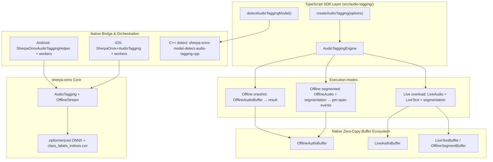
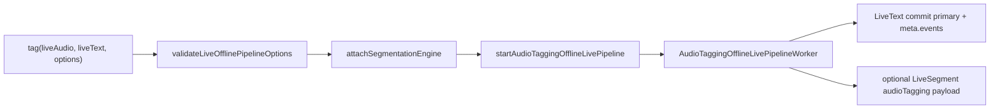

# Audio Tagging — Architecture & Implementation Plan

> **Status:** Phase 4 live overload landed — Phase 5 showcase next (offline↔live), then Phase 6 docs  
> **Audience:** SDK Maintainers  
> **Category:** Speech & Media Features (`ModelCategory.AudioTagging` / `audioTagging`)  
> **Target Branch:** `feat/add-audio-tagging-feature`  
> **MVP scope:** Offline oneshot + segmented ✅; live overload ✅; showcase + docs pending  
> **Research date:** 2026-09-10 (live overload research refresh 2026-09-10)  
> **Naming:** `ModelCategory.AudioTagging = 'audioTagging'`; native detect category `"audiotagging"` (alias `"audio_tagging"`).

---

## 1. Executive Summary & Core Decisions

### 1.1 What is Audio Tagging?

Audio tagging classifies **sound events** in an audio clip (speech, music, dog bark, siren, laughter, …) and returns a **ranked list of event labels with probabilities**. Unlike STT it does **not** produce a transcript; unlike VAD/KWS it does **not** localize events in time (upstream docs: *recognize sound events within an audio clip without its temporal localization*).

Typical use: scene / environment awareness, content moderation hints, “what kind of audio is this?”, wake-adjacent event detection (smoke alarm / baby cry) when wake-word KWS is the wrong tool.

Upstream overview: https://k2-fsa.github.io/sherpa/onnx/audio-tagging/

### 1.2 Offline-only upstream (inverse of KWS)

| Question | Answer |
| --- | --- |
| Offline config in sherpa-onnx? | **Yes.** `AudioTaggingConfig` + `AudioTagging` + `OfflineStream` |
| Online / streaming config? | **No.** There is no `OnlineAudioTagger` / online stream API |
| Mic demos upstream? | **Push-to-talk / accumulate then offline compute** (`sherpa-onnx-microphone-offline-audio-tagging`) — not a continuous online decoder |
| SDK MVP | **Offline first** — same family as SLID/SID/enhancement offline. **Not** real streaming like KWS/VAD |
| Live path | **Live overload** (optional Phase): segment live audio → run offline `compute` per window — same pattern as SLID live |
| Why not KWS as primary template? | KWS is streaming-only with `OnlineStream`. Audio tagging is offline classify → **SLID** is the closer API/orchestration analog |

This is the **inverse** of KWS (streaming-only, no offline engine). Audio tagging is **offline-only upstream**, with optional SDK live overload for mic/file streams.

### 1.3 Models: dedicated `audio-tagging-models` packs

- **Runtime:** Already in our prebuilts (same sherpa-onnx AAR / `SherpaOnnxC.framework`). No new native library release needed only for Audio Tagging.
- **Weights:** Dedicated GitHub release tag [`audio-tagging-models`](https://github.com/k2-fsa/sherpa-onnx/releases/tag/audio-tagging-models).
- **Families:**
  - **Zipformer** — `OfflineZipformerAudioTaggingModelConfig` / `model.zipformer.model` (single ONNX + labels CSV)
  - **CED** — `model.ced` path (Conditional Event Detection; tiny/mini/small/base)
- **Labels:** Every pack ships `class_labels_indices.csv` (AudioSet-style index → human-readable name). Required at init (`AudioTaggingConfig.labels`).
- Packs are **not** interchangeable with ASR zipformer / KWS packs.

Verified assets on `audio-tagging-models` (as of research):

| Asset |
| --- |
| `sherpa-onnx-zipformer-audio-tagging-2024-04-09.tar.bz2` |
| `sherpa-onnx-zipformer-small-audio-tagging-2024-04-15.tar.bz2` |
| `sherpa-onnx-ced-tiny-audio-tagging-2024-04-19.tar.bz2` |
| `sherpa-onnx-ced-mini-audio-tagging-2024-04-19.tar.bz2` |
| `sherpa-onnx-ced-small-audio-tagging-2024-04-19.tar.bz2` |
| `sherpa-onnx-ced-base-audio-tagging-2024-04-19.tar.bz2` |

---

## 2. Upstream Availability & Prebuilt Status

Verified against current SDK prebuilts / `third_party/sherpa-onnx` (2026-09-10):

| Component | Android | iOS |
| --- | --- | --- |
| **Underlying Engine** | Offline `AudioTagging` | Same via C-API |
| **Prebuilt Status** | ✅ `com.k2fsa.sherpa.onnx.AudioTagging*` in `classes.jar`; JNI in `libsherpa-onnx-jni.so` | ✅ `SherpaOnnxCreateAudioTagging` / CreateOfflineStream / Compute / FreeResults in `SherpaOnnxC` |
| **Native API Type** | Kotlin: `AudioTagging` + `OfflineStream` + `AudioTaggingConfig` | C-API: `SherpaOnnxAudioTaggingConfig`, `SherpaOnnxAudioEvent`, … |
| **Stream type** | `OfflineStream` (accept waveform → `compute(stream, topK)`) | Same offline stream lifecycle |
| **Extra native work** | Thin helper (+ optional offlineLive / segmented worker) | Thin ObjC++ bridge (+ same workers) |
| **Need custom ORT / CXX?** | **No** — use prebuilt Kotlin bindings | **No** — use prebuilt C-API |

Kotlin surface (from `third_party/sherpa-onnx/.../kotlin-api/AudioTagging.kt`):

```kotlin
class AudioTagging(assetManager: AssetManager? = null, config: AudioTaggingConfig) {
  fun createStream(): OfflineStream
  fun compute(stream: OfflineStream, topK: Int = -1): Array<AudioEvent>
  fun release()
}

data class AudioEvent(val name: String, val index: Int, val prob: Float)

data class AudioTaggingConfig(
  var model: AudioTaggingModelConfig = AudioTaggingModelConfig(), // zipformer and/or ced
  var labels: String = "",
  var topK: Int = 5,
)
```

C-API (abridged): `SherpaOnnxCreateAudioTagging` → `SherpaOnnxAudioTaggingCreateOfflineStream` → accept waveform → `SherpaOnnxAudioTaggingCompute` → `SherpaOnnxAudioTaggingFreeResults` → destroy stream/tagger.

Upstream Android demo: `third_party/sherpa-onnx/android/SherpaOnnxAudioTagging/` (record → `createStream` → accept → `compute` → show events).

Matrix today (`docs/internal/sdk-feature-support-matrix.md`):

| Feature | sherpa offline | sherpa online | SDK offline | SDK live |
| --- | --- | --- | --- | --- |
| Audio Tagging | Yes (`AudioTaggingConfig`) | No | **Yes** (oneshot + segmented) | **Yes** (live overload) |

---

## 3. How Audio Tagging Works (product + runtime)

### 3.1 Inference loop (oneshot)

1. Load pack: ONNX (`zipformer` **xor** `ced`) + `class_labels_indices.csv`.
2. `createStream()` → `OfflineStream`.
3. Feed PCM (any sample rate; upstream resamples as needed) via accept-waveform offline.
4. `compute(stream, topK)` → top-K `AudioEvent`s sorted by probability.
5. Destroy stream (and later tagger on unload).

There is **no** online decode loop, no `isReady`, no mid-stream reset-on-hit (contrast KWS).

### 3.2 Semantics

- **Multi-label style ranking:** top-K events for the whole clip (not mutually exclusive exclusive-argmax only — apps usually treat top-1 as primary and rest as alternatives).
- **No time stamps** on events from the core API (`AudioEvent` = name / index / prob only). Temporal structure must come from **our** segmentation windows if we slice long audio.
- **Labels file** maps model output indices to AudioSet-like names (`Speech`, `Music`, `Dog`, …).

### 3.3 Long audio

Upstream oneshot expects a **clip**. Very long files should use **offline segmentation** (fixed windows / energy / VAD) and tag **per segment**, same as SLID segmented mode — otherwise memory and model context degrade.

---

## 4. Feature Analog Selection (why not KWS)

| Candidate | Fit | Verdict |
| --- | --- | --- |
| **KWS** | Real streaming OnlineStream; hit → LiveText | **Wrong primary template** — no online AT engine |
| **VAD** | Streaming (+ offline process sugar) | Wrong — different product; AT is classify-clip |
| **SLID** | Offline classify → labels/scores; oneshot + segmented + **live overload** | **Primary API/orchestration analog** |
| **SID** | Offline embedding + live overload | Secondary — similar overload, different output |
| **Enhancement / punctuation** | Dedicated release tag + collect/license stream | **Collect/license packaging analog** (with KWS) |

**Rule of thumb for this feature:**

- **API shape / pipeline modes** → copy **SLID** (offline + optional live overload).
- **Collect / licenses / download category** → copy **KWS / enhancement** (dedicated release tag — **not** SLID’s ASR piggyback).
- **Do not** invent a fake “streaming AT” factory that pretends OnlineStream exists.

---

## 5. High-Level Architecture & Layering



### 5.1 Why live overload (not real streaming)?

There is no online AT model. Continuous mic requires:

1. Speech/energy/`continuous_frames` segmentation (or push-to-talk windows), then
2. Offline `compute` on each committed span.

That is exactly SLID live overload — **not** KWS’s always-on OnlineStream worker.

### 5.2 Pipeline I/O contract (integrable)

| Mode | Input | Output | Notes |
| --- | --- | --- | --- |
| Oneshot offline | `OfflineAudioBuffer` | Structured `AudioTaggingResult` | ✅ Phase 2 |
| Segmented offline | `OfflineAudioBuffer` + `segmentation: { mode: 'auto' }` | Per-segment events; optional `OfflineSegmentBuffer` | ✅ Phase 3 |
| Live overload | `LiveAudioBuffer` + **required** `LiveTextBuffer` + mandatory segmentation | Commit primary label (+ meta top-K) per span; optional live `targetSegmentBuffer`; `AudioTaggingPipelineHandle` | **Phase 4** |

**Result / LiveText encoding (locked for Phase 4):**

```typescript
interface AudioTaggingEvent {
  name: string;
  index: number;
  prob: number;
}

interface AudioTaggingResult {
  events: AudioTaggingEvent[]; // top-K, highest prob first
  audioDuration?: number;
}
```

**Buffer-friendly encoding for chaining (mirror SLID):**

| Sink | What to write |
| --- | --- |
| **LiveText (required)** | `text` = primary event `name`; `source` = `'audio_tagging'`; `meta.events` = plain top-K JSON; `meta.durationMs`; timestamps = span start/end |
| **LiveSegment (optional `targetSegmentBuffer`)** | Same payload as offline: `{ source: 'audioTagging', primaryName?, events? }` |
| **JS callbacks** | `onSegment` / `onEvent` from LiveText commits (map primary name + meta) — **no** SLID-style `onLanguageChanged` |

Apps that only need structured offline results ignore buffers; live always needs LiveText because the pipeline handle is async/streaming (same contract as SLID/STT live overload).

### 5.3 Live overload — concrete Zielbild (Phase 4 research)

Primary template: **SLID live** (`src/language-identification/live.ts`, `SlidOfflineLivePipelineWorker`, `startLanguageIdOfflineLivePipeline`). Shared contracts: [`docs/internal/live-overload.md`](live-overload.md). Showcase/docs order: implement live **before** example + public docs (same reason as SLID — one screen toggles offline/live via shared ingest components; `audio-tagging-live.md` is authored from the landed overload and linked from offline docs).



**JS layer (`src/audio-tagging/live.ts`):**

1. Dispatch in `createAudioTagging`: third overload when both args are live buffers (reject mixed offline/live).
2. `validateLiveOfflinePipelineOptions` with:
   - `featureName: 'audio tagging'`
   - `domain: 'speech'` (segmentation engine speech path → `seg_live_*` + `CommittedSegmentRef.Speech`)
   - **`supportedEvaluators: ['speech_energy_silence', 'continuous_frames']`** — same as offline Phase 3 (**not** SLID’s `speech_vad_model`; AT needs non-speech windows)
   - Default policy: `DEFAULT_AUDIO_TAGGING_SEGMENTATION_POLICY`
3. `attachSegmentationEngine` → read `segmentBufferId` → call native start.
4. Optional `targetSegmentBuffer` must be **live** (`seg_live_*`).
5. Return `AudioTaggingPipelineHandle` (`stop` / `flush` / `reset` / `getStatus` / `completed`) via `createStreamingPipelineCompletionPromise`; detach segmentation on completion/stop (copy SLID handle).
6. Wire `onSegment` (and optional `onEvent`) from `subscribeLiveTextBufferEvents` — map `text` + `meta.events`.

**Native bridge:**

| Piece | Name / shape |
| --- | --- |
| Spec + TurboModule | `startAudioTaggingOfflineLivePipeline(instanceId, audioIn, textOut, options)` |
| Options | `attachedSegmentationEngineId`, `segmentLiveBufferId`, optional `targetSegmentLiveBufferId`, optional `topK` |
| Android | `SherpaOnnxAudioTaggingLivePipelineHelper` + `AudioTaggingOfflineLivePipelineWorker` extends `OfflineLivePipelineWorker` |
| iOS | Same worker pattern as `SlidOfflineLivePipelineWorker` / LanguageId live helper |
| Unload | Join/stop live workers before `AudioTagging.release()` (existing pipeline-join lesson) |

**Worker `onSegmentCommitted` loop (per span):**

1. Cast `CommittedSegmentRef.Speech` (ignore text commits).
2. Slice ring via `liveAudioEntry.getSamplesSlice(start, frameCount)` (same diagnostics/gate pattern as SLID).
3. Reuse helper compute: `createStream` → `acceptWaveform` → `compute(topK)` → map events (same as offline oneshot; prefer shared helper method already used by `tagAudioOffline`).
4. Commit LiveText: primary `name`, Fabric-safe plain `meta` (no HybridData).
5. If `segmentsOutEntry != null`, append speech segment with `AudioTaggingSpeechSegmentPayload`.
6. Debug tag: `[SherpaOnnx:audioTagging]` at start/skip/compute/commit.

**Explicit non-goals for Phase 4:**

- No `OnlineAudioTagger` / KWS-style OnlineStream worker.
- No mandatory live segment **out** (optional side-channel only).
- No pushing Phase 5/6 into this phase beyond updating the support matrix row to “live overload Yes”.

**Reference files to copy from:**

- TS: `src/language-identification/live.ts`, `streamingTypes.ts`, `__tests__/live.test.ts`
- Android: `SherpaOnnxLanguageIdLivePipelineHelper.kt`, `SlidOfflineLivePipelineWorker.kt`
- iOS: LanguageId offline-live bridge + worker counterparts
- Contracts: `docs/internal/live-overload.md`, consumer shape preview: `docs/language-identification-live.md`

---

## 6. Public API Design (`src/audio-tagging/`)

### 6.1 Module structure (proposed)

```
src/audio-tagging/
├── index.ts
├── types.ts
├── createAudioTagging.ts
├── detectAudioTaggingModel.ts
├── customConfig.ts
├── orchestrate.ts          # offline segmented (Phase 3 ✅)
├── live.ts                 # live overload (Phase 4)
└── __tests__/
```

Naming proposal:

- Factory: `createAudioTagging` (primary).
- Category: `ModelCategory.AudioTagging = 'audioTagging'` (native detect `"audiotagging"` / alias `"audio_tagging"`).
- Docs: `docs/audio-tagging-offline.md` (+ later `docs/audio-tagging-live.md`).

### 6.2 Engine sketch

```typescript
export interface AudioTaggingEngine {
  readonly instanceId: string;

  /** Oneshot or segmented offline. */
  tag(
    audio: OfflineAudioBufferIdSource,
    options?: {
      topK?: number;
      segmentation?: { mode?: 'off' } | { mode: 'auto'; policy?: SegmentationPolicy };
      onProgress?: …;
      onSegment?: (ev: { segmentIndex: number; result: AudioTaggingResult }) => void;
      targetSegmentBuffer?: OfflineSegmentBufferIdSource;
    }
  ): Promise<AudioTaggingResult | AudioTaggingSegmentedResult>;

  /**
   * Live overload — Phase 4.
   * Same offline weights; mandatory segmentation; required LiveText out.
   */
  tag(
    audioIn: LiveAudioBufferIdSource,
    textOut: LiveTextBufferIdSource,
    options: {
      topK?: number;
      segmentation: { mode: 'auto'; policy?: SegmentationPolicy };
      onSegment?: (ev: {
        segmentIndex: number;
        result: AudioTaggingResult;
        startTime: number;
        endTime: number;
        durationMs: number;
      }) => void;
      targetSegmentBuffer?: LiveSegmentBufferIdSource;
    }
  ): Promise<AudioTaggingPipelineHandle>;

  destroy(): Promise<void>;
}
```

Init: `initMode: 'auto' | 'custom'` (folder detect vs explicit `model` + `labels` FileSources) — mirror VAD/KWS custom-init pattern.

Tuning: `topK` (config default + per-call override), `numThreads`, `provider`, `debug`, `quantization`.

### 6.3 What apps should **not** need

- Manual OfflineStream accept/compute loops in JS.
- Raw ORT session wiring (prebuilts already expose AT).
- A fake `createStreamingAudioTagging` that implies an online model exists.

---

## 7. Model Detection, Collect & Licenses

### 7.1 Detector (`sherpa-onnx-model-detect-audio-tagging.cpp`)

- New category in unified detect.
- Require: exactly one of zipformer ONNX **or** CED ONNX + `class_labels_indices.csv` (or `labels` filename variants if packs differ — verify during collect).
- `modelType`: `'zipformer' | 'ced'` (concrete); `'auto'` for folder scan.
- `isStreaming = false` always.
- Fail closed on ASR/KWS packs that lack labels CSV / AT layout.

Custom path keys (validate):

| `modelType` | Required keys |
| --- | --- |
| `zipformer` | `model`, `labels` |
| `ced` | `model` (ced onnx), `labels` |

### 7.2 Collect / licenses — **dedicated stream (not SLID piggyback)**

Same rationale as KWS vs SLID:

| | SLID | Audio Tagging |
| --- | --- | --- |
| Dedicated GitHub release? | No (Whisper in `asr-models`) | **Yes:** [`audio-tagging-models`](https://github.com/k2-fsa/sherpa-onnx/releases/tag/audio-tagging-models) |
| Collect stream today | Reuse `asr` | **Missing** |
| License CSV today | Reuse ASR CSV | **Need new** `audio-tagging-models-license-status.csv` |

Concrete Phase 1 collect work (mirror KWS / enhancement):

1. Add `scripts/ci/sherpa_audio_tagging_model_release_streams.json`:
   - `release_tag`: `audio-tagging-models`
   - `tree_cache_dir`: `tree-cache/audio-tagging-models`
   - `structure_file`: `test/fixtures/audio-tagging-models-structure.txt`
   - `expected_csv`: `test/fixtures/audio-tagging-models-expected.csv`
   - `license_csv`: `android/src/main/assets/model_licenses/audio-tagging-models-license-status.csv`
2. Register stream in `scripts/ci/sherpa_model_collect_manifest.json` + `collect-model-structures.yml`.
3. Run collect → fixtures + tree-cache + license CSV.
4. Mirror license CSV to `ios/Resources/model_licenses/`.
5. Wire `src/licenses.ts` / download `paths.ts` (`ModelCategory.AudioTagging` → tag `audio-tagging-models`).
6. Example `model-download-config.json` + `recommendedModels` entries (start with **ced-mini** or **zipformer-small** for size).

Do **not** piggyback ASR licenses — these tarballs never appear in `asr-models-license-status.csv`.

### 7.3 Quantization

- Packs commonly ship `model.int8.onnx` (and sometimes fp32 `model.onnx`).
- Universal `quantization` preference string applies during detect.

---

## 8. Native Implementation Details

### 8.1 Android

- Helper: `SherpaOnnxAudioTaggingHelper.kt` wrapping `com.k2fsa.sherpa.onnx.AudioTagging`.
  - Init from detected/custom paths; instance map; `unload` joins any workers.
- Offline path: read `OfflineAudioBuffer` PCM → `createStream` → accept → `compute` → map `AudioEvent[]`.
- Segmented / live: reuse **offlineLive / SLID-style** workers (per-span compute), **not** `KwsStreamingPipelineWorker` OnlineStream loop.
- Bridge: `initializeAudioTagging` / `unloadAudioTagging` / `tagAudioOffline` / **`startAudioTaggingOfflineLivePipeline`** (Phase 4).

### 8.2 iOS

- Bridge category + thin C-API wrapper around `SherpaOnnxCreateAudioTagging` / Compute / FreeResults.
- Same buffer I/O contracts as Android (including Phase 4 offline-live worker).

### 8.3 Lifecycle / Fabric notes

- Snapshot event arrays to plain JSON before emitting to JS (avoid retaining native HybridData — lesson from KWS LiveText meta).
- Always await worker stop before `release()` (pipeline join lesson).

---

## 9. Phased Delivery Plan

**Delivery order note:** Live overload is **Phase 4** (not deferred past showcase/docs). Rationale (same as SLID): the example screen should toggle **offline ↔ live** with shared mic/file ingest components; public docs (`audio-tagging-offline.md` + `audio-tagging-live.md`) are written from the landed live contract and cross-linked.

| Phase | Tasks | Deliverables |
| --- | --- | --- |
| **Phase 1: Foundation, Detect, Collect & Licenses** | • `ModelCategory.AudioTagging`<br>• C++ detect/validate (+ JNI/ObjC)<br>• TS `detectAudioTaggingModel`<br>• Collect stream for `audio-tagging-models`<br>• License CSV Android + iOS + `getModelLicenses()` | ✅ Detection fixtures + license status |
| **Phase 2: Native engine + offline oneshot** | • Android helper + iOS C-API bridge<br>• TS `createAudioTagging` + `tag(offline)` oneshot<br>• `initMode: 'auto' \| 'custom'`<br>• Jest | ✅ Engine lifecycle + oneshot result |
| **Phase 3: Offline segmentation** | • `segmentation: { mode: 'auto' }` per-span tag<br>• Optional target `OfflineSegmentBuffer`<br>• Progress / onSegment callbacks | ✅ Long-file safe offline API |
| **Phase 4: Live overload** | • TS `live.ts` + engine overload `tag(liveAudio, liveText, options)`<br>• Native `AudioTaggingOfflineLivePipelineWorker` (Android + iOS)<br>• `startAudioTaggingOfflineLivePipeline`<br>• Required LiveText commits + optional live `targetSegmentBuffer`<br>• Jest live tests; matrix: live overload Yes<br>• Touch `docs/internal/live-overload.md` feature matrix row | ✅ Mic/file continuous tagging via offline weights |
| **Phase 5: Showcase** | • Example screen (Home): pack init, offline file tag, **offline↔live mode toggle**, mic + file ingest, top-K HUD<br>• Shared components pattern like Language Identification screen<br>• Recommended pack + test wavs | Showcase covers offline + live |
| **Phase 6: Docs + download catalog** | • `docs/audio-tagging-offline.md`<br>• `docs/audio-tagging-live.md` (authored from Phase 4; link from offline)<br>• README checklist + models `<details>`<br>• Download manager / example catalog wiring | App-facing docs at SLID quality |

**Non-goals for MVP:**

- Real streaming / online AudioTagging factory.
- Custom ORT session implementation (prebuilts suffice).
- Temporal event localization inside the model (upstream does not provide it).
- Treating AT packs as ASR/KWS.

---

## 10. Feature Parity Snapshot (target after Phase 4+)

| Feature | sherpa offline | sherpa online | SDK offline / batch | SDK live |
| --- | --- | --- | --- | --- |
| KWS | No | Yes | No | **Real streaming** |
| SLID | Yes | No | Yes | Live overload |
| **Audio Tagging** | **Yes** | **No** | **Yes (Phase 2–3)** | **Live overload (Phase 4)** |

---

## 11. Key Benefits of This Architecture

1. **Prebuilts already include AudioTagging** — cost is orchestration + detect/collect, not compiling new sherpa features.
2. **Honest matrix row** — offline classify; live only as overload (no fake OnlineStream).
3. **SLID-shaped API** — oneshot / segmented / later live reuse existing buffer + segmentation machinery.
4. **Dedicated collect/license stream** — same hygiene as KWS/enhancement; no ASR piggyback mistake.
5. **Pipeline-integrable** — audio in via Offline/Live buffers; events out as structured results + optional text/segment commits with plain meta.
6. **Clear boundary vs KWS** — wake phrases → KWS; sound-event taxonomy → Audio Tagging.

---

## 12. Open Decisions

1. **Enum / path string:** **Resolved** — `ModelCategory.AudioTagging = 'audioTagging'`; native `"audiotagging"` (+ `"audio_tagging"` alias).
2. **Delivery order (live vs docs/showcase):** **Resolved** — Phase 4 live overload → Phase 5 showcase (offline↔live) → Phase 6 docs. Matches SLID practice; docs authored from landed live API.
3. **Default recommended pack for example:** `ced-mini` (size) vs `zipformer-small` (accuracy) — resolve in Phase 5 after on-device check.
4. **Segment policy default for AT:** **Resolved for offline + live** — default `speech_energy_silence` (`DEFAULT_AUDIO_TAGGING_SEGMENTATION_POLICY`); allowed live/offline evaluators `speech_energy_silence` \| `continuous_frames` (not speech-only VAD as primary). Revisit only if showcase shows energy windows miss common non-speech events.
5. **LiveText `source` string:** Prefer `'audio_tagging'` (underscore, filter-friendly, parallel to SLID `'language_id'`). Segment payload keeps `source: 'audioTagging'` (already in `AudioTaggingSpeechSegmentPayload`). Confirm in Phase 4 implementation plan if any existing filter convention prefers camelCase in LiveText.

---

## 13. References

- Upstream docs: https://k2-fsa.github.io/sherpa/onnx/audio-tagging/
- Pretrained packs: https://github.com/k2-fsa/sherpa-onnx/releases/tag/audio-tagging-models
- Kotlin API: `third_party/sherpa-onnx/sherpa-onnx/kotlin-api/AudioTagging.kt`
- C-API: `third_party/sherpa-onnx/sherpa-onnx/c-api/c-api.h` (`SherpaOnnxCreateAudioTagging`, …)
- Upstream Android demo: `third_party/sherpa-onnx/android/SherpaOnnxAudioTagging/`
- Live overload contracts: [live-overload.md](live-overload.md)
- SDK analogs: [language-identification-offline.md](../language-identification-offline.md), [language-identification-live.md](../language-identification-live.md), [keyword-spotting-plan.md](keyword-spotting-plan.md) (collect pattern), [sdk-feature-support-matrix.md](sdk-feature-support-matrix.md)
- JS WASM example (illustrative): https://k2-fsa.github.io/sherpa/onnx/javascript-api/examples/audio_tagging.html
