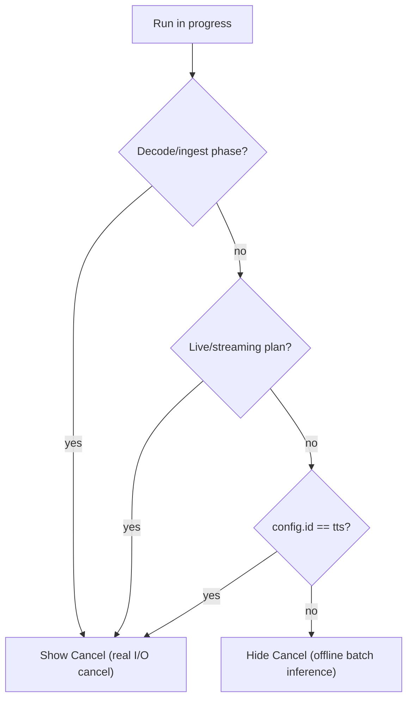

# Cancel clean cut — Internal Reference

> **Status:** Completed (2026-08).
> **Audience:** SDK maintainers and VoiceLab pipeline authors.
> **Follow-up:** Native offline inference cancel — [native-offline-inference-cancel-future-work.md](../future-work/native-offline-inference-cancel-future-work.md) (blocked on sherpa-onnx upstream).

Remove all non-native (“fake”) offline cancellation from the SDK as a **clean cut** (no deprecations, no history), keep every genuine I/O cancel and all live/streaming pipeline stops, then update the SDK example app and VoiceLab (hide the Cancel button during offline batch inference; keep it for live/streaming, the decode phase, and TTS).

---

## Principle

Keep only cancellation that does something real; delete the rest with no deprecation or doc trace (SDK unreleased).

- **KEEP (unchanged):** all I/O cancel — audio decode (`cancelDecode`), file encode/save cancel, model download pause/stop, archive extraction abort (`postDownloadProcessing.ts`), mic stop (`stopMicToLiveAudioBuffer`), ingest `.cancel()`.
- **KEEP (unchanged):** all live/streaming pipeline lifecycle stops — `StreamingPipelineHandle.stop()` / `pipeline.stop()` / `stopStreamingPipeline`, including streaming TTS.
- **REMOVE (clean cut):** offline batch `abortSignal` + `'cancelled'` result status on STT, TTS, separation, enhancement, VAD, punctuation, plus the shared orchestrator cancel machinery and the VAD `VAD_ABORTED` path.

---

## Implementation checklist (completed)

| Area | Task | Status |
|------|------|--------|
| SDK types | Remove `abortSignal` from six offline option types; drop `'cancelled'` from five result status unions | Done |
| SDK orchestrator | Strip abort/cancel machinery from `offlineOrchestrator.ts` | Done |
| SDK wrappers | Stop forwarding `abortSignal` in separation/stt/tts/enhancement/punctuation orchestrate wrappers | Done |
| SDK VAD | Remove `isAbortRequested` and both `VAD_ABORTED` guards from `vad/engine.ts` | Done |
| SDK tests | Trim abort/cancelled cases in orchestrator, separation, enhancement, VAD offline segmentation tests | Done |
| SDK docs | Remove `abortSignal`/`cancelled` from current user-facing docs; leave migration archives | Done |
| Example separation | Remove batch `abortSignal`/stop/cancelled UI; spinner while running; keep live overload stop | Done |
| Example showcase | Remove `abortRef`, offline transcribe/synthesize cancel, Cancel button | Done |
| VoiceLab executors | Remove SDK-bound `abortSignal` passes; keep app-level `AbortController`/scope teardown | Done |
| VoiceLab validation | Remove dead `status === 'cancelled'` check in `ttsAudioOutputValidation.ts` | Done |
| VoiceLab UI | Gate `ProgressPhase` Cancel via `showCancel` (decode, TTS, live plans) | Done |
| Verify | Typecheck + relevant SDK/VoiceLab test suites; manual smoke | Done |

---

## 1. SDK — deep removal

### Option types

Delete `abortSignal?` from:

- `SttTranscribeOptions` — `src/stt/types.ts`
- `TtsSynthesisOptions` — `src/tts/types.ts`
- `SeparateOptions` — `src/separation/types.ts`
- `EnhanceOptions` — `src/enhancement/types.ts`
- `VADOfflineRunOptions` — `src/vad/types.ts`
- `OfflinePunctuateOptions` — `src/punctuation/types.ts`

### Result types

Drop `'cancelled'` from the `status` union of `SttTranscribeResult`, `TtsSynthesisResult`, `SeparationResult`, `EnhancementResult`, and `OfflinePunctuateResult` (same files).

### Shared orchestrator (`src/pipeline/offlineOrchestrator.ts`)

- Remove `abortSignal` from `OrchestrationConfig`, `isAbortRequested`, and `shouldReturnPartialOnCancel` and their callers.
- Remove `'cancelled'` from `OrchestrationResult.status` and from the `SessionState` union; remove `cancel()` and its references in the completing transition and `isTerminal`.
- In all four pipeline loops (`runOfflineAudioToTextPipeline`, `runOfflineTextToAudioPipeline`, `runOfflineTextToTextPipeline`, `runOfflineAudioMultiOutputPipeline`), remove abort checks and `session.state === 'cancelled'` breaks.

### Feature wrappers

Stop forwarding `abortSignal` to the orchestrator in:

- `src/separation/orchestrate.ts`
- `src/stt/index.ts`
- `src/tts/orchestrate.ts`
- `src/enhancement/orchestrate.ts`
- `src/punctuation/orchestrate.ts`

### VAD engine (`src/vad/engine.ts`)

Remove `isAbortRequested` and both `VAD_ABORTED` guards.

### Tests

Trim abort/cancelled cases in:

- `src/pipeline/__tests__/offline-orchestrator.test.ts`
- `src/separation/__tests__/orchestrate.test.ts`
- `src/enhancement/__tests__/orchestrate.test.ts`
- `src/vad/__tests__/vad-offline-process-segmentation.test.ts`

(`tts/__tests__/orchestrate.test.ts` had no abort cases; `tts/__tests__/live-offline.test.ts` unchanged.)

### Docs (current/user-facing only)

Strip `abortSignal` / `'cancelled'` mentions from `docs/tts-offline.md`, `docs/vad-streaming.md`, and current separation docs. Archival `docs/migration/**` ADR/plan files remain historical records.

---

## 2. SDK example app

- `example/src/screens/separation/SeparationScreen.tsx` — remove `batchAbortRef`, `stopBatchSeparation`, batch `abortSignal` on `engine.separate`, and `signal.aborted` / “Status: cancelled” handling. Batch button shows a spinner while `separating`. Keep live-overload Stop and `cleanupLiveRuntime` (pipeline.stop + ingest.cancel + mic stop).
- `example/src/screens/offline-pipeline-showcase/OfflinePipelineShowcaseScreen.tsx` — remove `abortRef`, `abortSignal` on `transcribe`/`synthesize`, aborted early-exits, `handleCancel`, abort in `handleReset`, and the Cancel button.
- Streaming/live screens and offline STT/TTS/enhancement/VAD/punctuation screens need no change (they already use `pipeline.stop()` or have no inference cancel).

---

## 3. VoiceLab (external consumer)

Strip SDK-bound `abortSignal` (TS errors once SDK option types drop the field); keep app-level `AbortController` / `BufferScope` teardown:

- `executeSttOffline.ts`
- `executeTtsOffline.ts`
- `executeVoiceCloneOffline.ts`
- `executeEnhancementOffline.ts`
- `executeVadOffline.ts`
- `executePunctuationOffline.ts`

Remove the dead SDK `status === 'cancelled'` check in `ttsAudioOutputValidation.ts` (keep other failure handling).

### Cancel button gating

- Add `showCancel` via `resolveShowRunCancel` in `runCancellation.ts`; pass from `FeatureFlowScreen.tsx` into `ProgressPhase.tsx`.
- **Show** when: ingest/decode phase (`progress.stageId === 'sessionDecode'` or `progress.phase` is `preparing` / `sourceOpening`), OR `config.id === 'tts'`, OR the active composite stage plan is live (`plan.id` ends with `mic_stream`, `file_stream`, `file_stream_segmented_default`, or `text_streaming_cnn`).
- **Hide** during offline `engineRunning` for STT, enhancement, VAD, punctuation, alignment, voice-clone-offline.
- Store `selectedPlan` / composite stage plan ids in a ref at run start so the check stays valid during `engineRunning`.

App-level cancellation infra (`useRunProgress`, `runCancellation.ts`, `BufferScope.dispose`) stays — it still powers live-run stop, decode-phase cancel, and unmount/navigation cleanup.

---

## 4. Out of scope

- Native TTS callback-based mid-inference cancel wiring — see [native-offline-inference-cancel-future-work.md](../future-work/native-offline-inference-cancel-future-work.md).
- `maven` repo (not a consumer of these APIs).
- Historical `docs/migration/**` records.

---

## 5. Verification

- `tsc` / typecheck SDK + example + VoiceLab to catch removed-field references.
- Run SDK jest suites for orchestrator, separation, enhancement, VAD; VoiceLab pipeline runner/cancellation tests.
- Manual smoke: example batch separation (no Stop), offline pipeline showcase (no cancel), streaming screens still stop; VoiceLab offline STT/enhancement/VAD/punctuation (no Cancel during inference), live STT (Cancel shown), any TTS (Cancel shown), decode phase (Cancel shown).

---

## Related documents

- [Native offline inference cancel (future work)](../future-work/native-offline-inference-cancel-future-work.md)
- [Streaming pipelines overview](../streaming-pipelines-overview.md) — live `stop()` semantics (unchanged)
- [Audiobuffer streaming](../audiobuffer-streaming.md) — decode cancel (`DECODE_CANCELLED`)
- Migration (historical): `docs/migration/segmentationEngine/sub-04-transfer-offline-orchestration.md`, `docs/migration/OrchestrationProgressVADAli/ADR-002-vad-offline-segmentation-progress-strategy.md`
