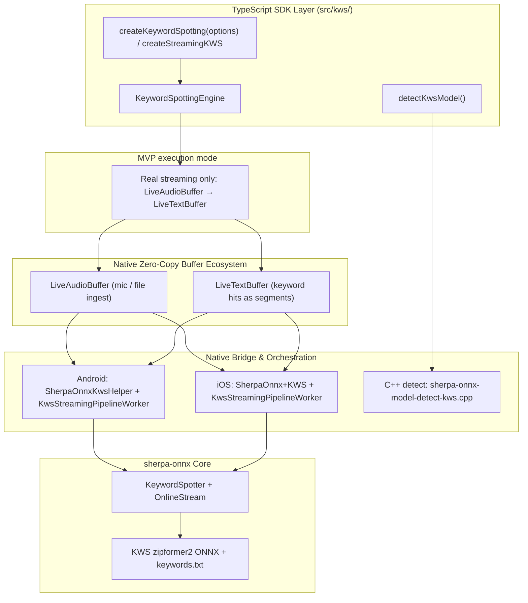

# Keyword Spotting (KWS) — Architecture & Implementation Plan

> **Status:** Landed (streaming MVP complete)  
> **Audience:** SDK Maintainers  
> **Category:** Speech & Media Features (`ModelCategory.Kws` / `kws`)  
> **Target Branch:** `feat/add-kws-feature`  
> **MVP scope:** **Streaming only** (first SDK feature without an offline engine API)  
> **Priority rationale:** Two community forks already exist primarily for KWS/wake-word; upstream `KeywordSpotter` is already in our Android/iOS prebuilts.

---

## 1. Executive Summary & Core Decisions

### 1.1 What is Keyword Spotting?
Keyword Spotting (KWS / wake-word) listens to a continuous audio stream and fires when a **configured keyword or phrase** is spoken (e.g. `"hey assistant"`, `"小爱同学"`). Unlike STT, it does **not** produce a full transcript — it only reports matches from a keyword list (`keywords.txt`), typically with very low latency and tiny models (~3M params).

### 1.2 Streaming-only MVP (no offline / batch public API)

| Question | Answer |
| --- | --- |
| Offline-only config in sherpa-onnx? | **No.** There is no `OfflineKeywordSpotter`. |
| Online / streaming config? | **Yes.** `KeywordSpotter` + `OnlineStream` (Kotlin) / `SherpaOnnxCreateKeywordSpotter` + online stream (C-API). |
| SDK MVP | **Real streaming only** — same family as `createStreamingSTT` / VAD. **Not** live overload. **Not** a public `spot(OfflineAudioBuffer)` API for v1. |
| Why no offline API? | There is no offline model family to wrap. A “batch” helper would only be OnlineStream-over-PCM sugar; that can wait as a follow-up. |
| File / wav testing without mic? | Reuse the **same** streaming path: `ingestFileToLiveAudioBuffer(live)` (or mic) while `spot(live, textOut)` runs. |
| `createOfflineAudioBufferFromLive` / transfer? | Fine for **keeping the recording** (archive, later STT/SID, …). It does **not** replace KWS inference — spotting stays on the live/online path. |

This is the **inverse** of SLID/SID/Separation live overload (offline weights + segmentation). KWS already has a native online decoder that consumes frames continuously. It is also the first planned feature whose public surface is **streaming-only** in the support matrix.

### 1.3 Models: dedicated KWS packs (not “reuse any STT zipformer”)

Important correction vs a common assumption:

- **Runtime:** Already in our prebuilts (same sherpa-onnx AAR / `SherpaOnnxC.framework`). No new native library release needed only for KWS.
- **Weights:** Published **KWS-specific** zipformer transducer packs (encoder + decoder + joiner + `tokens.txt` + `keywords.txt`), e.g.:
  - `sherpa-onnx-kws-zipformer-wenetspeech-3.3M-2024-01-01` (zh)
  - `sherpa-onnx-kws-zipformer-gigaspeech-3.3M-2024-01-01` (en)
  - `sherpa-onnx-kws-zipformer-zh-en-3M-2025-12-20` (zh+en)
- These are **not** interchangeable with arbitrary streaming STT zipformer packs. Architecture is the same family (`OnlineTransducer` / `zipformer2` chunk encoder), but packs are trained/exported for KWS and ship with keyword tooling (`text2token` → `keywords.txt`).
- Keywords are **open-vocabulary** relative to the model’s token inventory: apps customize `keywords.txt` (token sequences + optional `:score` / `#threshold` / `@label`), they do not retrain the network for each phrase.

Upstream docs: https://k2-fsa.github.io/sherpa/onnx/kws/index.html

---

## 2. Upstream Availability & Prebuilt Status

Verified against current SDK prebuilts / `third_party/sherpa-onnx`:

| Component | Android | iOS |
| --- | --- | --- |
| **Underlying Engine** | Online transducer KWS (`KeywordSpotter`) | Same via C-API |
| **Prebuilt Status** | ✅ `com.k2fsa.sherpa.onnx.KeywordSpotter*` in `classes.jar`; JNI symbols in `libsherpa-onnx-jni.so` | ✅ `SherpaOnnxCreateKeywordSpotter` / decode / reset / getResult in `SherpaOnnxC` |
| **Native API Type** | Kotlin: `KeywordSpotter` + `OnlineStream` + `KeywordSpotterConfig` | C-API: `SherpaOnnxKeywordSpotterConfig`, `SherpaOnnxCreateKeywordSpotter`, … |
| **Stream type** | `OnlineStream` (accept → isReady → decode → getResult → reset on hit) | Same online stream lifecycle |
| **Extra native work** | Thin helper + streaming pipeline worker (mirror online STT) | Thin ObjC++ bridge + worker |

Kotlin surface (abridged):

```java
public class KeywordSpotter {
  public OnlineStream createStream(String keywords);
  public OnlineStream createStream();
  public void decode(OnlineStream s);
  public void reset(OnlineStream s);
  public boolean isReady(OnlineStream s);
  public KeywordSpotterResult getResult(OnlineStream s);
  public void release();
}
```

`KeywordSpotterConfig` fields of interest: `featConfig`, `modelConfig` (`OnlineTransducerModelConfig` encoder/decoder/joiner + tokens), `keywordsFile` / `keywords_buf`, `keywordsScore`, `keywordsThreshold`, `numTrailingBlanks`, `maxActivePaths`.

---

## 3. Community Fork Analysis (planning input)

Two forks of this SDK added wake-word / KWS-related work. Neither targets the 1.0 buffer architecture; both are valuable as **bridge-level references**.

### 3.1 [skillmakerai/react-native-sherpa-onnx-kw](https://github.com/skillmakerai/react-native-sherpa-onnx-kw/tree/feat/expose-keyword-spotting) (`feat/expose-keyword-spotting`)

**Scope:** Full Android **and** iOS exposure of sherpa `KeywordSpotter`.

| Layer | What they added |
| --- | --- |
| TS | `src/kws/` — `createKeywordSpotter`, `createStream`, low-level accept/decode/getResult/reset, convenience `processAudioChunk` (accept + decode loop + auto-reset on hit) |
| Android | `SherpaOnnxKwsHelper.kt` — scans model dir for encoder/decoder/joiner/tokens/keywords; builds `KeywordSpotterConfig`; forces `modelType = "zipformer2"` (critical: `"zipformer"` aborts on missing v1 metadata) |
| iOS | `SherpaOnnx+KWS.mm` + `sherpa-onnx-kws-wrapper` around C-API |
| Docs | `docs/kws.md` — keywords.txt format, tuning (`numTrailingBlanks`, score/threshold) |

**API shape (0.4.x mental model):** JS feeds PCM arrays each chunk (`processAudioChunk`), same era as `createPcmLiveStream` / `onData`. Multiple streams per engine supported.

**Takeaways for 1.0:**
- Keep their tuning knobs and `zipformer2` default.
- Keep `processKwsAudioChunk`-style **native one-shot decode loop** inside the **pipeline worker** (avoid JS round-trips per frame).
- Do **not** expose raw Float32 PCM concat as the primary public API — use `LiveAudioBuffer` + streaming pipeline like STT.

### 3.2 [lakshgk/react-native-sherpa-onnx](https://github.com/lakshgk/react-native-sherpa-onnx) (`kws-bridge-spike`, `oww-wake-word`)

**Branch `kws-bridge-spike`:** Android-only sherpa KWS bridge.

| Layer | What they added |
| --- | --- |
| TS | Simpler engine: single attached stream, `processChunk` / `reset` / `release` (no multi-stream) |
| Android | Same helper pattern as skillmaker (`KeywordSpotter` + `OnlineStream`) |
| iOS | Explicitly **pending** in their comments |

**Branch `oww-wake-word`:** Separate path — **OpenWakeWord** on bundled ORT + PCM tee / VAD work (`OpenWakeWordHelper`). This is **not** sherpa-onnx KeywordSpotter. Out of scope for this plan unless we later add a second wake-word backend.

**Takeaways for 1.0:**
- Confirm demand for a **simple** “always-on one stream” ergonomics (their single-stream engine).
- Prefer sherpa KWS first (already in prebuilts); treat OWW as unrelated future work.

### 3.3 What we adopt vs discard

| Adopt | Discard / reshape |
| --- | --- |
| Native config scanning + `zipformer2` | Primary JS `processAudioChunk` / PCM push API |
| keywords.txt + score/threshold/trailing blanks | 0.4.x asset path-only init without model detect |
| Auto-reset stream after detection | Multi-stream as day-1 requirement (nice-to-have later) |
| File testing via **live ingest + streaming pipeline** | Public offline/batch `spot(OfflineAudio)` in MVP |
| | OpenWakeWord as part of MVP |

---

## 4. High-Level Architecture & Layering



### 4.1 Why not live overload?
Live overload exists for **offline** models that need utterance windows. KWS already maintains online state and fires mid-stream. Segmentation would **hurt** wake-word latency (waiting for VAD commit before spotting). The worker should read the live ring continuously, like streaming STT/VAD.

### 4.2 Why not an offline / batch public API in MVP?
- Upstream has **no** offline KWS engine — “batch” would only wrap OnlineStream over an `OfflineAudioBuffer`.
- File and sample-wav flows already work by **ingesting into a `LiveAudioBuffer`** and running the same worker.
- Apps that need the raw recording after a wake can **`createOfflineAudioBufferFromLive` / transfer** for storage or downstream offline features (STT, SID, …) — that is audio retention, not a second KWS mode.
- Keeps KWS as a clean **streaming-only** row in the feature matrix (easier docs and mental model).

### 4.3 Output contract (MVP)
- Append keyword label (and optional metadata) to `LiveTextBuffer` segments.
- Emit `onKeyword` / buffer `onSegment` to JS.
- Shared pipeline handle: `stop` / `flush` / `reset` / `getStatus` / `completed`.

---

## 5. Public API Design (`src/kws/`)

### 5.1 Module structure

```
src/kws/
├── index.ts
├── types.ts
├── createKeywordSpotting.ts   # or createStreamingKWS alias
├── streaming.ts               # LiveAudioBuffer pipeline wiring
├── detectKwsModel.ts
├── customConfig.ts
└── __tests__/
```

Naming proposal (align with STT):

- Factory: `createKeywordSpotting` (primary) with alias `createStreamingKWS` if we want symmetry with `createStreamingSTT`.
- Category: `ModelCategory.Kws = 'kws'`.
- Docs: `docs/kws-streaming.md` only for MVP (no `kws-offline.md`).

### 5.2 Engine sketch (streaming only)

```typescript
export interface KeywordSpottingInitializeOptions {
  modelSource: ModelSource;
  /** Defaults to <modelDir>/keywords.txt when omitted. */
  keywordsPath?: ModelPathConfig | string;
  keywordsScore?: number;       // default ~1.0–1.5
  keywordsThreshold?: number;   // default 0.25
  numTrailingBlanks?: number;   // default 1–2 (lower = sooner fire)
  maxActivePaths?: number;      // default 4
  quantization?: QuantizationPreference;
  numThreads?: number;
  provider?: string;
}

export interface KeywordDetection {
  keyword: string;
  tokens: string[];
  timestamps: number[];
  startTime?: number;
}

export interface KeywordSpottingEngine {
  readonly instanceId: string;

  /**
   * Real streaming — MVP sole execution API.
   * Native worker reads live audio, writes keyword hits to live text.
   */
  spot(
    audioIn: LiveAudioBufferIdSource,
    textOut: LiveTextBufferIdSource,
    options?: {
      chunkSize?: number;
      /** Optional per-session keywords override (sherpa createStream(keywords)). */
      keywords?: string;
      onKeyword?: (event: KeywordDetection & { segmentIndex: number }) => void;
    }
  ): Promise<StreamingPipelineHandle>;

  destroy(): Promise<void>;
}
```

### 5.3 What apps should **not** need
- Manual `acceptWaveform` / `isReady` / `decode` loops in JS (forks exposed these for 0.4.x parity).
- Concatenating `onData` PCM in JS to assemble recordings for KWS.
- A dedicated offline KWS API to “process a file” — use live ingest instead.

### 5.4 Typical call shapes

**Mic:**

```ts
const live = await createEmptyLiveAudioBuffer({ sampleRate: 16000, channelCount: 1 });
// LiveTextBuffer spooling defaults to on/auto (same as STT). Keep that if you need
// fullIfSpooled / offline transfer of hit history. For wake-word callbacks only:
// createLiveTextBuffer({ spooling: { mode: 'off' } }).
const textOut = await createLiveTextBuffer();
const pipeline = await kws.spot(live, textOut, { onKeyword: (e) => console.log(e.keyword) });
await startMicToLiveAudioBuffer(live);
// …
await stopMicToLiveAudioBuffer();
await finalizeLiveAudioBuffer(live);
await pipeline.completed;
```

**Sample wav / file (same streaming API):**

```ts
const live = await createEmptyLiveAudioBuffer({ sampleRate: 16000, channelCount: 1 });
const textOut = await createLiveTextBuffer();
const pipeline = await kws.spot(live, textOut, { onKeyword: (e) => console.log(e.keyword) });
await ingestFileToLiveAudioBuffer(live, { kind: 'fs', path: wavPath });
await finalizeLiveAudioBuffer(live);
await pipeline.completed;
```

**Optional after session — keep audio, not “offline KWS”:**

```ts
const clip = await createOfflineAudioBufferFromLive(live, 'fullIfSpooled');
// later: STT / SID / archive — not spot(clip)
```

---

## 6. Execution Mode in Detail (MVP)

### Real streaming (mic / file ingest / continuous)

1. Create engine from KWS model pack + keywords file.
2. Create `LiveAudioBuffer` + `LiveTextBuffer`.
3. `spot(audioIn, textOut)` starts `KwsStreamingPipelineWorker`.
4. Feed the live buffer via mic **or** `ingestFileToLiveAudioBuffer`.
5. Worker loop (native, no JS PCM):
   - Read new frames from live ring.
   - `acceptWaveform` on `OnlineStream`.
   - While `isReady`: `decode` → `getResult`.
   - If `keyword` non-empty: append text segment, emit event, **`reset(stream)`** (upstream requirement).
6. Stop / finalize via shared streaming pipeline lifecycle (`stop` / `flush` / `completed`).

**No mandatory speech segmentation** for spotting (unlike SLID/SID live). Optional later: tee the same `LiveAudioBuffer` into STT after wake.

---

## 7. Model Detection & Quantization

### 7.1 Detector (`sherpa-onnx-model-detect-kws.cpp`)
- New category `ModelCategory.Kws`.
- Require encoder + decoder + joiner (+ tokens).
- Prefer / require online-compatible **zipformer2** chunk encoders (reuse STT online-guard ideas where applicable).
- Detect presence of `keywords.txt` (warn if missing; allow override path at init).
- `isStreaming = true` always for matched KWS packs.
- Reject confusing STT-only packs that lack KWS layout / keywords unless we document an explicit advanced escape hatch (default: fail closed).

### 7.2 Quantization
- Same universal preference string as other features (`auto` | `int8` | `fp16` | `fp32` | …).
- KWS releases commonly ship int8 encoder/joiner variants — detect must pick matching triples.

### 7.3 Keywords file tooling (docs + example)
- Document `keywords.txt` format and `sherpa-onnx-cli text2token` / tokens-type (`bpe`, `ppinyin`, `phone+ppinyin`, …).
- Example app: ship a small default keywords file + UI to reload keywords without full model re-download when possible (`createStream(keywords)` / re-init).

---

## 8. Native Implementation Details

### 8.1 Android
- Helper: `SherpaOnnxKwsHelper.kt` (can start from skillmaker/lakshgk helpers).
  - Instance map; stream owned by the pipeline worker (single active stream for MVP).
  - Dir scan; `OnlineModelConfig.modelType = "zipformer2"`.
- Worker: `KwsStreamingPipelineWorker` registered like online STT worker.
  - Reads `LiveAudioBuffer`, runs accept/decode/reset loop **on native thread**.
  - Writes keyword hits to `LiveTextBuffer`.
- Bridge methods: init / unload / startStreamingPipeline / stop / flush / status (reuse streaming pipeline registry).

### 8.2 iOS
- Bridge category + thin C-API wrapper (skillmaker `KwsWrapper` is a starting point).
- Same worker lifecycle as Android; shared_ptr / HybridData teardown rules already learned from STT/TTS live workers.

### 8.3 Lifecycle / thread safety
- Apply existing streaming-pipeline completion posting (main looper) — do not emit RN events from ForkJoinPool.
- After each detection, reset stream before continuing (forks and upstream examples agree).

---

## 9. Implementation Phases & Milestones

### Phase 1 detail: Collect, licenses, and why this is **not** the SLID pattern

SLID had **no** dedicated sherpa-onnx release: it reuses **Whisper multilingual** packs that already ship under the **`asr-models`** release. Consequences for SLID:

- Collect: already covered by the existing **`asr`** stream in `collect-model-structures.yml` / `sherpa_asr_model_release_streams.json`.
- Licenses: already in `asr-models-license-status.csv` (and `getModelLicenses()` loads that ASR CSV). No separate `languageId-*-license-status.csv`.
- Catalog / detect: filter ASR Whisper packs with `is_multilingual == 1` into `ModelCategory.LanguageId`.

**KWS is different.** Upstream **does** publish an explicit release:

| | SLID | KWS |
| --- | --- | --- |
| Dedicated GitHub release? | No (weights live in `asr-models`) | **Yes:** [`kws-models`](https://github.com/k2-fsa/sherpa-onnx/releases/tag/kws-models) |
| Packs | Same Whisper dirs as STT | Dedicated `sherpa-onnx-kws-zipformer-*.tar.bz2` |
| Collect stream today | Reuse `asr` | **Missing** — not in `sherpa_model_collect_manifest.json` |
| License CSV today | Reuse ASR CSV | **Need new** `kws-models-license-status.csv` (Android assets + iOS Resources) |
| `getModelLicenses()` | ASR path already loaded | Must add the new CSV path |

Verified assets on `kws-models` (as of planning):

- `sherpa-onnx-kws-zipformer-gigaspeech-3.3M-2024-01-01.tar.bz2` (+ `-mobile`)
- `sherpa-onnx-kws-zipformer-wenetspeech-3.3M-2024-01-01.tar.bz2` (+ `-mobile`)
- `sherpa-onnx-kws-zipformer-zh-en-3M-2025-12-20.tar.bz2`
- `checksum.txt`

So Phase 1 should follow the **enhancement / punctuation / speaker-embedding** collect pattern, **not** the SLID “piggyback ASR” pattern.

Concrete collect / license work for Phase 1:

1. Add `scripts/ci/sherpa_kws_model_release_streams.json` (mirror `sherpa_speech_enhancement_model_release_streams.json`):
   - `release_tag`: `kws-models`
   - `tree_cache_dir`: `tree-cache/kws-models`
   - `structure_file`: `test/fixtures/kws-models-structure.txt`
   - `expected_csv`: `test/fixtures/kws-models-expected.csv`
   - `license_csv`: `android/src/main/assets/model_licenses/kws-models-license-status.csv`
2. Register stream `kws` in `scripts/ci/sherpa_model_collect_manifest.json` and in `.github/workflows/collect-model-structures.yml` (`stream` choice + docs comment).
3. Run collect once → fixtures + tree-cache + license CSV via existing `update_model_license_csv.sh` pipeline (HF/ModelScope fallbacks already support `sherpa-onnx-*.tar.bz2`).
4. Mirror license CSV to `ios/Resources/model_licenses/kws-models-license-status.csv` (same as other categories).
5. Wire `src/licenses.ts` `getModelLicenses()` to read the new CSV.
6. Download-manager / catalog: expose KWS packs under `ModelCategory.Kws` using the new expected/license data (do **not** list them under STT).

Do **not** invent a SLID-style shortcut of “licenses come from ASR” — KWS tarballs are not ASR assets and would never appear in `asr-models-license-status.csv`.

| Phase | Tasks | Deliverables |
| --- | --- | --- |
| **Phase 1: Foundation, Detect, Collect & Licenses** ✅ | • Add `ModelCategory.Kws`<br>• C++ `sherpa-onnx-model-detect-kws.cpp` (+ JNI/ObjC wiring)<br>• TS `detectKwsModel`<br>• Unit tests for detect (encoder/decoder/joiner + zipformer2 + keywords.txt)<br>• **Collect stream for `kws-models`** (manifest + workflow + `sherpa_kws_model_release_streams.json`)<br>• **License CSV** Android + iOS + `getModelLicenses()`<br>• Update support matrix: KWS = online yes / SDK offline **No** / SDK live **real streaming** | Detection + structure fixtures + license status for all `kws-models` release assets — **landed** |
| **Phase 2: Native engine + init/unload** ✅ | • Android `SherpaOnnxKwsHelper` (Kotlin `KeywordSpotter`)<br>• iOS C-API wrapper + bridge<br>• TS `createKeywordSpotting` + `destroy`<br>• Port tuning options from forks<br>• Smoke: create/destroy without pipeline<br>• `initMode: 'custom'` + path validation | Engine lifecycle ready for pipeline attach — **landed** |
| **Phase 3: Real streaming pipeline** ✅ | • `KwsStreamingPipelineWorker` Android + iOS<br>• `spot(LiveAudio, LiveText, options)` → `StreamingPipelineHandle`<br>• Mic path via `startMicToLiveAudioBuffer`<br>• File path via `ingestFileToLiveAudioBuffer` (same API)<br>• `onKeyword` / text-buffer `onSegment`<br>• Auto-reset after hit | Continuous wake-word (mic + wav) with buffer-first API — **landed** |
| **Phase 4: Keywords UX & docs** ✅ | • Document keywords.txt + text2token<br>• Optional reload keywords without full destroy where upstream allows<br>• `docs/kws-streaming.md` only<br>• README checklist + model catalog notes<br>• Note: live→offline transfer is for audio retention, not offline KWS<br>• Note: `textOut` LiveTextBuffer keeps normal spooling defaults; document `spooling: { mode: 'off' }` when only `onKeyword` / segments are needed | App-facing docs matching STT streaming quality — **landed** (reload via `spot({ keywords })` / stop+re-spot; no separate `reloadKeywords` API) |
| **Phase 5: Showcase & verification** ✅ | • Example screen `KeywordSpotting` (Home → Voice Activity): pack init, custom path slots, keywords textarea / file→textarea, example→`keywordsBody` prefill, mic + file-ingest `spot`<br>• Tuning: `keywordsScore` / `keywordsThreshold` / `numTrailingBlanks` / `maxActivePaths` / `chunkSize`<br>• Hit HUD + timeline + `onKeyword` log; unload-while-running control<br>• Android-first logcat checklist (filter `[SherpaOnnx:kws]`)<br>• Pack-aware example keywords + shared test WAVs | Showcase landed in `example/`; on-device streaming verified |

**Non-goals for MVP:** Public batch/offline `spot(OfflineAudioBuffer)`; OpenWakeWord backend; exposing low-level JS stream primitives as primary API; mandatory VAD segmentation in front of KWS; claiming STT zipformer packs “just work” as KWS without detect validation.

### Optional follow-up (post-MVP, not scheduled)

- Convenience `spot(OfflineAudioBuffer)` that internally runs OnlineStream over offline PCM (CLI-style file spotter sugar).
- Only add if apps repeatedly reinvent ingest→live→spot for static files and a one-shot API clearly reduces friction.

---

## 10. Feature Parity Snapshot (after KWS MVP lands)

| Feature | sherpa offline | sherpa online | SDK offline / batch | SDK live |
| --- | --- | --- | --- | --- |
| STT | Yes | Yes | Yes | **Real streaming** |
| SLID | Yes | No | Yes | Live overload |
| SID | Yes (embedding) | No | Yes | Live overload |
| **KWS** | **No** | **Yes** | **No (MVP)** | **Real streaming** |

---

## 11. Key Benefits of This Architecture

1. **Prebuilts already include KeywordSpotter** — implementation cost is mostly orchestration, not compiling new sherpa features.
2. **Matches real user demand** — two forks already reinvented 0.4.x KWS bridges; first-class 1.0 support can absorb that need.
3. **True streaming** — correct product shape for wake-word (low latency, no wait for segment commit).
4. **Streaming-only MVP** — honest matrix row; no fake “offline KWS” API without an offline model.
5. **Buffer-first** — no JS PCM concat / `onData` requirement; mic and file share one pipeline via live ingest.
6. **Fork lessons retained** — `zipformer2` default, native decode loop, keywords tuning, auto-reset after fire.
7. **Clear boundary** — dedicated KWS packs + keywords.txt; detect fails closed on wrong packs.

---

## 12. References

- Upstream KWS docs: https://k2-fsa.github.io/sherpa/onnx/kws/index.html
- Pretrained packs index: https://k2-fsa.github.io/sherpa/onnx/kws/pretrained_models/index.html
- Fork (full A/iOS): https://github.com/skillmakerai/react-native-sherpa-onnx-kw/tree/feat/expose-keyword-spotting
- Fork (Android spike + OWW branch): https://github.com/lakshgk/react-native-sherpa-onnx
- SDK analogs: [stt-streaming.md](../stt-streaming.md), [streaming-pipelines-overview.md](../streaming-pipelines-overview.md), [audiobuffer-streaming.md](../audiobuffer-streaming.md), [sdk-feature-support-matrix.md](sdk-feature-support-matrix.md)
- Sibling plan style: [spoken-language-identification-plan.md](spoken-language-identification-plan.md)
