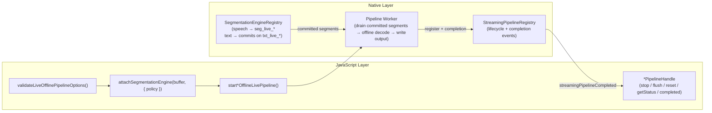

# Live Overload — Internal Reference

> **Status:** Implemented.
> **Audience:** SDK maintainers only.
> **Supersedes:** The former `docs/migration/liveOverload/` planning directory (now deleted).

---

## 1. The Overload Principle (Mandatory Segmentation)

Every offline batch engine (`createSTT`, `createTTS`, `createOfflinePunctuation`, `createEnhancement`) exposes a **second method overload** on its primary verb (`transcribe`, `synthesize`, `punctuate`, `enhance`) that accepts **live buffers** and **requires a segmentation policy**.

The mental model:

- The offline engine factory is unchanged — same init, same model, same `destroy()`.
- The offline batch overload (`Offline*, Offline*`) is unchanged.
- The **live overload** (`Live*, Live*, options`) is purely additive and drives the offline decoder per committed segment via a segmentation engine.

### Why segmentation is mandatory

Offline decoders (OfflineRecognizer, OfflineTts, OfflinePunctuation, OfflineSpeechEnhancement) process **bounded** input. A live buffer is an unbounded, open-ended stream. The segmentation engine bridges this gap by slicing the live stream into discrete segments that can be fed to the offline decoder one at a time.

Without segmentation, an offline decoder would have to wait for the entire stream to finish (defeating the "live" purpose) or be called on arbitrary chunks without semantic boundaries (producing garbage or degraded quality).

**Consequence:** The TypeScript type system enforces `segmentation.policy` at compile time. At runtime, `validateLiveOfflinePipelineOptions()` guards dynamic/JS callers and throws `LIVE_OFFLINE_SEGMENTATION_REQUIRED` if the policy is missing, `mode` is not `'auto'`, or (for enhancement) the evaluator is not `continuous_frames`.

### Commit-only output (no partials)

The live overload is **commit-only**. Between two segmentation commits there is no partial hypothesis from the offline decoder. `onPartial` is not exposed on any `*LivePipelineOptions` type. Apps that need in-utterance partial results must use the true streaming engine (`createStreamingSTT`, etc.).

Each feature's options type provides an **`onSegment`** mirror callback that fires once per committed output segment.

---

## 2. Speech vs. Text — `seg_live_*` vs. Commits on `txt_live_*`

The four live-overload features split into two categories based on their input buffer domain:

| Input domain | Features | Segmentation engine operates on | Committed segments land on |
|---|---|---|---|
| **Speech** (audio) | STT, Enhancement | `LiveAudioBuffer` (`live_*`) | A dedicated `LiveSegmentBuffer` (`seg_live_*`) created by the native segmentation engine attach | 
| **Text** | TTS, Punctuation | `LiveTextBuffer` (`txt_live_*`) | Committed text segments on the `txt_live_*` buffer itself |

### Speech domain (`seg_live_*`)

When a speech-domain segmentation engine is attached to a `LiveAudioBuffer`, the native layer allocates a companion `LiveSegmentBuffer` (`seg_live_*`) and populates it with speech segment metadata (start/end sample offsets, VAD confidence, etc.). The JS live-overload code retrieves this `segmentLiveBufferId` via `getSegmentationEngineInfo(engineId).segmentBufferId` and passes it to the native pipeline start call.

The native worker then polls or subscribes to newly committed segments on this `seg_live_*` buffer and reads the corresponding PCM range from the source `LiveAudioBuffer` for offline decode.

**Code path (STT example):**
```
attachSegmentationEngine(audioIn, { policy })     → attached.engineId
getSegmentationEngineInfo(attached.engineId)       → engineInfo.segmentBufferId  ("seg_live_*")
startSttOfflineLivePipeline(instanceId, audioInId, textOutId, {
  attachedSegmentationEngineId: attached.engineId,
  segmentLiveBufferId: engineInfo.segmentBufferId,  // always present for speech domain
  chunkSize: …
})
```

### Text domain (no `seg_live_*`)

Text-domain segmentation engines (`text_synthetic_auto`, `text_punctuation_assisted`, etc.) commit segments directly on the `LiveTextBuffer` itself. **No separate `seg_live_*` buffer is created.** The native pipeline worker drains committed text segments from the `txt_live_*` buffer using its internal segment cursor.

The JS code for TTS reflects this explicitly:

```ts
// TTS synthesizeLiveOverload:
const segmentLiveBufferId = engineInfo.segmentBufferId;
// Text-domain engines do not allocate seg_live_*:
if (!segmentLiveBufferId && engineInfo.domain !== 'text') {
  throw new Error('...');
}
// Pass segmentLiveBufferId only when present (speech domain edge case):
startTtsOfflineLivePipeline(instanceId, inId, outId, {
  attachedSegmentationEngineId: attached.engineId,
  ...(segmentLiveBufferId ? { segmentLiveBufferId } : {}),
  // TTS-specific options: sid, speed, voiceClone...
})
```

For **Punctuation**, both input and output are `LiveTextBuffer`s (`txt_live_*` → `txt_live_*`). The segmentation engine is attached to the **input** text buffer. Despite being text-domain, the punctuation implementation **does require `segmentLiveBufferId`** (it throws if absent) — this reflects that the native punctuation pipeline worker reads committed segments via the segment buffer, not directly from the text buffer cursor. This is an implementation detail that differs from TTS.

---

## 3. Bridge Fields

### `attachedSegmentationEngineId`

**Always present** in every `start*OfflineLivePipeline` call. This is the `engineId` returned by `attachSegmentationEngine()` from the JS layer. The native worker uses this ID to:

1. Access the segmentation engine's committed segment stream.
2. Coordinate flush/stop with the segmentation engine lifecycle.
3. On `pipeline.stop()`, the JS handle calls `detachSegmentationEngine(attachedEngineId)` for cleanup.

### `segmentLiveBufferId`

**Conditionally present.** Behavior depends on feature/domain:

| Feature | Domain | `segmentLiveBufferId` | Source |
|---|---|---|---|
| **STT** | speech | **Required** — always present | `getSegmentationEngineInfo().segmentBufferId` → `seg_live_*` |
| **Enhancement** | speech | **Required** — always present | Same as STT |
| **Punctuation** | text | **Required** — always present | `getSegmentationEngineInfo().segmentBufferId` (text-domain engines also produce one) |
| **TTS** | text | **Optional** — omitted for text-domain engines | Only present if speech-domain segmentation is used (edge case); text-domain engines commit on `txt_live_*` directly |

### TurboModule signatures (as implemented)

```ts
// NativeSherpaOnnx.ts — actual bridge contracts:

startSttOfflineLivePipeline(
  instanceId: string,
  audioInLiveBufferId: string,
  textOutLiveBufferId: string,
  options: {
    attachedSegmentationEngineId: string;
    segmentLiveBufferId: string;          // required
    chunkSize?: number;
  }
): Promise<{ pipelineId: string }>;

startTtsOfflineLivePipeline(
  instanceId: string,
  textInLiveBufferId: string,
  audioOutLiveBufferId: string,
  options: {
    attachedSegmentationEngineId: string;
    segmentLiveBufferId?: string;         // optional (text-domain omits)
    sid?: number;
    speed?: number;
    referenceAudioBufferId?: string;      // voice cloning
    referenceText?: string;               // voice cloning
  }
): Promise<{ pipelineId: string }>;

startPunctuationOfflineLivePipeline(
  instanceId: string,
  textInLiveBufferId: string,
  textOutLiveBufferId: string,
  options: {
    attachedSegmentationEngineId: string;
    segmentLiveBufferId: string;          // required
  }
): Promise<{ pipelineId: string }>;

startEnhancementOfflineLivePipeline(
  instanceId: string,
  audioInLiveBufferId: string,
  audioOutLiveBufferId: string,
  options: {
    attachedSegmentationEngineId: string;
    segmentLiveBufferId: string;          // required
  }
): Promise<{ pipelineId: string }>;
```

---

## 4. Worker Drain

### Pipeline lifecycle

All four live-overload features reuse the **existing streaming pipeline registry** and its lifecycle primitives. The native worker is registered via `StreamingPipelineRegistry.registerAndStart(worker)`, and JS controls it through the same generic methods used by true streaming pipelines:

- `stopStreamingPipeline(pipelineId)` — cancel in-flight work + tear down
- `flushStreamingPipeline(pipelineId)` — drain remaining committed segments + process tail
- `resetStreamingPipeline(pipelineId)` — reset internal state
- `getStreamingPipelineStatus(pipelineId)` — query drain progress

Completion is signaled via the existing `streamingPipelineCompleted` bridge event, consumed in JS through `createStreamingPipelineCompletionPromise(pipelineId)`.

### Pipeline handle structure

Each feature constructs its own typed handle (e.g., `SttPipelineHandle`, `TtsPipelineHandle`, `EnhancementPipelineHandle`, `PunctuationPipelineHandle`), but all extend `StreamingPipelineHandle`:

```ts
interface StreamingPipelineHandle {
  readonly pipelineId: string;
  readonly completed: Promise<StreamingPipelineCompletion>;
  stop(): Promise<void>;
  flush(): Promise<void>;
  reset(): Promise<void>;
  getStatus(): Promise<StreamingPipelineStatus>;
}
```

Feature-specific handles add `readonly instanceId: string` to track which engine instance is driving the pipeline.

### Stop vs. Flush

- **`handle.stop()`**: Calls `stopStreamingPipeline(pipelineId)` then `detachSegmentationEngine(attachedEngineId)`. Cancels in-flight per-segment decode. The segmentation engine is detached **without** flushing final pending data.
- **`handle.flush()`**: Calls `flushStreamingPipeline(pipelineId)`. The native worker triggers `detachSegmentationEngine(..., flushFinal: true)` internally, forcing a final segment boundary, then drains all remaining committed segments through the offline decoder before completing.

### onSegment callback wiring

The `onSegment` mirror callback is implemented purely in JS, not native. It subscribes to the output buffer's event stream:

- **Speech output** (STT, Punctuation): `subscribeLiveTextBufferEvents(textOut, { onSegment })`
- **Audio output** (TTS, Enhancement): `subscribeLiveAudioBufferEvents(audioOut, { onSegment })`

The subscription is automatically cleaned up when `handle.completed` settles (resolve or reject).

---

## 5. Per-Feature Implementation Summary

### STT (`createSTT().transcribe(LiveAudio, LiveText, options)`)

| Aspect | Value |
|---|---|
| Input buffer | `LiveAudioBuffer` (`live_*`) |
| Output buffer | `LiveTextBuffer` (`txt_live_*`) |
| Segmentation domain | `speech` |
| Supported policies | Any speech-domain evaluator (`speech_energy_silence`, `speech_vad_model`, etc.) |
| Bridge call | `startSttOfflineLivePipeline` |
| Options type | `SttLivePipelineOptions` — extends `LiveOfflinePipelineBaseOptions` + `chunkSize?`, `onSegment?` |
| Pipeline handle | `SttPipelineHandle` extends `StreamingPipelineHandle` |

### TTS (`createTTS().synthesize(LiveText, LiveAudio, options)`)

| Aspect | Value |
|---|---|
| Input buffer | `LiveTextBuffer` (`txt_live_*`) |
| Output buffer | `LiveAudioBuffer` (`live_*`) |
| Segmentation domain | `text` |
| Supported policies | Any text-domain evaluator (`text_synthetic_auto`, etc.) |
| Bridge call | `startTtsOfflineLivePipeline` |
| Options type | `TtsLivePipelineOptions` — extends `LiveOfflinePipelineBaseOptions` + `sid?`, `speed?`, `voiceClone?`, `onSegment?` |
| Pipeline handle | `TtsPipelineHandle` extends `StreamingPipelineHandle` |
| Special | Voice cloning options (`referenceAudioBufferId`, `referenceText`) are passed to native. Text-domain engines omit `segmentLiveBufferId`. |

### Punctuation (`createOfflinePunctuation().punctuate(LiveText, LiveText, options)`)

| Aspect | Value |
|---|---|
| Input buffer | `LiveTextBuffer` (`txt_live_*`) |
| Output buffer | `LiveTextBuffer` (`txt_live_*`) |
| Segmentation domain | `text` |
| Supported policies | Any text-domain evaluator |
| Bridge call | `startPunctuationOfflineLivePipeline` |
| Options type | `PunctuationLivePipelineOptions` — extends `LiveOfflinePipelineBaseOptions` + `onSegment?` |
| Pipeline handle | `PunctuationPipelineHandle` (own type, same shape as `StreamingPipelineHandle` + `instanceId`) |
| Note | `PunctuationPipelineHandle.completed` resolves to `void` (not `StreamingPipelineCompletion`) due to `.then(() => undefined)` in the handle constructor. |

### Enhancement (`createEnhancement().enhance(LiveAudio, LiveAudio, options)`)

| Aspect | Value |
|---|---|
| Input buffer | `LiveAudioBuffer` (`live_*`) |
| Output buffer | `LiveAudioBuffer` (`live_*`) |
| Segmentation domain | `speech` |
| Supported policies | **Only `continuous_frames`** — enforced via `supportedEvaluators: ['continuous_frames']` in validation |
| Bridge call | `startEnhancementOfflineLivePipeline` |
| Options type | `EnhancementLivePipelineOptions` — extends `LiveOfflinePipelineBaseOptions` with narrowed `segmentation.policy` type (`& { evaluator: 'continuous_frames' }`) + `onSegment?` |
| Pipeline handle | `EnhancementPipelineHandle` extends `StreamingPipelineHandle` |
| Restriction rationale | Speech denoisers produce boundary artifacts when chunked at silence/endpoint boundaries. `continuous_frames` uses fixed-size blocks with overlap to avoid this. |

---

## 6. Shared Validation Layer

`src/livePipeline/validation.ts` exports the shared validator used by all four features:

```ts
function validateLiveOfflinePipelineOptions(args: {
  featureName: string;
  domain: 'text' | 'speech';
  supportedEvaluators?: string[];   // enhancement passes ['continuous_frames']
  segmentation: unknown;
}): { policy: SegmentationPolicy }
```

Rejection paths:
1. `segmentation` is `undefined` → throws `LIVE_OFFLINE_SEGMENTATION_REQUIRED`
2. `segmentation.mode` is present and not `'auto'` → throws `LIVE_OFFLINE_SEGMENTATION_REQUIRED`
3. `segmentation.policy` is `undefined` → throws `LIVE_OFFLINE_SEGMENTATION_REQUIRED`
4. Policy fails domain/evaluator validation via `validateSegmentationConfig()` → throws `LIVE_OFFLINE_SEGMENTATION_REQUIRED` (wraps the inner error as `cause`)

The error class is `LiveOfflinePipelineError` with:
- `code: 'LIVE_OFFLINE_SEGMENTATION_REQUIRED'`
- `feature: string` (e.g., `'live offline STT'`)

---

## 7. Overload Dispatch

Each feature engine uses runtime buffer-kind detection to route between the batch and live overloads:

```ts
// STT example (same pattern in TTS, Punctuation, Enhancement):
const audioIsLive = isLiveAudioSource(buffer);   // checks 'live_' prefix or .info.kind
const textIsLive = isLiveTextSource(textOut);     // checks 'txt_live_' prefix or .info.kind

if (audioIsLive || textIsLive) {
  if (!(audioIsLive && textIsLive)) {
    throw new Error('overload mismatch');
  }
  return transcribeLiveOverload(instanceId, buffer, textOut, options);
}
// else: batch path
```

Both buffers must be live **or** both offline. Mixed calls throw `*_INVALID_ARGUMENT`.

---

## 8. Feature Matrix

| Feature | Live overload | Decision |
|---|---|---|
| **STT** | ✅ `transcribe(LiveAudio, LiveText, { segmentation })` | Implemented |
| **TTS** | ✅ `synthesize(LiveText, LiveAudio, { segmentation })` | Implemented |
| **Punctuation** | ✅ `punctuate(LiveText, LiveText, { segmentation })` | Implemented |
| **Enhancement** | ✅ `enhance(LiveAudio, LiveAudio, { segmentation: continuous_frames })` | Implemented (restricted) |
| VAD | ❌ | N/A — VAD **is** the segmentation primitive; `createStreamingVAD.process()` already accepts both buffer families |
| Alignment | ❌ | Structurally incompatible (closed, bounded problem) |
| Diarization | ❌ | Placeholder — revisit at implementation time |
| Source Separation | ❌ | Placeholder — revisit at implementation time |

---

## 9. Data Flow Diagram



---

## 10. Key Implementation Notes

### Differences from the original migration plan

1. **No shared `OfflineLivePipelineWorker` base class in JS.** The migration plan proposed a single shared native worker base. In practice, each feature's JS live-overload function (`transcribeLiveOverload`, `synthesizeLiveOverload`, `punctuateLiveOverload`, `enhanceLiveOverload`) follows the same pattern but is **not** extracted into a shared JS helper. The code is structurally identical across features but duplicated.

2. **`segmentLiveBufferId` handling diverges between features.** The migration plan implied uniform handling. In the implementation:
   - STT and Enhancement: `segmentLiveBufferId` is always required and always present (speech domain).
   - Punctuation: `segmentLiveBufferId` is always required (throws if absent).
   - TTS: `segmentLiveBufferId` is optional — text-domain engines don't produce one, and the code explicitly handles the absent case.

3. **`PunctuationPipelineHandle` resolved type differs.** The punctuation handle's `completed` promise resolves to `void` (via `.then(() => undefined)`) rather than `StreamingPipelineCompletion`. All other features resolve to `StreamingPipelineCompletion`. This is a minor inconsistency.

4. **Segmentation engine is attached from JS, not native.** The migration plan mentioned native-side attach via `SegmentationEngineRegistry.attach(...)`. In the actual implementation, **JS calls `attachSegmentationEngine()`** (which is itself a TurboModule call) before calling the native pipeline start. The `attachedSegmentationEngineId` is passed down as a pre-existing engine reference.

5. **No `chunkSize` on TTS/Punctuation/Enhancement.** The migration plan mentioned `chunkSize` as a shared option. In practice, only STT exposes `chunkSize` in its bridge options. TTS, Punctuation, and Enhancement do not accept `chunkSize` in their bridge calls.

6. **TTS voice cloning options are flattened.** The TTS live-overload passes `referenceAudioBufferId` and `referenceText` as top-level bridge fields, resolved from the `voiceClone` discriminated union in `toNativeOfflineLivePipelineOptions()`.
