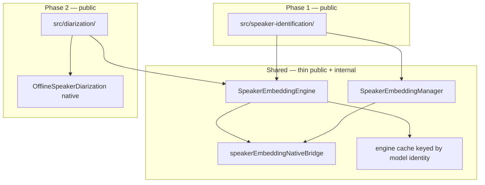

# Speaker embedding foundation — Internal design

> **Status:** Phase 1 (SID) **shipped** — shared extractor/manager + offline SID + live `labelLiveSegments`. Phase 2 (diarization) still planned. Example screen for SID is the remaining Phase‑1 demo item.
> **Audience:** SDK maintainers.
> **Strategy:** Ship **Speaker Identification (SID)** first on a shared **Extractor + Manager** layer designed so **Speaker Diarization** can reuse the same embedding engine without rework.
> **User request:** [Discussion #113 — Speaker Identification](https://github.com/XDcobra/react-native-sherpa-onnx/discussions/113)
>
> Live-overload implementation details (JS drain loop, native migration notes): [live-overload.md §11](live-overload.md#11-speaker-identification-live-overload-js-orchestration).

---

## 1. Goal

Implement speaker features in two phases without building the embedding stack twice:

| Phase | Public module | Uses shared layer | Status |
|-------|---------------|-------------------|--------|
| **1** | `speaker-identification/` | Extractor + Manager | **Done** (offline + live overload) |
| **2** | `diarization/` (replaces placeholder) | Same Extractor + `OfflineSpeakerDiarization` native | Planned |

**Principle:** The embedding extractor knows only **audio → vector**. It does not know enrollment, clustering, or timeline output. The manager is for **named speakers** (SID). Diarization uses **anonymous cluster indices** and must not overload the manager for clustering.

---

## 2. Layering



### 2.1 `src/speaker-embedding/` (shared foundation)

| Piece | Responsibility | Diarization-ready rule |
|-------|----------------|------------------------|
| **`SpeakerEmbeddingEngine`** | Load model, `dim`, `destroy()`, extract | Single engine instance shareable across SID + diarization init |
| **`SpeakerEmbeddingManager`** | `add`, `remove`, `search`, `verify`, `contains`, `numSpeakers` | **Not** used for cluster IDs — only named enrollment |
| **`extractFromOfflineAudio(buffer, range?)`** | Buffer-first input (SDK convention) | Diarization segments map to the same helper |
| **`detectSpeakerEmbeddingModel`** | Preflight detect | Also re-exported from SID for DX parity |
| **`speakerEmbeddingNativeBridge`** | TurboModule surface | Diarization reuses the same bridge layer |

**Exports:** Public detect / model types / error codes / custom-config helpers from `react-native-sherpa-onnx/speaker-embedding`. Phase 1 product API lives under `react-native-sherpa-onnx/speaker-identification` (and re-exports detect for peer DX).

### 2.2 `src/speaker-identification/` (Phase 1 — public)

```typescript
createSpeakerIdentification(options): SpeakerIdentificationEngine

engine.enroll(name, audio | audio[]): Promise<void>
engine.enrollOfflineSegments(name, audioIn, segmentsIn, options?): Promise<void>
engine.identify(audio, threshold?): Promise<IdentifyResult>
engine.labelOfflineSegments(audioIn, segmentsIn, segmentsOut, options?): Promise<LabelOfflineSegmentsResult>
engine.labelLiveSegments(audioIn, segmentsOut, options): Promise<SpeakerIdentificationPipelineHandle>
engine.verify(name, audio, threshold?): Promise<boolean>
engine.removeSpeaker / listSpeakers / contains / numSpeakers
engine.exportEnrollments / importEnrollments
engine.destroy(): Promise<void>
```

**Persistence:** Thin SID helpers `exportEnrollments` / `importEnrollments` return/accept a versioned embeddings JSON bundle (`SpeakerEnrollmentBundle`). The SDK does not write files — the app stores the object. Export is fed by a JS enrollment mirror (native manager cannot read embeddings back). Diarization does not need persistence.

**Live SID:** Offline embedding weights + mandatory speech segmentation + per-utterance extract/search. Public handle matches other live overloads. Drain loop is JS orchestration — see [live-overload.md §11](live-overload.md#11-speaker-identification-live-overload-js-orchestration).

### 2.3 `src/diarization/` (Phase 2 — replace placeholder)

Replace `src/diarization/index.ts` (file-path throws) with a real module that:

1. Accepts optional **`embeddingEngine: SpeakerEmbeddingEngine`** (shared) **or** embedding model path (creates/caches engine).
2. Loads **`OfflineSpeakerDiarization`** (segmentation + clustering native).
3. Returns timeline segments: `{ startSec, endSec, speakerIndex }`.

**Do not** store cluster labels in `SpeakerEmbeddingManager`.

---

## 3. Engine sharing

**Engine cache key:** `{ modelPath, provider, numThreads }` — implemented in `engineCache.ts` via `acquireSpeakerEmbeddingEngine`.

Preferred diarization pattern (Phase 2):

```typescript
createSpeakerDiarization({
  segmentationModelSource,
  embeddingEngine: sharedEngine, // from SID or cache
  clustering: { threshold, numClusters? },
})
```

---

## 4. Model categories & detect

| Category | Models | Used by |
|----------|--------|---------|
| **`SpeakerEmbedding`** | [speaker-recongition-models](https://github.com/k2-fsa/sherpa-onnx/releases/tag/speaker-recongition-models) (WeSpeaker, NeMo, 3D-Speaker, …) | SID + diarization embedding leg |
| **`Diarization`** | Bundles with Pyannote segmentation + matching embedding config | Diarization only |

`detectSpeakerEmbeddingModel` and unified catalog detection (`speakerEmbedding` domain) are implemented.

---

## 5. sherpa-onnx: offline vs streaming (upstream reality)

| Feature | Offline models | Streaming models (ASR-style) | “Live” UX in product |
|---------|----------------|------------------------------|----------------------|
| **Speaker ID** | Yes (embedding ONNX) | **No separate class** | Yes — live overload / segment orchestration + extract/search |
| **Speaker Diarization** | Yes (`OfflineSpeakerDiarization`) | **No** | Deferred — full-file offline first |

**SDK implication:** Treat SID as **offline embedding inference**. Live SID = orchestration, **not** a second model class.

---

## 6. Native bridge (Phase 1 — implemented)

| Location | Status |
|----------|--------|
| Android Kotlin facade + instances | Done under `android/.../speakerembedding/` |
| Android C++ detect only | Done under `android/.../cpp/.../speaker/` |
| iOS cxx wrappers + detect | Done under `ios/speaker-embedding/` |
| TurboModule / JS bridge | Done |
| `src/speaker-embedding/` + `src/speaker-identification/` | Done |

Rule unchanged: Android inference uses `com.k2fsa.sherpa.onnx` Kotlin classes; iOS uses cxx-API wrappers — **not** the Separation-style C-API inference path. C++ under `android/src/main/cpp/` is for detect, not duplicate extractor JNI.

---

## 7. Implementation phases

### Phase 1 — Foundation + SID

1. [x] Android Kotlin helper (`SpeakerEmbeddingExtractor` + `Manager`)
2. [x] iOS cxx-API wrapper
3. [x] Detect (both platforms)
4. [x] TurboModule + `speakerEmbeddingNativeBridge.ts`
5. [x] `src/speaker-embedding/` — engine, manager, buffer helpers, engine cache
6. [x] Model detect + `ModelCategory.SpeakerEmbedding`
7. [x] `src/speaker-identification/` — public API (offline + live overload + enrollment import/export)
8. [ ] Example screen: enroll + identify (file + optional mic via `labelLiveSegments`)
9. [x] Tests: bridge mocks, enroll/search/verify, offline label, live label, enrollment import/export

### Phase 2 — Diarization

1. Android `OfflineSpeakerDiarization` helper
2. iOS diarization wrapper
3. Accept shared `SpeakerEmbeddingEngine`
4. Replace diarization placeholder; buffer-in timeline-out API
5. Example diarization screen
6. Optional: `labelDiarizationSegments` helper

### Out of scope for initial phases

- True streaming diarization (no upstream API)
- Spoken Language Identification
- Native embedding dump / Upstream `GetEmbedding` (SID export uses a JS mirror) — tracked in [speaker-embedding-manager-upstream-export-import.md](../future-work/speaker-embedding-manager-upstream-export-import.md)
- Native SID live worker (optional; JS orchestration ships — see [live-overload.md §11](live-overload.md#11-speaker-identification-live-overload-js-orchestration))

---

## 8. Design rules (checklist)

- [x] Extractor API is buffer-first (`OfflineAudioBuffer` slices), not file-path-first.
- [x] Android inference uses `com.k2fsa.sherpa.onnx` Kotlin classes; iOS uses cxx-API wrappers — **not** the Separation-style C-API inference path.
- [x] C++ under `android/src/main/cpp/` is for detect (and other non-Kotlin features), not duplicate extractor JNI.
- [x] One TurboModule bridge surface; no duplicate extractor init in diarization init (cache ready for Phase 2).
- [x] Manager holds **names**, not diarization cluster indices.
- [x] Engine cache prevents double load when SID and diarization share weights.
- [x] Do not extend the old placeholder API (`initializeDiarization` / `diarizeAudio(path)`).
- [x] Document that SID “live” = segment orchestration, not a streaming model family.

---

## 9. Related documents

- [Discussion #113 — Speaker Identification request](https://github.com/XDcobra/react-native-sherpa-onnx/discussions/113)
- [speaker-identification-offline.md](../speaker-identification-offline.md)
- [speaker-identification-live.md](../speaker-identification-live.md)
- [speaker-embedding-manager-upstream-export-import.md](../future-work/speaker-embedding-manager-upstream-export-import.md) — upstream `GetEmbedding` / optional Save·Load
- [diarization.md](../diarization.md) — public stub (to replace when Phase 2 ships)
- [sdk-feature-support-matrix.md](./sdk-feature-support-matrix.md)
- Upstream: `third_party/sherpa-onnx/sherpa-onnx/kotlin-api/Speaker.kt`, `OfflineSpeakerDiarization.kt`
