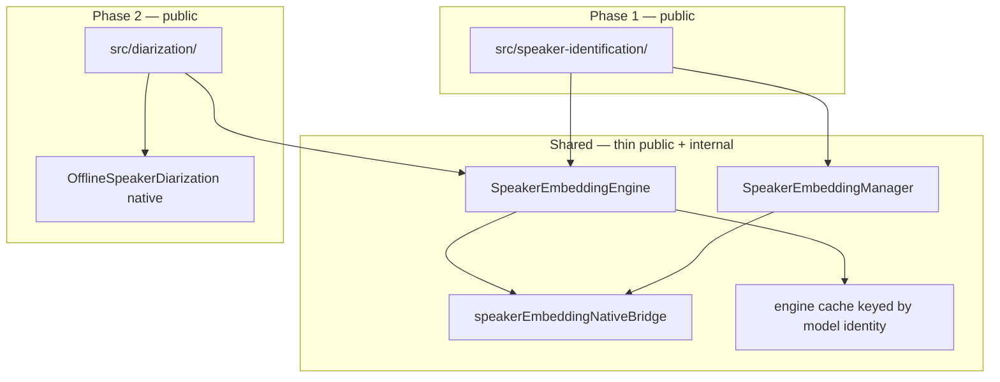
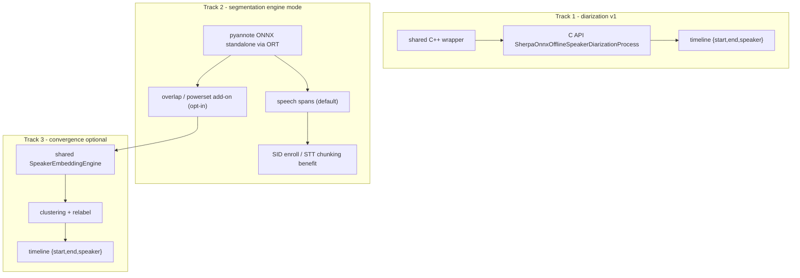

# Speaker embedding foundation — Internal design

> **Status:** Phase 1 (SID) **shipped** — shared extractor/manager + offline SID + live `labelLiveSegments`. Phase 2 (diarization) still planned; **core native design decided** — see [§10](#10-diarization-core-design-phase-2--decisions). Example screen for SID is the remaining Phase‑1 demo item.
> **Audience:** SDK maintainers.
> **Strategy:** Ship **Speaker Identification (SID)** first on a shared **Extractor + Manager** layer designed so **Speaker Diarization** can reuse the same embedding engine without rework.
> **User request:** [Discussion #113 — Speaker Identification](https://github.com/XDcobra/react-native-sherpa-onnx/discussions/113)
>
> Live-overload implementation details (JS drain loop, native migration notes): [live-overload.md §11](live-overload.md#11-speaker-identification-live-overload-js-orchestration).

---

## 1. Goal

Implement speaker features in two phases without building the embedding stack twice:

| Phase | Public module | Uses shared layer | Status |
|-------|---------------|-------------------|--------|
| **1** | `speaker-identification/` | Extractor + Manager | **Done** (offline + live overload) |
| **2** | `diarization/` (replaces placeholder) | Same Extractor + `OfflineSpeakerDiarization` native | Planned |

**Principle:** The embedding extractor knows only **audio → vector**. It does not know enrollment, clustering, or timeline output. The manager is for **named speakers** (SID). Diarization uses **anonymous cluster indices** and must not overload the manager for clustering.

---

## 2. Layering



### 2.1 `src/speaker-embedding/` (shared foundation)

| Piece | Responsibility | Diarization-ready rule |
|-------|----------------|------------------------|
| **`SpeakerEmbeddingEngine`** | Load model, `dim`, `destroy()`, extract | Single engine instance shareable across SID + diarization init |
| **`SpeakerEmbeddingManager`** | `add`, `remove`, `search`, `verify`, `contains`, `numSpeakers` | **Not** used for cluster IDs — only named enrollment |
| **`extractFromOfflineAudio(buffer, range?)`** | Buffer-first input (SDK convention) | Diarization segments map to the same helper |
| **`detectSpeakerEmbeddingModel`** | Preflight detect | Also re-exported from SID for DX parity |
| **`speakerEmbeddingNativeBridge`** | TurboModule surface | Diarization reuses the same bridge layer |

**Exports:** Public detect / model types / error codes / custom-config helpers from `react-native-sherpa-onnx/speaker-embedding`. Phase 1 product API lives under `react-native-sherpa-onnx/speaker-identification` (and re-exports detect for peer DX).

### 2.2 `src/speaker-identification/` (Phase 1 — public)

```typescript
createSpeakerIdentification(options): SpeakerIdentificationEngine

engine.enroll(name, audio | audio[]): Promise<void>
engine.enrollOfflineSegments(name, audioIn, segmentsIn, options?): Promise<void>
engine.identify(audio, threshold?): Promise<IdentifyResult>
engine.labelOfflineSegments(audioIn, segmentsIn, segmentsOut, options?): Promise<LabelOfflineSegmentsResult>
engine.labelLiveSegments(audioIn, segmentsOut, options): Promise<SpeakerIdentificationPipelineHandle>
engine.verify(name, audio, threshold?): Promise<boolean>
engine.removeSpeaker / listSpeakers / contains / numSpeakers
engine.exportEnrollments / importEnrollments
engine.destroy(): Promise<void>
```

**Persistence:** Thin SID helpers `exportEnrollments` / `importEnrollments` return/accept a versioned embeddings JSON bundle (`SpeakerEnrollmentBundle`). The SDK does not write files — the app stores the object. Export is fed by a JS enrollment mirror (native manager cannot read embeddings back). Diarization does not need persistence.

**Live SID:** Offline embedding weights + mandatory speech segmentation + per-utterance extract/search. Public handle matches other live overloads. Drain loop is JS orchestration — see [live-overload.md §11](live-overload.md#11-speaker-identification-live-overload-js-orchestration).

### 2.3 `src/diarization/` (Phase 2 — replace placeholder)

Replace `src/diarization/index.ts` (file-path throws) with a real module that:

1. Accepts optional **`embeddingEngine: SpeakerEmbeddingEngine`** (shared) **or** embedding model path (creates/caches engine).
2. Runs the diarization pipeline via a **shared C++ core** (not Kotlin+`.mm`) — see [§10](#10-diarization-core-design-phase-2--decisions) for the native strategy decision.
3. Returns timeline segments: `{ startSec, endSec, speakerIndex }`.

**Do not** store cluster labels in `SpeakerEmbeddingManager`.

> **Native strategy note:** the initial diarization core wraps the sherpa-onnx
> **whole-block** C API (`SherpaOnnxCreateOfflineSpeakerDiarization` / `...Process`)
> in shared C++. That block loads **its own** embedding model from a path and does
> **not** reuse an already-loaded SID `SpeakerEmbeddingEngine` instance, and does
> **not** expose pyannote overlap/powerset add-on info. Full rationale, constraints,
> and the additive "pyannote as a segmentation-engine mode" track are in [§10](#10-diarization-core-design-phase-2--decisions).

---

## 3. Engine sharing

**Engine cache key:** `{ modelPath, provider, numThreads }` — implemented in `engineCache.ts` via `acquireSpeakerEmbeddingEngine`.

Preferred diarization pattern (Phase 2):

```typescript
createSpeakerDiarization({
  segmentationModelSource,
  embeddingEngine: sharedEngine, // from SID or cache
  clustering: { threshold, numClusters? },
})
```

---

## 4. Model categories & detect

| Category | Models | Used by |
|----------|--------|---------|
| **`SpeakerEmbedding`** | [speaker-recongition-models](https://github.com/k2-fsa/sherpa-onnx/releases/tag/speaker-recongition-models) (WeSpeaker, NeMo, 3D-Speaker, …) | SID + diarization embedding leg |
| **`Diarization`** | [speaker-segmentation-models](https://github.com/k2-fsa/sherpa-onnx/releases/tag/speaker-segmentation-models) — pyannote (and ReVerb) **segmentation** packs only; **no** bundled embedding `.onnx` | Diarization segmentation leg + future `speech_pyannote_segmentation` evaluator |

`detectSpeakerEmbeddingModel` and unified catalog detection (`speakerEmbedding` domain) are implemented.

---

## 5. sherpa-onnx: offline vs streaming (upstream reality)

| Feature | Offline models | Streaming models (ASR-style) | “Live” UX in product |
|---------|----------------|------------------------------|----------------------|
| **Speaker ID** | Yes (embedding ONNX) | **No separate class** | Yes — live overload / segment orchestration + extract/search |
| **Speaker Diarization** | Yes (`OfflineSpeakerDiarization`) | **No** | Deferred — full-file offline first |

**SDK implication:** Treat SID as **offline embedding inference**. Live SID = orchestration, **not** a second model class.

---

## 6. Native bridge (Phase 1 — implemented)

| Location | Status |
|----------|--------|
| Android Kotlin facade + instances | Done under `android/.../speakerembedding/` |
| Android C++ detect only | Done under `android/.../cpp/.../speaker/` |
| iOS cxx wrappers + detect | Done under `ios/speaker-embedding/` |
| TurboModule / JS bridge | Done |
| `src/speaker-embedding/` + `src/speaker-identification/` | Done |

Rule unchanged: Android inference uses `com.k2fsa.sherpa.onnx` Kotlin classes; iOS uses cxx-API wrappers — **not** the Separation-style C-API inference path. C++ under `android/src/main/cpp/` is for detect, not duplicate extractor JNI.

---

## 7. Implementation phases

### Phase 1 — Foundation + SID

1. [x] Android Kotlin helper (`SpeakerEmbeddingExtractor` + `Manager`)
2. [x] iOS cxx-API wrapper
3. [x] Detect (both platforms)
4. [x] TurboModule + `speakerEmbeddingNativeBridge.ts`
5. [x] `src/speaker-embedding/` — engine, manager, buffer helpers, engine cache
6. [x] Model detect + `ModelCategory.SpeakerEmbedding`
7. [x] `src/speaker-identification/` — public API (offline + live overload + enrollment import/export)
8. [x] Example screen: enroll + identify (file + optional mic via `labelLiveSegments`)
9. [x] Tests: bridge mocks, enroll/search/verify, offline label, live label, enrollment import/export

### Phase 2 — Diarization

> Detailed decisions, C API surface, build wiring, and the pyannote segmentation-engine
> track are in [§10](#10-diarization-core-design-phase-2--decisions). Ordering:
> **collect + license** (see plan) → **detect** → **core** (below).

1. Collect + license for `speaker-segmentation-models` (fixtures + CSV + `licenses.ts`)
2. Model detect wiring (`CATEGORY_BY_NATIVE`, `CATALOG_DETECT_CATEGORIES`)
3. **Shared C++** diarization wrapper over the C API (Separation pattern) — one core, thin JNI + thin `.mm`
4. Replace diarization placeholder; buffer-in timeline-out API (`{ startSec, endSec, speakerIndex }`)
5. Example diarization screen
6. Additive: `speech_pyannote_segmentation` evaluator in the segmentation engine (simple spans + opt-in overlap/powerset add-on)

### Out of scope for initial phases

- True streaming diarization (no upstream API)
- Spoken Language Identification
- Native embedding dump / Upstream `GetEmbedding` (SID export uses a JS mirror) — tracked in [speaker-embedding-manager-upstream-export-import.md](../future-work/speaker-embedding-manager-upstream-export-import.md)
- Native SID live worker (optional; JS orchestration ships — see [live-overload.md §11](live-overload.md#11-speaker-identification-live-overload-js-orchestration))

---

## 8. Design rules (checklist)

- [x] Extractor API is buffer-first (`OfflineAudioBuffer` slices), not file-path-first.
- [x] Android inference uses `com.k2fsa.sherpa.onnx` Kotlin classes; iOS uses cxx-API wrappers — **not** the Separation-style C-API inference path.
- [x] C++ under `android/src/main/cpp/` is for detect (and other non-Kotlin features), not duplicate extractor JNI.
- [x] One TurboModule bridge surface; no duplicate extractor init in diarization init (cache ready for Phase 2).
- [x] Manager holds **names**, not diarization cluster indices.
- [x] Engine cache prevents double load when SID and diarization share weights.
- [x] Do not extend the old placeholder API (`initializeDiarization` / `diarizeAudio(path)`).
- [x] Document that SID “live” = segment orchestration, not a streaming model family.

---

## 9. Related documents

- [Discussion #113 — Speaker Identification request](https://github.com/XDcobra/react-native-sherpa-onnx/discussions/113)
- [speaker-identification-offline.md](../speaker-identification-offline.md)
- [speaker-identification-live.md](../speaker-identification-live.md)
- [speaker-embedding-manager-upstream-export-import.md](../future-work/speaker-embedding-manager-upstream-export-import.md) — upstream `GetEmbedding` / optional Save·Load
- [diarization.md](../diarization.md) — public stub (to replace when Phase 2 ships)
- [sdk-feature-support-matrix.md](./sdk-feature-support-matrix.md)
- [Diarization core design](#10-diarization-core-design-phase-2--decisions) — this doc, §10
- Upstream: `third_party/sherpa-onnx/sherpa-onnx/kotlin-api/Speaker.kt`, `OfflineSpeakerDiarization.kt` (Kotlin API — **not** used for diarization; see §10.2)

---

## 10. Diarization core design (Phase 2) — decisions

> **Purpose:** decide *exactly* how the diarization core is implemented before we
> write it, so that once **collect** and **detect** land we can build directly.
> Two independent decisions are recorded here: (1) **where** the native code lives
> (shared C++ vs duplicated Kotlin+`.mm`), and (2) **what** we wrap (the sherpa
> **whole-block** diarizer vs a **decomposed** pipeline built on our own
> segmentation + embedding). Both are grounded in the current build wiring.

### 10.1 What a pyannote segmentation model actually is

It is **not** a VAD and **not** an embedding model. It is a neural **local speaker
segmentation** (speaker-activity-detection) model. From the upstream reference
implementation `third_party/sherpa-onnx/sherpa-onnx/csrc/offline-speaker-diarization-pyannote-impl.h`:

- **Input:** fixed sliding windows over the audio — `window_size` samples (typically
  10 s @ 16 kHz), hop `window_shift` (tunable via `windowShiftRatio`, default `0.1`).
- **Output per window:** a matrix `(num_frames x num_classes)` of **powerset**
  probabilities. Classes encode combinations of up to `num_speakers` *local*
  speakers **including overlap** (e.g. `num_speakers=3, powerset_max_classes=2` →
  7 classes: `∅, s0, s1, s2, s0+s1, s0+s2, s1+s2`).
- **Two consequences:** (a) it is **overlap-aware** (two speakers at once), and
  (b) speaker indices are **local to each window** — "speaker 0" in window 1 is not
  the same person as "speaker 0" in window 5. Global identity is only recovered by
  the *later* embedding + clustering stage (`ComputeEmbeddings` → `FastClustering` →
  `ReLabel` → `FinalizeLabels`).

So pyannote **is** a segmentation model (it can deliver `{start,end}` regions), but
it is a **superset of VAD**: it segments by *speaker activity + overlap*, and its raw
output needs clustering to become globally meaningful.

Contrast with our existing engine (`src/segment/`, `SegmentationEngineRegistry.kt`,
`SherpaOnnx+SegmentBuffer.mm`): evaluators `speech_energy_silence` / `speech_vad_model`
answer only **"speech vs silence"** and emit flat, non-overlapping speech spans. They
are speaker-agnostic.

### 10.2 Decision 1 — shared C++ (C API), not duplicated Kotlin + `.mm`

**Decision:** implement the diarization core as **one portable C++ wrapper over the
sherpa-onnx C API**, with a thin Android JNI bridge and a thin iOS ObjC++ bridge —
the **Separation pattern**. Do **not** follow the speaker-embedding/segmentation
pattern of duplicating full logic in Kotlin (Android) and `.mm` (iOS).

**Why:**

- **Precedent already in the tree.** Source separation is exactly this: a single
  wrapper compiled on both platforms. It includes the C API and PIMPLs the handle:

  ```1:34:android/src/main/cpp/separation/sherpa-onnx-separation-wrapper.h
  #ifndef SHERPA_ONNX_SEPARATION_WRAPPER_H
  #define SHERPA_ONNX_SEPARATION_WRAPPER_H
  // ... portable, no jni.h; C-API based; class SeparationWrapper { ... std::unique_ptr<Impl> pImpl; };
  ```

- **The diarization C API already ships in both prebuilts.** `libsherpa-onnx-c-api.so`
  (Android) and `SherpaOnnxC.framework` (iOS, `-force_load`) both export
  `SherpaOnnxCreateOfflineSpeakerDiarization` / `...Process` / … . No new sherpa build
  flag is needed (`SHERPA_ONNX_ENABLE_SPEAKER_DIARIZATION` is upstream-only, default ON).
- **Avoids the exact duplication pain** this doc already calls out for speaker
  embedding and the segmentation engine (Kotlin 530/1636 lines vs `.mm` 270/3289 lines).
  One inference/marshalling implementation instead of two.

> **Supersedes** the earlier §6 rule ("Android inference uses `com.k2fsa` Kotlin
> classes; iOS uses cxx-API"). That rule stands for **speaker embedding** (already
> shipped that way). **Diarization** deliberately uses the **shared C-API** path
> instead, matching separation. The upstream Kotlin `OfflineSpeakerDiarization.kt`
> is **not** used.

**Build wiring (concrete):**

- **Android** — add the wrapper + JNI to `android/src/main/cpp/CMakeLists.txt`
  `SOURCES`, next to separation:

  ```122:123:android/src/main/cpp/CMakeLists.txt
      separation/sherpa-onnx-separation-wrapper.cpp
      jni/separation/sherpa-onnx-separation-jni.cpp
  ```

  `libsherpaonnx.so` already links the C API, so no new link step is needed:

  ```287:289:android/src/main/cpp/CMakeLists.txt
  if(SHERPA_C_API_LIB_DIR)
      target_link_directories(sherpaonnx PRIVATE ${SHERPA_C_API_LIB_DIR})
      target_link_libraries(sherpaonnx PRIVATE sherpa-onnx-c-api)
  ```

- **iOS** — add the wrapper `.cpp/.h` to `SherpaOnnx.podspec` `source_files` and
  exclude the JNI file, mirroring separation:

  ```51:53:SherpaOnnx.podspec
      # Shared separation inference core. JNI bridge excluded below.
      "android/src/main/cpp/separation/sherpa-onnx-separation-wrapper.cpp",
      "android/src/main/cpp/separation/sherpa-onnx-separation-wrapper.h"
  ```

  ```69:69:SherpaOnnx.podspec
      "android/src/main/cpp/jni/separation/sherpa-onnx-separation-jni.cpp"
  ```

  Add the wrapper dir to `HEADER_SEARCH_PATHS` (next to
  `"#{pod_root}/android/src/main/cpp/separation"`).

### 10.3 Decision 2 — whole-block core for v1, plus an additive pyannote segmentation mode

The C API `...Process()` is **monolithic**: it internally (1) runs the pyannote
segmentation model, (2) extracts embeddings from *its own* embedding extractor, and
(3) clusters. It returns only the final `{start, end, speaker}` timeline. It does
**not** expose the powerset/overlap add-on, and it constructs its **own** embedding
extractor from `config.embedding.model` — it cannot be handed our already-loaded
`SpeakerEmbeddingEngine`. `FastClustering` is likewise **not** exposed by the C API.

This creates a real tension with the desired "pyannote as a mode of our segmentation
engine + optional add-on info". We resolve it with **three tracks**:

#### Track 1 — Diarization v1 = shared C++ wrapper of the whole block  (recommended first)

- Wrap `SherpaOnnxCreateOfflineSpeakerDiarization` / `...Process` /
  `...ProcessWithCallback` / `...ResultSortByStartTime` in the shared C++ wrapper.
- **Pros:** correct, minimal, one implementation, already in both prebuilts, fastest
  path to shipping offline diarization.
- **Cons / constraints (document for API design):**
  - Loads its **own** embedding model from a path → **no reuse** of a live SID engine
    instance (may double-load weights if SID + diarization run together). Acceptable
    for offline v1; JS can still share the *model file*, not the *instance*.
  - **No** overlap/powerset add-on exposed.
  - Clustering is opaque (`num_clusters` / `threshold` only, via `SetConfig`).

#### Track 2 — pyannote as a new segmentation-engine evaluator (additive, independent value)

- Add `speech_pyannote_segmentation` to `SegmentationEvaluator` in
  `src/segment/engine-types.ts`, implemented in the **shared C++** segmentation core
  (new), running the pyannote seg ONNX **standalone** via onnxruntime (already linked
  on Android; inside `SherpaOnnxC` on iOS) and porting the powerset decode
  (`InitPowersetMapping` / `ToMultiLabel` / `ExcludeOverlap` /
  `GetChunkSpeakerSampleIndexes`).
- **Default output:** collapse "any speaker active" → speech spans, matching the
  existing engine contract (drop-in for SID enroll, STT chunking — better turn
  boundaries than energy/VAD).
- **Opt-in add-on:** expose per-frame powerset / overlap / local `(chunk, speaker)`
  regions via a separate call, only materialized when requested. This is the
  "simple boundaries + add-on info on demand" the product wants.
- The C API does **not** expose the standalone segmentation model, so Track 2 runs
  the ONNX directly; it is genuinely new native code (but shared, single-impl).

#### Track 3 — convergence (optional, later)

- Once Track 2 exists and we expose a clustering primitive (port `FastClustering`
  or add a small clustering helper), diarization can be **rebuilt** as:
  our pyannote seg mode → our shared `SpeakerEmbeddingEngine` → clustering → relabel.
  This fully de-duplicates model loading and reuses the add-on, realizing the shared
  vision — *without* being bound to the sherpa monolith.
- **Do this only if** the reuse benefits (single embedding instance, add-on reuse)
  prove worth porting `ReLabel` / `FinalizeLabels` / clustering. **Track 1 stays** as
  the reference/fallback for correctness.



### 10.4 C API surface (authoritative reference)

Header `third_party/sherpa-onnx/sherpa-onnx/c-api/c-api.h`. Config struct:

```3895:3906:third_party/sherpa-onnx/sherpa-onnx/c-api/c-api.h
typedef struct SherpaOnnxOfflineSpeakerDiarizationConfig {
  SherpaOnnxOfflineSpeakerSegmentationModelConfig segmentation;
  SherpaOnnxSpeakerEmbeddingExtractorConfig embedding;
  SherpaOnnxFastClusteringConfig clustering;
  float min_duration_on;
  float min_duration_off;
} SherpaOnnxOfflineSpeakerDiarizationConfig;
```

| Function | Purpose |
|----------|---------|
| `SherpaOnnxCreateOfflineSpeakerDiarization(cfg)` | Create pipeline (NULL on error) |
| `SherpaOnnxDestroyOfflineSpeakerDiarization(sd)` | Destroy |
| `SherpaOnnxOfflineSpeakerDiarizationGetSampleRate(sd)` | Required input rate (Hz) |
| `SherpaOnnxOfflineSpeakerDiarizationSetConfig(sd, cfg)` | Update **clustering only** |
| `...Process(sd, samples, n)` | Run; mono PCM in `[-1,1]` |
| `...ProcessWithCallback(sd, samples, n, cb, arg)` | With progress callback |
| `...ResultGetNumSpeakers(r)` / `...ResultGetNumSegments(r)` | Result metadata |
| `...ResultSortByStartTime(r)` | Segment array (sorted) |
| `...DestroySegment(s)` / `...DestroyResult(r)` | Free |

Config fields:
- `segmentation.pyannote.model` (path), `segmentation.pyannote.window_shift_ratio`
  (`(0,1]`, `0` → default `0.1`), `segmentation.num_threads/debug/provider`.
- `embedding.model` (path — the diarizer builds its **own** extractor here),
  `embedding.num_threads/debug/provider`.
- `clustering.num_clusters` (`>0` → threshold ignored) / `clustering.threshold`.
- `min_duration_on` (discard shorter segments) / `min_duration_off` (merge small gaps).

Segment: `{ float start; float end; int32_t speaker; }` (seconds; speaker = cluster id).

### 10.5 Proposed file layout (shared C++, mirrors separation)

```text
android/src/main/cpp/diarization/
  sherpa-onnx-diarization-wrapper.h      # portable, C-API based, PIMPL (no jni.h)
  sherpa-onnx-diarization-wrapper.cpp    # compiled on BOTH platforms
android/src/main/cpp/jni/diarization/
  sherpa-onnx-diarization-jni.cpp        # Android-only; excluded from podspec
ios/diarization/
  core/DiarizationBridgeState.h          # instance map (iOS)
  bridge/SherpaOnnx+DiarizationOffline.mm # thin ObjC++ over the shared wrapper
```

Wrapper shape (proposed):

```cpp
namespace sherpaonnx {
struct DiarizationInitializeResult { bool success; std::string error; int32_t sampleRate; /* + detected models */ };
struct DiarizationSegment { float start; float end; int32_t speaker; };
struct DiarizationProcessResult { bool success; std::string error; std::vector<DiarizationSegment> segments; int32_t numSpeakers; };

class DiarizationWrapper {
 public:
  DiarizationInitializeResult initialize(const std::string& segmentationModel,
                                         const std::string& embeddingModel,
                                         int32_t numClusters, float threshold,
                                         float minDurationOn, float minDurationOff,
                                         int32_t numThreads, const std::optional<std::string>& provider,
                                         bool debug);
  DiarizationProcessResult processMonoSamples(const std::vector<float>& mono, int32_t sampleRate,
                                              const ProgressFn& onProgress);
  void setClustering(int32_t numClusters, float threshold);  // -> SetConfig
  int32_t getSampleRate() const;
  void release();
 private:
  class Impl; std::unique_ptr<Impl> pImpl;  // owns SherpaOnnxOfflineSpeakerDiarization*
};
}  // namespace sherpaonnx
```

### 10.6 Collect finding (Phase 1) — segmentation-only tarballs

Collected from the `speaker-segmentation-models` release (3 assets). **None** of
the tarballs contain a speaker-embedding `.onnx`. Each pack is a **segmentation
model** (`model.onnx` + `model.int8.onnx`) plus LICENSE/README/export scripts:

| Asset | Contents of note | License (auto-scan) |
|-------|------------------|---------------------|
| `sherpa-onnx-pyannote-segmentation-3-0.tar.bz2` | `model.onnx`, `model.int8.onnx` | MIT, commercial yes |
| `sherpa-onnx-reverb-diarization-v1.tar.bz2` | same layout (no embedding) | custom-non-commercial, commercial no |
| `sherpa-onnx-reverb-diarization-v2.tar.bz2` | same + `sym_shape_infer_temp.onnx` (export leftover; still no embedding) | custom-non-commercial, commercial no |

**Implication for core:** diarization always needs a **separate** embedding model
from `speaker-recongition-models` (`ModelCategory.SpeakerEmbedding`). The TS API
must take both `segmentationModelSource` and an embedding path / shared engine
(Track 1 still loads its own extractor from that path). The example C-API snippet
in `c-api.h` already pairs `sherpa-onnx-pyannote-segmentation-3-0/model.onnx` with
`3dspeaker_speech_eres2net_base_sv_zh-cn_3dspeaker_16k.onnx`.

Fixtures: `test/fixtures/speaker-segmentation-models-{structure.txt,expected.csv}`.
License CSV: `android/src/main/assets/model_licenses/speaker-segmentation-models-license-status.csv`
(mirrored under `ios/Resources/model_licenses/`).

### 10.7 Design rules addendum (diarization)

- [ ] Diarization core is **shared C++** over the C API (Separation pattern), not Kotlin+`.mm`.
- [ ] Upstream `OfflineSpeakerDiarization.kt` (Kotlin) is **not** used.
- [ ] v1 wraps the whole block; document that it loads its **own** embedding model
      (no live-SID engine-instance reuse) and exposes **no** add-on.
- [ ] pyannote-as-segmentation-mode (Track 2) is a **separate** additive evaluator;
      default emits speech spans, add-on is **opt-in**.
- [ ] Do **not** store diarization cluster ids in `SpeakerEmbeddingManager`.
- [ ] No new sherpa build flag; rely on diarization already in shipped C API libs.
