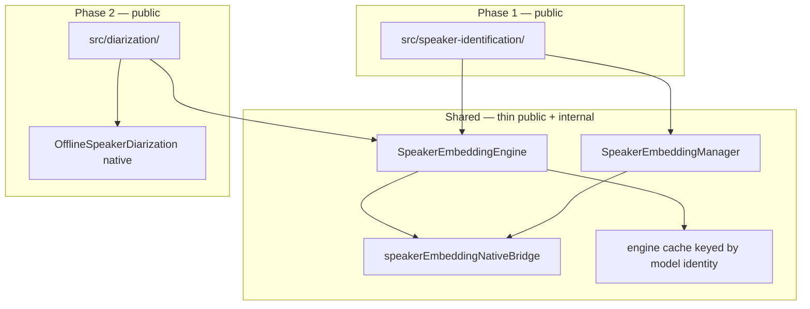
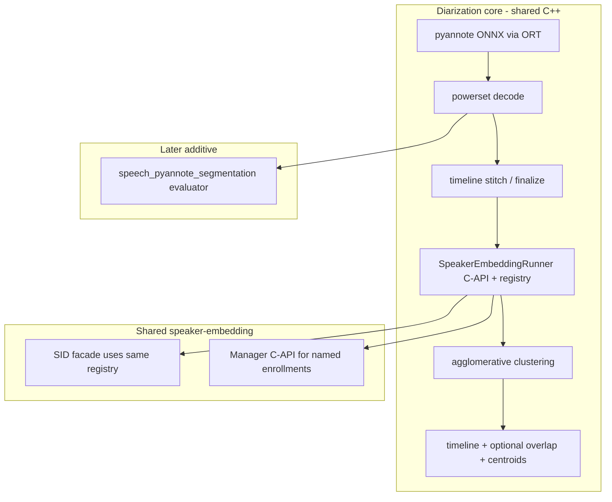

# Speaker embedding foundation — Internal design

> **Status:** Phase 1 (SID) **shipped** — shared extractor/manager + offline SID + live `labelLiveSegments`. Phase 2 (diarization) still planned; **core native design decided** — see [§10](#10-diarization-core-design-phase-2--decisions). Example screen for SID is the remaining Phase‑1 demo item.
> **Audience:** SDK maintainers.
> **Strategy:** Ship **Speaker Identification (SID)** first on a shared **Extractor + Manager** layer designed so **Speaker Diarization** can reuse the same embedding engine without rework.
> **User request:** [Discussion #113 — Speaker Identification](https://github.com/XDcobra/react-native-sherpa-onnx/discussions/113)
>
> Live-overload implementation details: [live-overload.md §11](live-overload.md#11-speaker-identification-live-overload-native-worker).

---

## 1. Goal

Implement speaker features in two phases without building the embedding stack twice:

| Phase | Public module | Uses shared layer | Status |
|-------|---------------|-------------------|--------|
| **1** | `speaker-identification/` | Extractor + Manager | **Done** (offline + live overload) |
| **2** | `diarization/` (replaces placeholder) | Same Extractor + `OfflineSpeakerDiarization` native | Planned |

**Principle:** The embedding extractor knows only **audio → vector**. It does not know enrollment, clustering, or timeline output. The manager is for **named speakers** (SID). Diarization uses **anonymous cluster indices** and must not overload the manager for clustering.

---

## 2. Layering



### 2.1 `src/speaker-embedding/` (shared foundation)

| Piece | Responsibility | Diarization-ready rule |
|-------|----------------|------------------------|
| **`SpeakerEmbeddingEngine`** | Load model, `dim`, `destroy()`, extract | Single engine instance shareable across SID + diarization init |
| **`SpeakerEmbeddingManager`** | `add`, `remove`, `search`, `verify`, `contains`, `numSpeakers` | **Not** used for cluster IDs — only named enrollment |
| **`extractFromOfflineAudio(buffer, range?)`** | Buffer-first input (SDK convention) | Diarization segments map to the same helper |
| **`detectSpeakerEmbeddingModel`** | Preflight detect | Also re-exported from SID for DX parity |
| **`speakerEmbeddingNativeBridge`** | TurboModule surface | Diarization reuses the same bridge layer |

**Exports:** Public detect / model types / error codes / custom-config helpers from `react-native-sherpa-onnx/speaker-embedding`. Phase 1 product API lives under `react-native-sherpa-onnx/speaker-identification` (and re-exports detect for peer DX).

### 2.2 `src/speaker-identification/` (Phase 1 — public)

```typescript
createSpeakerIdentification(options): SpeakerIdentificationEngine

engine.enroll(name, audio | audio[]): Promise<void>
engine.enrollOfflineSegments(name, audioIn, segmentsIn, options?): Promise<void>
engine.identify(audio, threshold?): Promise<IdentifyResult>
engine.labelOfflineSegments(audioIn, segmentsIn, segmentsOut, options?): Promise<LabelOfflineSegmentsResult>
engine.labelLiveSegments(audioIn, segmentsOut, options): Promise<SpeakerIdentificationPipelineHandle>
engine.verify(name, audio, threshold?): Promise<boolean>
engine.removeSpeaker / listSpeakers / contains / numSpeakers
engine.exportEnrollments / importEnrollments
engine.destroy(): Promise<void>
```

**Persistence:** Thin SID helpers `exportEnrollments` / `importEnrollments` return/accept a versioned embeddings JSON bundle (`SpeakerEnrollmentBundle`). The SDK does not write files — the app stores the object. Export is fed by a JS enrollment mirror (native manager cannot read embeddings back). Diarization does not need persistence.

**Live SID:** Offline embedding weights + mandatory speech segmentation + per-utterance extract/search in a native `OfflineLivePipelineWorker`. Public handle matches other live overloads — see [live-overload.md §11](live-overload.md#11-speaker-identification-live-overload-native-worker).

### 2.3 `src/diarization/` (Phase 2 — replace placeholder)

Replace `src/diarization/index.ts` (file-path throws) with a real module that:

1. Accepts optional **`embeddingEngine: SpeakerEmbeddingEngine`** (shared) **or** embedding model path (creates/caches engine).
2. Runs the diarization pipeline via a **shared C++ core** (not Kotlin+`.mm`) — see [§10](#10-diarization-core-design-phase-2--decisions) for the native strategy decision.
3. Returns timeline segments: `{ startSec, endSec, speakerIndex }`.

**Do not** store cluster labels in `SpeakerEmbeddingManager`.

> **Native strategy note:** the initial diarization core wraps the sherpa-onnx
> **whole-block** C API (`SherpaOnnxCreateOfflineSpeakerDiarization` / `...Process`)
> in shared C++. That block loads **its own** embedding model from a path and does
> **not** reuse an already-loaded SID `SpeakerEmbeddingEngine` instance, and does
> **not** expose pyannote overlap/powerset add-on info. Full rationale, constraints,
> and the additive "pyannote as a segmentation-engine mode" track are in [§10](#10-diarization-core-design-phase-2--decisions).

---

## 3. Engine sharing

ONNX weights are shared **in native C++** via `SpeakerEmbeddingRunner`
(`android/src/main/cpp/speaker-embedding/`), keyed by
`(model_path, provider, num_threads, debug)`. SID and diarization both
`Acquire` from that registry — a second open with the same key is a cache hit
(no second model load).

There is **no** JS-level engine cache. Each `createSpeakerIdentification` /
`createSpeakerEmbeddingEngine` still gets its own TurboModule `instanceId`;
the heavy extractor behind them is refcounted in C++. Enrollment
`modelKey` for export/import continues to use
`speakerEmbeddingEngineCacheKeyFromBridgeOptions` (identity string only).

Diarization does **not** take a shared JS `embeddingEngine` handle — it opens
its own session and shares weights through the C++ registry:

```typescript
createDiarization({
  segmentation: { modelSource: segmentationModelSource },
  embedding: { modelSource: embeddingModelSource },
  clustering: { threshold, numClusters? },
})
```

---

## 4. Model categories & detect

| Category | Models | Used by |
|----------|--------|---------|
| **`SpeakerEmbedding`** | [speaker-recongition-models](https://github.com/k2-fsa/sherpa-onnx/releases/tag/speaker-recongition-models) (WeSpeaker, NeMo, 3D-Speaker, …) | SID + diarization embedding leg |
| **`Diarization`** | [speaker-segmentation-models](https://github.com/k2-fsa/sherpa-onnx/releases/tag/speaker-segmentation-models) — pyannote (and ReVerb) **segmentation** packs only; **no** bundled embedding `.onnx` | Diarization segmentation leg + future `speech_pyannote_segmentation` evaluator |

`detectSpeakerEmbeddingModel` and unified catalog detection (`speakerEmbedding` domain) are implemented.
`detectDiarizationModel` and unified catalog detection (`diarization` domain) are implemented for segmentation packs (pyannote / reverb).

---

## 5. sherpa-onnx: offline vs streaming (upstream reality)

| Feature | Offline models | Streaming models (ASR-style) | “Live” UX in product |
|---------|----------------|------------------------------|----------------------|
| **Speaker ID** | Yes (embedding ONNX) | **No separate class** | Yes — live overload / segment orchestration + extract/search |
| **Speaker Diarization** | Yes (`OfflineSpeakerDiarization`) | **No** | Deferred — full-file offline first |

**SDK implication:** Treat SID as **offline embedding inference**. Live SID = orchestration, **not** a second model class.

---

## 6. Native bridge (Phase 1 — implemented)

| Location | Status |
|----------|--------|
| Android Kotlin facade + instances | Done under `android/.../speakerembedding/` |
| Android C++ detect only | Done under `android/.../cpp/.../speaker/` |
| iOS cxx wrappers + detect | Done under `ios/speaker-embedding/` |
| TurboModule / JS bridge | Done |
| `src/speaker-embedding/` + `src/speaker-identification/` | Done |

Rule unchanged: Android inference uses `com.k2fsa.sherpa.onnx` Kotlin classes; iOS uses cxx-API wrappers — **not** the Separation-style C-API inference path. C++ under `android/src/main/cpp/` is for detect, not duplicate extractor JNI.

---

## 7. Implementation phases

### Phase 1 — Foundation + SID

1. [x] Android Kotlin helper (`SpeakerEmbeddingExtractor` + `Manager`)
2. [x] iOS cxx-API wrapper
3. [x] Detect (both platforms)
4. [x] TurboModule + `speakerEmbeddingNativeBridge.ts`
5. [x] `src/speaker-embedding/` — engine, manager, buffer helpers, engine cache
6. [x] Model detect + `ModelCategory.SpeakerEmbedding`
7. [x] `src/speaker-identification/` — public API (offline + live overload + enrollment import/export)
8. [x] Example screen: enroll + identify (file + optional mic via `labelLiveSegments`)
9. [x] Tests: bridge mocks, enroll/search/verify, offline label, live label, enrollment import/export

### Phase 2 — Diarization

> Detailed decisions, C API surface, build wiring, and the pyannote segmentation-engine
> track are in [§10](#10-diarization-core-design-phase-2--decisions). Ordering:
> **collect + license** (see plan) → **detect** → **core** (below).

1. Collect + license for `speaker-segmentation-models` (fixtures + CSV + `licenses.ts`)
2. [x] Model detect wiring (`CATEGORY_BY_NATIVE`, `CATALOG_DETECT_CATEGORIES`, native detect)
3. **Shared C++** diarization wrapper over the C API (Separation pattern) — one core, thin JNI + thin `.mm`
4. Replace diarization placeholder; buffer-in timeline-out API (`{ startSec, endSec, speakerIndex }`)
5. Example diarization screen
6. Additive: `speech_pyannote_segmentation` evaluator in the segmentation engine (simple spans + opt-in overlap/powerset add-on)

### Out of scope for initial phases

- True streaming diarization (no upstream API)
- Spoken Language Identification
- Native embedding dump / Upstream `GetEmbedding` (SID export uses a JS mirror) — tracked in [speaker-embedding-manager-upstream-export-import.md](../future-work/speaker-embedding-manager-upstream-export-import.md)
- Remaining SID bridge roundtrip fixes (combined identify, embedding marshalling, JNI mutex) — tracked in [speaker-embedding-sid-bridge-roundtrips-future-work.md](../future-work/speaker-embedding-sid-bridge-roundtrips-future-work.md) (Findings 1–2 **done**)

---

## 8. Design rules (checklist)

- [x] Extractor API is buffer-first (`OfflineAudioBuffer` slices), not file-path-first.
- [x] SID + diarization embedding inference shares C++ under `android/src/main/cpp/speaker-embedding/` (C-API); Kotlin / `.mm` are thin bridges only.
- [x] One TurboModule bridge surface; diarization acquires the same `SpeakerEmbeddingRunner` registry (no second ONNX load for the same key).
- [x] Manager holds **names**, not diarization cluster indices.
- [x] Weight sharing is C++ registry only (JS `engineCache` removed).
- [x] Do not extend the old placeholder API (`initializeDiarization` / `diarizeAudio(path)`).
- [x] Document that SID “live” = segment orchestration, not a streaming model family.
- [x] SID live uses native `OfflineLivePipelineWorker` (same Zielbild as STT/TTS).

---

## 9. Related documents

- [Discussion #113 — Speaker Identification request](https://github.com/XDcobra/react-native-sherpa-onnx/discussions/113)
- [speaker-identification-offline.md](../speaker-identification-offline.md)
- [speaker-identification-live.md](../speaker-identification-live.md)
- [speaker-embedding-manager-upstream-export-import.md](../future-work/speaker-embedding-manager-upstream-export-import.md) — upstream `GetEmbedding` / optional Save·Load
- [speaker-embedding-sid-bridge-roundtrips-future-work.md](../future-work/speaker-embedding-sid-bridge-roundtrips-future-work.md) — bridge costs; Finding 1 (native live) done
- [speaker-embedding-sharing-verification.md](./speaker-embedding-sharing-verification.md) — device logcat sharing check
- [diarization.md](../diarization.md) — public stub (to replace when Phase 2 ships)
- [sdk-feature-support-matrix.md](./sdk-feature-support-matrix.md)
- [Diarization core design](#10-diarization-core-design-phase-2--decisions) — this doc, §10
- Upstream: `third_party/sherpa-onnx/sherpa-onnx/kotlin-api/Speaker.kt`, `OfflineSpeakerDiarization.kt` (Kotlin API — **not** used for diarization; see §10.2)

---

## 10. Diarization core design (Phase 2) — decisions

> **Purpose:** decide *exactly* how the diarization core is implemented before we
> write it, so that once **collect** and **detect** land we can build directly.
> Two independent decisions are recorded here: (1) **where** the native code lives
> (shared C++ vs duplicated Kotlin+`.mm`), and (2) **what** we wrap (the sherpa
> **whole-block** diarizer vs a **decomposed** pipeline built on our own
> segmentation + embedding). Both are grounded in the current build wiring.

### 10.1 What a pyannote segmentation model actually is

It is **not** a VAD and **not** an embedding model. It is a neural **local speaker
segmentation** (speaker-activity-detection) model. From the upstream reference
implementation `third_party/sherpa-onnx/sherpa-onnx/csrc/offline-speaker-diarization-pyannote-impl.h`:

- **Input:** fixed sliding windows over the audio — `window_size` samples (typically
  10 s @ 16 kHz), hop `window_shift` (tunable via `windowShiftRatio`, default `0.1`).
- **Output per window:** a matrix `(num_frames x num_classes)` of **powerset**
  probabilities. Classes encode combinations of up to `num_speakers` *local*
  speakers **including overlap** (e.g. `num_speakers=3, powerset_max_classes=2` →
  7 classes: `∅, s0, s1, s2, s0+s1, s0+s2, s1+s2`).
- **Two consequences:** (a) it is **overlap-aware** (two speakers at once), and
  (b) speaker indices are **local to each window** — "speaker 0" in window 1 is not
  the same person as "speaker 0" in window 5. Global identity is only recovered by
  the *later* embedding + clustering stage (`ComputeEmbeddings` → `FastClustering` →
  `ReLabel` → `FinalizeLabels`).

So pyannote **is** a segmentation model (it can deliver `{start,end}` regions), but
it is a **superset of VAD**: it segments by *speaker activity + overlap*, and its raw
output needs clustering to become globally meaningful.

Contrast with our existing engine (`src/segment/`, `SegmentationEngineRegistry.kt`,
`SherpaOnnx+SegmentBuffer.mm`): evaluators `speech_energy_silence` / `speech_vad_model`
answer only **"speech vs silence"** and emit flat, non-overlapping speech spans. They
are speaker-agnostic.

### 10.2 Decision 1 — shared C++, not duplicated Kotlin + `.mm`

**Decision:** implement the diarization core as **one portable C++ library** under
`android/src/main/cpp/diarization/`, with a thin Android JNI bridge and a thin iOS
ObjC++ bridge — the **Separation pattern** for packaging, but a **decomposed**
pipeline for the algorithm (see §10.3). Do **not** duplicate full logic in Kotlin
(Android) and `.mm` (iOS).

**Why:**

- **Precedent already in the tree.** Source separation is a single PIMPL wrapper
  compiled on both platforms (`sherpa-onnx-separation-wrapper.{h,cpp}`).
- **ORT + embedding C-API already available** on both platforms (alignment links
  `libonnxruntime`; iOS resolves ORT from force-loaded `SherpaOnnxC`; embedding
  extractor symbols are exported from the same C API libs).
- **Avoids the exact duplication pain** this doc already calls out for speaker
  embedding and the segmentation engine. SID inference is now also shared C++
  (Kotlin / `.mm` are thin bridges only). One inference/marshalling
  implementation instead of two.

> **Supersedes** the earlier §6 rule ("Android inference uses `com.k2fsa` Kotlin
> classes; iOS uses cxx-API"). That rule stood for **speaker embedding SID** until
> the SID migration onto the shared C++ `SpeakerEmbeddingRunner` (completed —
> see §10.3 additive tracks). **Diarization** and **SID** now share one C-API
> extractor registry under `android/src/main/cpp/speaker-embedding/`. The
> upstream Kotlin `OfflineSpeakerDiarization.kt` and the C API monolith
> `SherpaOnnxOfflineSpeakerDiarization*` are **not** used for inference.

**Build wiring (concrete):**

- **Android** — add diarization core + JNI next to separation in
  `android/src/main/cpp/CMakeLists.txt` `SOURCES`. Link `onnxruntime` (already
  required for CTC alignment) and `sherpa-onnx-c-api` (embedding extractor).
- **iOS** — add diarization `.cpp/.h` to `SherpaOnnx.podspec` `source_files`;
  exclude `jni/diarization/*-jni.cpp`. ORT symbols come from force-loaded
  `SherpaOnnxC`; headers from `third_party/onnxruntime/include`.

### 10.3 Decision 2 — decomposed C++ pipeline (Track 1 monolith REJECTED)

#### Why the C API monolith was rejected

`SHERPA_ONNX_EXIT(code)` expands to `_Exit(code)` — an uncatchable process kill.
Reachable sites in the upstream diarization path:

1. Missing ONNX metadata key (`SHERPA_ONNX_READ_META_DATA` in pyannote model load)
2. `powerset_max_classes > 2` in `InitPowersetMapping`
3. "segment too short" in `ComputeEmbeddings`

A bad/mismatched model would kill the host app. Avoiding that requires reading
metadata ourselves — at which point we have already built the core of our own
pipeline. Additionally the monolith: loads its own embedding (no SID instance
reuse), exposes no overlap/powerset add-on, cannot recluster without full
re-inference, and ignores progress-callback return values (no cancellation).

#### Chosen architecture — decomposed shared C++ (former Track 3, now primary)

```text
android/src/main/cpp/diarization/
  pyannote-segmentation-model.{h,cpp}   # Ort::Session + safe metadata
  powerset.{h,cpp}                      # generic powerset (max_classes >= 3)
  speaker-timeline.{h,cpp}              # stitch / exclude-overlap / finalize
  agglomerative-clustering.{h,cpp}      # complete-linkage, no fastcluster dep
  diarization-session.{h,cpp}           # orchestrate + cache + cancel + recluster
  sherpa-onnx-diarization-wrapper.{h,cpp}  # PIMPL facade (Separation pattern)

android/src/main/cpp/speaker-embedding/   # shared with SID
  speaker-embedding-runner.{h,cpp}      # C-API extractor + refcounted registry
  speaker-embedding-manager.{h,cpp}     # C-API named enrollment
  sherpa-onnx-speaker-embedding-wrapper.{h,cpp}  # SID PIMPL facade
```

Robustness properties:

- Errors as `{success, errorCode, message}` — never `_Exit`
- Immediate float→int8 multi-label reduction per chunk (memory)
- `std::atomic<bool>` cancel between chunks / embeddings
- Weighted progress across segmentation + embedding phases
- `recluster()` on embedding cache only (no re-inference)
- Optional overlap / speakers-per-frame add-on
- Cluster centroids for JS→`SpeakerEmbeddingManager.search` naming
- Sample-rate mismatch → resample (not reject)
- Hard build failure if ORT headers missing (unlike optional `ort_guard_utils`)

#### Additive tracks (no rework of the core)

| Track | What | When |
|-------|------|------|
| **Segmentation mode** | `speech_pyannote_segmentation` evaluator using layers 1–3 | After core ships; large Kotlin+`.mm` touch set |
| **SID migration** | Move SID onto shared C++ `EmbeddingRunner` registry | **Done** — Kotlin AAR + iOS cxx-API inference replaced; registry shared with diarization |
| **Live diarization** | Incremental append + recluster on session cache | Architecture-ready; not in first ship |


### 10.4 Upstream algorithm reference (not used at runtime)

The upstream C API / `OfflineSpeakerDiarizationPyannoteImpl` remain the **algorithmic
reference** for parity tests (golden vectors). Config semantics we preserve in our
own types:

- Segmentation: `model` path, `window_shift_ratio` (default `0.1`), threads/provider
- Embedding: separate `model` path (tarballs contain **no** embedding ONNX)
- Clustering: `num_clusters` (`>0` → threshold ignored) / `threshold`
- `min_duration_on` / `min_duration_off`
- Segment: `{ start, end, speaker }` in seconds (speaker = cluster id)

ONNX metadata keys (must all be present): `sample_rate`, `window_size`,
`receptive_field_size`, `receptive_field_shift`, `num_speakers`,
`powerset_max_classes`, `num_classes`.

### 10.5 File layout + wrapper shape

```text
android/src/main/cpp/diarization/     # shared core (see §10.3)
android/src/main/cpp/jni/diarization/
  sherpa-onnx-diarization-jni.cpp     # Android-only; excluded from podspec
ios/diarization/
  core/DiarizationBridgeState.{h,mm}
  bridge/SherpaOnnx+DiarizationOffline.mm
  bridge/SherpaOnnx+DiarizationDetect.mm   # already shipped (detect phase)
```

Public facade (`DiarizationWrapper`): `initialize` / `processMonoSamples` /
`recluster` / `getClusterEmbeddings` / `cancel` / `release`. Errors never throw
across the boundary.

### 10.6 Collect finding (Phase 1) — segmentation-only tarballs

Collected from the `speaker-segmentation-models` release (3 assets). **None** of
the tarballs contain a speaker-embedding `.onnx`. Each pack is a **segmentation
model** (`model.onnx` + `model.int8.onnx`) plus LICENSE/README/export scripts:

| Asset | Contents of note | License (auto-scan) |
|-------|------------------|---------------------|
| `sherpa-onnx-pyannote-segmentation-3-0.tar.bz2` | `model.onnx`, `model.int8.onnx` | MIT, commercial yes |
| `sherpa-onnx-reverb-diarization-v1.tar.bz2` | same layout (no embedding) | custom-non-commercial, commercial no |
| `sherpa-onnx-reverb-diarization-v2.tar.bz2` | same + `sym_shape_infer_temp.onnx` (export leftover; still no embedding) | custom-non-commercial, commercial no |

**Implication for core:** diarization always needs a **separate** embedding model
from `speaker-recongition-models` (`ModelCategory.SpeakerEmbedding`). The TS API
takes both `segmentation.modelSource` and `embedding.modelSource`. The C-API
example pairs `sherpa-onnx-pyannote-segmentation-3-0/model.onnx` with
`3dspeaker_speech_eres2net_base_sv_zh-cn_3dspeaker_16k.onnx`.

Fixtures: `test/fixtures/speaker-segmentation-models-{structure.txt,expected.csv}`.
License CSV: `android/src/main/assets/model_licenses/speaker-segmentation-models-license-status.csv`
(mirrored under `ios/Resources/model_licenses/`).

### 10.7 Design rules addendum (diarization)

- [x] Diarization core is **shared decomposed C++** (ORT + C-API embedding + own
      clustering), not a monolith C-API wrapper and not Kotlin+`.mm` inference.
- [x] Upstream `OfflineSpeakerDiarization.kt` / `SherpaOnnxOfflineSpeakerDiarization*`
      are **not** used for inference (`_Exit` risk + structural limits).
- [x] Embedding via shared C++ `SpeakerEmbeddingRunner` registry; **SID migrated**
      onto the same registry (Kotlin AAR / iOS cxx-API inference removed).
- [ ] pyannote-as-segmentation-mode is a **separate** additive evaluator; default
      emits speech spans, add-on is **opt-in**.
- [x] Do **not** store diarization cluster ids in `SpeakerEmbeddingManager`.
- [x] No new sherpa build flag; use ORT already linked + embedding C-API already
      in shipped libs.
