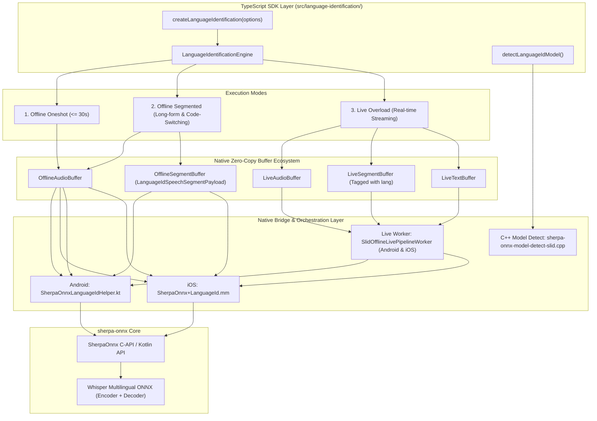

# Spoken Language Identification (SLID) — Architecture & Implementation Plan

> **Status:** Draft / Planning  
> **Audience:** SDK Maintainers  
> **Category:** Speech & Media Features (`ModelCategory.LanguageId` / `slid`)  
> **Target Branch:** `refactor/refactor-before-release-1-0`

---

## 1. Executive Summary & Core Decisions

### 1.1 What is Spoken Language Identification?
Spoken Language Identification (SLID / Language ID) determines which spoken human language (e.g., English, German, French, Chinese, Spanish) is present in an audio recording or live stream, returning ISO-639-1 language codes (such as `"en"`, `"de"`, `"zh"`, `"fr"`).

### 1.2 "Streaming" vs. Offline: Why Live Overload is the State-of-the-Art Solution
- **No True Frame-by-Frame Streaming in SLID:**  
  Unlike ASR (where phonemes are decoded frame-by-frame) or VAD (where energy/speech probability is computed every 20–30 ms), a 20 ms sound slice contains virtually no acoustic information to distinguish between e.g. German, Dutch, or English. All established speech ML models (Whisper, SpeechBrain VoxLingua107, Meta MMS LID) require a context window of **at least 1.5 to 3.0 seconds** of speech to classify phoneme distributions reliably.
- **Upstream sherpa-onnx Behavior:**  
  sherpa-onnx supports SLID **exclusively offline** using Whisper multilingual models (`tiny`, `base`, `small`, `medium`, `large`). There is no `OnlineSpokenLanguageIdentification` in sherpa-onnx.
- **The SDK Advantage:**  
  Instead of being limited to static files, our SDK's **Segmentation Engine + Live Overload** architecture provides the exact industry-standard pattern used by Google Meet, Apple Live Captions, and translation systems:
  1. Incoming microphone audio flows into a `LiveAudioBuffer`.
  2. A speech segmentation engine (VAD or energy-based) isolates speech utterances (e.g. 1.5–5.0 seconds).
  3. The offline SLID engine runs on each committed segment via **Live Overload**.
  4. Detected language codes are committed to a `LiveTextBuffer` and emitted via `onSegment` and `onLanguageChanged` callbacks in real time.
- **Long-Form Audio Advantage:**  
  Native sherpa-onnx Whisper SLID hard-truncates audio at 30 seconds (`"Only waves less than 30 seconds are supported. We process only the first 30 seconds and discard the remaining data"`). With our SDK's **Offline Segmentation Pipeline**, files of arbitrary duration (multi-hour podcasts, meetings, interviews) can be processed segment-by-segment with zero risk of OOM, and multilingual code-switching across the timeline can be mapped seamlessly.

---

## 2. Upstream Availability & Prebuilt Status

Both target mobile platforms are already equipped with the necessary symbols in our prebuilt bundles:

| Component | Android | iOS |
|---|---|---|
| **Underlying Engine** | Whisper Multilingual (`encoder.onnx`, `decoder.onnx`) | Whisper Multilingual (`encoder.onnx`, `decoder.onnx`) |
| **Prebuilt Status** | ✅ In `classes.jar` & `libsherpa-onnx-jni.so` | ✅ In `SherpaOnnxC.framework` binary |
| **Native API Type** | Kotlin (`com.k2fsa.sherpa.onnx.SpokenLanguageIdentification`) | C-API (`SherpaOnnxCreateSpokenLanguageIdentification`, etc.) |
| **Model Reusability** | ✅ **100% Shared with STT:** Any multilingual Whisper STT model can be reused as a Language ID model with **0 MB** extra download! | ✅ **100% Shared with STT:** Same ONNX weights used across STT and Language ID. |

### How Whisper Language Identification Works Internally
1. Upstream creates an `OfflineStream` and accepts 16 kHz mono PCM audio.
2. The Whisper feature extractor normalizes log-mel filterbank features (80-dim).
3. The Whisper encoder performs a single forward pass: `features ➔ cross_kv`.
4. The Whisper decoder executes **a single step** using the SOT (`<|startoftranscript|>`) token.
5. The logits across `all_language_tokens` (extracted from the model's ONNX metadata) are evaluated via argmax, yielding the detected ISO code (e.g. `"en"`, `"de"`, `"zh"`).
6. Execution time is extremely fast (typically < 100–300 ms on mobile CPU for `tiny`/`base`).

---

## 3. High-Level Architecture & Layering



---

## 4. Code-Switching & SegmentBuffer Integration

### 4.1 Understanding Code-Switching in Speech AI
In natural speech, bilingual or multilingual conversations frequently switch between languages:
1. **Inter-Sentential / Inter-Utterance Code-Switching:** A speaker (or alternating conversation partners) changes language between sentences or thought groups (e.g., 20 seconds German, then 40 seconds English, or switching back and forth in an international meeting).
2. **Intra-Sentential Code-Switching:** Loanwords or phrases embedded within a single clause (*"Lass uns das heute deployen"*). This level is handled acoustically by multilingual ASR (STT) models, whereas acoustic Language ID models classify the predominant language of an acoustic window ($\ge 1.5$ s).

Our SDK directly addresses **Inter-Sentential Code-Switching** in two powerful ways:
- **Offline:** Produces a timeline of language spans, calculates duration-weighted language distributions (e.g., 65% German, 35% English), and pinpoints timestamps of language transitions.
- **Live / Streaming:** Emits an **`onLanguageChanged`** event the exact moment speech switches to a different language, enabling instantaneous app reactions (updating UI flags, switching downstream TTS voices, or reconfiguring STT hints).

### 4.2 `LanguageIdSpeechSegmentPayload` on SegmentBuffers
Following the architecture of Speaker Identification (`SidSpeechSegmentPayload`) and Diarization (`DiarizationSegmentPayload`), Language ID extends `SpeechSegmentPayload` in `src/segmentbuffer/types.ts`:

```typescript
export interface LanguageIdSpeechSegmentPayload {
  source: 'languageId';
  /** Detected ISO language code, e.g. 'en', 'de', 'zh'. */
  lang: string;
  /** Optional model confidence / margin if available. */
  confidence?: number;
}
```

This unlocks **Composite Native Pipelines**:
```
Audio In ➔ VAD Segmentation ➔ Language ID (tags payload.lang) ➔ Downstream STT / Diarization
```
When downstream STT processes the segment buffer, each segment already carries its exact language tag, allowing multilingual STT routers to pick the optimal model or language prompt per utterance!

---

## 5. Public API Design (`src/language-identification/`)

### 5.1 Module Structure
```
src/language-identification/
├── index.ts                     # Public entry point (createLanguageIdentification, types, detect)
├── types.ts                     # Core options, results, events, and engine interfaces
├── languageIdNativeBridge.ts    # Native TurboModule calls and option normalizers
├── orchestrate.ts               # Offline segmentation pipeline & code-switching analysis
├── live.ts                      # Live overload wiring (LiveAudioBuffer -> LiveSegmentBuffer -> LiveTextBuffer)
├── customConfig.ts              # Custom model path builder
├── detect.ts                    # Model detection wrapper
└── __tests__/                   # Unit tests (init, oneshot, segmented, code-switching, live, detect)
```

### 5.2 Public Types & Interfaces

```typescript
export interface LanguageIdentificationInitializeOptions {
  /** Model directory or explicit model files (Whisper multilingual encoder + decoder). */
  modelSource: ModelSource;
  /** Quantization preference ('auto' | 'int8' | 'fp16' | 'fp32'). Defaults to 'auto'. */
  quantization?: QuantizationPreference;
  /** Number of CPU inference threads. Defaults to 1. */
  numThreads?: number;
  /** Provider ('cpu'). Defaults to 'cpu'. */
  provider?: string;
  /** Number of tail padding frames for Whisper (defaults to upstream default: 1000). */
  tailPaddings?: number;
}

/** Result for single-chunk / oneshot offline evaluation (<= 30s). */
export interface LanguageIdentificationResult {
  /** Two-letter ISO language code, e.g. 'en', 'de', 'fr', 'zh'. */
  lang: string;
  /** Processing duration in milliseconds. */
  elapsedMs: number;
  /** Audio duration in seconds. */
  audioDuration: number;
}

/** A single language switch event along a speech timeline. */
export interface LanguageSwitchEntry {
  /** Timestamp in seconds where the new language began. */
  timestamp: number;
  /** Previous language code (or null if first segment). */
  from: string | null;
  /** New language code. */
  to: string;
  /** Index of the segment where the transition occurred. */
  segmentIndex: number;
}

/** One detected speech segment with language information. */
export interface LanguageIdSegmentEntry {
  segmentIndex: number;
  startTime: number;
  endTime: number;
  durationMs: number;
  lang: string;
}

/** Event fired whenever speech transitions from one language to another. */
export interface LanguageChangedEvent {
  previousLang: string | null;
  currentLang: string;
  timestamp: number;
  segmentIndex: number;
}

/** Event fired after each speech segment is evaluated. */
export interface LanguageIdSegmentEvent {
  segmentIndex: number;
  totalSegments?: number;
  startTime: number;
  endTime: number;
  durationMs: number;
  lang: string;
}

/** Detailed result for long-form offline audio with code-switching analysis. */
export interface SegmentedLanguageIdentificationResult {
  /** Dominant language across all speech (duration-weighted). */
  dominantLanguage: string;
  /** Duration-weighted distribution of languages (fractions summing to 1.0, e.g. { en: 0.65, de: 0.35 }). */
  distribution: Record<string, number>;
  /** Chronological list of language switches detected across the audio. */
  switches: LanguageSwitchEntry[];
  /** Detailed segment-by-segment language timeline. */
  segments: LanguageIdSegmentEntry[];
  totalSegments: number;
  processingTimeMs: number;
}

export interface LanguageIdentificationOptions {
  /** Segmentation policy for long-form audio. If omitted or 'off', runs oneshot (<= 30s). */
  segmentation?: {
    mode?: 'off' | 'auto';
    policy?: SegmentationPolicy;
  };
  /** Progress callback during multi-segment processing. */
  onProgress?: (progress: OrchestrationProgress) => void;
  /** Fired for every evaluated speech segment. */
  onSegment?: (event: LanguageIdSegmentEvent) => void;
  /** Fired specifically when a language switch is detected between segments. */
  onLanguageChanged?: (event: LanguageChangedEvent) => void;
  /** Optional target OfflineSegmentBuffer to populate with LanguageIdSpeechSegmentPayload. */
  targetSegmentBuffer?: OfflineSegmentBufferRef | string;
}

export interface LanguageIdentificationLivePipelineOptions {
  /** Mandatory segmentation policy (live-overload contract). */
  segmentation: {
    mode: 'auto';
    policy: SegmentationPolicy;
  };
  chunkSize?: number;
  /** Fired for every evaluated speech segment. */
  onSegment?: (event: LanguageIdSegmentEvent) => void;
  /** Fired when the speaker switches language in the live stream. */
  onLanguageChanged?: (event: LanguageChangedEvent) => void;
  /** Optional target LiveSegmentBuffer to annotate with LanguageIdSpeechSegmentPayload. */
  targetSegmentBuffer?: LiveSegmentBufferRef | string;
}
```

### 5.3 Engine Method Signatures (`LanguageIdentificationEngine`)

```typescript
export interface LanguageIdentificationEngine {
  readonly instanceId: string;

  /**
   * Mode 1: Offline Oneshot (<= 30s)
   * Evaluates audio buffer directly in a single pass.
   */
  identify(
    audio: OfflineAudioBufferRef | string
  ): Promise<LanguageIdentificationResult>;

  /**
   * Mode 2: Offline Segmented (Long-form Audio & Code-Switching)
   * Slices long audio via segmentation policy, evaluates each speech span,
   * compiles code-switching timeline and duration-weighted distribution.
   */
  identify(
    audio: OfflineAudioBufferRef | string,
    options: LanguageIdentificationOptions & { segmentation: { mode: 'auto'; policy: SegmentationPolicy } }
  ): Promise<SegmentedLanguageIdentificationResult>;

  /**
   * Mode 3: Live Overload (Real-time Streaming)
   * Connects LiveAudioBuffer to LiveTextBuffer via segmentation engine worker,
   * commits detected language tags to text buffer, and emits onSegment/onLanguageChanged.
   */
  identify(
    audioIn: LiveAudioBufferRef | string,
    textOut: LiveTextBufferRef | string,
    options: LanguageIdentificationLivePipelineOptions
  ): Promise<StreamingPipelineHandle>;

  /**
   * Annotates an existing segment buffer with detected languages.
   */
  labelOfflineSegments(
    audioIn: OfflineAudioBufferRef | string,
    segmentsIn: OfflineSegmentBufferRef | string,
    segmentsOut: OfflineSegmentBufferRef | string,
    options?: {
      onProgress?: (progress: OrchestrationProgress) => void;
      onSegment?: (event: LanguageIdSegmentEvent) => void;
      onLanguageChanged?: (event: LanguageChangedEvent) => void;
    }
  ): Promise<{ labeledCount: number }>;

  /** Release native resources. */
  destroy(): Promise<void>;
}
```

---

## 6. The Three Execution Modes in Detail

### Mode 1: Offline Oneshot (`<= 30s`)
* **Target:** Short audio clips, voice notes, prompt audio.
* **Flow:**  
  1. `audioIn` is passed to the native bridge.
  2. Native code accepts waveform into `OfflineStream`.
  3. `Compute(stream)` executes Whisper encoder + single-step decoder.
  4. Returns `{ lang: "de", audioDuration: 4.2, elapsedMs: 145 }`.

### Mode 2: Offline Segmented (Long-form Audio & Code-Switching)
* **Target:** Podcasts, interviews, multilingual meetings, audio files `> 30s`.
* **Problem Solved:** Native Whisper SLID drops all audio after 30 seconds. A 10-minute file would only have its first 30 seconds checked.
* **Flow:**  
  1. User specifies `segmentation: { mode: 'auto', policy: { evaluator: 'speech_energy_silence', ... } }`.
  2. SDK's segmentation engine slices audio at natural speech pauses into discrete chunks of 2–10 seconds.
  3. SLID evaluates each chunk independently.
  4. Fires `onSegment` per chunk and `onLanguageChanged` whenever the language flips.
  5. If `targetSegmentBuffer` is provided, attaches `LanguageIdSpeechSegmentPayload` to each segment.
  6. Compiles duration-weighted distribution (e.g. `{ en: 0.70, de: 0.30 }`) and chronological `switches`.

### Mode 3: Live Overload (Streaming Microphone / Continuous Ingestion)
* **Target:** Live microphone language detection, dynamic ASR switching, real-time translation pipelines.
* **Flow:**
  1. Mic records continuous audio into `LiveAudioBuffer` (`live_*`).
  2. `attachSegmentationEngine` creates `LiveSegmentBuffer` (`seg_live_*`) with VAD.
  3. `SlidOfflineLivePipelineWorker` (inherited from `OfflineLivePipelineWorker`) waits for committed speech segments.
  4. When a speech segment of sufficient duration (e.g. $\ge 1.5$ s) commits, worker reads PCM slice from `LiveAudioBuffer`.
  5. Worker calls `compute()` on native Whisper SLID instance.
  6. Resulting language code (e.g. `"en"`) is:
     - Appended as a text segment to `LiveTextBuffer` (`txt_live_*`).
     - Emitted to JS via `onSegment({ segmentIndex, lang, startTime, endTime })`.
     - Compared against previous segment language; if different, emits `onLanguageChanged({ previousLang, currentLang, timestamp, segmentIndex })`.
  7. Downstream app reacts immediately (e.g. switches transcription model or shows a country flag).

---

## 7. Model Detection & Quantization Parity

### 7.1 Model Detection (`sherpa-onnx-model-detect-slid.cpp`)
- Follows the existing unified C++ detection architecture (`ModelCategory::kLanguageId`).
- Pattern:
  - Searches directory for `encoder` and `decoder` files.
  - Recognizes Whisper model structures (e.g. `tiny-encoder.onnx`, `tiny-decoder.onnx`, `base-encoder.int8.onnx`, etc.).
  - Reads ONNX metadata: validates `model_type == "whisper"` and `is_multilingual == 1`.
  - Extracts supported language tokens from metadata (`all_language_codes`).
- Supports explicit paths, `.onnx`, and `.ort` formats.

### 7.2 Universal Quantization
- Full parity with other SDK features:
  - Supports `quantization: 'int8' | 'fp16' | 'fp32' | 'int4' | 'uint8' | 'auto'`.
  - Automatically filters and selects matched pairs (e.g., `tiny-encoder.int8.onnx` + `tiny-decoder.int8.onnx`).

---

## 8. Native Implementation Details

### 8.1 Android Layer
- **Helper:** `android/src/main/java/com/sherpaonnx/slid/facade/SherpaOnnxLanguageIdHelper.kt`
  - Maintains `ConcurrentHashMap<String, SpokenLanguageIdentification>` instances.
  - Exposes `initializeLanguageId`, `identifyLanguageOffline`, `releaseLanguageId`.
- **Live Worker:** `android/src/main/java/com/sherpaonnx/slid/pipeline/SlidOfflineLivePipelineWorker.kt`
  - Inherits from existing `OfflineLivePipelineWorker`.
  - Overrides `onSegmentCommitted(segment)` to fetch PCM, run `compute()`, track language transitions, and commit result to `LiveTextBuffer`.

### 8.2 iOS Layer
- **Bridge:** `ios/slid/bridge/SherpaOnnx+LanguageId.mm`
  - Calls C-API: `SherpaOnnxCreateSpokenLanguageIdentification(&config)`.
  - Manages instance lifetime and handles offline buffer audio ingest.
- **Live Worker:** `ios/slid/pipeline/SlidOfflineLivePipelineWorker.mm`
  - Inherits from `OfflineLivePipelineWorker`.
  - Dispatches segment PCM to `SherpaOnnxSpokenLanguageIdentificationCompute`, detects transitions, and commits to text buffer.

---

## 9. Implementation Phases & Milestones

| Phase | Tasks | Deliverables |
|---|---|---|
| **Phase 1: Foundation & Detect** | • Add `ModelCategory.LanguageId` / `slid` to enums and downloads<br>• Add `LanguageIdSpeechSegmentPayload` to `src/segmentbuffer/types.ts`<br>• Implement C++ detector `sherpa-onnx-model-detect-slid.cpp` with metadata validation<br>• Add native detection bindings in JNI and ObjC++<br>• C++ & TS model detect unit tests | Detection parity for Whisper multilingual models across Android, iOS, and TS |
| **Phase 2: Offline Native Engine & Oneshot** | • Implement Android `SherpaOnnxLanguageIdHelper.kt`<br>• Implement iOS `SherpaOnnx+LanguageId.mm`<br>• Wire native bridge methods (`initializeLanguageId`, `identifyLanguageOffline`, `releaseLanguageId`)<br>• Implement `createLanguageIdentification` TS engine (Oneshot mode $\le 30$s) | Working offline language identification for short audio buffers |
| **Phase 3: Long-Form Segmentation & Code-Switching** | • Implement `orchestrate.ts` for segmented audio files<br>• Track language transitions and calculate duration-weighted `distribution`<br>• Emit `onSegment` and `onLanguageChanged` events<br>• Support annotating `targetSegmentBuffer` with `LanguageIdSpeechSegmentPayload`<br>• Implement `labelOfflineSegments` | Processing multi-minute audio files without 30s truncation; rich code-switching timeline |
| **Phase 4: Live Overload (Streaming)** | • Implement `SlidOfflineLivePipelineWorker` on Android and iOS<br>• Wire `LiveAudioBuffer` ➔ `LiveSegmentBuffer` ➔ `LiveTextBuffer`<br>• Implement `engine.identify(liveAudio, liveText, options)` TS overload<br>• Real-time `onSegment` and `onLanguageChanged` events | Real-time streaming language identification from microphone with instant switch alerts |
| **Phase 5: Showcase & Verification** | • Add Language ID showcase screen to example app (supporting Oneshot, File Code-Switching, and Live Mic)<br>• Test with Whisper tiny/base multilingual models<br>• Multi-language test suite (German, English, Spanish, Chinese, French)<br>• Update documentation (`docs/language-identification-offline.md`, `docs/language-identification-live.md`, `README.md`) | Fully verified feature with developer documentation and interactive demo |

---

## 10. Key Benefits of This Architecture

1. **Zero New Upstream Dependencies:** Relies 100% on prebuilts already present in the repository (`SherpaOnnxC.framework`, `libsherpa-onnx-jni.so`, and `classes.jar`).
2. **Zero Storage Redundancy:** Reuses existing Whisper ASR models that users already download for speech-to-text.
3. **No 30-Second Limit:** Breaks the native Whisper 30s barrier through our native segmentation engine.
4. **First-Class Code-Switching Support:** Full timeline mapping, duration-weighted language statistics, and real-time transition callbacks (`onLanguageChanged`).
5. **Composable Native Pipelines:** Emits `LanguageIdSpeechSegmentPayload` into `SegmentBuffers`, enabling downstream models (e.g. STT) to automatically adapt to per-segment language tags.
6. **Architectural Consistency:** Follows the exact design pattern of STT, TTS, Enhancement, Punctuation, SID, and Diarization.
