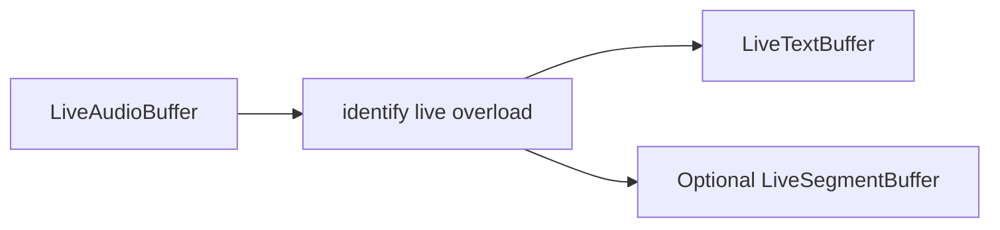

# Spoken language identification (live overload)

> **Live overload** — not a streaming SLID model.
>
> Live audio is sliced by a mandatory speech segmentation policy; each committed utterance is identified natively with the same offline Whisper multilingual weights. There is no separate online/streaming spoken-language-ID model in sherpa-onnx.

## Introduction

On-device **language tagging** over a live mic or file stream. Each committed utterance writes the ISO language code to a live text buffer and can optionally append labeled speech segments.

Import path: **`react-native-sherpa-onnx/language-identification`**.

Factory / detect / models: [language-identification-offline.md](language-identification-offline.md#api-reference).

## Quick start

```ts
import {
  createEmptyLiveAudioBuffer,
  finalizeLiveAudioBuffer,
  releasePipelineAudioBuffer,
  startMicToLiveAudioBuffer,
  stopMicToLiveAudioBuffer,
} from 'react-native-sherpa-onnx/audiobuffer';
import {
  createLiveTextBuffer,
  releasePipelineTextBuffer,
} from 'react-native-sherpa-onnx/textbuffer';
import {
  DEFAULT_LANGUAGE_ID_SEGMENTATION_POLICY,
} from 'react-native-sherpa-onnx/language-identification';

// Assume `slid` from createLanguageIdentification (see offline doc).

const audioIn = await createEmptyLiveAudioBuffer({ sampleRate: 16000, channelCount: 1 });
const textOut = await createLiveTextBuffer();

const pipeline = await slid.identify(audioIn, textOut, {
  segmentation: { mode: 'auto', policy: DEFAULT_LANGUAGE_ID_SEGMENTATION_POLICY },
  onSegment: (e) => console.log('#', e.segmentIndex, e.lang, e.durationMs),
  onLanguageChanged: (e) => console.log(e.previousLang, '→', e.currentLang),
});

await startMicToLiveAudioBuffer(audioIn);
// … speak …
await stopMicToLiveAudioBuffer();
await finalizeLiveAudioBuffer(audioIn);
const completion = await pipeline.completed;
console.log(completion.reason);

await releasePipelineTextBuffer(textOut);
await releasePipelineAudioBuffer(audioIn);
```

`finalizeLiveAudioBuffer(audioIn)` drains remaining spans and resolves `completed`. Prefer that over an early `stop()` when the session ends naturally.

## Buffer matrix

| Role | Type | Notes |
| --- | --- | --- |
| **Audio in** | [`LiveAudioBuffer`](audiobuffer-streaming.md) | Mic / file ingest (offline path uses `OfflineAudioBuffer`) |
| **Text out** | [`LiveTextBuffer`](textbuffer-streaming.md) | Required on live — committed language tags |
| **Segments out (optional)** | [`LiveSegmentBuffer`](segmentbuffer-streaming.md) | Live `targetSegmentBuffer`; offline uses offline segment buffer |
| **Return** | `LanguageIdentificationPipelineHandle` | Offline returns result objects instead |
| **Engine** | Same `LanguageIdentificationEngine` as offline | `identify(liveAudio, liveText, options)` |
| **Pipeline handle** | `LanguageIdentificationPipelineHandle` | `stop` / `flush` / `reset` / `getStatus` / `completed` |

Mixed live/offline arguments throw `LANGUAGE_ID_INVALID_ARGUMENT`.

## Segmentation (Mandatory)

Live spoken language identification must cut the incoming audio stream into committed utterance spans before each offline Whisper identification step. `options.segmentation.policy` is **required** (`LIVE_OFFLINE_SEGMENTATION_REQUIRED` if missing or `mode !== 'auto'`). SLID attaches the engine — you do **not** pass a pre-built VAD segment from the app.

**Modes:** `'auto'` only (policy required). `'off'` / `'manual'` are not supported on the live path.

| Evaluator | Supported | Notes |
| --- | --- | --- |
| `speech_energy_silence` | ✅ **Recommended** | Pass `DEFAULT_LANGUAGE_ID_SEGMENTATION_POLICY` (`minSegmentMs: 1500`) explicitly |
| `speech_vad_model` | ✅ | Model-based speech cuts; pass VAD pack via policy `modelPath` |
| `continuous_frames` | ❌ | Fixed windows are a poor fit for utterance-level language ID |
| `speech_pyannote_segmentation` | ❌ | Not in SLID live `supportedEvaluators` |

```ts
const pipeline = await slid.identify(audioIn, textOut, {
  segmentation: {
    mode: 'auto',
    policy: DEFAULT_LANGUAGE_ID_SEGMENTATION_POLICY,
  },
});
```

Full policy reference: [segmentation-engine.md](segmentation-engine.md). Offline Auto: [language-identification-offline.md](language-identification-offline.md#segmentation-optional).

## Models

Same packs as [language-identification-offline.md#models](language-identification-offline.md#models).

## Pipeline handle

Same control surface as other streaming / live-overload features ([streaming-pipelines-overview.md](streaming-pipelines-overview.md)):

| Method | Behavior |
| --- | --- |
| `stop()` | Stop identify, flush remaining committed spans, resolve `completed` with `reason: 'stopped'`. |
| `flush()` | Identify **already-committed** spans. Open tail emits on `stop` / input finalize. |
| `reset()` | Clears progress counters while the pipeline remains running. |
| `getStatus()` | `{ pipelineId, isRunning, chunksProcessed, unitsRead, unitsWritten, error }` |
| `completed` | Resolves on graceful finalize (`completed`) or `stop()` (`stopped`); rejects on fatal errors (`STREAMING_PIPELINE_ERROR`). |

## API reference

Factory, detection, and model init are the same as offline — see [language-identification-offline.md](language-identification-offline.md#api-reference).

### `slid.identify(audioIn, textOut, options)`

Starts a live overload pipeline: identifies each committed audio span with offline Whisper weights, commits the ISO language code to `textOut`, and returns a pipeline handle.

```ts
identify(
  audioIn: LiveAudioBufferIdSource,
  textOut: LiveTextBufferIdSource,
  options: LanguageIdentificationLivePipelineOptions
): Promise<LanguageIdentificationPipelineHandle>;
```

**Constraints:** both buffers must be live; `segmentation.policy` required (`speech_energy_silence` or `speech_vad_model`).

```ts
const pipeline = await slid.identify(audioIn, textOut, {
  segmentation: { mode: 'auto', policy: DEFAULT_LANGUAGE_ID_SEGMENTATION_POLICY },
  onSegment: (e) => console.log(e.segmentIndex, e.lang),
  onLanguageChanged: (e) => console.log(e.previousLang, '→', e.currentLang),
});
```

## Optional `targetSegmentBuffer`

Pass a **live** segment buffer (`seg_live_*`) to append the same payload as offline (`payload: { source: 'languageId', lang }` ). Offline `targetSegmentBuffer` ids are rejected (`LANGUAGE_ID_INVALID_ARGUMENT`).

## Speech payload (`source: 'languageId'`)

Same contract as offline — each identified span appended to `targetSegmentBuffer` is `kind: 'speech'` with `{ source: 'languageId', lang }`. Full shape: [language-identification-offline.md#speech-payload-source-languageid](language-identification-offline.md#speech-payload-source-languageid).

## Pipeline composition

### Typical upstream

| Source / feature | Buffer or handle | Notes |
| --- | --- | --- |
| Mic / file ingest | `LiveAudioBuffer` (`live_*`) | Mandatory Auto segmentation on the live path. |
| Offline Whisper SLID pack | Same engine | Factory/detect: [language-identification-offline.md](language-identification-offline.md). |

### Typical downstream

| Destination / feature | Buffer or handle | Notes |
| --- | --- | --- |
| Live text HUD | `LiveTextBuffer` (`txt_live_*`) | ISO language code per committed span. |
| Optional segment timeline | `LiveSegmentBuffer` (`seg_live_*`) | `targetSegmentBuffer` with `payload.source: 'languageId'`. |



Shared lifecycle: [streaming-pipelines-overview.md](streaming-pipelines-overview.md).

## JS Events

| Callback | Payload | Fires when | Notes |
| --- | --- | --- | --- |
| `onSegment` | `LanguageIdSegmentEvent` | after each committed span is identified | no `onProgress` on the live path |
| `onLanguageChanged` | `LanguageChangedEvent` | predicted `lang` differs from previous non-empty language | includes first span (`previousLang: null`) |

Shapes: [Types](#types) · offline result fields: [language-identification-offline.md](language-identification-offline.md#types).

```ts
await slid.identify(audioIn, textOut, {
  segmentation: { mode: 'auto', policy: DEFAULT_LANGUAGE_ID_SEGMENTATION_POLICY },
  onSegment: (e) => console.log(e.segmentIndex, e.lang),
  onLanguageChanged: (e) => console.log(e.previousLang, '→', e.currentLang),
});
```

## Types

### Live-only language-identification types (`react-native-sherpa-onnx/language-identification`)

| Type | Description |
| --- | --- |
| `LanguageIdentificationLivePipelineOptions` | Mandatory `segmentation.policy`; optional `onSegment`, `onLanguageChanged`, `targetSegmentBuffer` |
| `LanguageIdentificationPipelineHandle` | Extends `StreamingPipelineHandle` — live run control surface |
| `StreamingPipelineCompletion` | `{ reason: 'completed' \| 'stopped' }` from `completed` |
| `StreamingPipelineStatus` | Snapshot from `getStatus()` |

Engine, detect, and offline result types: [language-identification-offline.md](language-identification-offline.md#types).

## Error codes

| Code / token | Typical reason |
| --- | --- |
| `LIVE_OFFLINE_SEGMENTATION_REQUIRED` | Missing `segmentation` / `policy`, or `mode !== 'auto'`. |
| `LANGUAGE_ID_INVALID_ARGUMENT` | Non-live audio/text (or bad options). |
| `LANGUAGE_ID_IDENTIFY_FAILED` | Live start / identify path failed. |
| `STREAMING_PIPELINE_ERROR` | Fatal error during the run; `completed` rejects with this `code`. |
| `LANGUAGE_ID_*` / `SEGMENT_*` | Same codes as [offline SLID](language-identification-offline.md#error-codes). |

## Use case examples

<details>
<summary>Live language commits while audio is still being captured</summary>

`onSegment` / `onLanguageChanged` update as speech spans commit — useful for code-switch UIs that must not wait for the whole recording.

```ts
import {
  createLanguageIdentification,
  DEFAULT_LANGUAGE_ID_SEGMENTATION_POLICY,
} from 'react-native-sherpa-onnx/language-identification';
import {
  createEmptyLiveAudioBuffer,
  startMicToLiveAudioBuffer,
  finalizeLiveAudioBuffer,
  releasePipelineAudioBuffer,
} from 'react-native-sherpa-onnx/audiobuffer';
import { createLiveTextBuffer, releasePipelineTextBuffer } from 'react-native-sherpa-onnx/textbuffer';

const slid = await createLanguageIdentification({
  modelSource: { kind: 'fs', path: '/path/to/whisper-slid' },
});
const audioIn = await createEmptyLiveAudioBuffer({ sampleRate: 16000, channelCount: 1 });
const textOut = await createLiveTextBuffer({ maxSegments: 256 });

const pipeline = await slid.identify(audioIn, textOut, {
  segmentation: { mode: 'auto', policy: DEFAULT_LANGUAGE_ID_SEGMENTATION_POLICY },
  onSegment: (e) => console.log('lang segment', e.segment.text),
  onLanguageChanged: (e) => console.log('now', e.language),
});
const mic = await startMicToLiveAudioBuffer(audioIn);

await new Promise((r) => setTimeout(r, 25_000));
await mic.stop();
await finalizeLiveAudioBuffer(audioIn);
await pipeline.completed;

await slid.destroy();
await releasePipelineTextBuffer(textOut);
await releasePipelineAudioBuffer(audioIn);
```

</details>

<details>
<summary>File ingest then settle the pipeline</summary>

Start identify, ingest the file, and only then finalize + await — language labels can appear during ingest.

```ts
import {
  createLanguageIdentification,
  DEFAULT_LANGUAGE_ID_SEGMENTATION_POLICY,
} from 'react-native-sherpa-onnx/language-identification';
import {
  createEmptyLiveAudioBuffer,
  ingestFileToLiveAudioBuffer,
  finalizeLiveAudioBuffer,
  releasePipelineAudioBuffer,
} from 'react-native-sherpa-onnx/audiobuffer';
import { createLiveTextBuffer, releasePipelineTextBuffer } from 'react-native-sherpa-onnx/textbuffer';

const slid = await createLanguageIdentification({ modelSource: { kind: 'fs', path: '/path/to/slid' } });
const audioIn = await createEmptyLiveAudioBuffer({ sampleRate: 16000, channelCount: 1 });
const textOut = await createLiveTextBuffer({ maxSegments: 256 });

const pipeline = await slid.identify(audioIn, textOut, {
  segmentation: { mode: 'auto', policy: DEFAULT_LANGUAGE_ID_SEGMENTATION_POLICY },
});
const ingest = await ingestFileToLiveAudioBuffer(audioIn, { kind: 'fs', path: '/path/to/mixed.wav' });
await ingest.done;
await finalizeLiveAudioBuffer(audioIn);
await pipeline.completed;

await slid.destroy();
await releasePipelineTextBuffer(textOut);
await releasePipelineAudioBuffer(audioIn);
```

</details>

<details>
<summary>Mirror commits into an optional `targetSegmentBuffer`</summary>

Pass a live segment buffer so each language commit is also mirrored as a segment row for timeline UIs, while text output stays available for labels.

```ts
import { createLiveSegmentBuffer, releasePipelineSegmentBuffer } from 'react-native-sherpa-onnx/segmentbuffer';

const segOut = await createLiveSegmentBuffer({ sourceAudioBufferId: audioIn, spooling: { mode: 'on' } });
const pipeline = await slid.identify(audioIn, textOut, {
  segmentation: { mode: 'auto', policy: DEFAULT_LANGUAGE_ID_SEGMENTATION_POLICY },
  targetSegmentBuffer: segOut,
  onSegment: (e) => console.log(e.segment.text),
});
// ... feed audio, then finalize / await as usual ...
await releasePipelineSegmentBuffer(segOut);
```

</details>

## See also

- [Spoken language identification (offline)](language-identification-offline.md)
- [Streaming pipelines — shared lifecycle](streaming-pipelines-overview.md)
- [Segmentation engine](segmentation-engine.md)
- [Pipeline audio buffers — streaming](audiobuffer-streaming.md)
- [Pipeline text buffers — live](textbuffer-streaming.md)
- [Speaker Identification (live overload)](speaker-identification-live.md) — same live-overload pattern

## Native crash diagnostics

If native code fails or the app crashes but the tombstone shows only a UI/GPU thread, inspect the SDK **last-activity ring buffer**. Full details: [native-diagnostics.md](./native-diagnostics.md).
