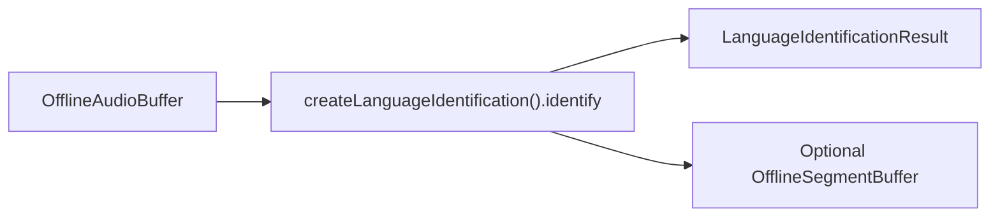

# Spoken language identification (offline)

## Introduction

On-device **spoken language identification** using **Whisper multilingual** models. Returns ISO 639-1 codes (e.g. `en`, `zh`, `de`). Use oneshot for short clips or segmented Auto mode for code-switching audio; continuous mic/file use is the [live overload](language-identification-live.md).

Import path: **`react-native-sherpa-onnx/language-identification`**.

## Quick start — oneshot

```ts
import {
  createLanguageIdentification,
  detectLanguageIdModel,
} from 'react-native-sherpa-onnx/language-identification';
import {
  createOfflineAudioBufferFromFile,
  releasePipelineAudioBuffer,
} from 'react-native-sherpa-onnx/audiobuffer';

const modelDir = {
  kind: 'fs' as const,
  path: '/absolute/path/to/whisper-multilingual-dir',
};

const det = await detectLanguageIdModel(modelDir, { modelType: 'auto' });
if (!det.success) throw new Error(det.error ?? 'Language ID detection failed');

const slid = await createLanguageIdentification({
  modelSource: modelDir,
  quantization: det.quantization ?? 'auto',
  numThreads: 2,
});

try {
  const audio = await createOfflineAudioBufferFromFile({
    kind: 'fs',
    path: '/absolute/path/clip.wav',
  });
  const result = await slid.identify(audio);
  console.log(result.lang, result.audioDuration, result.elapsedMs);
  await releasePipelineAudioBuffer(audio);
} finally {
  await slid.destroy();
}
```

## Quick start — segmented (code-switching)

```ts
import { DEFAULT_LANGUAGE_ID_SEGMENTATION_POLICY } from 'react-native-sherpa-onnx/language-identification';

const result = await slid.identify(audio, {
  segmentation: {
    mode: 'auto',
    policy: DEFAULT_LANGUAGE_ID_SEGMENTATION_POLICY,
  },
  onProgress: (p) => console.log(`${p.currentSegment + 1}/${p.totalSegments}`),
  onSegment: (e) => console.log('#', e.segmentIndex, e.lang),
  onLanguageChanged: (e) => console.log(e.previousLang, '→', e.currentLang),
});

console.log(result.dominantLanguage, result.distribution, result.switches.length);
```

Acoustic SLID is **inter-sentential** (segment-level). Word-level switching belongs to STT decoders.

Optional empty `targetSegmentBuffer` attaches `LanguageIdSpeechSegmentPayload` for downstream pipelines (e.g. Audio → VAD → Language ID → STT).

## Buffer matrix

| Role | Type | Notes |
| --- | --- | --- |
| **Audio in** | [`OfflineAudioBuffer`](audiobuffer-offline.md) | Short clip (oneshot) or long-form (segmented) |
| **Segments out (optional)** | [`OfflineSegmentBuffer`](segmentbuffer-offline.md) | `payload.source: 'languageId'`, `lang` |
| **Return** | oneshot / `SegmentedLanguageIdentificationResult` | Oneshot: `{ lang, audioDuration, elapsedMs }`; segmented: dominant language, distribution, switches, segments |
| **Engine** | `LanguageIdentificationEngine` via `createLanguageIdentification` | `identify` oneshot / segmented; `labelOfflineSegments` |

## Segmentation (Optional)

Long or code-switching audio in one `identify` call sees only the dominant language. Auto mode splits the audio buffer into utterance-level spans, identifies each independently, and returns per-segment language tags plus switch points — essential for multilingual content.

**Modes:** `'off'` (default — whole clip in one pass) | `'auto'` (policy-driven spans). `'manual'` is not supported.

| Evaluator | Supported | Notes |
| --- | --- | --- |
| `speech_energy_silence` | ✅ **Default** | `DEFAULT_LANGUAGE_ID_SEGMENTATION_POLICY` (`minSegmentMs: 1500`) |
| `speech_vad_model` | ✅ | Model-based speech cuts; pass VAD pack via policy `modelPath` |
| `speech_pyannote_segmentation` | ✅ | Pyannote speaker/speech segmentation; pass model via policy `modelPath` |
| `continuous_frames` | ❌ | Streaming-only; rejected for offline segmentation |

```ts
const result = await slid.identify(audio, {
  segmentation: {
    mode: 'auto',
    // policy defaults to DEFAULT_LANGUAGE_ID_SEGMENTATION_POLICY
  },
});
```

Full policy reference: [segmentation-engine.md](segmentation-engine.md). Live path: [language-identification-live.md](language-identification-live.md#segmentation-mandatory).

## Models

| `modelType` | Required files | Custom-init keys |
| --- | --- | --- |
| `whisper` | `encoder` + `decoder` ONNX (same layout as STT Whisper) | `encoder`, `decoder` |

Validate category: **`languageId`**. Overview: [README — Spoken Language Identification](../README.md#spoken-language-identification) · detection: [model-detect.md](model-detect.md) · downloads: [download-manager.md](download-manager.md) (`ModelCategory.LanguageId`).

## API reference

### `detectLanguageIdModel(source, options?)`

File-based detection **without** initializing the engine. Prefer before `createLanguageIdentification` to confirm pack layout and quantization. Unified detection: [model-detect.md](model-detect.md).

Packs require `model_type == "whisper"` and `is_multilingual == 1` metadata. Same layout as STT Whisper (encoder + decoder ONNX).

```ts
function detectLanguageIdModel(
  source: FileSource,
  options?: LanguageIdDetectOptions
): Promise<LanguageIdDetectResult>;
```

```ts
const det = await detectLanguageIdModel(
  { kind: 'fs', path: '/path/to/whisper-multilingual' },
  { modelType: 'auto' }
);
if (!det.success) throw new Error(det.error ?? 'Language ID detection failed');
```

### `createLanguageIdentification(options)`

Creates a `LanguageIdentificationEngine`. Init via `modelSource` (auto-detect) or `customConfig` (`{ encoder, decoder }` `FileSource` paths). Shared tuning: `quantization`, `numThreads`, `provider`, `tailPaddings`, `debug`.

```ts
function createLanguageIdentification(
  options: LanguageIdentificationInitializeOptions
): Promise<LanguageIdentificationEngine>;
```

```ts
const slid = await createLanguageIdentification({
  modelSource: { kind: 'fs', path: '/path/to/whisper-multilingual' },
  quantization: 'auto',
  numThreads: 2,
});
```

### `slid.identify(audio, options?)` — oneshot

Whole-clip offline Whisper SLID (≤ ~30 s; longer clips are truncated). Omit `segmentation` or set `mode: 'off'`. Does **not** emit `onProgress` / `onSegment`.

```ts
identify(
  audio: OfflineAudioBufferIdSource,
  options?: LanguageIdentificationOptions & { segmentation?: { mode?: 'off' } }
): Promise<LanguageIdentificationResult>;
```

```ts
const result = await slid.identify(audio);
console.log(result.lang, result.elapsedMs);
```

### `slid.identify(audio, options)` — segmented

`mode: 'auto'` + policy. Duration-weighted `distribution` / `switches`. Optional `onProgress` / `onSegment` / `onLanguageChanged` / `targetSegmentBuffer`.

```ts
identify(
  audio: OfflineAudioBufferIdSource,
  options: LanguageIdentificationOptions & {
    segmentation: { mode: 'auto'; policy?: SegmentationPolicy };
  }
): Promise<SegmentedLanguageIdentificationResult>;
```

```ts
const result = await slid.identify(audio, {
  segmentation: { mode: 'auto', policy: DEFAULT_LANGUAGE_ID_SEGMENTATION_POLICY },
  onSegment: (e) => console.log(e.segmentIndex, e.lang),
});
```

Live overload `identify(liveAudio, liveText, options)`: [language-identification-live.md](language-identification-live.md).

### `slid.labelOfflineSegments(audioIn, segmentsIn, segmentsOut, options?)`

Annotate existing speech segments with language labels without re-running segmentation. Reads spans from `segmentsIn`, evaluates each with Whisper SLID, writes `{ source: 'languageId', lang }` payloads to `segmentsOut`. Does not mutate `segmentsIn`.

```ts
labelOfflineSegments(
  audioIn: OfflineAudioBufferIdSource,
  segmentsIn: OfflineSegmentBufferIdSource,
  segmentsOut: OfflineSegmentBufferIdSource,
  options?: LanguageIdLabelOptions
): Promise<LabelOfflineSegmentsResult>;
```

```ts
const labeled = await slid.labelOfflineSegments(audioIn, segmentsIn, segmentsOut, {
  onSegment: (e) => console.log(e.lang),
  onLanguageChanged: (e) => console.log(e.previousLang, '→', e.currentLang),
});
console.log(labeled.labeledCount, labeled.dominantLanguage);
```

### `slid.destroy()`

Releases the native instance (joins any live workers first).

```ts
destroy(): Promise<void>;
```

```ts
await slid.destroy();
```

## Speech payload (`source: 'languageId'`)

When you pass `targetSegmentBuffer` (or use `labelOfflineSegments`), each identified span is appended as `kind: 'speech'` with this payload. Downstream code can filter on `payload.source === 'languageId'` without re-running identification.

```ts
{ source: 'languageId'; lang: string }
```

See [segmentbuffer-offline.md](segmentbuffer-offline.md).

## Pipeline composition

### Typical upstream

| Source / feature | Buffer or handle | Notes |
| --- | --- | --- |
| File decode path | `OfflineAudioBuffer` (`off_*`) | Clip via `createOfflineAudioBufferFromFile(...)`. |
| Sample ingestion path | `OfflineAudioBuffer` (`off_*`) | App-owned PCM via `createOfflineAudioBufferFromSamples(...)`. |
| Existing speech spans | `OfflineSegmentBuffer` (`seg_off_*`) | For `labelOfflineSegments` (PCM still required). |

### Typical downstream

| Destination / feature | Buffer or handle | Notes |
| --- | --- | --- |
| Oneshot / segmented result | `LanguageIdentificationResult` / `SegmentedLanguageIdentificationResult` | Dominant lang, distribution, switches. |
| Optional segment timeline | `OfflineSegmentBuffer` (`seg_off_*`) | `targetSegmentBuffer` / `labelOfflineSegments` with `payload.source: 'languageId'`. |
| Live overload | `LiveAudioBuffer` → `LiveTextBuffer` | Same engine: [language-identification-live.md](language-identification-live.md). |



## JS Events

| Callback | Payload | Fires when | Notes |
| --- | --- | --- | --- |
| `onProgress` | `OrchestrationProgress` | start of each offline segment step | segmented / `labelOfflineSegments` only; oneshot: none |
| `onSegment` | `LanguageIdSegmentEvent` | after each committed span is identified | order: progress → identify → optional segment append → `onSegment` |
| `onLanguageChanged` | `LanguageChangedEvent` | predicted `lang` differs from previous non-empty language | includes first span (`previousLang: null`); same list as result `switches` |

Shapes: [Types](#types).

```ts
await slid.identify(audio, {
  segmentation: { mode: 'auto', policy: DEFAULT_LANGUAGE_ID_SEGMENTATION_POLICY },
  onProgress: (p) => console.log(p.currentSegment, p.totalSegments),
  onSegment: (e) => console.log(e.segmentIndex, e.lang, e.durationMs),
  onLanguageChanged: (e) => console.log(e.previousLang ?? '—', '→', e.currentLang),
});
```

Live overload uses `onSegment` / `onLanguageChanged` only (no offline `onProgress`) — see [language-identification-live.md](language-identification-live.md#js-events).

## Types

### Core language-identification types (`react-native-sherpa-onnx/language-identification`)

| Type | Description |
| --- | --- |
| `LanguageIdModelType` | `'whisper'` |
| `LANGUAGE_ID_MODEL_TYPES` | Readonly runtime list of model types |
| `LanguageIdConcreteModelType` | Alias of `LanguageIdModelType` (non-`auto`) |
| `LanguageIdDetectOptions` | Options for `detectLanguageIdModel` (`modelType?`, `assetName?`, `quantization?`) |
| `LanguageIdDetectResult` | Return of `detectLanguageIdModel()` |
| `LanguageIdentificationInitializeOptions` | Init options for `createLanguageIdentification` (`modelSource`, `customConfig`, `quantization`, `numThreads`, …) |
| `LanguageIdCustomConfig` | `{ encoder, decoder }` `FileSource` paths for custom init |
| `LanguageIdentificationOptions` | Optional `segmentation`, `onProgress`, `onSegment`, `onLanguageChanged`, `targetSegmentBuffer` |
| `LanguageIdentificationResult` | `{ lang, audioDuration, elapsedMs }` |
| `SegmentedLanguageIdentificationResult` | `{ dominantLanguage, distribution, switches, segments, totalSegments, processingTimeMs }` |
| `LanguageIdSegmentEntry` | Per-segment detail: `segmentIndex`, `startTime`, `endTime`, `durationMs`, `lang` |
| `LanguageSwitchEntry` | `{ timestamp, from, to, segmentIndex }` |
| `LanguageIdSegmentEvent` | Per-span callback event (`segmentIndex`, ranges, `lang`) |
| `LanguageChangedEvent` | Language transition (`previousLang`, `currentLang`, `timestamp`, `segmentIndex`) |
| `LanguageIdLabelOptions` | Options for `labelOfflineSegments` (`onProgress`, `onSegment`, `onLanguageChanged`) |
| `LabelOfflineSegmentsResult` | `{ labeledCount, dominantLanguage, distribution, switches }` |
| `LanguageIdentificationEngine` | `identify` (oneshot / segmented / live), `labelOfflineSegments`, `destroy` |
| `DEFAULT_LANGUAGE_ID_SEGMENTATION_POLICY` | Runtime constant — energy silence, `minSegmentMs: 1500` |
| `LanguageIdErrorCode` | Offline/live error code object |
| `OrchestrationProgress` | Shared offline progress payload (`currentSegment`, `totalSegments`, `fraction`, …) |

Live-only types (`LanguageIdentificationLivePipelineOptions`, `LanguageIdentificationPipelineHandle`, `StreamingPipelineCompletion`, `StreamingPipelineStatus`): [language-identification-live.md](language-identification-live.md#types).

### Related buffer types

| Type | Description |
| --- | --- |
| `OfflineAudioBufferIdSource` | Offline audio ref or handle passed to `identify` |
| `OfflineSegmentBufferIdSource` | Offline segment buffer for `targetSegmentBuffer` / `labelOfflineSegments` |

See [audiobuffer-offline.md](audiobuffer-offline.md) · [segmentbuffer-offline.md](segmentbuffer-offline.md).

## Error codes

| Error code | Explanation |
| --- | --- |
| `LANGUAGE_ID_NOT_INITIALIZED` | Engine not created / native instance missing. |
| `LANGUAGE_ID_ALREADY_INITIALIZED` | Duplicate init for the same instance path. |
| `LANGUAGE_ID_INVALID_ARGUMENT` | Bad options / buffer kind / missing required fields. |
| `LANGUAGE_ID_AUDIO_BUFFER_NOT_FOUND` | Audio buffer id missing from the registry. |
| `LANGUAGE_ID_AUDIO_BUFFER_EMPTY` | Offline audio has no samples. |
| `LANGUAGE_ID_INIT_ERROR` | Model load / native construct failed. |
| `LANGUAGE_ID_IDENTIFY_FAILED` | Identify / label path failed. |
| `LANGUAGE_ID_DESTROYED` | Call after `destroy()`. |
| `SEGMENT_*` / `FILEIO_*` | Segment buffers / `FileSource` resolution (same as other offline features). |

## Use case examples

<details>
<summary>Identify the language of a whole clip</summary>

Run oneshot language ID on an offline audio buffer and read the top language + scores.

```ts
import { createLanguageIdentification } from 'react-native-sherpa-onnx/language-identification';
import {
  createOfflineAudioBufferFromFile,
  releasePipelineAudioBuffer,
} from 'react-native-sherpa-onnx/audiobuffer';

const slid = await createLanguageIdentification({
  modelSource: { kind: 'fs', path: '/path/to/whisper-slid' },
});
const audio = await createOfflineAudioBufferFromFile({ kind: 'fs', path: '/path/to/clip.wav' });
const result = await slid.identify(audio);
console.log(result.language, result.scores);

await releasePipelineAudioBuffer(audio);
await slid.destroy();
```

</details>

<details>
<summary>Segmented identify for code-switched audio</summary>

Auto-segment long/mixed speech so each committed span gets its own language label instead of one clip-level guess.

```ts
await slid.identify(audio, {
  segmentation: {
    mode: 'auto',
    policy: {
      evaluator: 'speech_energy_silence',
      silenceThresholdMs: 500,
      energyThresholdDb: -40,
      minSegmentMs: 1000,
      maxSegmentMs: 60_000,
    },
  },
  onSegment: (e) => console.log(e.segmentIndex, e.language, e.scores),
});
```

</details>

<details>
<summary>Gate downstream work on confidence</summary>

Only hand the clip to STT/TTS when the top language score clears a threshold.

```ts
const result = await slid.identify(audio);
const top = result.scores?.[0];
if (top && top.score >= 0.6) {
  console.log('accept language', result.language);
} else {
  console.log('low confidence — ask user or skip');
}
```

</details>

## See also

- [Spoken language identification (live overload)](language-identification-live.md)
- [STT offline — Whisper](stt-offline.md)
- [Segmentation engine](segmentation-engine.md)
- [Pipeline audio buffers — offline](audiobuffer-offline.md)
- [Pipeline segment buffers — offline](segmentbuffer-offline.md)
- [Model detect](model-detect.md)
- [Download manager](download-manager.md)

## Native crash diagnostics

If native code fails or the app crashes but the tombstone shows only a UI/GPU thread, inspect the SDK **last-activity ring buffer**. Full details: [native-diagnostics.md](./native-diagnostics.md).
