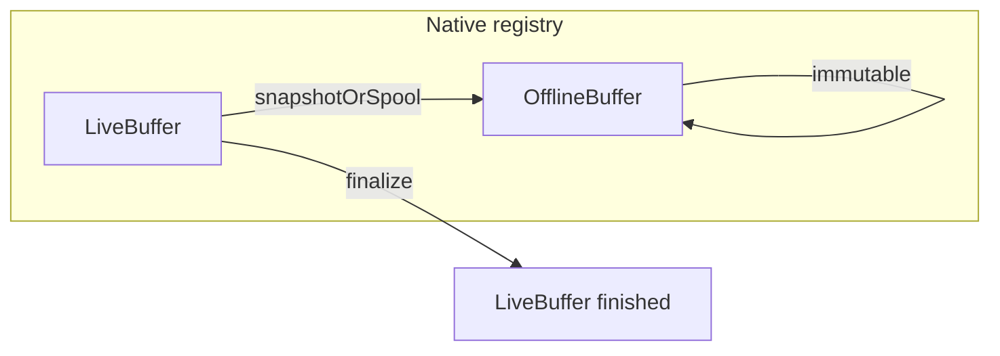

# Implementierungsplan: Offline- und Live-AudioBuffer (Pipeline-Bausteine)

## Zielbild

- **OfflineAudioBuffer**: **Voll funktionsfähig** für kleine und große Quellen: (a) RAM-Backing bei Samples/übertragbaren Größen, (b) **file-backed / sequentielles Lesen** für große WAV-Dateien (kein vollständiges Laden in den Heap), (c) Erstellung aus Datei, aus JS-Samples, aus Live-Snapshot bzw. aus abgeschlossenem Live-Spool ohne unnötige RAM-Dopplung.
- **LiveAudioBuffer**: Zustand **`recording`** | **`finished`** (kein Rückweg). Hot Path = **Rolling Window** (Ringpuffer, konfigurierbare Fenstergröße in Sekunden/Samples). Optional **Persistenz**: gleichzeitiges Schreiben **linear-float oder WAV** in eine Datei (PCM nicht komprimiert; FFmpeg nur für späteren Export, nicht im Hot Path).
- **Öffentliche API** für Pipeline-Buffers: **[`package.json`](package.json)** `./audiobuffer` → [`src/audiobuffer/index.ts`](src/audiobuffer/index.ts). **`./pcm-stream`** re-exportiert ausschließlich [`src/pcm/index.ts`](src/pcm/index.ts) (Player); bestehendes [`src/pcm/index.ts`](src/pcm/index.ts) bleibt kanonisch für Playback.
- **Keine Feature-Integration** in diesem Schritt: keine neuen Aufrufe in [`SherpaOnnxSttHelper.kt`](android/src/main/java/com/sherpaonnx/SherpaOnnxSttHelper.kt), kein `acceptWaveform`-Bypass—nur stabile Handles und Methoden, die später `engine.bindLiveBuffer(liveId)` o. Ä. verwenden können.

## Architektur Native (Kotlin, primär)

### 1. Registry und Identität

- Neues Modul z. B. **`com.sherpaonnx.audio.pipeline`** (oder unter `stt`, falls ihr Package-Struktur schlank halten wollt):
  - **`PipelineAudioRegistry`**: `ConcurrentHashMap<String, PipelineAudioEntry>` mit `bufferId`-Präfixen (`off_…`, `live_…`) zur einfachen Runtime-Validierung.
  - **`sealed interface PipelineAudioEntry`**: `OfflineEntry` | `LiveEntry`.
- **Fehlercodes**: entweder in [`SttErrorCodes`](android/src/main/java/com/sherpaonnx/stt/SttErrorCodes.kt) ergänzen oder kleines **`PipelineAudioErrorCodes`** (invalid state, not found, window full policy, wrong kind)—einheitlich für Promise.reject.

### 2. OfflineEntry (OfflineAudioBuffer)

- Implementierung als **sealed Varianten** oder interne Strategy: **`OfflineInMemory`** (`FloatArray`) und **`OfflineFileBacked`** (Pfad + Metadaten, Lesen per Chunk/`streamRead` für native Consumer und für `saveToWav`-Ableitung ohne Full-RAM). Öffentliche `getAudioBufferInfo` liefert konsistent `numSamples`/`durationMs` (aus Header bzw. bekannten Längen).
- **ChannelCount**: v1 Mono fokussiert; API-Contract für `channelCount` beibehalten, Multi-Channel nur wenn Quelle und Downstream einheitlich—ansonsten klare `INVALID_ARGUMENT`.
- **Erstellung**:
  - `createOfflineFromFile(path, targetSampleRateHz?, forceMono?)`—bei großer Datei automatisch **file-backed**; bei kleiner/konfigurierbarer Schwelle optional RAM (konfigurierbarer `maxBytesForInMemory` o. Ä.).
  - `createOfflineFromSamples(samples, sampleRate, channelCount?)`—immer In-Memory.
  - `createOfflineFromLive(liveBufferId, mode)`:
    - **`fullIfSpooled`**: Offline verweist auf **fertige Spool-Datei** (file-backed) oder materialisiert nur wenn nötig—**keine** Pflicht, das gesamte Recording dupliziert in RAM zu halten.
    - **`windowSnapshot`**: In-Memory-Kopie des **aktuellen Ringfensters** (explizite Semantik in Doku).
- **Methoden**: `getInfo() -> WritableMap` (wie `toWritableMap()` heute: `bufferId`, `kind`, `sampleRate`, `channelCount`, `numSamples`, `durationMs`), `release()`, **`saveToWav(path: String)`** (float → 16-bit PCM WAV, gleiche Konvention wie ihr für STT erwartet: mono 16 kHz ideal; Implementierung: kleiner WAV-Header-Writer in Kotlin, kein FFmpeg im Hot Path).

### 3. LiveEntry (LiveAudioBuffer)

- Zustand: **`recording`** | **`finished`** (intern `AtomicReference` oder `@Volatile` + synchronized Blöcke).
- **Ringpuffer**: Kapazität = `windowSeconds * sampleRate` (Default z. B. 60 s bei 16 kHz); `writeIndex`, `totalSamplesWritten` (monoton steigend, kann `Long` sein), optional `totalSamplesDropped` wenn Window überschrieben wird—für Metriken/Doku.
- **Append** (`recording` only):
  - `appendSamples(ReadableArray | FloatArray, sampleRate)`—bei abweichender Rate: gleiche `resampleLinear` wie in [`AudioBufferRegistry`](android/src/main/java/com/sherpaonnx/stt/AudioBufferRegistry.kt).
  - `appendOffline(offlineBufferId)`—kopiert `OfflineEntry.samples` ans Ende des Rings (und optional in Spool-Datei).
- **Persistenz (opt-in)** bei `createLive(config)`:
  - `persistence: null | { filePath: String, format: "wav_pcm_float" | "wav_pcm_s16le" }`—Background: bei `recording` chunked append; bei `finalize()` Header finalisieren / flush.
- **Finalize**: `finalizeLiveBuffer(id)` setzt Zustand `finished`, schließt Datei-Writer, Metadaten einfrieren (`numSamples` = `totalSamplesWritten`).
- **Native Consumer**: **Cursor-API** `peekOrDrainLiveSamples(liveId, maxSamples)` / `advanceLiveReadCursor(liveId, frames)` (oder äquivalent), thread-safe, für den späteren STT-Streaming-Hot-Path. Mehrere Reader: entweder **ein** offizieller Consumer-Cursor dokumentiert **oder** mehrere unabhängige Cursor-Handles (Implementierung wählen—beides „fertig“, sobald Semantik fest und getestet ist).
- **JS-PCM bei Bedarf**: **`getLiveAudioBufferSamplesSlice(startFrame, frameCount)`** (Promise) für Debug/Export; optionale **JSI/ArrayBuffer**-Route im gleichen Plan vorbereiten (Schnittstelle definieren, Implementierung nach RN-Codegen-Möglichkeiten).
- **Native Capture**: Anbindung **Mikrofon → LiveBuffer** (bestehende Capture-Logik aus [`SherpaOnnxPcmCapture.kt`](android/src/main/java/com/sherpaonnx/SherpaOnnxPcmCapture.kt) / iOS-Äquivalent in einen wählbaren Ziel-`liveBufferId` schreiben, nicht nur Events nach JS)—Teil des Lieferumfangs, damit „Live“ ohne JS-Roundtrip nutzbar ist.

### 4. Konkrete TurboModule-Methoden (zentrale Liste)

Neue/umbenannte Methoden in [`src/NativeSherpaOnnx.ts`](src/NativeSherpaOnnx.ts) (Codegen), implementiert in [`SherpaOnnxModule.kt`](android/src/main/java/com/sherpaonnx/SherpaOnnxModule.kt):

| Methode | Zweck |
|---------|--------|
| `createOfflineAudioBufferFromFile` | wie heute |
| `createOfflineAudioBufferFromSamples` | wie heute |
| `createOfflineAudioBufferFromLive` | Snapshot/Spool |
| `createLiveAudioBuffer` | options: sampleRate, windowSeconds?, persistence map? |
| `appendSamplesToLiveAudioBuffer` | recording only |
| `appendOfflineToLiveAudioBuffer` | recording only |
| `finalizeLiveAudioBuffer` | -> finished |
| `saveOfflineAudioBufferToWav` / `saveLiveAudioBufferToWav` | Offline jederzeit; Live: bei `recording` nur wenn Spool aktiv oder explizit erlaubt (copy current window); `finished` immer |
| `getPipelineAudioBufferInfo` | ein ID, Rückgabe inkl. `kind`, `state` für live |
| `releasePipelineAudioBuffer` | universal release |

**Rückwärtskompatibilität**: bestehende `createAudioBufferFromFile` / `getAudioBufferInfo` / `releaseAudioBuffer` können **dünne Wrapper** auf dieselbe Registry bleiben (oder IDs kompatibel halten), um STT nicht in diesem PR zu brechen.

## iOS (ObjC++ / [`ios/SherpaOnnx+STT.mm`](ios/SherpaOnnx+STT.mm) oder neues `SherpaOnnx+PipelineAudio.mm`)

- Spiegelung der Kotlin-Logik: `std::unordered_map` für Offline vs Live structs.
- Ringpuffer + optional `NSFileHandle` für WAV-Append.
- Methoden-Namen an Codegen-Protokoll anbinden (gleiche TS-Signatur wie Android).
- WAV-Schreiben: CoreAudio / manueller Header wie Android.

## TypeScript Public Layer

- Neu: [`src/audiobuffer/types.ts`](src/audiobuffer/types.ts):
  - **`AudioBufferInfo`** erweitert um `state?: 'recording' | 'finished'` und `kind: 'offlinePcmBuffer' | 'livePcmBuffer'` (oder string literal union).
  - **Brands / Discriminated Unions**: z. B. `LiveBufferHandleRecording` vs `LiveBufferHandleFinished` als **Typen**, die nur nach `createLive…` bzw. `finalize…` zurückgegeben werden (rein TS; Native validiert ohnehin).
- [`src/audiobuffer/index.ts`](src/audiobuffer/index.ts): dünne async Facades, keine Geschäftslogik.
- **`package.json` exports**: `"./audiobuffer"` + `"./pcm-stream"` (Player-Alias) + Builder-Bob/tsconfig paths.

## Dokumentation (kurz)

- Neue Seite z. B. [`docs/pcm-stream-pipeline.md`](docs/pcm-stream-pipeline.md): Zustände, Rolling Window, Persistenz opt-in, Semantik „Offline aus Live“, **file-backed Offline** vs In-Memory, Cursor-Semantik, kein FFmpeg im Live-Pfad.

## Test / Qualitätssicherung

- **Kotlin Unit-Tests** (wenn vorhandenes Test-Target): Ringpuffer (wraparound, drop-Metrik), State-Machine (`recording` → `finished`, append nach finished = Fehler).
- **Manueller Integrationstest** über Example-App-Screen optional (nicht zwingend wenn Zeit knapp)—oder Instrumented Test nur Android.

## Reihenfolge der Umsetzung

1. Kotlin `PipelineAudioRegistry` + Offline (In-Memory + file-backed) + Live (Ring, Spool, Cursor, Capture-Ziel) + WAV save + TurboModule-Plumbing.  
2. TS Spec + Facade + `audiobuffer` export (inkl. Slice-API wo spezifiziert); `pcm-stream` nur Player-Re-Export.  
3. iOS Parität (identische Semantik).  
4. Alte `AudioBufferRegistry` → Delegation auf neue Registry, STT bleibt funktionsfähig.  
5. Doku + Tests (Ring, State-Machine, file-backed Lesen, Live-Spool → Offline ohne Full-RAM).

## Vollständigkeit (keine bewussten Halbheiten)

Nach Abschluss des Plans sind **Offline- und Live-AudioBuffer** produktionsreif im Sinne der Pipeline-Diskussion: große Dateien ohne Full-RAM-Load, Live mit Ring + optionaler linearer Spool-Datei, Finalisierung, nativer Cursor für Consumer, optionaler JS-Slice, **Mikrofon-nativ in LiveBuffer**, Speichern als WAV ohne FFmpeg im Hot Path. Feature-APIs (STT binden) bleiben bewusst ein späterer Schritt—die Buffer-API selbst ist davon unabhängig **vollständig**.
