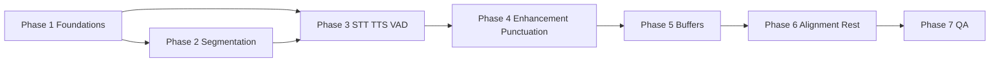

# High-Level Plan: Public SDK Documentation Rework

**Status:** Draft  
**Goal:** Bring all **user-facing** docs under `docs/` (plus root `README.md`) in line with the canonical structure in `.cursor/rules/sdk-documentation-structure.mdc`, without unnecessarily touching `docs/migration/**` or `docs/internal/**` (those folders stay as-is unless explicitly requested).

**Standing rules for every phase:**

- Required spine: Introduction → Quick start → API reference → Types/constants → Error codes → Use case examples (`
` only in §6).
- **Additive rework:** keep feature-specific sections (e.g. `## Modes` in alignment); do not delete content solely for template fit.
- **API reference:** cross-check names, signatures, and exports against `src/` and `package.json` exports—existing markdown is often stale.
- Offline/streaming split where applicable; **`alignment-offline.md`** as single alignment surface until streaming ships.

---

## Phase 1 — Foundations & navigation

**Purpose:** Readers find the right doc before diving into features.

| Deliverable | Notes |
|-------------|--------|
| Root **`README.md`** | Short **memory / models / planning** teaser (bullets) + link to deep doc; doc index or table aligned with final filenames. |
| **`docs/memory-and-models.md`** (or final chosen name) | OOM awareness, model sizing, concurrent engines, buffers, offline vs streaming, relation to segmentation—high level only in README, detail here. |
| Optional **`docs/README.md`** | One-page map: feature pairs, segmentation guide, memory doc, model-setup—only if it reduces friction. |

**Exit criteria:** From README and optional docs index, every major feature surface is reachable by link; memory/OOM is visible early.

---

## Phase 2 — Cross-cutting: segmentation

**Purpose:** One canonical story for engine, links, maps, modes—so feature docs stay thin.

| Deliverable | Notes |
|-------------|--------|
| **`docs/segmentation-engine.md`** | Public guide: engine, `SegmentLink`, `SegmentLinkMap`, modes, lifecycle, links to buffer/feature docs as needed. Authoritative for integrators (not `docs/migration/` paths). |

**Exit criteria:** Feature reworks can link `## Segmentation` → this file without duplicating the full model.

---

## Phase 3 — Primary speech features (offline + streaming)

**Purpose:** Highest-traffic APIs documented to the full spine + verified API reference.

Suggested order (adjust if dependencies dictate):

1. **`stt-offline.md` / `stt-streaming.md`**
2. **`tts-offline.md` / `tts-streaming.md`**
3. **`vad-streaming.md`** (and offline usage notes if applicable within the same or sibling file per rule)

**Exit criteria:** Quick starts runnable against current exports; API sections cross-checked; segmentation subsection where supported.

---

## Phase 4 — Enhancement & punctuation

| Deliverable | Notes |
|-------------|--------|
| **`enhancement-offline.md` / `enhancement-streaming.md`** | Full spine; pipeline handles H3 on streaming. |
| **`punctuation-offline.md` / punctuation streaming doc** | Align filename with repo (`punctuation-streaming.md` or existing name—normalize during rework). |

**Exit criteria:** Same as Phase 3 for these surfaces.

---

## Phase 5 — Buffers & text/segment I/O

**Purpose:** Consistent buffer docs for apps composing pipelines.

| Deliverable | Notes |
|-------------|--------|
| **`audiobuffer-offline.md` / `audiobuffer-streaming.md`** | |
| **`textbuffer-offline.md` / `textbuffer-streaming.md`** | |
| **`segmentbuffer-offline.md` / `segmentbuffer-streaming.md`** | |

**Exit criteria:** Cross-links to STT/TTS/segmentation where relevant; API ref verified.

---

## Phase 6 — Alignment & remaining guides

| Deliverable | Notes |
|-------------|--------|
| **`alignment-offline.md`** | Preserve feature-specific sections (`## Modes`, etc.); streaming doc **not** added until product exists. |
| Single-file guides | **`fileio.md`**, **`extraction.md`**, **`audio-session.md`**, **`execution-providers.md`**, **`model-setup.md`**, **`model-languages.md`**, **`download-manager.md`**, **`hotwords.md`**, **`pcm-player.md`**, **`diarization.md`**, **`separation.md`**, **`disable-*.md`**, **`audio-conversion.md`**, **`KNOWN_ISSUES.md`**, etc. |

Apply the **same spine where it fits**; shorter guides may collapse sections (e.g. no full “Use case examples”) but must remain accurate and cross-checked where APIs are listed.

**Exit criteria:** No broken references to old paths (e.g. `alignment.md`); README lists alignment as offline-only.

---

## Phase 7 — Quality gate & consistency pass

**Purpose:** Ship-quality cohesion.

| Task | Notes |
|------|--------|
| Global link sweep | README ↔ docs; offline ↔ streaming siblings; segmentation links. |
| Terminology | Same terms for modes, handles, errors across features. |
| Error-code tables | Align with actual thrown codes per feature (cross-check `src/`). |
| Optional | Spell-check, code snippet compile-sanity (manual or scripted). |

**Exit criteria:** Team agrees docs are “release-ready” for the current SDK shape; rule file and this plan stay the reference for future edits.

---

## Dependency overview (mermaid)

**Parallelism:** Phase 2 can start after Phase 1’s navigation sketch is clear; Phases 3–6 can use segmentation doc from Phase 2 as soon as its first complete draft exists. Buffer docs (5) often benefit after speech features (3) are updated but can overlap.

---

## Out of scope (unchanged)

- **`docs/migration/**`** (except this planning file under `docs/migration/docs/`)
- **`docs/internal/**`**

---

## Revision log

| Date | Change |
|------|--------|
| (created) | Initial high-level phases |
| 2026-05-01 | Phase 3 TTS line item lists `tts-offline.md` / `tts-streaming.md` only |
