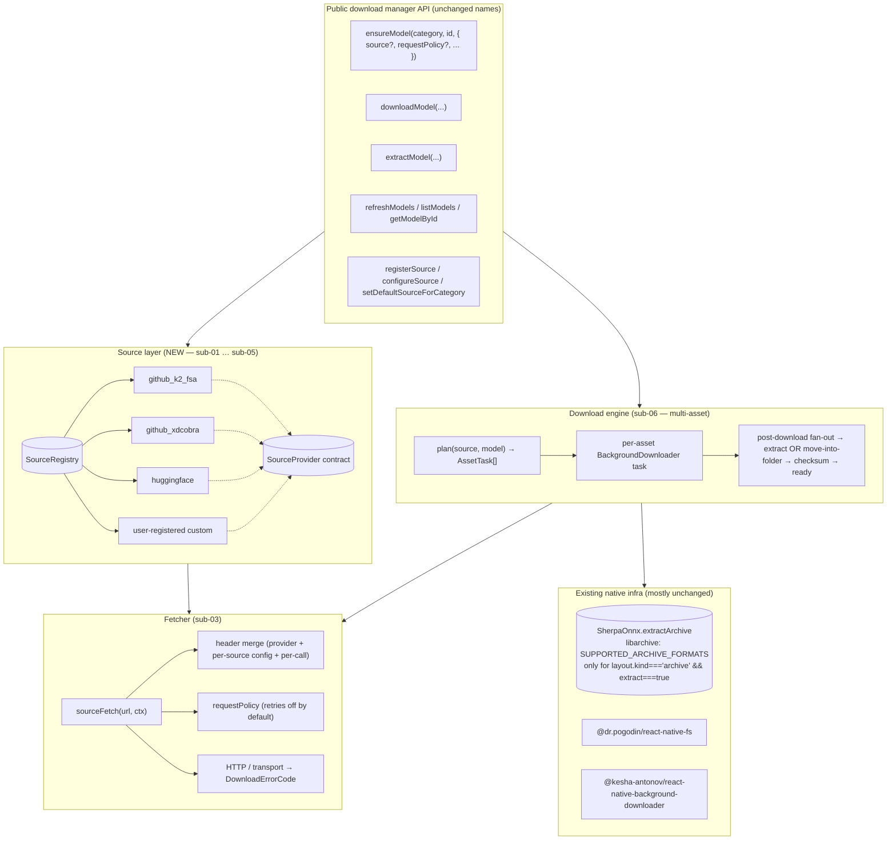

# Download Manager Rework — Implementation Overview

> Mirrors the structure of the Live Overload migration
> ([`docs/migration/liveOverload/live_overload_overview.md`](../liveOverload/live_overload_overview.md))
> and the Segmentation Engine migration
> ([`docs/migration/segmentationEngine/segmentation_engine_overview.md`](../segmentationEngine/segmentation_engine_overview.md)).

## Scope

Rework the **public download manager** (`react-native-sherpa-onnx/download`) so that it stops being hard-wired to **one** GitHub release source and instead drives every download through a small, well-typed **`SourceProvider`** abstraction:

- Multiple **built-in sources**: GitHub `k2-fsa/sherpa-onnx`, GitHub `XDcobra/react-native-sherpa-onnx`, and **Hugging Face**.
- **Custom sources** registered by SDK users (own mirror, internal release host, etc.).
- **Per-source archive layout** (single archive vs. multi-file folder), **per-source extract flag**, **per-source archive format** (must be supported by the native libarchive shim — the supported set is the intersection of filters registered by `ConfigureArchiveFormats` in `android/.../sherpa-onnx-archive-helper.cpp` and `ios/.../sherpa-onnx-archive-helper.mm` and decoders enabled by both `third_party/libarchive_prebuilt/build_libarchive_android.sh` and `…/build_libarchive_ios.sh`; see sub-04 → "Supported formats (source of truth)").
- **Archive-as-root invariant**: extraction happens only when the model's *single* asset *is* the archive that contains the model root. A folder-layout model that happens to ship a `.tar.bz2` inside a sub-directory is **never** unpacked by the engine (see sub-04 → "Archive-as-root invariant").
- **Per-source HTTP headers** (Hugging Face token, GitHub token to avoid rate limits, arbitrary headers for custom servers).
- **Deterministic error codes** (`DOWNLOAD_*`) so SDK consumers can branch on `error.code` without string matching.
- **Retry off by default**, opt-in via flag — no implicit retry loops anywhere in the new pipeline.
- **Cancellation + cleanup hardening** for the new multi-asset model.

The new abstraction is **purely additive at the public surface** — every existing top-level API name (`refreshModels`, `listModels`, `ensureModel`, `downloadModel`, `pauseDownload`, `resumeDownload`, `extractModel`, `deleteModel`, …) keeps its name and stays callable, but now takes an **optional `source`** argument (default = the built-in k2-fsa GitHub source per category, i.e. the current behaviour for everything except `Alignment`, which keeps defaulting to XDcobra).

Per the SDK status (public, **not yet released**), this is a **clean cut**: no legacy mirror code path or deprecation alias is kept. The new pipeline is the only pipeline.

---

## Files in this folder

All paths under `docs/migration/downloadManager/`:

| File | Content |
|---|---|
| [download_manager_overview.md](./download_manager_overview.md) | **This file** — problem statement, scope, IST/SOLL summary, phases. |
| [sub-01-source-contract.md](./sub-01-source-contract.md) | **Cross-source contract** — `SourceProvider`, `SourceModel`, `SourceAssetLayout`, `SourceFetchContext`, `DownloadErrorCode` constants, `DownloadError` class, no native changes. |
| [sub-02-source-registry-and-builtins.md](./sub-02-source-registry-and-builtins.md) | **Source registry + built-in GitHub providers** — `registerSource`, `getSource`, `listBuiltinSources`, `setDefaultSourceForCategory`. Built-in `github_k2_fsa` and `github_xdcobra` providers behind the new contract (replacing today's hard-coded `CATEGORY_CONFIG`). |
| [sub-03-fetcher-and-headers.md](./sub-03-fetcher-and-headers.md) | **HTTP fetcher + headers + retry policy** — shared `sourceFetch(url, ctx)` helper, header merge order, `requestPolicy: { retries: 0, ... }` defaults, deterministic mapping from HTTP/transport failures to `DownloadErrorCode`. |
| [sub-04-archive-layout-and-extraction-flags.md](./sub-04-archive-layout-and-extraction-flags.md) | **Archive layout + dynamic extract flags** — generalize `archiveExt: 'tar.bz2' \| 'onnx'` to `SourceAssetLayout`, drive native extraction by `extract`/`format` from the source, hard-fail on unsupported formats with `DOWNLOAD_EXTRACT_UNSUPPORTED_FORMAT`. |
| [sub-05-huggingface-source.md](./sub-05-huggingface-source.md) | **Hugging Face source** — `huggingface` built-in source, `siblings`-based listing, per-file `resolve/main/<path>` download URLs, optional HF token, repo-rev pinning, multi-file folder layout. |
| [sub-06-download-pipeline-rework.md](./sub-06-download-pipeline-rework.md) | **Multi-asset download engine** — refactor `downloadTask.ts` to drive a list of assets (atomic temp dir → rename pattern), cancellation/cleanup hardening, ready-marker semantics for multi-file folder models, post-download processing fan-out. |
| [sub-07-registry-and-cache-rework.md](./sub-07-registry-and-cache-rework.md) | **Source-aware registry + cache + paths** — cache namespaced per source, `ModelMeta` gains `sourceId` + `layout`, paths rework (`getModelDir`, `getArchivePath` source-aware), deterministic disk layout. |
| [sub-08-cleanup-and-test-harness.md](./sub-08-cleanup-and-test-harness.md) | **Cleanup, parity audit, test matrix, example app + docs** — update `docs/download-manager.md`, extend `example/src/screens/download-showcase/DownloadShowcaseScreen.tsx` with a source-picker, Jest matrix per source, CHANGELOG breaking entry. |
| [execution-prompt.md](./execution-prompt.md) | **Execution prompt** — the prompt to feed the implementing agent. Self-contained: cross-references, all relevant files, the start-to-finish rule, the per-phase IST/SOLL check rule. |
| [voicelab-source-picker-implementation-prompt.md](./voicelab-source-picker-implementation-prompt.md) | **VoiceLab app integration** — UX spec + implementation prompt for per-category source picker (GitHub / Hugging Face / Custom) in `voicelab-app`. |
| [voicelab-huggingface-github-mirror-crossmatch-prompt.md](./voicelab-huggingface-github-mirror-crossmatch-prompt.md) | **VoiceLab Hugging Face cross-match** — prompt for deriving HF availability from GitHub assets via HF existence probing + caching + progress UI (VoiceLab-only, no SDK helper). |
| [voicelab-custom-huggingface-import-prompt.md](./voicelab-custom-huggingface-import-prompt.md) | **VoiceLab Custom Hugging Face import** — prompt for importing a single HF model by URL into a chosen category and serving it via a local custom provider. |
| [voicelab-final-execution-prompt.md](./voicelab-final-execution-prompt.md) | **VoiceLab final execution** — one prompt that executes all VoiceLab integration docs end-to-end (source picker + HF mirror + HF import + custom URL). |

---

## IST-Zustand (current state)

Anchored in the current code on `main` (paths relative to repo root):

| Concern | Today |
|---|---|
| Source selection | **Hard-coded.** `src/download/constants.ts` exports `RELEASE_API_BASE = 'https://api.github.com/repos/k2-fsa/sherpa-onnx/releases/tags'`. Only `ModelCategory.Alignment` has a per-category override (`XDcobra/react-native-sherpa-onnx`) in `src/download/paths.ts → CATEGORY_CONFIG[Alignment].releaseApiBase`. |
| Listing | `src/download/registry.ts → refreshModels()` does `fetch(getReleaseUrl(category))`, expects a `{ assets: ReleaseAsset[] }` body, filters by hardcoded `isAssetSupportedForCategory(...)`. |
| Asset shape | Every asset is **one** GitHub release asset: either a `.tar.bz2` archive **or** a single `.onnx` file. `ModelMeta.archiveExt: 'tar.bz2' \| 'onnx'`. No multi-file model concept. |
| Checksums | Single `checksum.txt` per release tag, fetched in `fetchChecksumsFromRelease`. |
| Headers | None. `fetch(...)` calls have no auth, no rate-limit token. |
| Retry | Implicit. `retryWithBackoff` defaults to `maxRetries: 3` for registry/checksums; `downloadModel` defaults to `maxRetries: 2`; `refreshModels` re-tries on every call. **Not** opt-in. |
| Error surface | Plain `Error('Failed to fetch models: <status>')` etc. No typed codes consumers can branch on. `PauseError` exists for the explicit-pause case, `AbortError` for `AbortSignal`. |
| Layout | Two implicit shapes only: archive (`.tar.bz2` extracted to `getModelDir(category, id)`) or single ONNX (placed inside `getModelDir(...)`). |
| Native extraction | `src/extraction/extractTarBz2.ts` + native `extractArchive` configures libarchive via `archive_read_support_format_tar` + filters `bzip2`, `gzip`, `xz`, `zstd` (see `android/.../sherpa-onnx-archive-helper.cpp` and `ios/.../sherpa-onnx-archive-helper.mm`). Which of those filters actually decode is governed by the libarchive build scripts. **Capability exists** but the JS layer only exposes `tar.bz2` and is hard-coupled to "the model is an archive". |
| Cleanup | `cleanupCanceledDownload` removes `statePath`, archive file (or model dir for ONNX), native asset extracted mirror, and the ready marker. Single-asset assumption. |

## SOLL-Zustand (target state)

Same surface, source-aware internals:

| Concern | Target |
|---|---|
| Source selection | Pluggable. Every public function accepts an optional `source?: SourceId \| 'default'`. Default per category is set via `setDefaultSourceForCategory(category, sourceId)` and ships preconfigured to `github_k2_fsa` (except `Alignment` → `github_xdcobra`). |
| Listing | Delegated to `SourceProvider.listModels(category, ctx)`. Provider implementations decide how to enumerate (GitHub release assets, Hugging Face `siblings`, etc.). The registry only orchestrates: provider → `SourceModel[]` → cache → `ModelMeta[]`. |
| Asset shape | `SourceModel.layout: { kind: 'archive', format, extract } \| { kind: 'folder', format: 'none', extract: false }` + `assets: SourceAssetEntry[]`. Multi-file folder models are first-class. |
| Checksums | Provider-supplied. GitHub source keeps `checksum.txt`; Hugging Face source uses per-blob sha256 from the `siblings` API when present; custom sources can ship checksums via the asset entry's `sha256`. |
| Headers | Per source via `SourceProvider.resolveHeaders(ctx)`. Tokens (HF, GitHub) and arbitrary headers configurable via `configureSource(sourceId, { headers, token })`. Used both for **listing** and **downloading**. |
| Retry | **Off by default.** `RequestPolicy.retries = 0`. Callers opt in via `{ requestPolicy: { retries: N, backoffMs: M } }` on `refreshModels`/`downloadModel`/`ensureModel`. No internal silent retries elsewhere. |
| Error surface | New `DownloadError extends Error` with `code: DownloadErrorCode` and `source?: SourceId`. Code set covers `DOWNLOAD_UNKNOWN_SOURCE`, `DOWNLOAD_SOURCE_LIST_FAILED`, `DOWNLOAD_SOURCE_AUTH_FAILED`, `DOWNLOAD_NETWORK_FAILED`, `DOWNLOAD_HTTP_STATUS`, `DOWNLOAD_INTEGRITY_CHECKSUM_MISMATCH`, `DOWNLOAD_INTEGRITY_TRUNCATED`, `DOWNLOAD_EXTRACT_FAILED`, `DOWNLOAD_EXTRACT_UNSUPPORTED_FORMAT`, `DOWNLOAD_DISK_SPACE_INSUFFICIENT`, `DOWNLOAD_CANCELLED`, `DOWNLOAD_PAUSED`, `DOWNLOAD_INVALID_LAYOUT`. `PauseError` and abort behaviour are retained as instances/code wrappers. |
| Layout | Driven by `SourceModel.layout`: archive → existing extract path with format dispatch; folder → multi-file fan-out into `getModelDir(...)`. |
| Native extraction | JS exposes `SourceArchiveFormat = SUPPORTED_ARCHIVE_FORMATS` (intersection of native helper filters × libarchive build-script decoders — see sub-04 → "Supported formats (source of truth)"). Anything else throws `DOWNLOAD_EXTRACT_UNSUPPORTED_FORMAT` at planning time. Extraction is gated by the **archive-as-root invariant**: only `layout.kind === 'archive' && layout.extract === true` triggers `extractArchive`; folder layouts never extract — even if an asset is named `…/foo.tar.bz2`. |
| Cleanup | New multi-asset cleanup tracks every started asset's temp path. Atomic ready marker only written after **all** assets are present and (when applicable) extraction completed. |

---

## Architecture (target)

Mental model:

- A **source** owns the question *"what models exist?"* and *"where do I fetch each piece?"*.
- The **download engine** owns *"how do I get those pieces to disk safely, with cancel, cleanup, and atomic readiness?"*.
- The **fetcher** owns *"every HTTP call, with the right headers and the right retry policy."*
- The **registry + paths** layer keeps everything per-(source, category, modelId) addressable.

---

## Migration order (phases)

Each phase ships independently and is verified in isolation before moving to the next. After each phase, the implementer compares **IST vs. SOLL** against this overview and the corresponding sub-plan acceptance criteria; any deviation is implemented immediately, **before** advancing.

| Phase | Sub-plan | Scope | Acceptance |
|---|---|---|---|
| **Phase 1** | [sub-01](./sub-01-source-contract.md) | JS-only foundation: `SourceProvider`, `SourceModel`, `SourceAssetLayout`, `SourceFetchContext`, `DownloadError`, `DownloadErrorCode`. Public re-exports from `src/download/index.ts`. No behavioural change yet. | TS compiles. Public re-exports stable. Jest unit tests cover the error class and the type-guards. Existing `downloadModel`/`refreshModels`/… still pass their current tests (no regression). |
| **Phase 2** | [sub-02](./sub-02-source-registry-and-builtins.md) | `registerSource`, `getSource`, `setDefaultSourceForCategory`, `listBuiltinSources`, `configureSource`. Built-in `github_k2_fsa` and `github_xdcobra` providers replace `RELEASE_API_BASE` + `CATEGORY_CONFIG.releaseApiBase`. `Alignment` defaults to `github_xdcobra`; everything else to `github_k2_fsa`. | Existing tests still green (default routing matches old behaviour). New tests: register/unregister, default override, `configureSource({ headers })` propagation. Manual smoke: `refreshModels(ModelCategory.Alignment)` still hits XDcobra. |
| **Phase 3** | [sub-03](./sub-03-fetcher-and-headers.md) | Replace direct `fetch(...)` + `retryWithBackoff(...)` with `sourceFetch(url, ctx, opts)`. Default `RequestPolicy = { retries: 0 }`. Add typed `DownloadError` mapping (`DOWNLOAD_NETWORK_FAILED`, `DOWNLOAD_HTTP_STATUS`, `DOWNLOAD_SOURCE_AUTH_FAILED`). Tokens + arbitrary headers via `configureSource`. | Jest matrix on `sourceFetch`: 200 happy path, 401 → `DOWNLOAD_SOURCE_AUTH_FAILED`, 429 + retries=0 → no retry, 429 + retries=3 → 3 retries then `DOWNLOAD_HTTP_STATUS`, network drop → `DOWNLOAD_NETWORK_FAILED`. `refreshModels` no longer retries silently when `requestPolicy` is unset. |
| **Phase 4** | [sub-04](./sub-04-archive-layout-and-extraction-flags.md) | Generalize `ModelMeta.archiveExt` to `SourceAssetLayout`. `extractTarBz2.ts` callers branch on `format`. Reject unknown formats with `DOWNLOAD_EXTRACT_UNSUPPORTED_FORMAT`. Per-source `extract: false` is honored: archive is stored as-is, no unpacking. | Jest: archive layout with `extract: true, format: 'tar.bz2'` → unpacks (existing behaviour). Archive layout with `extract: false` → file is downloaded but ready marker is written next to the archive, no extraction. Layout with unsupported `format: 'zip'` (today) → `DOWNLOAD_EXTRACT_UNSUPPORTED_FORMAT` thrown at planning time. |
| **Phase 5** | [sub-05](./sub-05-huggingface-source.md) | Built-in `huggingface` provider. Discovers models via the configured `repos` list (allow-list to keep parity with the GitHub release approach). `listModels` returns `SourceModel { layout: { kind: 'folder' }, assets: [...] }` from the `siblings` array. Per-file download URLs use `https://huggingface.co/<repo>/resolve/<rev>/<path>`. Token routed through `configureSource('huggingface', { token })`. | Jest with mocked HF API: lists files for a configured repo, returns one `SourceModel` per allowed model spec, asset entries point at `resolve/main/<file>`. Smoke: `ensureModel({ source: 'huggingface', ... })` for a small allowlisted model downloads every asset under `getModelDir(...)` and writes ready marker. |
| **Phase 6** | [sub-06](./sub-06-download-pipeline-rework.md) | Refactor `downloadTask.ts` + `modelExtraction.ts` to drive `SourceModel.assets[]` instead of one archive. Atomic *temp folder → final folder* rename on success; on cancel/error, the temp folder is removed. Progress is **aggregated** across assets. Pause/resume continue to work for both archive layout (existing) and folder layout (new). `PauseError`, `AbortError` semantics preserved. | Cross-layout Jest matrix: archive happy path; folder happy path with 3 files; cancel mid-folder-fetch → temp folder removed, no ready marker; pause + resume archive download (existing); pause + resume folder download (new). |
| **Phase 7** | [sub-07](./sub-07-registry-and-cache-rework.md) | `ModelMeta` gains `sourceId` + `layout` + asset summary. Cache file path namespaced per source: `cache/{sourceId}/{category}.json`. Paths layer (`getModelDir`, `getReadyMarkerPath`, …) becomes source-aware: model dir is `…/sherpa-onnx/models/{sourceId}/{category}/{modelId}/`. Migration of legacy paths is **not** required (pre-release SDK; existing on-device caches are wiped on first run via a one-shot purge of the legacy directory). | `getModelsCacheStatus(category, { source })` returns per-source timestamp. Two sources can hold the same `modelId` independently. No collisions in tests. Disk layout matches the new spec. |
| **Phase 8** | [sub-08](./sub-08-cleanup-and-test-harness.md) | Update `docs/download-manager.md` (new source picker section + per-source examples). Extend `example/src/screens/download-showcase/DownloadShowcaseScreen.tsx` with a source dropdown next to the category picker. Cross-source parity audit. CHANGELOG entry (breaking, since `ModelMeta.archiveExt` is replaced by `layout`). | CI green on Android + iOS. Example app demoes downloading the **same** model id (where the same id exists on multiple sources) from both GitHub k2-fsa **and** Hugging Face. All parity audit boxes ticked. |

---

## Design decisions (anchored from the user's requirements)

> [!IMPORTANT]
> - **One `SourceProvider` contract.** All source-specific quirks live behind the provider — the download engine never sniffs URLs or names.
> - **Built-in + custom on the same contract.** `github_k2_fsa`, `github_xdcobra`, and `huggingface` are *just* registered providers; SDK users register their own with the same shape.
> - **Default-source-per-category** preserves today's behaviour (XDcobra for Alignment, k2-fsa for everything else) without leaking source identity into the rest of the API.
> - **Retry off by default.** No `retryWithBackoff(...)` left in the production path of `refreshModels` / `downloadModel` / `ensureModel` unless the caller opts in via `requestPolicy.retries`.
> - **One error class, deterministic codes.** `DownloadError.code: DownloadErrorCode` is the **only** stable error contract — string matching is never the recommended approach. `PauseError` and abort behaviour remain (they predate the rework and are widely consumed).
> - **Per-source headers.** Tokens (HF, GitHub) and arbitrary headers are configured via `configureSource(sourceId, { headers, token })` and merged at fetch time. Per-call header overrides via the request options are permitted, but they **augment** (not replace) source-level headers.
> - **Format gate at planning time.** A `SourceModel` whose layout requests a format the native extractor can't handle is rejected with `DOWNLOAD_EXTRACT_UNSUPPORTED_FORMAT` **before** any byte hits disk. The accepted set is mechanically derived from the native helper + build scripts (see sub-04).
> - **Archive-as-root invariant.** Extraction is a property of the **model**, not of any individual file. `extractArchive` only runs when the model's single asset *is* the archive. Folder-layout assets are written as-is — a `.tar.bz2` sibling of `model.onnx` is **not** unpacked, ever.
> - **Atomic readiness for multi-file folders.** Temp folder → final folder rename is the only acceptable commit step for folder layouts. Crash mid-fetch leaves no half-installed model.
> - **Pre-release clean cut.** No alias for `ModelMeta.archiveExt`; the type is replaced by `layout`. No legacy mirror code path remains.

---

## Cross-source error contract

| Code | Where it fires | Notes |
|---|---|---|
| `DOWNLOAD_UNKNOWN_SOURCE` | `getSource(sourceId)` when not registered | Thrown synchronously from the public API entry point before any I/O. |
| `DOWNLOAD_SOURCE_LIST_FAILED` | `SourceProvider.listModels` failed for non-HTTP reasons (e.g. malformed response body) | Wraps the provider's error via `cause`. |
| `DOWNLOAD_SOURCE_AUTH_FAILED` | HTTP 401/403 from fetcher | Caller is expected to configure a token. |
| `DOWNLOAD_NETWORK_FAILED` | Transport-level failure (DNS, TLS, ECONNREFUSED, etc.) | Reason carried via `cause`. |
| `DOWNLOAD_HTTP_STATUS` | Any other non-2xx | `error.status: number` populated. |
| `DOWNLOAD_INTEGRITY_CHECKSUM_MISMATCH` | sha256 mismatch after fetch/extract | Replaces today's plain `Error('Checksum verification failed...')`. |
| `DOWNLOAD_INTEGRITY_TRUNCATED` | Archive smaller than declared bytes | Replaces today's `'Archive is truncated...'` error. |
| `DOWNLOAD_EXTRACT_FAILED` | Native extraction errored | `cause` carries native message. |
| `DOWNLOAD_EXTRACT_UNSUPPORTED_FORMAT` | `SourceAssetLayout.format` not in `SUPPORTED_ARCHIVE_FORMATS` | Planning-time guard. |
| `DOWNLOAD_DISK_SPACE_INSUFFICIENT` | `checkDiskSpace` failure | Renames today's plain error. |
| `DOWNLOAD_CANCELLED` | `AbortSignal` aborts a planned operation | Still surfaced as an `AbortError`-named DownloadError; consumers can branch on either `error.name === 'AbortError'` (existing) or `error.code === 'DOWNLOAD_CANCELLED'` (new). |
| `DOWNLOAD_PAUSED` | Explicit `pauseDownload` / `pauseExtraction` | Co-existence with `PauseError`: `PauseError` remains the thrown instance for backward-source-agnostic match; its prototype is updated to also satisfy `error.code === 'DOWNLOAD_PAUSED'`. |
| `DOWNLOAD_INVALID_LAYOUT` | Provider returned a `SourceModel` whose `layout` is inconsistent (e.g. `kind: 'archive'` with `> 1 asset`) | Planning-time guard. |

> The error contract is **finalised in sub-01** and frozen across phases. Sub-plans for downstream phases extend behaviour but **never** add new codes (or reuse codes for different meanings) without an explicit revision of this overview.

---

## What is **not** in scope

- **Native libarchive feature expansion** — we expose only the filters that are already registered by the native helper *and* enabled by both libarchive build scripts (`build_libarchive_android.sh`, `build_libarchive_ios.sh`). Adding a new compression filter (`zip`, `7z`, etc.) is out of scope; the format gate explicitly rejects them. Enabling an additional filter is a deliberate paired change in: native helper + both build scripts + `SourceArchiveFormat` union + `SUPPORTED_ARCHIVE_FORMATS` constant.
- **In-place model upgrades** — a model whose source/checksum changed upstream is treated as a fresh model by id; the manager does **not** attempt to delta-patch.
- **Cross-source model identity mapping** — the same logical model on `github_k2_fsa` and `huggingface` is two different `(sourceId, modelId)` pairs as far as the registry, paths, and ready markers are concerned. Application code can map them at its layer.
- **Streaming partial extraction across sources** — folder layouts are eagerly fully fetched then committed atomically; we do not stream-decode files mid-fetch.

---

## Definition of done (rollout-wide)

- [ ] Phases 1–8 all green on CI (Jest matrix + Android + iOS native build).
- [ ] `docs/download-manager.md` regenerated with: source picker, per-source examples (GitHub k2-fsa, GitHub XDcobra, Hugging Face, custom server), header/token guide, error code table.
- [ ] CHANGELOG entry marks the breaking change to `ModelMeta` (`archiveExt` → `layout`).
- [ ] Example showcase screen lets the tester switch source per category and download a known model from each.
- [ ] No `retryWithBackoff` call survives in the production code path of `refreshModels` / `downloadModel` / `ensureModel` / `extractModel` unless a caller-supplied `requestPolicy.retries > 0` is in effect.
- [ ] No code path constructs a plain `Error('Failed to ...')` for a download failure that maps to a defined `DownloadErrorCode`.
- [ ] No legacy `RELEASE_API_BASE` constant or per-category `releaseApiBase` override remains.
- [ ] After each phase, an IST/SOLL review was performed (see `execution-prompt.md`) and any deviation was implemented before advancing.
