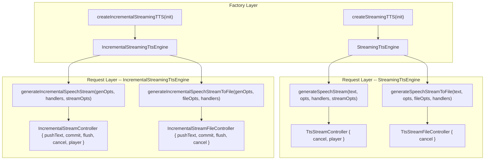

# Incremental TTS API Redesign: Request-Centric Pattern

## Motivation

The current `IncrementalStreamingTtsEngine` is session-centric: `createIncrementalStreamingTTS` returns an engine with `pushText`, `commit`, `flush` directly on it, and callbacks are passed at factory creation time. This diverges from `StreamingTtsEngine` where the factory creates an engine and per-request methods (`generateSpeechStream`, `generateSpeechStreamToFile`) accept handlers and return controllers.

The new design aligns both APIs structurally, making the SDK consistent and intuitive. No backward compatibility is needed since incremental support was never released.

## Target API Shape



### Factory: `createIncrementalStreamingTTS(options)`

```typescript
interface IncrementalStreamingTtsFactoryOptions {
  source: IncrementalStreamingTtsSource; // existing engine or engineOptions
  segmentation?: SegmentationPolicy;     // shared across requests
  queue?: QueuePolicy;                   // shared across requests
}

interface IncrementalStreamingTtsEngine {
  readonly instanceId: string;

  generateIncrementalSpeechStream(
    options: TtsGenerationOptions | undefined,
    handlers: IncrementalStreamHandlers,
    streamOptions?: TtsStreamOptions,
    incrementalOptions?: IncrementalRequestOptions
  ): IncrementalStreamController;

  generateIncrementalSpeechStreamToFile(
    options: TtsGenerationOptions | undefined,
    fileOptions: TtsStreamToFileOptions,
    handlers: IncrementalStreamToFileHandlers,
    incrementalOptions?: IncrementalRequestOptions
  ): IncrementalStreamFileController;

  getModelInfo(): Promise<TTSModelInfo>;
  getSampleRate(): Promise<number>;
  getNumSpeakers(): Promise<number>;
  destroy(): Promise<void>;
}
```

Key design decisions:
- `segmentation` and `queue` at factory level (shared default for all requests)
- `IncrementalRequestOptions` allows per-request override of segmentation/queue + session/segment event callbacks
- Only one active request at a time (throws if called while another is active; underlying `StreamingTtsEngine` constraint)
- `text` is NOT passed at request start (it arrives via `pushText` on the controller)

### Per-request handlers

Extend `TtsStreamHandlers` / `TtsStreamToFileHandlers` with incremental events:

```typescript
interface IncrementalStreamHandlers extends TtsStreamHandlers {
  onSessionEvent?: (event: SessionEvent) => void;
  onSegmentEvent?: (event: SegmentEvent) => void;
  onMetrics?: (metrics: IncrementalMetrics) => void;
}

interface IncrementalStreamToFileHandlers extends TtsStreamToFileHandlers {
  onSessionEvent?: (event: SessionEvent) => void;
  onSegmentEvent?: (event: SegmentEvent) => void;
  onMetrics?: (metrics: IncrementalMetrics) => void;
}
```

Top-level `onChunk`/`onEnd`/`onError` work at the session level:
- `onChunk`: delivers chunks from the currently active segment (when `emitChunks: true`)
- `onEnd`: fires when `flush()` resolves (all segments complete)
- `onError`: fires on segment errors (engine continues with next segment)

### Controllers

```typescript
interface IncrementalStreamController {
  pushText(text: string): void;
  commit(options?: CommitOptions): void;
  flush(options?: FlushOptions): Promise<void>;
  cancel(options?: CancelOptions): Promise<void>;
  getMetrics(): IncrementalMetrics;
  readonly player: PcmPlayer | null; // proxy over active segment player
  readonly state: SessionState;
}

interface IncrementalStreamFileController {
  pushText(text: string): void;
  commit(options?: CommitOptions): void;
  flush(options?: FlushOptions): Promise<void>;
  cancel(options?: CancelOptions): Promise<void>;
  getMetrics(): IncrementalMetrics;
  readonly state: SessionState;
}
```

### Commit semantics (clarified)

`commit()` is a **force trigger**, not a required step for normal generation.

- `pushText()` only appends input to the request buffer.
- Speech starts automatically when auto-segmentation finds a boundary (punctuation, length limit, or timeout).
- `commit()` forces the current buffer to be enqueued immediately, even if no boundary is detected yet.
- `flush()` performs an implicit forced commit of remaining text and waits until all queued/active segments finish.

Behavior matrix:

- **Only `pushText()` with detectable boundaries** -> speech is generated automatically.
- **`pushText()` without boundaries, but timeout enabled** -> speech starts when timeout triggers forced segmentation.
- **`pushText()` without boundaries and no timeout** -> no generation until `commit()` or `flush()`.
- **`commit()`** -> immediate enqueue/start path for current buffered text.

### Player Proxy (playback: true)

When `streamOptions.playback` is `true`, `IncrementalStreamController.player` returns a **proxy PcmPlayer** that:
- Delegates `pause()`/`resume()` to the currently active segment's native player
- Maintains internal `isPaused` flag; when a new segment starts, if `isPaused`, the new segment's player is immediately paused
- `destroy()` on the proxy triggers `cancel({ scope: 'all' })`

This gives the user a single, stable `player` reference for the entire incremental session.

### File output strategy (`generateIncrementalSpeechStreamToFile`)

Each committed segment is dispatched via `streamingEngine.generateSpeechStreamToFile(...)` to a **temporary WAV file**. On `flush()`, temp files are concatenated into the final output path. Temp files are cleaned up after concatenation or on cancel/destroy.

## Files to Change

### 1. [src/tts/incremental/types.ts](src/tts/incremental/types.ts) -- Full rewrite

- Remove old `IncrementalStreamingTtsEngine` (session-centric) interface
- Add `IncrementalStreamingTtsEngine` (factory interface with `generateIncrementalSpeechStream`, `generateIncrementalSpeechStreamToFile`, passthrough model info methods, `destroy`)
- Add `IncrementalStreamingTtsFactoryOptions` (replaces `IncrementalStreamingTtsOptions`; no handlers/streamOptions/genOptions at factory level)
- Add `IncrementalRequestOptions` (optional per-request segmentation/queue override + event callbacks)
- Add `IncrementalStreamHandlers` (extends `TtsStreamHandlers`)
- Add `IncrementalStreamToFileHandlers` (extends `TtsStreamToFileHandlers`)
- Add `IncrementalStreamController` interface
- Add `IncrementalStreamFileController` interface
- Keep existing `SegmentationPolicy`, `QueuePolicy`, `SessionEvent`, `SegmentEvent`, `IncrementalMetrics`, `CommitOptions`, `CancelOptions`, `FlushOptions`, `SessionState`, `SessionId`, `SegmentId` types unchanged

### 2. [src/tts/incremental/engine.ts](src/tts/incremental/engine.ts) -- Major refactor

- `createEngine` now returns the factory `IncrementalStreamingTtsEngine` with `generateIncrementalSpeechStream` and `generateIncrementalSpeechStreamToFile`
- Move the current queue/segmentation/dispatch loop into a per-request function that returns an `IncrementalStreamController` or `IncrementalStreamFileController`
- Add player proxy logic: create a proxy `PcmPlayer` that tracks the active segment's controller and maintains pause state
- Add file controller logic: dispatch segments to temp files, concatenate on flush
- Track whether a request is active; throw on concurrent requests

### 3. [src/tts/incremental/index.ts](src/tts/incremental/index.ts) -- Update factory + exports

- `createIncrementalStreamingTTS` signature changes to accept `IncrementalStreamingTtsFactoryOptions`
- Return type becomes the new `IncrementalStreamingTtsEngine`
- Update all public type re-exports (remove old types, add new controller types and handler types)

### 4. [src/tts/incremental/events.ts](src/tts/incremental/events.ts) -- No changes

Event factory functions and types remain as-is.

### 5. [src/tts/incremental/segmenter.ts](src/tts/incremental/segmenter.ts) -- No changes

Segmentation logic is pure and reusable.

### 6. [src/tts/incremental/policies.ts](src/tts/incremental/policies.ts) -- No changes

Queue policies are pure and reusable.

### 7. [src/tts/incremental/__tests__/engine.test.ts](src/tts/incremental/__tests__/engine.test.ts) -- Full rewrite

- Update to match new API: create engine, call `generateIncrementalSpeechStream`, interact with controller
- Test lifecycle: idle state, pushText/commit/flush/cancel on controller, destroy on engine
- Test player proxy: pause/resume propagation, cross-segment pause state
- Test concurrent request rejection
- Test file controller variant (temp file concat mock)

### 8. [src/tts/streamingTypes.ts](src/tts/streamingTypes.ts) -- No changes

The `StreamingTtsEngine` interface stays unchanged.

### 9. [src/tts/index.ts](src/tts/index.ts) -- Update re-exports

- Replace old incremental type exports with new ones (`IncrementalStreamingTtsFactoryOptions`, `IncrementalStreamController`, `IncrementalStreamFileController`, `IncrementalStreamHandlers`, `IncrementalStreamToFileHandlers`, `IncrementalRequestOptions`)
- Remove removed types from the export list

### 10. [docs/tts-streaming.md](docs/tts-streaming.md) -- Update Quick Start + API Reference

- Rewrite Quick Start example 4 (incremental text feeding) to use new request-centric API
- Update the "Choosing a streaming path" table if needed
- Update API Reference for `IncrementalStreamingTtsEngine` and controllers
- Update the Types tables for incremental streaming

### 11. [docs/migration/tts-incremental-text-feeding-plan.md](docs/migration/tts-incremental-text-feeding-plan.md) -- Update architecture description

- Update "Proposed Public API" section to reflect request-centric pattern
- Update data flow diagram

## Usage Example (target)

```typescript
import { createIncrementalStreamingTTS } from 'react-native-sherpa-onnx/tts';

// 1. Create factory
const inc = await createIncrementalStreamingTTS({
  source: { engineOptions: { modelPath: { type: 'asset', path: 'models/vits-piper-en' } } },
  segmentation: { maxCharsPerSegment: 220, minCharsPerSegment: 24, maxWaitMs: 900 },
});

// 2. Start a request with native playback
const ctrl = inc.generateIncrementalSpeechStream(
  { sid: 0, speed: 1.0 },
  {
    onChunk: (c) => { /* waveform viz */ },
    onEnd: () => console.log('All segments done'),
    onError: (e) => console.error(e.message),
    onSessionEvent: (e) => console.log(e.type),
    onSegmentEvent: (e) => { if (e.type === 'segment:dropped') console.warn(e.reason); },
  },
  { playback: true, emitChunks: true }
);

// 3. Push text progressively
ctrl.pushText('Hello Michael. ');
ctrl.pushText('The weather today was amazing. ');
ctrl.commit();

// 4. Player control (works across segments)
await ctrl.player?.pause();
await ctrl.player?.resume();

// 5. Finish
await ctrl.flush();

// 6. Cleanup
await inc.destroy();
```
