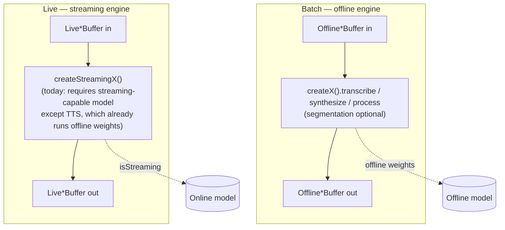
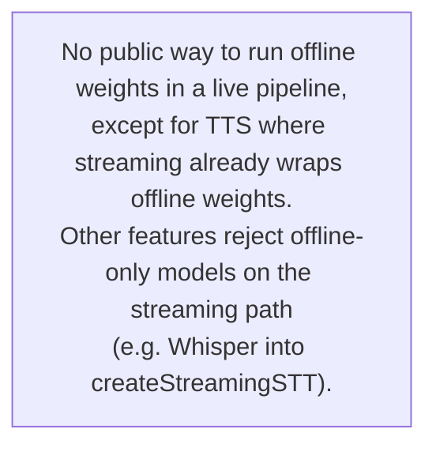

# SDK extension: offline engines in live pipelines via mandatory segmentation

**Status:** Design note — not implemented. Pre-release SDK; public API still in flux.
**Scope:** Feature-agnostic. Let any feature whose **offline batch engine** owns the model also be **consumed by a live pipeline** (live-buffer in / live-buffer out) when a **segmentation policy is provided**. Execution stays **pipeline/segment-driven**, not "real" online decoding.
**Reference feature:** STT (this doc grew out of an STT discussion); the same shape applies to other features that today only expose a batch path on offline weights.

**Out of scope:** The example app pipeline-showcase split (already shipped); see [pipeline-showcase-offline-live-rework.md](./pipeline-showcase-offline-live-rework.md) only as historical context.

**Related:** [Offline STT](../stt-offline.md), [Streaming STT](../stt-streaming.md), [Offline TTS](../tts-offline.md), [Segmentation engine](../segmentation-engine.md), [offline vs streaming model guards](./offline-streaming-model-engine-mismatch-guards.md).

---

## 1. Today's structure (critical analysis)

The SDK today exposes two engine factories per feature where both modes are needed:

- **Offline (batch) engine** — `createSTT`, `createTTS`, `createPunctuation`, `createEnhancement`, …
  Owns **offline weights**. Public method shape: `transcribe(OfflineAudioBuffer, OfflineTextBuffer, …)` / `synthesize(OfflineTextBuffer, OfflineAudioBuffer, …)` / `process(OfflineXBuffer, OfflineYBuffer, …)`.
  Today already supports **optional segmentation** to lower peak RAM on long offline inputs.

- **Streaming (live) engine** — `createStreamingSTT`, `createStreamingTTS`, `createStreamingPunctuation`, `createStreamingEnhancement`, …
  Owns whichever weights the live pipeline supports. Public method shape: `xxx(LiveXBuffer, LiveYBuffer, …)` returning a pipeline handle (`stop` / `flush` / `reset` / `getStatus`).

There is one important asymmetry already inside the SDK:

- **Streaming TTS** is initialized with `initializeTts(...)` — the **same offline `OfflineTts`** as `createTTS`. The streaming TTS pipeline drains **committed text segments** from a `LiveTextBuffer` (driven by a segmentation engine on the buffer) and synthesizes per segment. It is **already** the "offline weights consumed live, driven by mandatory segmentation" pattern, just under the streaming-engine name.
- **Streaming STT** is the only feature that *requires* a streaming-capable model (`detectSttModel().isStreaming === true`) and uses `OnlineRecognizer`. Users with offline-only assets (e.g. Whisper) cannot run them in a live pipeline today.

So the gap is **per feature** wherever the streaming engine truly requires an online/streaming-capable model. The fix should be uniform across features and avoid adding a third "mixed" engine surface.

### 1.1 Today: supported paths (simplified)



### 1.2 Today: the cross-cutting gap



---

## 2. Design constraints (from product owner)

1. **Public SDK, pre-release** — small, conservative changes preferred; minimize churn for early users.
2. **No third "mixed" engine** — keep `createX` (offline) and `createStreamingX` (live) as the only engine factories per feature.
3. **Hidden complexity** — users keep working as they do today. Adding live-buffer support to an offline engine is just an **additional method overload** that asks for a **mandatory segmentation policy**.
4. **Feature-agnostic** — the same rule applies to every feature with both paths.
5. **Maximum code reuse** — share orchestration and native worker plumbing across features; don't fork pipeline plumbing per module.

---

## 3. Recommendation — Option A (offline engine gains a live-pipeline overload)

The offline engine's batch method gets a **second overload** that accepts **live buffers** and **requires** a `segmentation` policy. The offline engine's identity does not change: same factory, same model init, same `destroy()`. The only conceptual addition is "consume me from a live pipeline".

**Why this is the right pick (rejecting B and C):**

- **Option B** (extend `createStreamingX` to also accept offline weights) makes the streaming engine **polymorphic on weights kind**: `OnlineRecognizer` *or* `OfflineRecognizer` behind the same factory. That breaks the simple "streaming engine == online decoder" mental model and forces native init flows to bifurcate. Risky for a public API.
- **Option C** (new `createLiveOfflineX`) adds a third factory per feature. Bigger surface, more docs, more migration cost — exactly what the constraint forbids.
- **Option A** matches the **existing TTS streaming precedent** in spirit (offline weights, live consumption, mandatory segmentation), just located on the offline engine where the weights actually live. Native work is **additive**: a new worker variant and one new TurboModule call per feature, reusing the existing streaming-pipeline registry and segmentation engine on `LiveAudioBuffer` / `LiveTextBuffer`.

### 3.1 Target: per-feature surface

```mermaid
flowchart TB
  subgraph Off["Offline engine — createX()"]
    M[(Offline model)]
    M --> B1["transcribe / synthesize / process<br/>(Offline*, Offline*) — batch (today)"]
    M --> B2["transcribe / synthesize / process<br/>(Live*, Live*, segmentation: REQUIRED) — NEW"]
  end
  subgraph On["Streaming engine — createStreamingX() (unchanged)"]
    Mon[(Online model — STT, punctuation, enhancement, …)<br/>or offline weights for TTS today]
    Mon --> S1["xxx(Live*, Live*) — pipeline handle"]
  end
```

### 3.2 Target: data flow inside the new live overload

```mermaid
flowchart LR
  LIN[Live*Buffer in]
  SEG["Segmentation engine<br/>policy REQUIRED<br/>(speech_* on audio in, text_* on text in)"]
  DEC["Offline decoder per committed segment<br/>(reuses existing batch decode path)"]
  LOUT[Live*Buffer out<br/>(text segments / audio samples / …)]
  LIN --> SEG --> DEC --> LOUT
```

---

## 4. Concrete signatures

The TypeScript shapes below are **proposed** and meant to anchor the implementation. Each feature's offline engine adds **one method overload**; the existing batch overload is unchanged. Native shows the **STT** version; punctuation / enhancement / others follow the same template.

### 4.1 TypeScript — offline engine method overload (per feature)

`src/stt/types.ts` — extend `SttEngine`:

```ts
export interface SttLivePipelineOptions {
  segmentation: {                // REQUIRED for the live overload
    policy: SegmentationPolicy;  // speech_* policy
    mode?: 'auto';               // 'auto' is the only meaningful mode here
  };
  chunkSize?: number;            // worker drain chunk in samples; default 3200
  onSegment?: (segment: TextSegment) => void; // optional mirror of each committed segment
  // No onPartial: live-offline path is commit-only (§7.1). Partials are a true-streaming contract.
}

export interface SttEngine {
  readonly instanceId: string;

  // Existing batch overload (unchanged).
  transcribe(
    buffer: OfflineAudioBufferRef | OfflineBufferHandle | string,
    textOut: OfflineTextBufferRef | OfflineTextBufferHandle | string,
    options?: SttTranscribeOptions
  ): Promise<SttTranscribeResult>;

  // NEW live overload.
  transcribe(
    audioIn: LiveAudioBufferIdSource,
    textOut: LiveTextBufferIdSource,
    options: SttLivePipelineOptions          // REQUIRED — no overload without policy
  ): Promise<SttPipelineHandle>;             // reuse existing handle type

  setConfig(options: SttRuntimeConfig): Promise<void>;
  destroy(): Promise<void>;
}
```

`src/tts/types.ts` — same idea on `TtsEngine` (offline batch engine), giving offline TTS the same live-pipeline ergonomics that `createStreamingTTS` already has, but **without requiring** a separate streaming engine instance:

```ts
export interface TtsLivePipelineOptions {
  segmentation: {
    policy: SegmentationPolicy;  // text_* policy
    mode?: 'auto';
  };
  sid?: number;
  speed?: number;
  voiceClone?: TtsVoiceClone;
  onSegment?: (segment: SpeechSegment) => void;
}

export interface TtsEngine {
  readonly instanceId: string;

  // Existing batch overload (unchanged).
  synthesize(
    text: OfflineTextBufferRef | OfflineTextBufferHandle | string,
    audioOut: OfflineAudioBufferRef | OfflineBufferHandle | string,
    options?: TtsSynthesizeOptions
  ): Promise<TtsSynthesizeResult>;

  // NEW live overload.
  synthesize(
    textIn: LiveTextBufferIdSource,
    audioOut: LiveAudioBufferIdSource,
    options: TtsLivePipelineOptions
  ): Promise<TtsPipelineHandle>;

  destroy(): Promise<void>;
}
```

The same template applies to `PunctuationEngine`, `EnhancementEngine`, etc. Naming of the per-feature options interface follows `<Feature>LivePipelineOptions`.

> **Why a method overload, not a new factory or a flag?** It maps 1:1 to the user's intent ("this offline engine, consumed live"), keeps the type system honest about the **mandatory** policy, and stays additive — existing `await engine.transcribe(off, off)` keeps compiling and behaving identically.

### 4.2 Native bridge — `src/NativeSherpaOnnx.ts`

One new TurboModule call per feature. STT example:

```ts
/**
 * Start a live-offline pipeline driven by a segmentation engine on the LIVE audio buffer.
 * The offline recognizer is reused per committed speech segment.
 */
startSttOfflineLivePipeline(
  instanceId: string,                  // existing offline STT instance (createSTT)
  audioInLiveBufferId: string,
  textOutLiveBufferId: string,
  options: {
    segmentationPolicy: Object;        // already-marshalled policy (mirrors attachSegmentationEngine)
    chunkSize?: number;
  }
): Promise<{ pipelineId: string }>;
```

Pipeline lifecycle (`stopStreamingPipeline`, `flushStreamingPipeline`, `resetStreamingPipeline`, `getStreamingPipelineStatus`) is **reused as-is** — these are already feature-agnostic in the streaming pipeline registry.

### 4.3 Kotlin — Android

`SherpaOnnxOfflineSttLivePipelineHelper.kt` (new, sibling to `SherpaOnnxOnlineSttHelper.kt`):

```kotlin
internal class SherpaOnnxOfflineSttLivePipelineHelper(
  private val context: ReactApplicationContext,
  private val offlineSttRegistry: OfflineSttRegistry, // existing handle to OfflineRecognizer instances
) {
  fun startSttOfflineLivePipeline(
    instanceId: String,
    audioInLiveBufferId: String,
    textOutLiveBufferId: String,
    segmentationPolicy: ReadableMap,
    chunkSize: Int?,
    promise: Promise,
  ) {
    // 1. Resolve OfflineRecognizer from offlineSttRegistry[instanceId].
    // 2. Validate audio/text buffer kinds + recording state (same checks as startSttPipeline).
    // 3. Attach a *speech-domain* SegmentationEngine to audioInLiveBufferId via the existing
    //    SegmentationEngineRegistry.attach(...) used by attachSegmentationEngine().
    // 4. Build OfflineSttLivePipelineWorker(recognizer, audioIn, segEngine, textOut, chunkSize).
    // 5. Register with StreamingPipelineRegistry.registerAndStart(worker) { completion -> emit(...) }.
    // 6. Return { pipelineId } via promise.resolve.
  }
}

internal class OfflineSttLivePipelineWorker(
  private val recognizer: OfflineRecognizer,            // from createSTT instance
  private val audioInputEntry: LiveAudioEntry,
  private val attachedSegmentationEngineId: String,
  private val textOutputEntry: LiveTextEntry,
  private val chunkSize: Int,
) : StreamingPipelineWorker {
  override fun runLoop() {
    // Pseudocode:
    // while (running && !audioInputEntry.isFinalized) {
    //   val newSegmentIds = SegmentationEngineRegistry
    //     .pollNewlyCommittedSpeechSegments(attachedSegmentationEngineId)
    //   for (segmentId in newSegmentIds) {
    //     val pcm = audioSegmentBuffer.readSamples(segmentId)
    //     val stream = recognizer.createStream()
    //     stream.acceptWaveform(pcm, sampleRate)
    //     stream.inputFinished()
    //     recognizer.decode(stream)
    //     val text = recognizer.getResult(stream).text
    //     textOutputEntry.appendCommittedSegment(text, meta = ...)
    //     stream.release()
    //   }
    //   sleepShortIfNoNewSegments()
    // }
    // On flush(): drain remaining committed segments, then process tail via segmentation engine flushFinal.
  }
}
```

Kotlin module entry point on `SherpaOnnxModule.kt`:

```kotlin
@ReactMethod
fun startSttOfflineLivePipeline(
  instanceId: String,
  audioInLiveBufferId: String,
  textOutLiveBufferId: String,
  options: ReadableMap,
  promise: Promise,
) = offlineSttLivePipelineHelper.startSttOfflineLivePipeline(
  instanceId,
  audioInLiveBufferId,
  textOutLiveBufferId,
  segmentationPolicy = options.getMap("segmentationPolicy")!!,
  chunkSize = options.getInt("chunkSize").takeIf { options.hasKey("chunkSize") },
  promise = promise,
)
```

### 4.4 Objective-C++ — iOS

`ios/stt/bridge/SherpaOnnx+OfflineSTTLivePipeline.mm` (new, sibling to `SherpaOnnx+OnlineSTT.mm`):

```objcpp
@interface SherpaOnnx (OfflineSTTLivePipeline)

- (void)startSttOfflineLivePipeline:(NSString *)instanceId
                  audioInLiveBufferId:(NSString *)audioInLiveBufferId
                 textOutLiveBufferId:(NSString *)textOutLiveBufferId
                              options:(JS::NativeSherpaOnnx::SpecStartSttOfflineLivePipelineOptions &)options
                              resolve:(RCTPromiseResolveBlock)resolve
                               reject:(RCTPromiseRejectBlock)reject;

@end
```

Implementation skeleton:

```objcpp
- (void)startSttOfflineLivePipeline:(NSString *)instanceId
                audioInLiveBufferId:(NSString *)audioInLiveBufferId
                textOutLiveBufferId:(NSString *)textOutLiveBufferId
                             options:(JS::NativeSherpaOnnx::SpecStartSttOfflineLivePipelineOptions &)options
                             resolve:(RCTPromiseResolveBlock)resolve
                              reject:(RCTPromiseRejectBlock)reject {
  // 1. Look up SherpaOnnxOfflineRecognizer for instanceId in OfflineSttRegistry.
  // 2. Validate live buffer kinds and recording state via PipelineAudioRegistry / TextPipelineRegistry.
  // 3. Attach speech-domain SegmentationEngine to audioInLiveBufferId via the same path as
  //    attachSegmentationEngine() (reuse SegmentationEngineCoordinator).
  // 4. Build OfflineSttLivePipelineWorker(recognizer, audioInEntry, segEngine, textOutEntry, chunkSize).
  // 5. Register worker via SharedStreamingPipelineRegistry; emit completion events through the
  //    existing streamingPipelineCompleted bridge.
  // 6. resolve(@{ @"pipelineId": pipelineId }).
}
```

The worker class lives in shared C++/Objective-C++ next to the existing online STT worker so both share completion bookkeeping, cancellation, and event emission.

### 4.5 Shared native worker contract (across features)

To meet the **maximum reuse** constraint, define one shared interface for live-offline workers:

```cpp
// pseudocode — shared header next to streaming pipeline registry
class OfflineLivePipelineWorker : public StreamingPipelineWorker {
public:
  virtual void onSegmentCommitted(const SegmentRef& segment) = 0;
  // base class implements: drain loop, flush(), stop(), reset(), status(),
  // pipeline registry hand-off, completion event emission.
};
```

Per-feature subclasses implement only `onSegmentCommitted(...)` (decode / synthesize / process and append to the live output buffer). All other lifecycle is shared.

---

## 5. Per-feature decisions (resolved)

This section answers §7.6.2 (per-feature review) up front so the rollout is concrete. For every SDK feature that has a public engine surface today, the question is one of:

- **(a) STT template applies as-is** — live overload on the offline engine, mandatory speech/text segmentation, commit-only output.
- **(b) STT template with documented restrictions** — same shape but with a constrained policy set or known caveats.
- **(c) No live overload** — feature is structurally incompatible with the bridge, or already covers both buffer families.
- **(d) Defer** — placeholder / not yet implemented.

### 5.1 Feature matrix

| Feature | Today: offline engine | Today: streaming engine | Decision | Live-overload signature (proposed) |
| --- | --- | --- | --- | --- |
| **STT** | `createSTT` — `transcribe(Off, Off)` on `OfflineRecognizer` | `createStreamingSTT` — `OnlineRecognizer`; **requires** `isStreaming` model | **(a) STT template** | `engine.transcribe(LiveAudio, LiveText, { segmentation })` |
| **TTS** | `createTTS` — `synthesize(Off, Off)` on `OfflineTts` | `createStreamingTTS` — also wraps `OfflineTts` + segmentation engine on `LiveTextBuffer` | **(a) STT template** + post-implementation dedup track (§7.5) | `engine.synthesize(LiveText, LiveAudio, { segmentation })` |
| **Punctuation** | `createOfflinePunctuation` — CT-Transformer, **offline-only** weights, `punctuate(Off, Off)` | `createStreamingPunctuation` — CNN-BiLSTM, **online-only** weights | **(a) STT template** (no dedup question — different weights) | `engine.punctuate(LiveText, LiveText, { segmentation })` |
| **Enhancement** | `createEnhancement` — offline denoiser, `enhance(Off, Off)` | `createStreamingEnhancement` — online denoiser; policy **restricted to `continuous_frames`** | **(b) STT template with restrictions** | `engine.enhance(LiveAudio, LiveAudio, { segmentation: { policy: continuous_frames } })` |
| **VAD** | n/a (no separate batch engine) | `createStreamingVAD` — single engine; `process()` already accepts **both** `LiveAudioBuffer` **and** `OfflineAudioBuffer` via a discriminated union | **(c) No live overload** | — |
| **Alignment** | `createAlignment` — offline forced alignment / ASR-mediated / VAD-anchored | n/a | **(c) No live overload** | — |
| **Diarization** | placeholder (`initializeDiarization` throws) | n/a | **(d) Defer** | revisit at implementation time |
| **Source separation** | placeholder (`initializeSeparation` throws) | n/a | **(d) Defer** | likely (b) when implemented (block-based) |

### 5.2 Rationale per feature

- **STT (a).** Reference case for this whole document. Users with offline-only assets (Whisper, SenseVoice, Canary, paraformer-offline, …) cannot drive a mic pipeline today; the live overload closes that gap deterministically with mandatory `speech_*` segmentation.
- **TTS (a + dedup).** The streaming TTS engine is **already** "offline weights driven by segmentation on a `LiveTextBuffer`" — it just lives under the streaming-engine factory for historical reasons. Adding `synthesize(LiveText, LiveAudio, …)` to `createTTS` brings the model entry point in line with STT. Once the live overload ships, `createStreamingTTS` becomes redundant; deprecation/alias is **post-implementation** (§7.5), not first-slice work.
- **Punctuation (a).** The two engines use **different model architectures** (CT-Transformer offline vs CNN-BiLSTM online); the streaming engine is **not** a superset of the offline one. Live overload on `createOfflinePunctuation` lets users with CT-Transformer-only assets get live punctuation; the dedup question from TTS does **not** apply because the two engines own different weights.
- **Enhancement (b — restrictions).** Speech denoisers carry non-trivial inter-frame state and produce **boundary artifacts** when chunked without overlap. The streaming engine handles this with `continuous_frames` (fixed frame block) and `supportedEvaluators: ['continuous_frames']`. The live overload on `createEnhancement` must mirror that constraint:
  - `policy.evaluator` **must be** `continuous_frames` (reject `speech_energy_silence`, `speech_vad_model` — endpoint/silence-cut semantics make artifacts worse).
  - The feature doc must state "**audible boundary discontinuities are possible** vs. the true online denoiser; for artifact-free real-time output use `createStreamingEnhancement`."
- **VAD (c).** VAD is the **segmentation primitive** other features ride on; the segmentation engine itself uses VAD models (`speech_vad_model` evaluator). `createStreamingVAD.process()` already accepts both `LiveAudioBuffer` and `OfflineAudioBuffer` via a discriminated union, so the gap this document addresses **does not exist** for VAD. Adding a live overload here would also create a circular dependency (segmentation engine ↔ VAD engine).
- **Alignment (c).** Alignment maps a **known, fixed** text to a **known, fixed** audio (forced alignment via DP / Viterbi-style or ASR-mediated). It is structurally a **closed** problem and meaningless on an open-ended stream where neither end is bounded. No live overload.
- **Diarization (d).** Currently a placeholder. When implemented, decision will likely lean (a)/(b) but speaker change-point detection is itself segmentation-like; revisit then.
- **Source separation (d).** Currently a placeholder. When implemented, expect template **(b)** with `continuous_frames`-style chunking similar to enhancement, since separators have the same boundary-artifact concerns.

### 5.3 Consequences for §3 / §4 / §6

- **§3.2 diagram** — The "offline decoder per committed segment" arrow is **the same** for STT (audio→text), Punctuation (text→text) and TTS (text→audio). For Enhancement (audio→audio) it is the same arrow but constrained to `continuous_frames` policy.
- **§4.1 default policies** —
  - STT: `speech_energy_silence` (or `speech_vad_model` if VAD model provided).
  - Punctuation: `text_punctuation_assisted` (mirroring streaming punctuation default).
  - TTS: `text_synthetic_auto`.
  - Enhancement: `continuous_frames` only (enforced; reject other evaluators with `INVALID_SEGMENTATION` at the JS layer, mirroring `createStreamingEnhancement`).
- **§4.5 shared worker base** — STT, TTS, Punctuation, Enhancement **all** reuse the same `OfflineLivePipelineWorker` skeleton; per-feature differences live exclusively in `onSegmentCommitted`. This keeps Enhancement's restricted-policy variant from forking the worker.
- **§6 minimal-touch table** — VAD and Alignment add **zero** surface in this rollout (decision (c)); Diarization and Separation are explicitly out of scope until they ship at all.

---

## 6. Why this is minimal-touch

| Concern | Impact |
| --- | --- |
| Public TS API | One method overload per feature offline engine; no new factory. |
| Streaming engine surface | **Unchanged** (still online-only on the STT-style features). |
| Native init flows | **Unchanged** (offline engines stay batch-only init; new worker reuses the existing offline recognizer/synth instance). |
| Streaming pipeline registry / events | **Reused** as-is (`stopStreamingPipeline`, `streamingPipelineCompleted`, …). |
| Segmentation engine | **Reused** as-is (same `attachSegmentationEngine` paths used by streaming TTS today). |
| Detect / model guards | No new flag required for the live overload; weights are validated by the **existing** `createX` init. The streaming engine's existing `isStreaming` guard stays untouched. |

---

## 7. Specification

### 7.1 Partials vs. commits — **resolved (accepted)**

This is an intentional limitation of the **live overload on the offline engine** (segmentation-driven, offline decode per committed chunk):

| Path | Partials / incremental hypothesis | Commits |
| --- | --- | --- |
| **True streaming** (`createStreamingX` with an **online** decoder, e.g. streaming STT) | Supported: `LiveTextBuffer` partials, polling, or an `onPartial`-style callback may deliver **in-utterance** updates. | Endpoint / engine-driven segment commits as today. |
| **Live + offline weights** (offline engine live overload, mandatory segmentation) | **Not part of the contract.** Between two segmentation commits there is **no** guaranteed partial transcript from the offline decoder. Do **not** expose `onPartial` on the live-offline options type, or document it as **never invoked** if a shared options shape forces the field. | One output segment (text/audio/…) per **segmentation event**; optional `onSegment` mirrors each commit. |

Rationale: offline batch decode does not naturally emit a stable mid-segment partial stream; accepting **no partials** keeps expectations clear. Apps that need live partials keep using **true** streaming.

### 7.2 Flush / teardown — **resolved (accepted)**

Implement exactly as follows:

- **`pipeline.flush()`** — Call `detachSegmentationEngine(..., { flushFinal: true })` to force a final segment boundary where applicable, then **drain** the worker (finish any in-flight per-segment offline work for already-committed segments, then process the tail).
- **`pipeline.stop()`** — **Cancel** any in-flight decode/synthesis/processing for the current segment, then **detach** the segmentation engine and tear down the pipeline worker.

This matches the lifecycle users already expect from streaming pipeline handles.

### 7.3 Latency / policy defaults — **resolved (document)**

Per-feature **default segmentation policy** (when the app does not override) must use meaningful **`minSegmentMs` / `maxSegmentMs`** (speech domain) or **`maxLengthChars`** (text domain). The **trade-off vs. a true online decoder** (lower latency + partials vs. chunk latency + commit-only) is **documentation work**: cover it in the feature docs (e.g. STT/TTS guides), not an open API design question.

Concrete defaults — see §5.3.

### 7.4 Shared worker base — **resolved (non-negotiable)**

**Critical:** Implement **`OfflineLivePipelineWorker` (or equivalent shared base) exactly once.** Each feature supplies only **`onSegmentCommitted` (or the per-segment body)** that invokes its existing offline decode/synth/processing path. **Do not** fork **drain loop, flush, stop, reset, pipeline registry integration, or completion/event emission** per feature — that duplication will diverge and regress.

### 7.5 TTS — **two tracks**

**In scope for implementation (required):** Extend the **offline** TTS engine (`createTTS` / `TtsEngine`) with the same pattern as STT: a **live overload** `synthesize(LiveTextBuffer, LiveAudioBuffer, options)` with **mandatory** `segmentation.policy` (text domain), returning the existing `TtsPipelineHandle`. This is part of the cross-feature rollout, not an optional nice-to-have. (Decision §5.1 / rationale §5.2.)

**After implementation (important, scheduled later):** **Deduplication** of `createStreamingTTS` vs. the offline-engine live overload — e.g. thin alias, deprecation path, or internal redirect — is **explicitly deferred until the live overloads are complete and stable**. It remains **important** to avoid two divergent public stories long-term; track it as a **post-implementation** cleanup milestone, not as part of the first shipping slice.

### 7.6 Open (before implementation)

1. **Validation.** The live overload **must** reject `mode: 'off'` and a missing `policy` at the JS layer (TS already enforces presence at compile time; runtime check guards JS callers / dynamic access). For **enhancement**, also reject any `policy.evaluator !== 'continuous_frames'` (mirrors the streaming-enhancement guard, §5.2).
   - Use one **cross-feature error code** for the mandatory-policy contract:
     - `LIVE_OFFLINE_SEGMENTATION_REQUIRED`
   - Standardized error message template:
     - `LIVE_OFFLINE_SEGMENTATION_REQUIRED: live offline pipelines require segmentation.policy (mode must not be "off"). Provide a valid policy (e.g. speech_energy_silence, text_synthetic_auto, or continuous_frames for enhancement).`
   - Purpose: users get one stable, searchable code independent of feature (`stt`, `tts`, `punctuation`, `enhancement`), with the fix included in the message.

> The earlier "per-feature review" item is **resolved in §5**; nothing else is open at the design level.

---

## 8. Acceptance criteria (per feature)

- The offline engine's existing batch overload is **byte-for-byte unchanged** in behavior and signature.
- The new live overload **requires** `segmentation.policy`; passing missing/`off` policy fails deterministically (TS error / runtime `LIVE_OFFLINE_SEGMENTATION_REQUIRED`).
- The live overload returns the **existing** `<Feature>PipelineHandle` and integrates with the **existing** streaming pipeline registry events.
- The feature follows its **§5.1 decision** (a / b / c / d). For (b)-Enhancement, the live overload rejects non-`continuous_frames` policies.
- **Flush / stop** semantics match **§7.2** (`flush` → `detachSegmentationEngine(..., flushFinal)` + drain; `stop` → cancel in-flight work + detach).
- Tests:
  - One golden path: offline weights + live mic-style / live-text buffer + correct policy → committed segments arrive on the output buffer; `stop()`/`flush()` finalize cleanly.
  - One negative path: `transcribe(liveAudio, liveText, /* no options */)` (and equivalents) fails to type-check; runtime guard throws `LIVE_OFFLINE_SEGMENTATION_REQUIRED` with remediation text; for enhancement, `policy.evaluator: 'speech_energy_silence'` is rejected.

---

## 9. Summary

| | Today | Target |
| --- | --- | --- |
| STT / Punctuation: live audio/text + offline weights | Not supported (streaming engine rejects offline weights) | Supported via offline engine's **live-pipeline overload** with **mandatory** `segmentation.policy`; **no partials** (§7.1) — use true streaming for that |
| TTS: live text in → live audio out | Today via `createStreamingTTS` (offline weights inside the streaming engine) | `createTTS` gains the same live overload (§5.1 / §7.5); streaming-TTS factory dedup **deferred** |
| Enhancement: live audio in → live audio out | Today only via `createStreamingEnhancement` | Live overload on `createEnhancement` (§5.1) **restricted** to `continuous_frames` policy |
| VAD | `createStreamingVAD.process()` already covers both buffer families | **No change** (decision §5.1.c) |
| Alignment, Diarization, Separation | Offline / placeholder | **No live overload** (decision §5.1.c / §5.1.d) |
| Batch file + offline weights | Supported; segmentation optional | **Unchanged** for every feature |
| Mental model for users | Two engines per feature, distinct domains | **Same two engines**; offline engine simply gains a "consume me live" overload — feature-by-feature per §5 |
