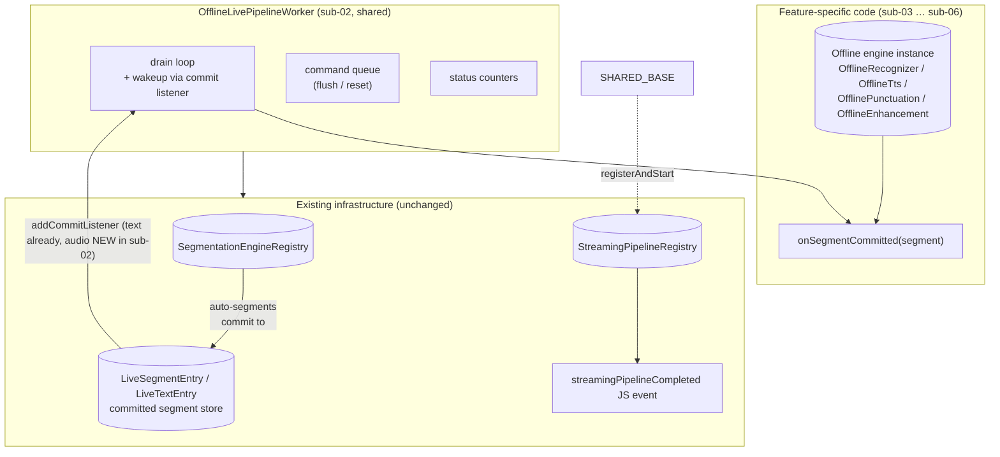

# Sub-Plan 02: Shared Native Worker Base

## Status
- Phase: **1b (foundation, native)**
- Depends on: existing `StreamingPipelineRegistry` / `StreamingPipelineWorker` (Android + iOS), existing `SegmentationEngineRegistry`, sub-01 (cross-feature contract).
- Prerequisite for: sub-03, sub-04, sub-05, sub-06.

## Cross-references

- Design note: [`offline-stt-live-pipeline-mandatory-segmentation.md`](./offline-stt-live-pipeline-mandatory-segmentation.md)
- Phase overview: [`live_overload_overview.md`](./live_overload_overview.md)

## Purpose

Per design §7.4 (`Shared worker base — non-negotiable`):

> Implement `OfflineLivePipelineWorker` (or equivalent shared base) **exactly once.** Each feature supplies only `onSegmentCommitted` (or the per-segment body) that invokes its existing offline decode/synth/processing path. Do not fork drain loop, flush, stop, reset, pipeline registry integration, or completion/event emission per feature — that duplication will diverge and regress.

This sub-plan defines that single shared base on **both Android (Kotlin) and iOS (Obj-C++/C++)**. After this phase the per-feature sub-plans (sub-03 … sub-06) only have to:

1. Resolve the offline engine instance from their existing registry.
2. Wire it into a per-feature `onSegmentCommitted(...)` callback.
3. Add **one** TurboModule entry point that constructs the shared base with that callback.

No feature implements drain/flush/stop/completion logic itself.

---

## Design principles

1. **Reuse, do not parallel-build.** The shared base subclasses the existing `StreamingPipelineWorker` interface and registers with the existing `StreamingPipelineRegistry`. Lifecycle events, completion emission, status reporting are unchanged.
2. **Cursor + listener wakeup.** Per-segment work is **event-driven**, not polled. The worker holds a cursor on the input segment buffer (audio or text) and is woken by a commit listener when a new segment arrives. (See OQ-2.1.)
3. **Domain-symmetric.** The same base handles `LiveAudioBuffer in / LiveTextBuffer in` segment sources. The only difference is which segment store the cursor lives on.
4. **Per-feature work runs on the worker thread.** No cross-thread hops to JS for the fast path. JS only sees the **completion** event and (optionally) per-segment user-supplied callbacks (mirrored on the JS side from the existing live text/audio buffer events, **not** new bridge calls).
5. **Stop is cancel + detach.** `stop()` cancels mid-segment work, `flush()` calls `detachSegmentationEngine(..., flushFinal: true)` and drains.

---

## Architecture



---

## Public-shape decisions before implementation

| # | Decision | Reason |
|---|---|---|
| D1 | The base **subclasses `StreamingPipelineWorker`** (Android + iOS), not a new sibling type. | Keeps `StreamingPipelineRegistry` / completion event plumbing untouched. |
| D2 | The base is **internal**. No JS visibility. | Each feature exposes the overload through its own existing engine surface. |
| D3 | The base reuses the existing **`SegmentationEngineRegistry.attach/detach`** path. The feature's TurboModule entry calls these the **same way** as `attachSegmentationEngine` / `createStreamingTTS` / `createStreamingPunctuation`. | Ensures the segmentation engine is the single owner of policy + commit semantics. |
| D4 | The base accepts a **typed `onSegmentCommitted(SegmentRef)` callback**, not a generic Lambda<Any>. | Type safety; per-feature code reads cleanly. |
| D5 | A new **`LiveSegmentEntry::addCommitListener`** API is added on Android and iOS (parity with `LiveTextEntry::addCommitListener`). See OQ-2.2. | Required for event-driven drain on the speech-input case (STT, Enhancement). |
| D6 | `flush()` calls **`detachSegmentationEngine(engineId, flushFinal: true)`** under the hood, then waits for the drain to finish in-flight segments. | Matches the contract documented in design §7.2. |
| D7 | `stop()` cancels the in-flight per-segment work using a cooperative `std::atomic<bool>` / Kotlin `@Volatile var` flag, then **detaches** the segmentation engine. | Matches design §7.2. |

---

## Android (Kotlin) — `OfflineLivePipelineWorker.kt`

Location: `android/src/main/java/com/sherpaonnx/livePipeline/OfflineLivePipelineWorker.kt`.

```kotlin
package com.sherpaonnx.livePipeline

import com.sherpaonnx.audio.pipeline.PipelineAudioRegistry
import com.sherpaonnx.audio.pipeline.LiveEntry as LiveAudioEntry
import com.sherpaonnx.audio.pipeline.StreamingPipelineWorker
import com.sherpaonnx.audio.pipeline.StreamingPipelineStatus
import com.sherpaonnx.segment.engine.SegmentationEngineRegistry
import com.sherpaonnx.segment.pipeline.LiveSegmentEntry
import com.sherpaonnx.text.pipeline.LiveTextEntry
import java.util.concurrent.CompletableFuture
import java.util.concurrent.atomic.AtomicBoolean
import java.util.concurrent.locks.ReentrantLock
import kotlin.concurrent.thread
import kotlin.concurrent.withLock

/** A single committed input segment, regardless of domain. */
sealed class CommittedSegmentRef {
  data class Speech(
    val sourceAudioBufferId: String,
    val startSample: Int,
    val endSample: Int,
    val sampleRate: Int,
    val durationMs: Int,
    val segmentId: String,
    val segmentIndex: Int,
  ) : CommittedSegmentRef()

  data class Text(
    val text: String,
    val segmentId: String,
    val segmentIndex: Int,
    val startOffset: Int,
    val endOffset: Int,
  ) : CommittedSegmentRef()
}

internal abstract class OfflineLivePipelineWorker(
  override val pipelineId: String,
  /** Engine attached to the input live buffer; detached on flush/stop. */
  protected val attachedSegmentationEngineId: String,
  /** Cursor source. Exactly one of these is non-null. */
  private val audioInput: AudioInput?,
  private val textInput: TextInput?,
) : StreamingPipelineWorker {

  data class AudioInput(
    val liveAudioEntry: LiveAudioEntry,
    val liveSegmentEntry: LiveSegmentEntry,
  )

  data class TextInput(
    val liveTextEntry: LiveTextEntry,
  )

  private val running = AtomicBoolean(false)
  private val stopRequested = AtomicBoolean(false)
  private val workerThreadLock = ReentrantLock()
  private val dataAvailable = workerThreadLock.newCondition()
  private val cmdLock = Any()
  private val commandQueue = ArrayDeque<PipelineCommand>()

  @Volatile private var workerThread: Thread? = null
  @Volatile private var error: String? = null
  @Volatile private var chunksProcessed: Long = 0L
  @Volatile private var unitsRead: Long = 0L
  @Volatile private var unitsWritten: Long = 0L

  /**
   * Per-feature implementation: process one committed segment and write whatever
   * output the feature produces (text / audio / annotated text / etc.) to the
   * pipeline output buffer that was wired in via the per-feature TurboModule
   * entry. No I/O orchestration here — drain loop owns that.
   *
   * Throws on fatal errors; soft errors should be logged and skipped (the worker
   * keeps running to honor the streaming contract).
   */
  protected abstract fun onSegmentCommitted(segment: CommittedSegmentRef)

  /** Per-feature optional teardown (release per-engine streams etc.). */
  protected open fun onRelease() = Unit

  override val isRunning: Boolean get() = running.get()

  override fun start() {
    if (!running.compareAndSet(false, true)) return
    attachCommitListener()
    workerThread = thread(name = "OfflineLivePipelineWorker-$pipelineId", isDaemon = true) {
      try {
        runLoop()
      } catch (e: Exception) {
        error = e.message ?: "OfflineLivePipelineWorker failed"
      } finally {
        running.set(false)
      }
    }
  }

  override fun stop() {
    if (!stopRequested.compareAndSet(false, true)) return
    workerThreadLock.withLock { dataAvailable.signalAll() }
  }

  override fun flush(): CompletableFuture<Unit> {
    val future = CompletableFuture<Unit>()
    val cmd = PipelineCommand.Flush(future)
    synchronized(cmdLock) { commandQueue.addLast(cmd) }
    workerThreadLock.withLock { dataAvailable.signalAll() }
    return future
  }

  override fun reset(): CompletableFuture<Unit> {
    val future = CompletableFuture<Unit>()
    val cmd = PipelineCommand.Reset(future)
    synchronized(cmdLock) { commandQueue.addLast(cmd) }
    workerThreadLock.withLock { dataAvailable.signalAll() }
    return future
  }

  override fun getStatus(): StreamingPipelineStatus = StreamingPipelineStatus(
    isRunning = running.get(),
    chunksProcessed = chunksProcessed,
    unitsRead = unitsRead,
    unitsWritten = unitsWritten,
    error = error,
  )

  override fun release() {
    detachCommitListener()
    detachSegmentationEngineSafe()
    onRelease()
    workerThread?.let { thread ->
      if (thread !== Thread.currentThread()) {
        try { thread.join(2_000) } catch (_: InterruptedException) {}
      }
    }
  }

  // --- internals ---

  private fun runLoop() {
    var audioCursor = 0
    var textCursorId: Int? = textInput?.liveTextEntry?.attachSegmentCursor()

    while (!stopRequested.get()) {
      processCommands()

      val drained = drainNextSegment(audioCursor, textCursorId)
      if (drained == null) {
        // Nothing new — wait for commit listener wakeup or finalize.
        if (isInputFinalized()) break
        workerThreadLock.withLock {
          dataAvailable.await(100, java.util.concurrent.TimeUnit.MILLISECONDS)
        }
        continue
      }
      try {
        onSegmentCommitted(drained.segment)
        chunksProcessed += 1
        unitsRead += drained.unitsRead
      } catch (e: Exception) {
        // Soft-skip on per-segment failure; the streaming contract should not
        // fail entirely on one bad segment.
        error = e.message
      }
      if (drained.advanceAudioCursor) audioCursor += 1
    }

    // Drain remaining commits before terminating.
    drainTail(audioCursor, textCursorId)
    drainRemainingCommands()
  }

  // ... drain/flush/reset/cursor helpers, attach/detach commit listener,
  //     processCommands(), drainTail() etc. (omitted for brevity — see "Implementation steps").
}

internal sealed class PipelineCommand {
  data class Flush(val completion: CompletableFuture<Unit>) : PipelineCommand()
  data class Reset(val completion: CompletableFuture<Unit>) : PipelineCommand()
}
```

> Concrete `drainTail`, `processCommands`, `drainNextSegment`, `attachCommitListener` implementations follow the pattern already established in `SttPipelineWorker.kt` / `TtsPipelineWorker.kt` / `PunctuationPipelineWorker.kt` — that is exactly the duplication this base eliminates after sub-03 … sub-06 land.

---

## iOS (Obj-C++/C++) — `OfflineLivePipelineWorker.h` / `.mm`

Location: `ios/livePipeline/OfflineLivePipelineWorker.h` + `.mm` (new directory).

```cpp
#pragma once

#include "../pipeline/core/SherpaOnnx+StreamingPipeline.h"
#include "../audio/pipeline/PaLiveEntry.h"
#include "../textbuffer/core/SherpaOnnx+TextBufferGlobals.h"
#include "../segmentbuffer/core/SherpaOnnx+SegmentBufferGlobals.h"

#include <atomic>
#include <condition_variable>
#include <deque>
#include <future>
#include <memory>
#include <mutex>
#include <string>
#include <thread>
#include <variant>

struct CommittedSegmentSpeech {
  std::string sourceAudioBufferId;
  int startSample = 0;
  int endSample = 0;
  int sampleRate = 0;
  int durationMs = 0;
  std::string segmentId;
  int segmentIndex = 0;
};

struct CommittedSegmentText {
  std::string text;
  std::string segmentId;
  int segmentIndex = 0;
  int startOffset = 0;
  int endOffset = 0;
};

using CommittedSegmentRef =
    std::variant<CommittedSegmentSpeech, CommittedSegmentText>;

class OfflineLivePipelineWorker : public StreamingPipelineWorker {
public:
  OfflineLivePipelineWorker(std::string pipelineId,
                            std::string attachedSegmentationEngineId,
                            std::shared_ptr<PaLiveEntry> audioInput,
                            std::shared_ptr<SegLiveEntry> audioSegmentInput,
                            std::shared_ptr<TxtLiveEntry> textInput);

  ~OfflineLivePipelineWorker() override;

  void start() override;
  void stop() override;
  std::future<void> flush() override;
  std::future<void> reset() override;
  StreamingPipelineStatus getStatus() override;
  void release() override;

protected:
  /// Per-feature hook — see Kotlin counterpart.
  virtual void onSegmentCommitted(const CommittedSegmentRef &segment) = 0;

  /// Optional per-feature teardown.
  virtual void onRelease() {}

private:
  struct PipelineCommand {
    enum Type { Flush, Reset };
    Type type;
    std::promise<void> completion;
  };

  void runLoop();
  void processCommands();
  void drainTail(int &audioCursor, int textCursorId);
  void attachCommitListener();
  void detachCommitListener();
  void detachSegmentationEngineSafe();

  std::string attachedSegmentationEngineId_;

  std::shared_ptr<PaLiveEntry> audioInput_;          // optional
  std::shared_ptr<SegLiveEntry> audioSegmentInput_;  // optional
  std::shared_ptr<TxtLiveEntry> textInput_;          // optional

  std::thread workerThread_;
  std::atomic<bool> stopRequested_{false};

  std::mutex waitMtx_;
  std::condition_variable waitCv_;

  std::mutex cmdMtx_;
  std::deque<PipelineCommand> commandQueue_;

  std::atomic<int64_t> chunksProcessed_{0};
  std::atomic<int64_t> unitsRead_{0};
  std::atomic<int64_t> unitsWritten_{0};
  std::mutex errorMtx_;
  std::string error_;

  int audioCommitListenerToken_ = -1;
  int textCommitListenerToken_ = -1;
};
```

The `.mm` implementation mirrors the existing `SttPipelineWorker.mm` for the wakeup / drain / command pattern, but the per-segment work is the abstract `onSegmentCommitted(...)` extension point.

---

## New native API: `LiveSegmentEntry::addCommitListener`

To keep the audio path event-driven (parity with text), this sub-plan adds a commit listener API to the audio segment store on **both platforms**.

### Android (Kotlin)

`LiveSegmentEntry.kt` — extend with:

```kotlin
fun addCommitListener(
  listener: (segmentId: String, segmentIndex: Int, record: SegmentRecord) -> Unit
): Int { /* return token */ }

fun removeCommitListener(token: Int)
```

The listener fires inside `appendSegment(...)` after the segment has been appended (post-commit, mirroring `LiveTextEntry.notifyCommitListeners` semantics).

### iOS (C++)

`SherpaOnnx+SegmentBufferGlobals.h` — extend `SegLiveEntry` with:

```cpp
int addCommitListener(
  std::function<void(const std::string &segmentId,
                     int segmentIndex,
                     const SegRecord &record)> listener);

void removeCommitListener(int token);
```

Same fire-after-append semantics as text.

> Why this is necessary: today the audio segment store is **polled** by the only existing consumer (offline orchestrator transferring on flush). Live overload workers consume per-commit, so polling at 50 ms is wasted CPU and adds 50 ms latency floor. The listener is a small, contained addition; the existing polling path stays available.

---

## Integration with `SegmentationEngineRegistry`

The base reuses the existing JS-side attach helper. The per-feature TurboModule entry (sub-03 … sub-06) does:

```kotlin
// inside e.g. SherpaOnnxOfflineSttLivePipelineHelper.startSttOfflineLivePipeline:
val seg = SegmentationEngineRegistry.attach(
  bufferId = audioInLiveBufferId,
  policy = parsedPolicy,
)
val worker = SttOfflineLivePipelineWorker(
  pipelineId = "live_offline_stt_$counter",
  attachedSegmentationEngineId = seg.engineId,
  audioInput = OfflineLivePipelineWorker.AudioInput(
    liveAudioEntry = liveAudioEntry,
    liveSegmentEntry = SegmentPipelineRegistry.requireLive(seg.segmentBufferId!!),
  ),
  textInput = null,
  recognizer = recognizerFromOfflineSttRegistry,
  textOutputEntry = liveTextOutputEntry,
)
StreamingPipelineRegistry.registerAndStart(worker) { completion ->
  emitStreamingPipelineCompleted(completion)
}
```

The per-feature `SttOfflineLivePipelineWorker` (sub-03) only implements `onSegmentCommitted(...)`; everything else is inherited.

---

## TurboModule entry: shape

Each feature's bridge call has the **same shape** (sub-01's options interface translates 1:1):

```ts
// src/NativeSherpaOnnx.ts (one method per feature, shape identical)
start<Feature>OfflineLivePipeline(
  instanceId: string,
  inputLiveBufferId: string,
  outputLiveBufferId: string,
  options: {
    segmentationPolicy: Object,  // already-marshalled SegmentationPolicy (mirrors attachSegmentationEngine input)
    chunkSize?: number,           // STT only; ignored elsewhere
  }
): Promise<{ pipelineId: string }>;
```

Lifecycle calls (`stopStreamingPipeline`, `flushStreamingPipeline`, `resetStreamingPipeline`, `getStreamingPipelineStatus`) are reused unchanged.

---

## Implementation steps

1. **Phase 1b.1 — Audio segment listener API parity**
   - Android: add `addCommitListener` / `removeCommitListener` to `LiveSegmentEntry`. Tests: append → listener fires; finalize → listener no longer fires; remove token → no callback.
   - iOS: same on `SegLiveEntry`.

2. **Phase 1b.2 — Shared base (Android)**
   - Create `android/src/main/java/com/sherpaonnx/livePipeline/OfflineLivePipelineWorker.kt`.
   - Implement drain loop + commands + cursor handling + commit listener wiring + segmentation-engine detach on `release()`.
   - Status counters via `getStatus()`.

3. **Phase 1b.3 — Shared base (iOS)**
   - Create `ios/livePipeline/OfflineLivePipelineWorker.{h,mm}`.
   - Implement everything mirroring Android for behavior parity.

4. **Phase 1b.4 — Build verification**
   - Android example: `:react-native-sherpa-onnx:compileDebugKotlin` succeeds.
   - iOS example: `xcodebuild` Debug simulator builds clean.
   - **No JS-facing API changes yet** — verified end-to-end in Phase 2 via STT.

> ⚠️ This sub-plan introduces native code that has no consumer until Phase 2. To keep the foundation tight, the worker base should be merged together with sub-03 (STT) rather than ahead of it; otherwise you ship dead code.

---

## Test strategy

- Unit tests are limited at this layer because a worker base needs a feature implementation to be exercised. Coverage instead lands in **sub-03 (Phase 2)** as the integration test for the full STT live overload, since that's the first concrete feature.
- Native unit tests added here:
  - `LiveSegmentEntryCommitListenerTest.kt` (Android): append/finalize/remove behavior.
  - iOS equivalent in `SegLiveEntryTests.mm` (XCTest).

---

## Acceptance criteria

- `OfflineLivePipelineWorker` exists on both platforms and subclasses the existing `StreamingPipelineWorker` interface.
- New `addCommitListener` / `removeCommitListener` exists on `LiveSegmentEntry` (Android) and `SegLiveEntry` (iOS), with parity tests.
- Android + iOS builds green.
- No public TS API changes in this sub-plan.
- `release()` always detaches the segmentation engine and removes commit listeners — even on error paths.

---

## Resolved decisions

### OQ-2.1 — Listener wakeup vs. periodic poll for segment drain

**Decision: event-driven listener with short timeout fallback (accepted).**

Use commit-listener-based wakeup with a short timeout fallback for finalize/state transitions. Do not use periodic polling as the primary mechanism.

### OQ-2.2 — Should `LiveSegmentEntry::addCommitListener` be public on the JS side too?

**Decision: No — keep it native-only (accepted).**

No JS API is added for `addCommitListener`; JS keeps using existing segment events (`SegmentBufferEventBridge`) and optional `onSegment` wrappers on output buffers.

### OQ-2.3 — Where should `OfflineLivePipelineWorker` physically live?

**Decision: New `livePipeline/` package on Android and new `ios/livePipeline/` folder on iOS (accepted).**

Do not place the shared base under `audio/pipeline/`; this worker is cross-domain (audio + text), not audio-only.

### OQ-2.4 — What does `reset()` do in this worker?

**Decision: `reset()` is a no-op that completes successfully (accepted).**

`OfflineLivePipelineWorker.reset()` must resolve successfully without re-attaching segmentation or clearing segment cursors. This behavior must be explicitly documented in code docstrings/comments on both platforms.

If a future feature needs non-trivial reset semantics, it can override the default no-op behavior in its subclass.
