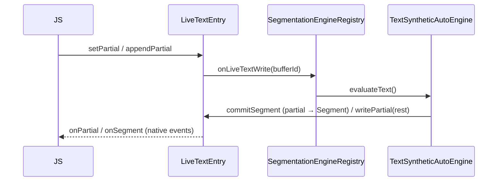
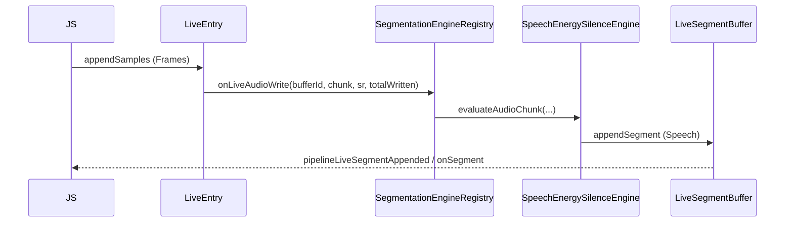

# Segmentation Engine — Ist-Stand & TS-API (Snapshot)

High-Level Referenz für die **aktuelle** Kern-Implementierung der Segmentierungs-Engine nach Abschluss von Phase 1d und mit den Phase-2-Erweiterungen (VAD + STT-Verkettung). Gedacht als Einstieg für die Arbeit an den Folgephasen 3–7.

---

## 1. Kern-Implementierung (native-first)

### 1.1 Architektur kurz

- **Single authority:** Die Engine entscheidet über Auto-Segmente; der jeweilige **Buffer** speichert committed Segmente und feuert Events (siehe Sub-Plan 03).
- **Zwei Plattform-Implementierungen** mit gleichem TurboModule-Contract:
  - **Android:** `android/src/main/java/com/sherpaonnx/segment/engine/SegmentationEngineRegistry.kt` — Registry (`engineId` ↔ Instanz), Policy-Parsing, konkrete Engine-Klassen für Text und Speech.
  - **iOS:** `ios/segmentbuffer/bridge/SherpaOnnx+SegmentBuffer.mm` (C++ Hilfslogik: `SegEngine`, Annotation-Map, Offline-Text/Audio-Pass) — gleiche Semantik wie Android.
- **Bridge:** `SherpaOnnx` TurboModule (`NativeSherpaOnnx.ts`, Abschnitt „Segmentation Engine Core“): `attachSegmentationEngine`, `detachSegmentationEngine`, `getSegmentationEngineInfo`, `segmentOfflineBuffer`.

### 1.2 Engine-Instanzen (Policy → Verhalten)

| Policy `evaluator` (TS) | Domäne | Implementierung (Kern) | Anmerkung |
|-------------------------|--------|-------------------------|-----------|
| `text_synthetic_auto` | Text | Satz-/Zeichengrenzen, `maxLengthChars`, `sentenceBoundary` | P0, kein externes Modell |
| `text_punctuation_assisted` | Text | Policy ist **zulässig**; Laufzeit nutzt denselben Kernpfad wie synthetic auto | Dediziertes Interpunktions-**Modell** = Folgephase (z. B. Phase 4) |
| `speech_energy_silence` | Speech | RMS dB vs. `energyThresholdDb`, Stille-Akkumulation, `min`/`maxSegmentMs` | P0 |
| `speech_vad_model` | Speech | Echte VAD-Runtime (Model-basiert) für Live- und Offline-Segmentierung | Kein stiller Fallback auf Energy-Pfad bei gewählter VAD-Policy |
| `continuous_frames` | Speech | Zusätzlich grobe **Checkpoints** über `checkpointIntervalMs` → `policy_checkpoint` | Für Enhancement-Drain-Szenarien |

Offline-Pass (`segmentOfflineBuffer`) spiegelt dieselben Parameter (Text: zeichenweise Aufteilung; Speech: Samples scannen, Segmente in `OfflineSegmentBuffer` schreiben).

### 1.3 Registry & Lebenszyklus

- Pro **Live-Buffer** höchstens **eine** aktive Engine (`ENGINE_ALREADY_ATTACHED`).
- Zustände: **active → detached** (nach `detach` oder Finalize) bzw. **released** bei Buffer-Release.
- **Flush:** optional bei `detachSegmentationEngine(..., { flushFinal: true })` — schreibt restliches Partial (Text) bzw. offene Samples (Audio) als finales Segment, soweit implementiert.

---

## 2. Zusammenspiel mit Text- und Audio-Buffern

### 2.1 Symmetrisches Zwei-Ebenen-Modell

| Ebene | Text (`LiveTextBuffer`) | Audio (`LiveAudioBuffer`) |
|-------|-------------------------|---------------------------|
| **Daten** | `setPartial` / `appendPartial` (TurboModule) | `appendSamplesToLiveAudioBuffer` (JSI append) |
| **Segmente (manuell)** | `commitSegment` (SDK) | `commitSegment` (SDK) |
| **Segmente (auto)** | Native Engine an Partial-Write gebunden | Native Engine an Append-Chunk gebunden |
| **Segment-Lesepfad** | Embedded Segment-Log im Text-Buffer | Zugehöriges `LiveSegmentBuffer` (`segmentBufferId`) |

### 2.2 Live Text — Ablauf



- **Auto-Attach:** `createLiveTextBuffer({ segmentation: { mode: 'auto', policy? } })` ruft nach Buffer-Erzeugung `attachSegmentationEngine` mit Default-Policy (`text_synthetic_auto`), sofern keine Policy übergeben wird (`src/textbuffer/index.ts`).
- **Manuell attach:** `attachSegmentationEngine(buffer, { policy })` aus `src/segment/index.ts`.
- **JS-Spiegel:** `registerLiveTextSegmentation`, `registerAttachedSegmentationEngine` in `src/segment/runtime-state.ts` halten Modus/Engine-ID für `commitSegment`/`getSegmentBuffer`-Pfad.

### 2.3 Live Audio — Ablauf



- **Auto-Attach:** `createEmptyLiveAudioBuffer({ segmentation: { mode: 'auto', policy? } })` analog Text (`src/audiobuffer/index.ts`).
- Speech-Engine erhält bei Attach eine frisch erzeugte **LiveSegmentBuffer**-ID (`segmentBufferId` in `SegmentationEngineInfo`).

### 2.4 Finalize / Release

- Beim **Finalisieren** des Live-Text- oder Live-Audio-Buffers ruft natives Code **Engine-Flush** und **Detach** auf (siehe `onBufferFinalized` in Registry / iOS-Äquivalent).
- Bei **Release** des Buffers: Engine wird aus Registry entfernt (`onBufferReleased`).

### 2.5 Offline

- **`segmentOfflineBuffer(offlineBuffer, policy)`** (TS): einmaliger nativer Durchlauf; Ergebnis:
  - **Text:** Segmentliste wird in JS-Cache (`offlineTextSegmentsByBufferId`) materialisiert; `getSegments`/`getSegmentCount` auf Offline-Text **erfordern** vorher diesen Aufruf (sonst `SEGMENT_NOT_AVAILABLE`).
  - **Speech:** neues/aktualisiertes **`seg_off_*`**; Zuordnung Parent-Audio → Segmentbuffer wird in JS gecacht.

- **Lazy Default für Offline-Audio:** `getSegmentBuffer(offlineAudio)` kann intern `segmentOfflineBuffer` mit **`DEFAULT_SPEECH_POLICY`** auslösen, wenn noch kein Segmentbuffer verknüpft ist (`ensureOfflineAudioSegmentBuffer` in `src/segment/index.ts`).

---

## 3. TypeScript-API-Referenz (Segmentation Engine)

**Modul:** `react-native-sherpa-onnx/segment` (Quelle: `src/segment/index.ts`, Typen: `src/segment/engine-types.ts`).

### 3.1 Typen (`src/segment/engine-types.ts`)

```typescript
// `FileSource` — see `react-native-sherpa-onnx/fileio`

export type SegmentationEvaluator =
  | 'text_synthetic_auto'
  | 'text_punctuation_assisted'
  | 'speech_energy_silence'
  | 'speech_vad_model'
  | 'continuous_frames';

export interface SegmentationPolicy {
  evaluator: SegmentationEvaluator;
  maxLengthChars?: number;
  sentenceBoundary?: boolean;
  languageHints?: string[];
  silenceThresholdMs?: number;
  energyThresholdDb?: number;
  minSegmentMs?: number;
  maxSegmentMs?: number;
  hangoverMs?: number;
  checkpointIntervalMs?: number;
  modelPath?: FileSource; // `speech_vad_model` — JS `detectVadModel` (same as streaming VAD); native gets `.onnx` + modelType
  vadThreshold?: number;
  vadMinSpeechMs?: number;
  vadMinSilenceMs?: number;
}

export interface SegmentationConfig {
  policy: SegmentationPolicy;
}

export interface SegmentationEngineRef {
  engineId: string;
}

export interface SegmentationEngineInfo {
  engineId: string;
  attachedBufferId: string;
  domain: 'text' | 'speech';
  policy: SegmentationPolicy;
  state: 'active' | 'detached';
  totalSegmentsCommitted: number;
  lastSegmentId?: string;
  segmentBufferId?: string;
}
```

### 3.2 Funktionen (Engine-spezifisch)

| Funktion | Signatur (vereinfacht) | Beschreibung |
|----------|------------------------|--------------|
| `attachSegmentationEngine` | `(buffer, config: SegmentationConfig) => Promise<SegmentationEngineRef>` | Nur **Live**-Text oder **Live**-Audio; `config.policy` optional → Defaults (`text_synthetic_auto` / `speech_energy_silence`). Registriert Engine in JS-Runtime-State. |
| `detachSegmentationEngine` | `(engine \| engineId, options?: { flushFinal?: boolean }) => Promise<void>` | Trennt Engine; optional finales Flush. |
| `getSegmentationEngineInfo` | `(engine \| engineId) => Promise<SegmentationEngineInfo>` | Liest nativen Snapshot; synchronisiert JS-State (`segmentBufferId` für Audio). |
| `segmentOfflineBuffer` | `(buffer, policy: SegmentationPolicy) => Promise<SegmentBufferRef>` | **Offline**-Text (`txt_off_*`) oder **Offline**-Audio (`off_*`); Speech-Ergebnis: `SegmentBufferRef` mit `seg_off_*`. |

### 3.3 Verwandte Segment-APIs (gleiches Paket, für Kontext)

| Funktion | Kurzbeschreibung |
|----------|------------------|
| `setPartial` / `appendPartial` | Level-1 Text-Schreiben; triggert Engine bei Auto. |
| `commitSegment` | Level-2 manueller Commit (Text/Audio), nicht die Auto-Engine. |
| `getSegmentBuffer` | Einheitlicher Zugriff auf Segment-Sicht (Text embedded, Audio `seg_*`). |
| `getSegments` / `getSegmentCount` | Pull-API; maßgeblich für UI/Orchestrierung. |
| SegmentLinkMap-Familie | `createSegmentLinkMap`, `addSegmentLink`, … — Cross-Domain Links (Phase 1b), nicht Engine-Core. |

### 3.4 Native TurboModule (Rohcontract)

Siehe `src/NativeSherpaOnnx.ts` — Methoden `attachSegmentationEngine`, `detachSegmentationEngine`, `getSegmentationEngineInfo`, `segmentOfflineBuffer` (Promise-basiert).

### 3.5 Typische Fehler-Codes (native → JS)

- `ENGINE_ALREADY_ATTACHED`, `ENGINE_DETACHED`
- `POLICY_INVALID` (Evaluator passt nicht zur Domäne)
- `BUFFER_STATE_INVALID` (Buffer nicht recording / offline nicht gefunden)
- `SEGMENT_NOT_AVAILABLE` (z. B. Offline-Text ohne vorheriges `segmentOfflineBuffer`)

---

## 4. Siehe auch

- [segmentation_engine_overview.md](segmentation_engine_overview.md) — Phasen 1–7
- [sub-02-segmentation-engine-core.md](sub-02-segmentation-engine-core.md) — Spezifikation Engine Core
- [sub-03-buffer-integration.md](sub-03-buffer-integration.md) — Events, `getSegmentBuffer`, Commit-Mechanik
