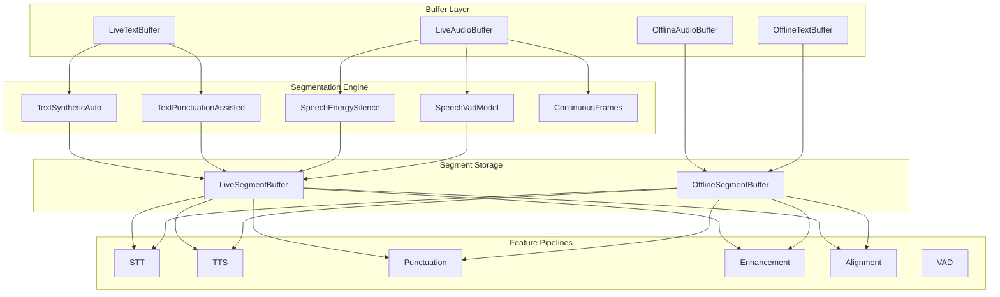

# Segmentation Engine — Spec & Sub-Plans Overview

## Erstellte Dateien

Alle Dateien liegen unter `docs/migration/segmentationEngine/`:

| Datei | Inhalt |
|---|---|
| [segmentation-engine-spec.md](file:///Volumes/SSD/dev/react-native-sherpa-onnx/docs/migration/segmentationEngine/segmentation-engine-spec.md) | **Haupt-Spec (v2)** — Pipeline-Modi, Segment Contract, SegmentLink als Core-Artifact, Symmetric Write API, Policy Model, Enhancement, Transfer, TTS Removal Gates |
| [sub-01-segment-contract.md](file:///Volumes/SSD/dev/react-native-sherpa-onnx/docs/migration/segmentationEngine/sub-01-segment-contract.md) | **Segment Contract & Types** — Segment + **SegmentLink/SegmentLinkMap** (TS/Kotlin/C++), Serialisierung, Validierung, Migration |
| [sub-02-segmentation-engine-core.md](file:///Volumes/SSD/dev/react-native-sherpa-onnx/docs/migration/segmentationEngine/sub-02-segmentation-engine-core.md) | **Engine Core** — Native Interface, 5 Policy Evaluators, Symmetric Buffer Attachment, Offline Segmentation |
| [sub-03-buffer-integration.md](file:///Volumes/SSD/dev/react-native-sherpa-onnx/docs/migration/segmentationEngine/sub-03-buffer-integration.md) | **Buffer Integration** — Symmetric Write Model, onSegment Events, Segment Storage (`getSegmentBuffer`), Commit Mechanics |
| [sub-04-transfer-offline-orchestration.md](file:///Volumes/SSD/dev/react-native-sherpa-onnx/docs/migration/segmentationEngine/sub-04-transfer-offline-orchestration.md) | **Transfer & Orchestration** — Zero-Copy Transfer, Lifecycle Management, Error Recovery Strategien |
| [sub-05-feature-pipeline-migration.md](file:///Volumes/SSD/dev/react-native-sherpa-onnx/docs/migration/segmentationEngine/sub-05-feature-pipeline-migration.md) | **Feature Migration** — STT (+stt_produced), TTS (+tts_produced), Punctuation, Enhancement, Alignment (+alignment links), VAD |
| [sub-06-cleanup-contract-parity.md](file:///Volumes/SSD/dev/react-native-sherpa-onnx/docs/migration/segmentationEngine/sub-06-cleanup-contract-parity.md) | **Cleanup & Contract Parity** — Plan-Audit je Sub-Plan, verbleibende Contract-Lücken schließen (z. B. Sync-JSI Fast-Path), Legacy/Dead-Code entfernen, finale Release-Härtung |

---

## Architektur-Überblick

---

## Pipeline-Modi (Zusammenfassung)

| # | Modus | Flow | Segmentation |
|---|---|---|---|
| 1 | Offline Full | `OfflineBuffer → Consumer → OfflineBuffer` | `mode: 'off'` |
| 2 | Offline + Segmentation | `OfflineBuffer + Engine → Consumer(×N) → OfflineBuffer` | `mode: 'auto'` |
| 3 | Streaming Manual | `LiveBuffer → Consumer → LiveBuffer` | `mode: 'manual'` |
| 4 | Streaming Auto | `LiveBuffer + Engine → Consumer → LiveBuffer` | `mode: 'auto'` |
| 5 | Continuous Frames | `LiveAudioBuffer → Enhancement (drain) → LiveAudioBuffer` | `policy: 'continuous_frames'` |

---

## Migrations-Reihenfolge

Da das Fundament (Phase 1) sehr umfangreich ist, wird es in vier machbare Schritte (1a–1d) unterteilt:

| Phase | Was | Details |
|---|---|---|
| **Phase 1a** | Core Types & Linkage (Sub-Plan 01) | TypeScript, Kotlin, C++ Datentypen für `Segment`, `SegmentLink`, `SegmentLinkMap` + Serialisierung. **Contract only, keine Runtime-APIs/Store-Logik.** **Status: Completed** |
| **Phase 1b** | Storage & Write APIs (Sub-Plan 03 + Sub-Plan 01 Runtime-Teil) | Symmetric Write API (`setPartial`, `appendPartial`), `getSegmentBuffer()` Abstraktion, Event-Payloads **sowie SegmentLinkMap Runtime-APIs** (`createSegmentLinkMap`, `addSegmentLink(s)`, `getSpeechSegmentsForText`, `getTextSegmentsForSpeech`, `getAllSegmentLinks`, `getSegmentLinkCount`, `getSegmentLinkMapInfo`, `removeSegmentLink`, `releaseSegmentLinkMap`) inkl. nativer LinkMap-Store/Indizes. **Status: Completed** |
| **Phase 1c** | Orchestration & Transfer (Sub-Plan 04) | `transferOfflineAudioBufferFromLive`, `OrchestrationSession` State Machine, Error Recovery Strategien (abort, skip, retry, partial). |
| **Phase 1d** | Engine Core (Sub-Plan 02) | Native Evaluatoren (Energy, Punctuation, etc.), Buffer Attachment, Offline-Segmentation Loop. |
| **Phase 2** | VAD + STT (+ `stt_produced` Links) | VAD liefert Grenzen, STT nutzt diese und produziert Text. |
| **Phase 3** | Enhancement (Offline segmentiert) | Verifizierung der Audio-Orchestration & Error Recovery. |
| **Phase 4** | Punctuation | Verifizierung der Text-Orchestration. |
| **Phase 5** | TTS (Incremental entfernen, + `tts_produced` Links) | Höchstes Risiko, benötigt Parity. Produziert Links für Playback-Highlighting. |
| **Phase 6** | Alignment (Fake-Live, + `alignment` Links) | Basiert auf `SegmentLinkMap` aus Phase 1a. Komplexe Cross-Domain Strategien. |
| **Phase 7** | Cleanup & Contract-Parity (Sub-Plan 06) | Systematischer Soll-Ist-Audit aller Sub-Pläne, verbleibende Abweichungen nachziehen (inkl. **JSI-Fast-Path Kandidaten** mit Priorisierung/Messung), Legacy-/Dead-Code entfernen, release-ready Hardening. |

> `SegmentLink` und `SegmentLinkMap`-**Contracts** werden in **Phase 1a** implementiert; die `SegmentLinkMap`-**Runtime-APIs/Store-Logik** folgen in **Phase 1b**. Ab Phase 2 rufen Features dann `addSegmentLink()` auf.

> Hinweis zu `setPartial()` / `appendPartial()`:
> Der aktuelle Stand nutzt bewusst den Promise-basierten TurboModule-Contract (funktional vollständig). Ein expliziter synchroner JSI-Fast-Path benötigt eine zusätzliche Host-API-Erweiterung und ist als Cleanup/Parity-Item für **Phase 7** eingeplant.

---

## Wichtige Design-Entscheidungen

> [!IMPORTANT]
> - **Symmetric 2-Level Write Model** — beide Domains (Text + Audio) haben dieselbe API-Struktur: Level 1 = Daten schreiben (`setPartial`/`appendPartial` bzw. `appendFrames`), Level 2 = Segment committen (`commitSegment()` für beide)
> - **Segment = innerhalb einer Domain, SegmentLink = zwischen Domains** — beide als Core-Artifacts in Sub-Plan 01
> - **Unified Segment Access** — `getSegmentBuffer(anyBuffer)` gibt einheitlichen Zugriff auf Segmente, unabhängig ob intern embedded (Text) oder separate (Audio)
> - **Engine entscheidet, Buffer speichert** — keine Dual-Authority
> - **transferOfflineAudioBufferFromLive** mit `dataOffsetBytes` für Zero-Copy
> - **Enhancement** behält continuous frame-drain, keine Per-Frame-Segmente
> - **TTS Incremental** wird entfernt nach Parity/Contract/Ops Gates

## SegmentLink — Cross-Domain Core-Artifact

| Feature | `linkType` | Richtung | Wann erstellt |
|---|---|---|---|
| **STT** | `stt_produced` | speech → text | Nach per-Segment Transkription |
| **TTS** | `tts_produced` | text → speech | Nach per-Segment Synthese |
| **Alignment** | `alignment` | text ↔ speech | Nach Alignment-Model Run |
| **Subtitle** | `proportional` / `vad_assisted` | text ↔ speech | Während Timing-Generierung |
| **User** | `user_defined` | beliebig | Explizit durch SDK-User |

## Symmetric Write Model

| Operation | Text (LiveTextBuffer) | Audio (LiveAudioBuffer) |
|---|---|---|
| **Daten schreiben** | `setPartial()` / `appendPartial()` | `appendFrames()` |
| **Daten lesen** | `getPartialSlice()` | `getSamplesSlice()` |
| **Daten-Event** | `onPartial` | `onFramesAppended` |
| **Segment committen** | `commitSegment(buf)` | `commitSegment(buf)` |
| **Segment Buffer** | `getSegmentBuffer(buf)` | `getSegmentBuffer(buf)` |
| **Segmente lesen** | `getSegments(buf \| segBuf)` | `getSegments(buf \| segBuf)` |
| **Segment-Event** | `onSegment` | `onSegment` |

> [!NOTE]
> `setPartial()` und `appendPartial()` sind **neue public APIs** für LiveTextBuffer (aktuell TurboModule-basiert; optionaler Sync-JSI Fast-Path in Phase 7). `getSegmentBuffer()` ist die **neue einheitliche Zugriffs-API** für Segmente beider Domains.

## Gelöste Design-Fragen

> [!TIP]
> Alle Open Questions aus dem initialen Spec sind mittlerweile gelöst und in die Pläne integriert:
> 1. **✅ Event Payload**: Text-onSegment enthält `text` Feld. Audio-onSegment nur Metadaten (kein PCM). Kein Coalescing.
> 2. **✅ Segment Storage**: Unified via `getSegmentBuffer()`. Intern: Text embedded, Audio separate. Extern: identisch.
> 3. **✅ Cross-Domain Linkage**: `SegmentLink` als Core-Artifact in Sub-Plan 01. Feature-agnostic, N:M, bidirektional.
> 4. **✅ Audio Orchestration Lifecycle**: `OrchestrationSession` mit 4 Error-Recovery Strategien (abort, skip, retry, partial) und deterministischem Cleanup.
