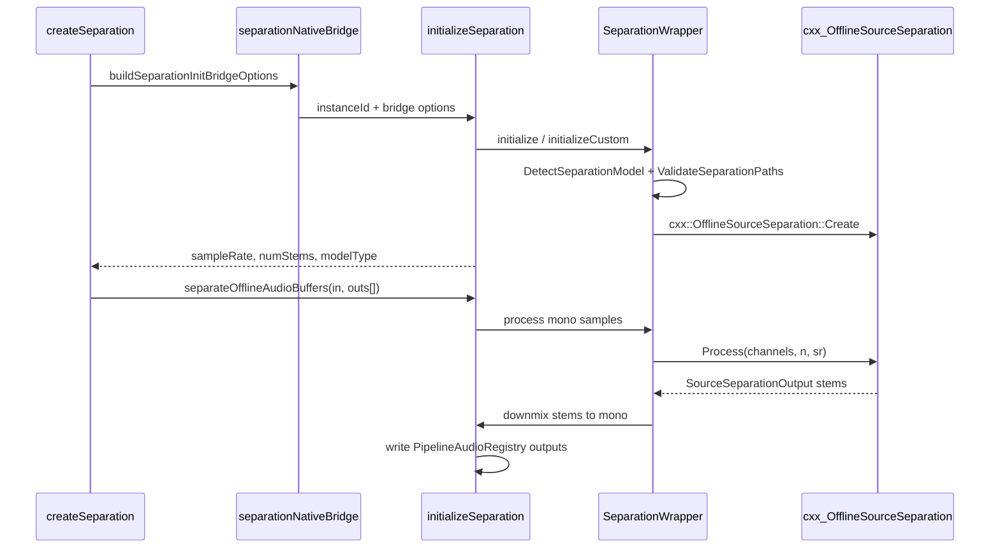
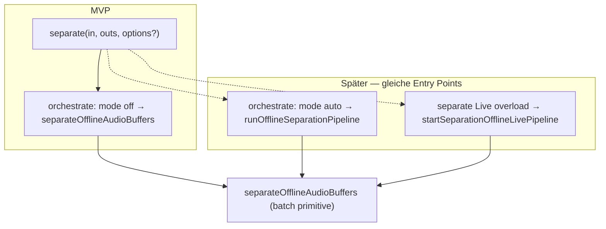

# Separation Runtime — Implementierungsplan

## Zielbild (Vertrag)

Entspricht [`.cursor/rules/separation-diarization-pre-1.0.mdc`](.cursor/rules/separation-diarization-pre-1.0.mdc):

- **Offline only**, kein Streaming-MVP
- **Buffer-first**: `OfflineAudioBuffer` rein → **N** leere `OfflineAudioBuffer` raus (MVP: N=2)
- **Instanz-API**: `createSeparation` + `engine.separate(..., options?)` → `SeparationResult` + `engine.destroy()`
- Placeholder (`initializeSeparation`, `separateSources(filePath)`, Singleton-`unloadSeparation`) **entfernen**
- **Stem-Reihenfolge** (sherpa-onnx): `[0]=vocals`, `[1]=accompaniment` (UVR: non-vocals)



## Architektur-Entscheidung: Native via C++ + cxx-api (beide Plattformen)

| Aspekt | Enhancement (Referenz) | Separation (neu) |
|--------|------------------------|------------------|
| Android Inference | Kotlin `OfflineSpeechDenoiser` aus AAR | **Kein** Kotlin/Java-API → C++ `SeparationWrapper` + JNI |
| iOS Inference | C++ `EnhancementWrapper` + cxx-api | C++ `SeparationWrapper` + cxx-api |
| Wrapper-Dateien (Inference) | [`ios/enhancement/sherpa-onnx-enhancement-wrapper.{h,mm}`](ios/enhancement/sherpa-onnx-enhancement-wrapper.h) | [`ios/separation/sherpa-onnx-separation-wrapper.{h,mm}`](ios/separation/sherpa-onnx-separation-wrapper.h) |
| Wrapper-Dateien (Detect, Android) | [`model_detect/enhancement/sherpa-onnx-enhancement-wrapper.cpp`](android/src/main/cpp/jni/model_detect/enhancement/sherpa-onnx-enhancement-wrapper.cpp) (nur Detect-JNI) | [`model_detect/separation/sherpa-onnx-separation-wrapper.cpp`](android/src/main/cpp/jni/model_detect/separation/sherpa-onnx-separation-wrapper.cpp) (bestehend, unverändert) |
| iOS Bridge (Offline) | [`SherpaOnnx+EnhancementOffline.mm`](ios/enhancement/bridge/SherpaOnnx+EnhancementOffline.mm) | [`SherpaOnnx+SeparationOffline.mm`](ios/separation/bridge/SherpaOnnx+SeparationOffline.mm) |
| sherpa API | `sherpa_onnx::cxx::OfflineSpeechDenoiser` | `sherpa_onnx::cxx::OfflineSourceSeparation` aus [`cxx-api.h`](third_party/sherpa-onnx/sherpa-onnx/c-api/cxx-api.h) |
| Detect/Validate | Bereits vorhanden | Wiederverwendung: `DetectSeparationModel`, `ValidateSeparationPaths` |

**Namenskonvention:** Kein `runtime`-Suffix — analog Enhancement heißt die Klasse `SeparationWrapper`, die Dateien `sherpa-onnx-separation-wrapper.{h,mm}`.

**Zwei Wrapper-Pfade (wie Enhancement):** Unter Android existieren zwei getrennte `sherpa-onnx-separation-wrapper`-Artefakte in verschiedenen Verzeichnissen — sie werden nie im selben Translation Unit kombiniert:
- **Detect** (bestehend): `jni/model_detect/separation/` — nur `SeparationDetectResultToJava`
- **Inference** (neu): Header/Impl wie iOS in `ios/separation/`; Android kompiliert zusätzlich `jni/separation/sherpa-onnx-separation-wrapper.cpp` mit Include-Pfad `ios/separation/` (vor `model_detect/separation/`)

**Linking:** Bestehendes Android-Setup (`sherpa-onnx-c-api` in [`CMakeLists.txt`](android/src/main/cpp/CMakeLists.txt)) und iOS (`-lsherpa-onnx` in [`SherpaOnnx.podspec`](SherpaOnnx.podspec)) reichen.

## Audio-I/O-Konvention

- **Input**: Mono-`OfflineAudioBuffer` → `Process(&channelPtr, 1, numSamples, sampleRate)`
- **Output**: Multi-channel Stems intern → **Downmix L/R zu Mono** in Output-Buffer (MVP, dokumentieren in [`docs/separation.md`](docs/separation.md))
- **Validierung** (native, wie Enhancement): `off_*`-IDs, Input non-empty, alle Outputs empty, `audioOuts.length === numStems`
- **Später:** Stereo-/Multi-Channel-Output-Buffer — dann Downmix entfällt; MVP bleibt bewusst mono-only

## Extension Points — Segmentation & Live Overload (vorbereiten, nicht implementieren)

Segmentation Engine und Live Overload sind **nicht** Teil des MVP. Die API-Struktur orientiert sich an Enhancement, damit später **keine Breaking Changes** nötig sind.

Referenz: [`src/enhancement/types.ts`](src/enhancement/types.ts), [`src/enhancement/orchestrate.ts`](src/enhancement/orchestrate.ts), Live-Overload-Matrix §5.1 **(b)** in [`docs/migration/liveOverload/offline-stt-live-pipeline-mandatory-segmentation.md`](docs/migration/liveOverload/offline-stt-live-pipeline-mandatory-segmentation.md) (Separation: `continuous_frames`, Boundary-Artefakte wie Enhancement).



| Prinzip | MVP | Später |
|---------|-----|--------|
| Public Entry | `separate(Off, Off[], options?)` | + Live-Overload auf derselben Engine (kein `createStreamingSeparation`) |
| Options | `SeparateOptions` mit `segmentation.mode: 'off'` only | `auto`/`manual`, `policy`, `onProgress`, `errorRecovery`, `overlapSamples` |
| Return | `SeparationResult` (1 Segment) | `partial`/`failed`/`skippedSegments` via Orchestrator |
| TS-Orchestrierung | [`orchestrate.ts`](src/separation/orchestrate.ts) — Direct-Pfad only | `runOfflineSeparationPipeline` (N Outputs pro Segment) |
| Native Inference | `separateOfflineAudioBuffers` — **einzige** Batch-Primitive | Live-Worker ruft dieselbe Primitive pro Chunk auf |
| Native Live | — (Name reserviert) | `startSeparationOfflineLivePipeline` (parallel Enhancement) |
| C++ `SeparationWrapper` | Batch-only | **Unverändert** — keine Segment-Schleife in C++ |

**1→N-Besonderheit:** Live Overload muss **N parallele Output-Buffer** (`audioOuts[]`) synchron pro Segment bedienen — deshalb von Anfang an Array + `getNumStems()`, kein festes 2-Tuple.

**Nicht vorwegbauen:** `attachSegmentationEngine`, Live-TurboModule, `createStreamingSeparation`, SegmentBuffer-Kopplung.

---

## 1. TypeScript — Public API

Entry point: [`src/separation/index.ts`](src/separation/index.ts) (exportiert via `@react-native-sherpa-onnx/separation`).

### 1.1 Typen — [`src/separation/types.ts`](src/separation/types.ts)

```typescript
import type { FileSource } from '../fileio/types';
import type {
  OfflineAudioBufferIdSource,
  LiveAudioBufferIdSource,
} from '../audiobuffer/types';
import type { SeparationDetectModelResult } from '../types/modelDetect';
import type { SpleeterCustomConfig, UvrCustomConfig } from './customConfig';
import type {
  ErrorRecoveryStrategy,
  FailedSegmentInfo,
  OrchestrationProgress,
  SkippedSegmentInfo,
} from '../pipeline/offlineOrchestrator';
import type { SegmentationPolicy } from '../segment/engine-types';
import type { SeparationPipelineHandle } from './streamingTypes';
import type { LiveOfflinePipelineBaseOptions } from '../livePipeline';
import type { SpeechSegment } from '../segment/segment';

// --- bereits vorhanden ---
export type SeparationModelType = 'spleeter' | 'uvr';
export const SEPARATION_MODEL_TYPES: readonly SeparationModelType[];
export type SeparationDetectResult = SeparationDetectModelResult;

// --- init (neu) ---
export type SeparationConcreteModelType = SeparationModelType;

export type SeparationInitOptionsShared = {
  numThreads?: number;
  provider?: string;
  debug?: boolean;
};

export type SeparationAutoInitializeOptions = SeparationInitOptionsShared & {
  initMode?: 'auto';
  modelSource: FileSource;
  modelType?: SeparationModelType | 'auto';
};

export type SeparationCustomInitializeOptions = SeparationInitOptionsShared & (
  | { initMode: 'custom'; modelType: 'spleeter'; customConfig: SpleeterCustomConfig }
  | { initMode: 'custom'; modelType: 'uvr'; customConfig: UvrCustomConfig }
);

export type SeparationInitializeOptions =
  | SeparationAutoInitializeOptions
  | SeparationCustomInitializeOptions;

// --- separate() options (MVP: segmentation off only) ---
export interface SeparateSegmentationConfig {
  /** MVP: only `'off'` (default). `'auto'`/`'manual'` added with orchestrator. */
  mode?: 'off' | 'manual' | 'auto';
  policy?: SegmentationPolicy;
}

export interface SeparateOptions {
  segmentation?: SeparateSegmentationConfig;
  /** Reserved — wired when orchestrator ships. */
  errorRecovery?: ErrorRecoveryStrategy;
  maxRetriesPerSegment?: number;
  retryExhaustedFallback?: 'abort' | 'skip';
  abortSignal?: AbortSignal;
  onProgress?: (progress: OrchestrationProgress) => void;
  overlapSamples?: number;
}

export interface SeparationResult {
  status: 'complete' | 'partial' | 'failed' | 'cancelled';
  totalSegments: number;       // MVP: 1
  completedSegments: number;   // MVP: 1
  skippedSegments: SkippedSegmentInfo[]; // MVP: []
  failedSegment?: FailedSegmentInfo;
  processingTimeMs: number;
}

// --- stems ---
export type SeparationStemIndex = 0 | 1;
export const SEPARATION_STEM_LABELS: readonly ['vocals', 'accompaniment'];

export type SeparationEngineInfo = {
  instanceId: string;
  modelType: SeparationConcreteModelType;
  sampleRate: number;
  numStems: number;
};

// --- engine ---
export interface SeparationEngine {
  readonly instanceId: string;

  /**
   * Offline batch separation (Enhancement-shaped API).
   * MVP: `segmentation.mode` defaults to `'off'` → single native batch call.
   */
  separate(
    audioIn: OfflineAudioBufferIdSource,
    audioOuts: readonly OfflineAudioBufferIdSource[],
    options?: SeparateOptions
  ): Promise<SeparationResult>;

  /**
   * Live overload — NOT implemented in MVP.
   * Future: template (b), `continuous_frames` only (see live-overload doc §5.1).
   * Writes N stem streams to N live output buffers in sync per committed segment.
   */
  // separate(
  //   audioIn: LiveAudioBufferIdSource,
  //   audioOuts: readonly LiveAudioBufferIdSource[],
  //   options: SeparationLivePipelineOptions
  // ): Promise<SeparationPipelineHandle>;

  getSampleRate(): Promise<number>;
  getNumStems(): Promise<number>;
  destroy(): Promise<void>;
}

/**
 * Live-pipeline options — type stub for future live overload (not exported from index until implemented).
 * Restricted to `continuous_frames` (same rationale as Enhancement).
 */
export interface SeparationLivePipelineOptions
  extends LiveOfflinePipelineBaseOptions {
  segmentation: {
    policy: SegmentationPolicy & { evaluator: 'continuous_frames' };
    mode?: 'auto';
  };
  onSegment?: (segment: SpeechSegment) => void;
}
```

### 1.2 Factory — [`src/separation/index.ts`](src/separation/index.ts)

```typescript
/**
 * Create an offline source-separation engine.
 *
 * @example Auto init
 * ```ts
 * const sep = await createSeparation({
 *   modelSource: { path: modelDir },
 *   modelType: 'auto',
 * });
 * ```
 *
 * @example Custom init (Spleeter)
 * ```ts
 * const sep = await createSeparation({
 *   initMode: 'custom',
 *   modelType: 'spleeter',
 *   customConfig: { vocals: { path: '...' }, accompaniment: { path: '...' } },
 * });
 * ```
 *
 * @throws Error if native init fails (`Separation initialization failed: …`)
 */
export async function createSeparation(
  options: SeparationInitializeOptions
): Promise<SeparationEngine>;
```

**`createSeparation`-Implementierung (Verhalten):**

- `instanceId = separation_${++counter}`
- `buildSeparationInitBridgeOptions(options)` → `SherpaOnnx.initializeSeparation(instanceId, bridgeOptions)`
- Bei `!init.success` → `throw new Error(...)` (Enhancement-Pattern)
- Returned engine: `destroyed`-Guard wie `createEnhancement`; nach `destroy()` werfen alle Methoden

**Detect (unverändert, bleibt exportiert):**

```typescript
export async function detectSeparationModel(
  source: FileSource,
  options?: {
    modelType?: SeparationModelType | 'auto';
    assetName?: string;
  }
): Promise<SeparationDetectResult>;
```

### 1.3 Entfernte Placeholder (Breaking, pre-1.0 ok)

| Entfernen | Ersatz |
|-----------|--------|
| `initializeSeparation(options)` | `createSeparation(options)` |
| `separateSources(filePath)` | `engine.separate(audioIn, audioOuts)` |
| `unloadSeparation()` (Singleton) | `engine.destroy()` |
| `SeparationInitializeOptions` (nur `modelSource`) | `SeparationAutoInitializeOptions` / Union |
| `SeparatedSource` | — (kein Dateipfad-API) |

### 1.4 Re-Exports aus `index.ts`

```typescript
// types
export type {
  SeparationModelType,
  SeparationConcreteModelType,
  SeparationInitOptionsShared,
  SeparationAutoInitializeOptions,
  SeparationCustomInitializeOptions,
  SeparationInitializeOptions,
  SeparateSegmentationConfig,
  SeparateOptions,
  SeparationResult,
  SeparationStemIndex,
  SeparationEngineInfo,
  SeparationEngine,
  SeparationDetectResult,
  SeparationDetectModelResult,
  // SeparationLivePipelineOptions — export when live overload ships
} from './types';
export { SEPARATION_MODEL_TYPES, SEPARATION_STEM_LABELS } from './types';

// customConfig (bereits vorhanden)
export {
  assertSeparationCustomConfig,
  resolveSeparationCustomConfigPaths,
  resolveSpleeterCustomConfigPaths,
  resolveUvrCustomConfigPaths,
  SeparationErrorCode,
  type SpleeterCustomConfig,
  type UvrCustomConfig,
  type SpleeterCustomPathKey,
  type UvrCustomPathKey,
} from './customConfig';

// functions
export { createSeparation, detectSeparationModel };
```

### 1.5 Interne Bridge (nicht public) — [`src/separation/separationNativeBridge.ts`](src/separation/separationNativeBridge.ts)

Nur für `createSeparation`; nicht aus `index.ts` re-exportieren:

```typescript
import type { SeparationInitializeOptions } from './types';

export type SeparationInitBridgeOptions = {
  initMode?: string;
  modelDir?: string;
  modelPaths?: Object;
  modelType: string;
  numThreads?: number;
  provider?: string;
  debug?: boolean;
};

export async function buildSeparationInitBridgeOptions(
  options: SeparationInitializeOptions
): Promise<SeparationInitBridgeOptions>;
```

Re-export des Bridge-Typs in [`src/nativeBridge/initBridgeTypes.ts`](src/nativeBridge/initBridgeTypes.ts) (wie Enhancement).

### 1.6 TurboModule (codegen, nicht public) — [`src/NativeSherpaOnnx.ts`](src/NativeSherpaOnnx.ts)

```typescript
export type SeparationInitializeNativeResult = {
  success: boolean;
  error?: string;
  modelType?: string;
  detectedModels: Array<{ type: string; modelDir: string }>;
  sampleRate?: number;
  numStems?: number;
};

// Spec interface:
initializeSeparation(
  instanceId: string,
  options: SeparationInitBridgeOptions
): Promise<SeparationInitializeNativeResult>;

separateOfflineAudioBuffers(
  instanceId: string,
  audioInBufferId: string,
  audioOutBufferIds: string[]
): Promise<void>;

getSeparationSampleRate(instanceId: string): Promise<number>;
getSeparationNumStems(instanceId: string): Promise<number>;
unloadSeparation(instanceId: string): Promise<void>;

// --- reserviert für Live Overload (nicht MVP) ---
// startSeparationOfflineLivePipeline(
//   instanceId: string,
//   audioInBufferId: string,
//   audioOutBufferIds: string[],
//   options: { attachedSegmentationEngineId: string; segmentLiveBufferId: string }
// ): Promise<{ pipelineId: string }>;
```

Native bleibt batch-only; Live-Worker (später) ruft pro committed Segment **`separateOfflineAudioBuffers`** auf — analog `enhanceOfflineAudioBuffers`.

### 1.7 `separate()` — Routing (MVP vs. später)

[`src/separation/index.ts`](src/separation/index.ts) delegiert an [`src/separation/orchestrate.ts`](src/separation/orchestrate.ts):

```typescript
// Pseudocode — SeparationEngine.separate (offline overload)
const mode = options?.segmentation?.mode ?? 'off';

if (mode !== 'off') {
  // MVP: reject — orchestrator not implemented yet
  throw new Error(
    `${SeparationErrorCode.INVALID_ARGUMENT}: segmentation mode '${mode}' is not supported yet; use mode 'off' or omit options`
  );
}

const startedAtMs = Date.now();
const numStems = await SherpaOnnx.getSeparationNumStems(instanceId);
if (audioOuts.length !== numStems) {
  throw new Error(
    `${SeparationErrorCode.INVALID_ARGUMENT}: separate() expects ${numStems} output buffers, got ${audioOuts.length}`
  );
}

await runOfflineSeparationDirect(instanceId, audioIn, audioOuts);

return {
  status: 'complete',
  totalSegments: 1,
  completedSegments: 1,
  skippedSegments: [],
  processingTimeMs: Date.now() - startedAtMs,
};

// Später (mode auto/manual):
// return runOfflineSeparationPipeline(audioIn, instanceId, audioOuts, options);
```

### 1.8 Orchestrator-Stub — [`src/separation/orchestrate.ts`](src/separation/orchestrate.ts) (neu)

MVP exportiert nur den Direct-Pfad; Signatur von `runOfflineSeparationPipeline` schon reservieren:

```typescript
import SherpaOnnx from '../NativeSherpaOnnx';
import { resolvePipelineAudioBufferId } from '../audiobuffer';
import type { OfflineAudioBufferIdSource } from '../audiobuffer/types';

/** Single batch call — used by MVP and later as orchestrator primitive. */
export async function runOfflineSeparationDirect(
  instanceId: string,
  audioIn: OfflineAudioBufferIdSource,
  audioOuts: readonly OfflineAudioBufferIdSource[]
): Promise<void> {
  const inId = resolvePipelineAudioBufferId(audioIn);
  const outIds = audioOuts.map(resolvePipelineAudioBufferId);
  await SherpaOnnx.separateOfflineAudioBuffers(instanceId, inId, outIds);
}

/**
 * Segment-wise separation into N output buffers — NOT implemented in MVP.
 * Future: mirror runOfflineEnhancementPipeline; per segment call
 * separateOfflineAudioBuffers with slice/sub-buffers; sync all N stems.
 */
export async function runOfflineSeparationPipeline(
  _audioIn: OfflineAudioBufferIdSource,
  _instanceId: string,
  _audioOuts: readonly OfflineAudioBufferIdSource[],
  _options: import('./types').SeparateOptions = {}
): Promise<import('./types').SeparationResult> {
  throw new Error('Separation segmentation orchestration is not implemented yet');
}
```

### 1.9 Pipeline-Handle-Stub — [`src/separation/streamingTypes.ts`](src/separation/streamingTypes.ts) (neu)

Parallel zu [`src/enhancement/streamingTypes.ts`](src/enhancement/streamingTypes.ts) — Typen für Live Overload, MVP ohne Implementierung:

```typescript
import type { StreamingPipelineCompletionPromise } from '../audiobuffer/streamingPipelineCompletion';

/** Returned by future live `separate(Live, Live[], options)` overload. */
export interface SeparationPipelineHandle {
  instanceId: string;
  pipelineId: string;
  completed: StreamingPipelineCompletionPromise;
  stop(): Promise<void>;
  flush(): Promise<void>;
  reset(): Promise<void>;
  getStatus(): Promise<{ /* mirror EnhancementPipelineHandle */ }>;
}
```

Nicht aus `index.ts` exportieren bis Live Overload implementiert ist.

### 1.10 Vollständiges Nutzungsbeispiel (Public API)

```typescript
import {
  createSeparation,
  detectSeparationModel,
} from '@react-native-sherpa-onnx/separation';
import {
  createOfflineAudioBufferFromFile,
  createEmptyOfflineAudioBuffer,
} from '@react-native-sherpa-onnx/audiobuffer';

// optional preflight
await detectSeparationModel({ path: modelDir });

const mixed = await createOfflineAudioBufferFromFile({ path: '/path/mix.wav' });
const vocalsOut = createEmptyOfflineAudioBuffer({ sampleRate: 44100 });
const accompOut = createEmptyOfflineAudioBuffer({ sampleRate: 44100 });

const sep = await createSeparation({
  modelSource: { path: modelDir },
  modelType: 'auto',
});

try {
  const outSampleRate = await sep.getSampleRate(); // e.g. 44100
  const result = await sep.separate(mixed, [vocalsOut, accompOut]);
  // result.status === 'complete', result.totalSegments === 1
  // vocalsOut / accompOut: mono-downmixed stems at outSampleRate
} finally {
  await sep.destroy();
}

// Später (nicht MVP):
// await sep.separate(mixed, [vocalsOut, accompOut], {
//   segmentation: { mode: 'auto', policy: { evaluator: 'speech_energy_silence', ... } },
// });
```

---

## 2. C++ — `SeparationWrapper`

Neue Dateien (Muster wie [`ios/enhancement/sherpa-onnx-enhancement-wrapper.mm`](ios/enhancement/sherpa-onnx-enhancement-wrapper.mm)):

| Datei | Rolle |
|-------|-------|
| [`ios/separation/sherpa-onnx-separation-wrapper.h`](ios/separation/sherpa-onnx-separation-wrapper.h) | Public C++ API (`SeparationWrapper`) |
| [`ios/separation/sherpa-onnx-separation-wrapper.mm`](ios/separation/sherpa-onnx-separation-wrapper.mm) | iOS-Implementierung |
| [`android/src/main/cpp/jni/separation/sherpa-onnx-separation-wrapper.cpp`](android/src/main/cpp/jni/separation/sherpa-onnx-separation-wrapper.cpp) | Android-Implementierung (shared Logik, gleicher Header) |
| [`ios/separation/core/SeparationBridgeState.h`](ios/separation/core/SeparationBridgeState.h) | `g_separation_instances` Map |
| [`ios/separation/core/SeparationBridgeState.mm`](ios/separation/core/SeparationBridgeState.mm) | Instanz-Registry (wie Enhancement) |

**Include:**

```cpp
#include "sherpa-onnx/c-api/cxx-api.h"
```

### Interne C++-Signaturen

```cpp
namespace sherpaonnx {

struct SeparationInitializeResult {
  bool success = false;
  std::vector<DetectedModel> detectedModels;
  std::string error;
  std::string modelType;
  int32_t sampleRate = 0;
  int32_t numStems = 0;
};

struct SeparationStemAudio {
  std::vector<float> samples; // mono downmixed
  int32_t sampleRate = 0;
};

struct SeparationProcessResult {
  bool success = false;
  std::string error;
  std::vector<SeparationStemAudio> stems;
};

class SeparationWrapper {
 public:
  SeparationWrapper();
  ~SeparationWrapper();

  SeparationInitializeResult initialize(
      const std::string& modelDir,
      const std::string& modelType = "auto",
      int32_t numThreads = 1,
      const std::optional<std::string>& provider = std::nullopt,
      bool debug = false);

  SeparationInitializeResult initializeCustom(
      const std::string& modelType,
      const SeparationModelPaths& paths,
      int32_t numThreads = 1,
      const std::optional<std::string>& provider = std::nullopt,
      bool debug = false);

  SeparationProcessResult processMonoSamples(
      const std::vector<float>& monoSamples,
      int32_t sampleRate);

  int32_t getSampleRate() const;
  int32_t getNumStems() const;
  void release();
};

} // namespace sherpaonnx
```

### Init / Process

Analog `EnhancementWrapper` — `cxx::OfflineSourceSeparation::Create(config)`, `Process(channels, num_channels, num_samples, sample_rate)`, Downmix pro Stem.

---

## 3. Android Bridge

### Kotlin — [`SherpaOnnxSeparationHelper.kt`](android/src/main/java/com/sherpaonnx/separation/facade/SherpaOnnxSeparationHelper.kt)

`initializeSeparation`, `separateOfflineAudioBuffers`, `getSampleRate`, `getNumStems`, `unloadSeparation` — Buffer-Orchestrierung wie Enhancement, Inference via JNI → `SeparationWrapper`.

Supporting: `SeparationInitOptionsParser.kt`, `SeparationErrorCodes.kt`.

### JNI — [`sherpa-onnx-module-jni.cpp`](android/src/main/cpp/jni/module/sherpa-onnx-module-jni.cpp)

`nativeInitializeSeparation`, `nativeProcessSeparation`, `nativeReleaseSeparation` auf `SherpaOnnxSeparationHelper`.

---

## 4. iOS Bridge

Neue Bridge: [`ios/separation/bridge/SherpaOnnx+SeparationOffline.mm`](ios/separation/bridge/SherpaOnnx+SeparationOffline.mm) (parallel zu `SherpaOnnx+EnhancementOffline.mm`).

Detect bleibt in [`SherpaOnnx+SeparationDetect.mm`](ios/separation/bridge/SherpaOnnx+SeparationDetect.mm).

[`SherpaOnnx.podspec`](SherpaOnnx.podspec): `"#{pod_root}/ios/separation"` zu `HEADER_SEARCH_PATHS`.

---

## 5. Fehlercodes

| Code | Wann |
|------|------|
| `SEPARATION_INIT_ERROR` | Init/Detect/Validate fehlgeschlagen |
| `SEPARATION_ERROR` | Instanz nicht gefunden, Process-Fehler |
| `SEPARATION_BUFFER_NOT_FOUND` | Buffer-ID unbekannt |
| `SEPARATION_BUFFER_KIND_MISMATCH` | nicht `off_*` |
| `SEPARATION_BUFFER_EMPTY` | Input leer |
| `SEPARATION_OUTPUT_NOT_EMPTY` | Output bereits befüllt |
| `SEPARATION_STEM_COUNT_MISMATCH` | `audioOuts.length !== numStems` |
| `OFFLINE_OOM` | wie Enhancement |

---

## 6. Tests & Docs

- `createSeparation.test.ts`, `separationNativeBridge.test.ts`
- [`docs/separation.md`](docs/separation.md), sdk-feature-support-matrix

**Deferred (eigene Milestones):**

- **Stereo-/Multi-Channel-Output-Buffer** — Downmix entfällt (MVP schreibt mono-downmixed stems)
- **Live-overlap/crossfade** — `overlapSamples` für live overload; siehe [future-work/live-overload-audio-overlap-crossfade-future-work.md](../../future-work/live-overload-audio-overlap-crossfade-future-work.md)

**Shipped (nicht mehr deferred):**

- Example [`SeparationScreen`](example/src/screens/separation/SeparationScreen.tsx)
- **Segmentation Engine** — `runOfflineSeparationPipeline`, `segmentation.mode: 'auto'`
- **Live Overload** — `separate(Live, Live[], …)`, `startSeparationOfflineLivePipeline`, `SeparationPipelineHandle`

**Follow-up-Checkliste:**

- [x] `runOfflineSeparationPipeline` implementieren (N Outputs pro Segment synchron)
- [x] `SeparateOptions` Felder aktivieren (`onProgress`, `errorRecovery`; `overlapSamples` offline)
- [x] Live-Overload auf `SeparationEngine` (Overload + `SeparationLivePipelineOptions` exportieren)
- [x] Native: `startSeparationOfflineLivePipeline` + Worker (Enhancement-Worker als Vorlage)
- [x] Policy-Guard: nur `continuous_frames` (wie Enhancement §5.1.b)
- [x] Kein `createStreamingSeparation` — Offline-Engine bleibt einziger Entry Point
- [ ] Stereo/multi-channel output buffers (kein Downmix)
- [ ] Live-overlap/crossfade für boundary artifacts (`overlapSamples` auf live overload)

---

## Implementierungs-Reihenfolge

1. **`SeparationWrapper`** in `sherpa-onnx-separation-wrapper` + Init/Process + Downmix
2. **Android JNI + Kotlin**
3. **`SherpaOnnx+SeparationOffline.mm`**
4. **TurboModule + TS** (`types`, `orchestrate.ts` stub, `streamingTypes.ts` stub, `createSeparation`)
5. **Tests + Docs** (inkl. Test: `segmentation.mode !== 'off'` wirft klaren Fehler)
