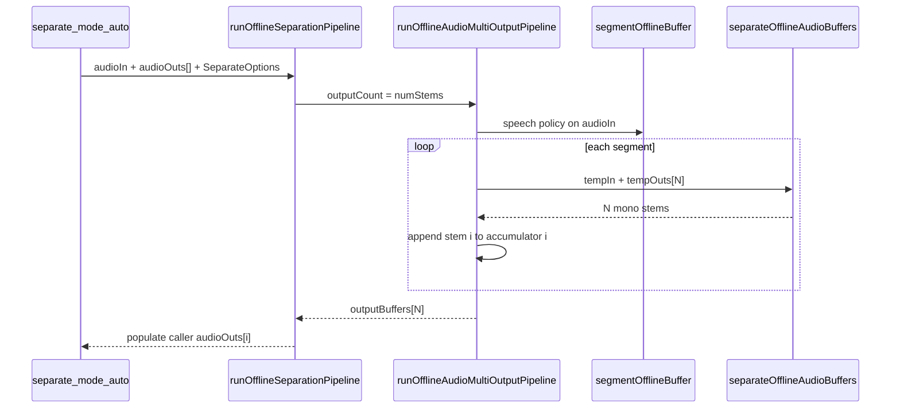

# Separation — Segmentation Engine (Offline)

## Zielbild

Nach dem Runtime-MVP wird der reservierte Pfad aktiviert:



**In Scope:** Offline `segmentation.mode: 'auto'` auf `SeparationEngine.separate(Offline, Offline[], options?)`.

**Out of Scope (eigener Milestone):** Live-Overload, `mode: 'manual'`, native Änderungen, Stereo-Output-Buffer.

---

## Architektur-Entscheidung: 1→N Orchestrator (Refactor, keine Code-Dopplung)

Enhancement nutzt [`runOfflineAudioPipeline`](src/pipeline/offlineOrchestrator.ts) (1 Input → 1 Output). Separation braucht **N parallele Stem-Outputs**, die pro Segment synchron befüllt werden.

**Wichtig:** Es geht **nicht** um das Kopieren von PCM-Werten oder eine copy-paste-Duplikation der Segment-Schleife. Stattdessen wird die bestehende Orchestrierungslogik **einmal extrahiert** und von Single- und Multi-Output parametrisiert wiederverwendet.

### Shared intern (eine Implementierung)

| Bereits vorhanden / bleibt shared | Rolle |
| --- | --- |
| `collectSpeechSegments` | Segmentierung via `segmentOfflineBuffer` |
| `OrchestrationSession` | Progress, completed/skipped/failed/cancelled |
| Recovery-Logik | retry / skip / partial_result / abort |
| `finalizeAudioAccumulator` | Live-Spool → Offline-Buffer |
| Append-APIs | `appendOfflineToLiveAudioBuffer`, Overlap-Trim, Silence-Padding bei skip |

### Neu: parametrisierte Segment-Schleife

Interne Helper-Funktion (Name z. B. `runOfflineAudioSegmentLoop`), die die Schleife aus `runOfflineAudioPipeline` (Zeilen ~549–770) **einmal** kapselt:

```typescript
// Pseudocode — intern in offlineOrchestrator.ts, nicht public
async function runOfflineAudioSegmentLoop(args: {
  input: OfflineAudioBufferIdSource;
  inputInfo: OfflineAudioBufferInfo;
  outputCount: number;
  consumer: (
    segIn: OfflineAudioBufferRef,
    segOuts: readonly OfflineAudioBufferRef[]
  ) => Promise<void>;
  config: OrchestrationConfig;
}): Promise<OrchestrationResult<readonly OfflineAudioBufferRef[]>>
```

**Parametrisierung nur an den Stellen, wo 1 vs N differiert:**

| Aspekt | `outputCount === 1` | `outputCount === N` |
| --- | --- | --- |
| Temp outputs pro Segment | 1× `tempOut` | N× `tempOut[i]` |
| Accumulators | 1× Live spool | N× Live spool |
| Overlap trim | auf einen Accumulator | **gleiches Trim auf alle N** (identische Segmentgrenzen) |
| Skip recovery | Silence in einen Accumulator | Silence in **alle N** Accumulators |
| Finalize | 1× `finalizeAudioAccumulator` | N× finalize → `outputBuffers[]` |
| Cleanup | `cleanupAudioTemporaries(in, out)` | `cleanupAudioTemporariesMulti(in, outs[])` |

PCM fließt weiterhin nur über die bestehenden Buffer-APIs (slice → consumer → append). Keine manuelle Sample-Kopie in Separation.

### Public API (zwei dünne Wrapper)

```typescript
export async function runOfflineAudioPipeline(
  input, consumer: (segIn, segOut) => Promise<void>, config
): Promise<OrchestrationResult<OfflineAudioBufferRef>>

export async function runOfflineAudioMultiOutputPipeline(
  input, outputCount, consumer: (segIn, segOuts) => Promise<void>, config
): Promise<OrchestrationResult<readonly OfflineAudioBufferRef[]>>
```

- `runOfflineAudioPipeline` → refactored auf `runOfflineAudioSegmentLoop({ outputCount: 1, … })` mit Adapter `(segIn, [segOut]) => consumer(segIn, segOut)` — **Verhalten und Signatur unverändert** (kein Breaking Change).
- `runOfflineAudioMultiOutputPipeline` → gleicher Helper mit `outputCount: N`.

Kein Duplikat der Recovery/Progress/Abort-Logik in `src/separation/` — nur der Consumer unterscheidet sich (`separateOfflineAudioBuffers` statt `enhanceOfflineAudioBuffers`).

---

## Phase 1 — Shared Orchestrator (Refactor + 1→N)

**Datei:** [`src/pipeline/offlineOrchestrator.ts`](src/pipeline/offlineOrchestrator.ts)

1. **Refactor:** Segment-Schleife aus `runOfflineAudioPipeline` in internen Helper `runOfflineAudioSegmentLoop` extrahieren (keine zweite Schleife, keine PCM-Kopie).
2. **`runOfflineAudioPipeline`** auf den Helper umstellen (`outputCount: 1`) — Verhalten identisch, bestehende Tests müssen grün bleiben.
3. **`runOfflineAudioMultiOutputPipeline`** exportieren — dünner Wrapper um denselben Helper (`outputCount: N`).
4. Hilfsfunktionen: `cleanupAudioTemporariesMulti`, ggf. `finalizeAudioAccumulators` (N× finalize).
5. `outputCount <= 0` → failed mit `ORCHESTRATION_INVALID_ARGUMENT`.

**Tests:** [`src/pipeline/__tests__/offline-orchestrator.test.ts`](src/pipeline/__tests__/offline-orchestrator.test.ts)

- **Regression:** alle bestehenden `runOfflineAudioPipeline`-Tests weiter grün (Refactor darf 1→1 nicht brechen).
- **Neu — Multi:** 2-output consumer; pro Segment N Outputs befüllt; am Ende `outputBuffers.length === N`.
- Overlap + skip recovery: alle Accumulators synchron.
- Abort / partial_result / failed (mindestens je 1 Test, analog 1→1).

---

## Phase 2 — Separation Orchestrator

**Datei:** [`src/separation/orchestrate.ts`](src/separation/orchestrate.ts)

Stub ersetzen — Blueprint: [`src/enhancement/orchestrate.ts`](src/enhancement/orchestrate.ts)

```typescript
const DEFAULT_SEPARATION_SEGMENTATION_POLICY: SegmentationPolicy = {
  evaluator: 'speech_energy_silence',
  silenceThresholdMs: 500,
  energyThresholdDb: -40,
  minSegmentMs: 1000,
  maxSegmentMs: 120000,  // wie Enhancement — harte OOM-Kappe
  hangoverMs: 300,
};

export async function runOfflineSeparationPipeline(
  audioIn: OfflineAudioBufferIdSource,
  instanceId: string,
  audioOuts: readonly OfflineAudioBufferIdSource[],
  options: SeparateOptions = {}
): Promise<SeparationResult>
```

**Ablauf:**

1. `numStems = await SherpaOnnx.getSeparationNumStems(instanceId)` — Mismatch zu `audioOuts.length` → `SEPARATION_INVALID_ARGUMENT` (wie MVP)
2. `validateSegmentationConfig({ mode, policy, featureName: 'offline source separation', domain: 'speech', supportsManual: false, defaultPolicy })`
3. `runOfflineAudioMultiOutputPipeline(audioIn, numStems, consumer, orchestrationConfig)`
4. Consumer: `runOfflineSeparationDirect(instanceId, segIn, segOuts)` (bestehende Batch-Primitive)
5. `OrchestrationResult` → `SeparationResult` mappen (`status`, counters, `processingTimeMs`)
6. Interne `outputBuffers[]` zurückgeben oder direkt in `runOfflineSeparationPipeline` befüllen — **Empfehlung:** Rückgabe von `outputBuffers` im Orchestration-Ergebnis, Populate in `index.ts` (Enhancement-Muster)

**Segmentation-Policy-Hinweis (Doku):** Mixed Music hat oft keine klaren Sprechpausen; `maxSegmentMs` ist der zuverlässige OOM-Hebel. Optional `speech_vad_model` wenn Nutzer VAD-Schnitte will.

**Tests:** [`src/separation/__tests__/orchestrate.test.ts`](src/separation/__tests__/orchestrate.test.ts) (neu)

- Mock `runOfflineAudioMultiOutputPipeline`
- Prüfen: default policy, consumer ruft `separateOfflineAudioBuffers` mit N Buffer-IDs, Options-Durchreichung (`errorRecovery`, `overlapSamples`, `onProgress`, `abortSignal`)

---

## Phase 3 — Public API Wiring

**Datei:** [`src/separation/index.ts`](src/separation/index.ts)

Enhancement-Pattern aus [`src/enhancement/index.ts`](src/enhancement/index.ts) (Zeilen 284–327):

```typescript
const mode = separateOptions?.segmentation?.mode ?? 'off';

if (mode === 'off') {
  await runOfflineSeparationDirect(...);
  return { status: 'complete', totalSegments: 1, ... };
}

const orchestrated = await runOfflineSeparationPipeline(
  audioIn, instanceId, audioOuts, separateOptions ?? {}
);

for (let i = 0; i < orchestrated.outputBuffers.length; i++) {
  await SherpaOnnx.populateOfflineAudioBufferIfEmpty(
    resolvePipelineAudioBufferId(audioOuts[i]),
    orchestrated.outputBuffers[i].bufferId,
    undefined
  );
  await releasePipelineAudioBuffer(orchestrated.outputBuffers[i].bufferId).catch(() => undefined);
}

return { status, totalSegments, completedSegments, skippedSegments, failedSegment?, processingTimeMs };
```

**Anpassungen:**

- MVP-Guard (`mode !== 'off'` throws) **entfernen**
- `mode === 'manual'` → weiterhin via `validateSegmentationConfig` mit `supportsManual: false` abgelehnt
- `releasePipelineAudioBuffer` importieren (wie Enhancement)

**Types:** [`src/separation/types.ts`](src/separation/types.ts) — Kommentare bei `SeparateOptions` / `SeparateSegmentationConfig` aktualisieren (`'auto'` supported; reserved fields jetzt aktiv)

**Tests:** [`src/separation/__tests__/createSeparation.test.ts`](src/separation/__tests__/createSeparation.test.ts)

- Ersetzen: „rejects auto mode“ → „routes auto mode to orchestrator“
- Neu: populate N caller buffers, partial/cancelled status propagation (Mock wie [`enhance-segmented.test.ts`](src/enhancement/__tests__/enhance-segmented.test.ts))

---

## Phase 4 — Dokumentation

**Datei:** [`docs/separation.md`](docs/separation.md)

- Abschnitt **Segmentation (planned)** → **Segmentation** (wie [`enhancement-offline.md#segmentation`](docs/enhancement-offline.md#segmentation))
- Beispiel: long mix + `segmentation: { mode: 'auto' }` + `errorRecovery: 'skip'`
- Hinweis OOM / `maxSegmentMs` / Boundary-Artefakte
- API-Reference `separate()`: MVP-Constraint „nur off“ entfernen; `auto` dokumentieren

**Optional klein:**

- [`docs/segmentation-engine.md`](docs/segmentation-engine.md) — Separation in Feature-Integration-Liste
- [`docs/memory-and-models.md`](docs/memory-and-models.md) — Separation als offline-only OOM-Kandidat erwähnen

Kein neues Native-TurboModule, kein Example-Screen (weiter deferred).

---

## Verifikation pro Phase

| Phase | Done when |
|-------|-----------|
| 1 | Refactor: eine Segment-Schleife im Helper; 1→1 Regression grün; `runOfflineAudioMultiOutputPipeline` Tests grün |
| 2 | `runOfflineSeparationPipeline` implementiert; orchestrate Tests grün |
| 3 | `createSeparation().separate(..., { segmentation: { mode: 'auto' }})` End-to-End in Unit-Tests; `mode: 'off'` unverändert |
| 4 | `separation.md` beschreibt auto-Segmentierung; kein „planned“-Widerspruch |

**Manuell (später):** Langes WAV + UVR/Spleeter auf Device — RAM beobachten, Stem-Länge = Input-Länge, `SeparationResult.totalSegments > 1`.

---

## Was bewusst nicht gebaut wird

- **Native C++ / JNI / iOS:** unverändert — Batch-Primitive `separateOfflineAudioBuffers` reicht
- **Live-Overload:** separater Milestone ([live-overload doc §5.1](docs/migration/liveOverload/offline-stt-live-pipeline-mandatory-segmentation.md))
- **`segmentation.mode: 'manual'`:** wie Enhancement offline nicht supported
- **Stereo-/Multi-Channel-Output:** weiter mono-downmix MVP
