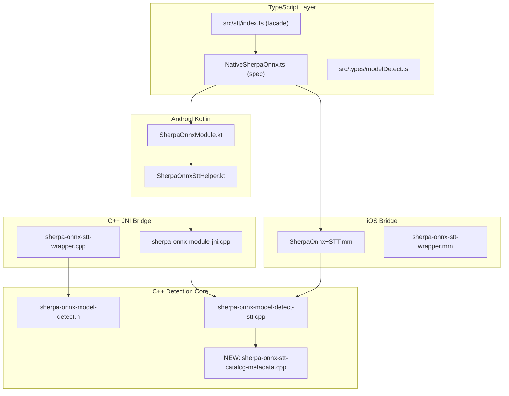

# STT Detection Rework -- Align with TTS Pattern

## Architecture Overview



## Layer-by-Layer Changes

### 1. C++ Header -- `SttDetectResult` struct expansion

File: [sherpa-onnx-model-detect.h](android/src/main/cpp/jni/model_detect/common/sherpa-onnx-model-detect.h) (lines 233-241)

Current `SttDetectResult`:
- `ok`, `error`, `isHardwareSpecificUnsupported`, `detectedModels`, `selectedKind`, `tokensRequired`, `paths`

Add the following fields (matching `TtsDetectResult` pattern at lines 244-260):
- `std::vector<DetectionSource> detectionSources` -- trace of how detection chose the kind
- `std::vector<std::string> derivedLanguages` -- from catalog heuristics (stub initially)
- `std::string quantization` -- fp16, int8, etc. from name heuristics

Keep STT-specific fields: `isHardwareSpecificUnsupported`, `tokensRequired`.

### 2. C++ Header -- `DetectSttModel` signature change

Same file, lines 284-289. Change from:

```cpp
SttDetectResult DetectSttModel(
    const std::string& modelDir,
    const std::optional<bool>& preferInt8,
    const std::optional<std::string>& modelType,
    bool debug = false);
```

To (TTS-parallel ordering):

```cpp
SttDetectResult DetectSttModel(
    const std::optional<std::string>& model_dir,
    const std::optional<std::string>& asset_name,
    const std::string& modelType = "auto",
    const std::optional<bool>& preferInt8 = std::nullopt,
    bool debug = false);
```

Also update `DetectSttModelFromFileList` (lines 295-300) to accept `preferInt8` and `modelType` as non-optional defaults where appropriate.

### 3. C++ Core -- `sherpa-onnx-model-detect-stt.cpp`

File: [sherpa-onnx-model-detect-stt.cpp](android/src/main/cpp/jni/model_detect/stt/sherpa-onnx-model-detect-stt.cpp)

**3a. Extract shared detection into `DetectSttModelFromFiles` (static)**

Analogous to TTS `DetectTtsModelFromFiles` (tts line 162): move the body of the current `DetectSttModel` (lines 768-899: from `GatherSttCandidatePaths` through validation and path assignment) into a new `static SttDetectResult DetectSttModelFromFiles(files, modelDir, modelType, preferInt8)`.

At the top of this function, add the **name-only early return** when `files.empty()`:
- Set `detectionSources` to `kNameOnly`
- Run `GetKindsFromDirName` on the synthetic dir string
- Populate `detectedModels` from dir-name candidates
- If `modelType != "auto"`, parse it and set `selectedKind` + `kExplicitModelType`; otherwise pick first dir-name candidate
- Set `ok = false` with error "STT: Name-only detection cannot validate files; run a full directory scan before createSTT."
- Return early (no paths, no validation)

When files are present (full scan): add `AppendUniqueDetectionSource` calls (same helper as TTS) at:
- Start of file scan: `kFileListing`
- After `ResolveSttKind` picks from dir name: `kDirName`
- After fallback order: `kFallbackOrder`
- When explicit modelType is used: `kExplicitModelType`

**3b. Rewrite public `DetectSttModel`**

Same pattern as `DetectTtsModel` (tts lines 381-445):
- Check `has_dir` / `has_asset` (both optional), reject if both empty
- Asset-only path: call `DetectSttModelFromFiles({}, "m/" + assetName, modelType, preferInt8)` then `FillSttDerivedCatalogMetadata`
- Dir-exists path: `ListFilesRecursive`, call `DetectSttModelFromFiles`, then fill catalog metadata from `asset_name` (if present) or dir basename

**3c. Update `DetectSttModelFromFileList` (test-only)**

Adjust to call into the new shared `DetectSttModelFromFiles` (same as TTS pattern at line 449).

### 4. New file -- `sherpa-onnx-stt-catalog-metadata.{h,cpp}`

Analogous to [sherpa-onnx-tts-catalog-metadata.cpp](android/src/main/cpp/jni/model_detect/tts/sherpa-onnx-tts-catalog-metadata.cpp):

```cpp
void FillSttDerivedCatalogMetadata(SttDetectResult& r, const std::string& idForHeuristics);
void FillSttDerivedCatalogMetadataUsingModelDirBasename(SttDetectResult& r, const std::string& modelDir);
```

These delegate to the existing shared `FillDerivedCatalogMetadata` / `FillDerivedCatalogMetadataFromBasename` in [sherpa-onnx-catalog-metadata.h](android/src/main/cpp/jni/model_detect/common/sherpa-onnx-catalog-metadata.h), writing into the new `derivedLanguages` and `quantization` fields on `SttDetectResult`. (No `sizeTier` for STT since it is not applicable; leave that field out of the struct.)

### 5. JNI Bridge -- `sherpa-onnx-module-jni.cpp`

File: [sherpa-onnx-module-jni.cpp](android/src/main/cpp/jni/module/sherpa-onnx-module-jni.cpp) (lines 150-173)

Change `nativeDetectSttModel` JNI signature to match TTS pattern (lines 177-200):

```cpp
Java_com_sherpaonnx_SherpaOnnxModule_nativeDetectSttModel(
    JNIEnv* env, jobject,
    jstring j_model_dir,       // nullable
    jstring j_asset_name,      // nullable (NEW)
    jstring j_model_type,      // "auto" default
    jboolean j_prefer_int8,
    jboolean j_has_prefer_int8,
    jboolean j_debug)
```

Build `optional<string>` for `model_dir` and `asset_name` (same null-checking as TTS JNI), then call the new `DetectSttModel(model_dir, asset_name, model_type, prefer_int8, j_debug)`.

### 6. JNI Wrapper -- `sherpa-onnx-stt-wrapper.cpp`

File: [sherpa-onnx-stt-wrapper.cpp](android/src/main/cpp/jni/model_detect/stt/sherpa-onnx-stt-wrapper.cpp)

Extend `SttDetectResultToJava` to also marshal:
- `detectionSources` as `ArrayList<String>` (same pattern as [sherpa-onnx-tts-wrapper.cpp](android/src/main/cpp/jni/model_detect/tts/sherpa-onnx-tts-wrapper.cpp) lines 63-74)
- `languages` from `derivedLanguages` (same pattern as TTS wrapper lines 76-82)
- `quantization` string (same as TTS wrapper line 83)

### 7. Kotlin -- `SherpaOnnxModule.kt`

File: [SherpaOnnxModule.kt](android/src/main/java/com/sherpaonnx/SherpaOnnxModule.kt)

**7a. `external` declaration** (line 1475-1481): change to:

```kotlin
private external fun nativeDetectSttModel(
  modelDir: String?,
  assetName: String?,
  modelType: String,
  preferInt8: Boolean,
  hasPreferInt8: Boolean,
  debug: Boolean
): HashMap<String, Any>?
```

**7b. Lambda in `sttHelper`** (line 50-54): update signature to include `assetName`.

**7c. Public `detectSttModel`** (line 405-458): add `assetName` and `debug` parameters; marshal new result fields (`detectionSources`, `languages`, `quantization`) into the promise result, matching what TTS does. Pass `"auto"` for `modelType` consistently (not empty/null).

### 8. Kotlin -- `SherpaOnnxSttHelper.kt`

File: [SherpaOnnxSttHelper.kt](android/src/main/java/com/sherpaonnx/SherpaOnnxSttHelper.kt)

Update the `detectSttModel` lambda type (line 39-45) to include `assetName: String?` in the correct position. Update `initializeStt` (line 203) to call with `assetName = null` (init always has a real directory).

### 9. iOS -- `SherpaOnnx+STT.mm`

File: [SherpaOnnx+STT.mm](ios/SherpaOnnx+STT.mm) (lines 281-320)

**9a. Signature**: add `assetName:(NSString*)` and `debug:(NSNumber*)` parameters.

**9b. C++ call**: build `optional<string>` for both `model_dir` and `asset_name`, always pass `modelType` as `"auto"` string when nil/empty (not `nullopt` -- unification with Android).

**9c. Result dict**: marshal `detectionSources`, `languages` (from `derivedLanguages`), `quantization` into the NSDictionary, matching the TTS pattern in [SherpaOnnx+TTSInit.mm](ios/tts/bridge/SherpaOnnx+TTSInit.mm) lines 193-212.

### 10. iOS -- `sherpa-onnx-stt-wrapper.mm`

File: [sherpa-onnx-stt-wrapper.mm](ios/stt/sherpa-onnx-stt-wrapper.mm) (line 196)

Update the `DetectSttModel(...)` call inside `initialize` to match the new signature: `DetectSttModel(optional(modelDir), nullopt, modelType, preferInt8, debug)`.

### 11. TypeScript Spec -- `NativeSherpaOnnx.ts`

File: [NativeSherpaOnnx.ts](src/NativeSherpaOnnx.ts) (lines 85-97)

Change `detectSttModel` to:

```typescript
detectSttModel(
  modelDir: string,
  assetName: string | null,
  modelType?: string | null,
  preferInt8?: boolean,
  debug?: boolean
): Promise<{
  success: boolean;
  error?: string;
  isHardwareSpecificUnsupported?: boolean;
  detectedModels: Array<{ type: string; modelDir: string }>;
  modelType?: string;
  languages?: string[];
  quantization?: string;
  detectionSources?: string[];
}>;
```

### 12. TypeScript Types -- `modelDetect.ts`

File: [modelDetect.ts](src/types/modelDetect.ts)

Add `SttDetectModelResult`:

```typescript
export interface SttDetectModelResult extends ModelDetectResultBase {
  isHardwareSpecificUnsupported?: boolean;
}
```

### 13. TypeScript Facade -- `src/stt/index.ts`

File: [src/stt/index.ts](src/stt/index.ts) (lines 58-94)

Update `detectSttModel` to:
- Accept optional `assetName` in options (or derive from `modelPath` for catalog-style)
- Pass `assetName`, `debug` to `SherpaOnnx.detectSttModel`
- Parse and expose `detectionSources`, `languages`, `quantization` from the raw result (same pattern as TTS facade in [src/tts/index.ts](src/tts/index.ts) lines 75-125)
- Return `SttDetectModelResult` type

### 14. Streaming STT caller -- `src/stt/streaming.ts`

File: [src/stt/streaming.ts](src/stt/streaming.ts) (line 163)

Update the `SherpaOnnx.detectSttModel(...)` call to pass `null` for `assetName` (second arg) and adjust subsequent positional args.

### 15. Tests -- `model_detect_test.cpp`

File: [model_detect_test.cpp](test/cpp/model_detect/model_detect_test.cpp)

Update all `DetectSttModelFromFileList(files, dir, preferInt8, modelType)` calls (lines 113, 133, 313, 323, 334, 347, 360, 378) to match the new signature. Since the test-only function keeps a simpler signature, this is mostly adjusting parameter order.

## Parameter Ordering Summary (all layers)

```
C++:       (model_dir?, asset_name?, modelType="auto", preferInt8?, debug=false)
JNI:       (j_model_dir, j_asset_name, j_model_type, j_prefer_int8, j_has_prefer_int8, j_debug)
Kotlin:    (modelDir?, assetName?, modelType, preferInt8, hasPreferInt8, debug)
iOS:       (modelDir, assetName, modelType, preferInt8, debug)
TS spec:   (modelDir, assetName, modelType?, preferInt8?, debug?)
TS facade: (modelPath, options?: { modelType?, preferInt8?, debug? })
```
