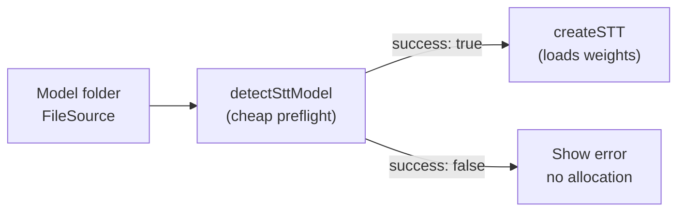
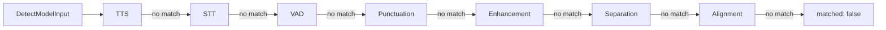

# Model detection & initialization

Inspect model folders, validate required files, and choose how to pass paths to engines — **without loading weights**.

| Doc | Question it answers |
| --- | --- |
| [model-setup.md](model-setup.md) | Where is my model? How do I build a `FileSource`? |
| **This page** | What type is this? Is it valid? Auto or custom init? |
| [model-languages.md](model-languages.md) | Language codes for pickers / `modelOptions` |

**Import:** `react-native-sherpa-onnx/detect` (unified) · feature packages (`/stt`, `/tts`, `/vad`, …) for feature-specific detect

---

## Table of contents

- [Why detection exists](#why-detection-exists)
- [Quick start](#quick-start)
- [Unified vs feature-specific detection](#unified-vs-feature-specific-detection)
- [Init modes: auto vs custom](#init-modes-auto-vs-custom)
- [Custom path validation](#custom-path-validation)
- [Required files per feature](#required-files-per-feature)
- [Unified detector order](#unified-detector-order)
- [QNN and ModelCategory](#qnn-and-modelcategory)
- [API reference](#api-reference)
- [Feature-specific detect APIs](#feature-specific-detect-apis)
- [See also](#see-also)

---

## Why detection exists

`detect*Model` functions answer three questions **before** you pay for engine init:

1. **What model family is this?** (`modelType` — e.g. `whisper`, `vits`, `silero_vad`)
2. **Are the required files present?** (`success` / `error`, missing-file messages)
3. **What else can I show in UI?** (languages, quantization, streaming hint, lexicon list)



| | Detection | Engine init |
| --- | --- | --- |
| Loads ONNX weights | **No** | Yes |
| Allocates recognizer / TTS / VAD runtime | **No** | Yes |
| Speed | Fast (file scan + validate) | Slow (ORT session creation) |
| Returns | `modelType`, `success`, `error`, `paths` | Live engine handle |
| When to skip | Single known-good bundled pack | Model pickers, downloads, diagnostics |

> [!NOTE]
> **`createSTT({ modelType: 'auto' })` runs the same native auto-selection internally.** You do not *need* a separate detect call for init to work. Use detect when you want to **validate early**, build a model picker, or show errors before allocation.

---

## Quick start

### 1) Preflight before STT init

```typescript
import { bundledModelFileSource } from 'react-native-sherpa-onnx/utils';
import { detectSttModel, createSTT } from 'react-native-sherpa-onnx/stt';

const modelSource = bundledModelFileSource('models/sherpa-onnx-whisper-tiny-en');

const det = await detectSttModel(modelSource);
if (!det.success) throw new Error(det.error ?? 'STT pack invalid');

// Prefer modelType: 'auto' on create — same native selection path
const stt = await createSTT({ modelSource, modelType: 'auto' });
```

### 2) Catalog row — unknown category

```typescript
import { detectModel } from 'react-native-sherpa-onnx/detect';

const result = await detectModel({
  kind: 'fs',
  path: '/absolute/path/to/extracted-model-dir',
});

if (result.matched) {
  console.log(result.category, result.modelType, result.languages);
}
```

### 3) Custom init — skip folder detection

```typescript
import { createSTT } from 'react-native-sherpa-onnx/stt';

const stt = await createSTT({
  initMode: 'custom',
  modelType: 'transducer',
  customConfig: {
    encoder: { kind: 'fs', path: '/data/models/encoder.onnx' },
    decoder: { kind: 'fs', path: '/data/models/decoder.onnx' },
    joiner: { kind: 'fs', path: '/data/models/joiner.onnx' },
    tokens: { kind: 'fs', path: '/data/models/tokens.txt' },
  },
});
```

No `detectSttModel` call — validation runs via native `validateCustomModelPaths`. See [Init modes](#init-modes-auto-vs-custom).

### 4) Batch scan for a model library

```typescript
import { detectModelsBatch, detectModelResultMatchesCategory } from 'react-native-sherpa-onnx/detect';
import { ModelCategory } from 'react-native-sherpa-onnx/download';

const results = await detectModelsBatch(
  [
    { kind: 'fs', path: '/data/models/pack-a' },
    { assetName: 'vits-piper-en_US-lessac-medium' },
  ],
  { concurrency: 8 }
);

results.forEach((r, i) => {
  if (r.matched && detectModelResultMatchesCategory(ModelCategory.Stt, r)) {
    console.log('STT pack', i, r.modelType);
  }
});
```

---

## Unified vs feature-specific detection

Two API layers — same native detectors, different JS payloads.

| | Unified (`detect`) | Feature-specific (`detectSttModel`, …) |
| --- | --- | --- |
| **Import** | `react-native-sherpa-onnx/detect` | Feature package (`/stt`, `/tts`, …) |
| **Input** | `FileSource` or `{ assetName }` | `FileSource` |
| **Output** | Compact: `category`, `modelType`, `languages`, `quantization`, `isStreaming` | Full: `success`, `error`, `detectedModels`, `paths`, `detectionSources` |
| **Validates required files** | No (category/type only) | **Yes** |
| **Best for** | Model library UX, batch scans, HF catalog hints | Before `create*` / per-call init when you know the feature |

| Scenario | Use |
| --- | --- |
| "What is this download?" (category unknown) | `detectModel` |
| Scan many folders (catalog, author validation) | `detectModelsBatch` |
| Filter STT vs QNN in a unified result | `detectModelResultMatchesCategory` |
| Before `createSTT` with required-file checks | `detectSttModel` |
| Before `createTTS` with lexicon metadata | `detectTtsModel` |
| VAD / punctuation / enhancement / alignment init | Matching `detect*Model` on the feature package |

Unified detection tries domains in fixed order (first hit wins) — see [Unified detector order](#unified-detector-order). When you **know** the target feature, prefer that feature's `detect*Model` so validation and `paths` match engine init exactly.

---

## Init modes: auto vs custom

Every engine that loads model weights accepts one of two init modes. Policy-level features (alignment accurate, segmentation `speech_vad_model`) follow the same pattern on their options object — no persistent engine init.

```mermaid
flowchart TD
  call["createSTT / createTTS / createStreamingVAD / …\nor alignTextToAudio / segmentOfflineBuffer policy"]
  branch{initMode?}
  auto["auto (default)\nmodelSource: FileSource folder\n→ detect*Model internally\n→ resolved paths → native init"]
  custom["custom\ninitMode: 'custom'\nmodelType: concrete\n customConfig: FileSource per file\n→ validateCustomModelPaths\n→ resolved paths → native init"]
  native["Native engine / policy"]

  call --> branch
  branch -->|"default / omitted"| auto --> native
  branch -->|"'custom'"| custom --> native
```

### Auto mode (default)

Pass a **folder** as `modelSource` (`FileSource`). The SDK:

1. Resolves `FileSource` → absolute directory ([model-setup.md](model-setup.md))
2. Runs native file scan + type selection (`modelType: 'auto'` or explicit type)
3. Validates required files for the chosen type
4. Loads weights

```typescript
const stt = await createSTT({
  modelSource: bundledModelFileSource('models/sherpa-onnx-whisper-tiny-en'),
  modelType: 'auto', // native picks from folder contents
});
```

**Expected folder layout:** one directory with ONNX + sidecar files for one model family. See [Expected folder layouts](model-setup.md#expected-folder-layouts).

Optional **`detect*Model` preflight** before init — same scan, no allocation ([Why detection exists](#why-detection-exists)).

### Custom mode (`initMode: 'custom'`)

Use when files are **not** in one detectable folder — non-standard names, scattered paths, or detection fails but you know the model family.

| Field | Value |
| --- | --- |
| `initMode` | `'custom'` |
| `modelType` | Concrete type (`'transducer'`, `'vits'`, `'silero_vad'`, …) — **not** `'auto'` |
| `customConfig` | One **`FileSource` per required file** (keys match native validate tables) |

Auto-detection is **skipped**. Each `FileSource` is resolved to an absolute path, then native **`validateCustomModelPaths(category, modelType, paths)`** runs (C++ `validate-*.cpp` tables).

```typescript
const vad = await createStreamingVAD({
  initMode: 'custom',
  modelType: 'silero_vad',
  customConfig: {
    model: { kind: 'fs', path: '/data/models/silero_vad.onnx' },
  },
  sampleRate: 16000,
});
```

Query path keys for UI forms:

```typescript
import {
  getCustomModelPathRequirements,
  requiredCustomModelPathFieldKeys,
} from 'react-native-sherpa-onnx/detect';

const { fields } = await getCustomModelPathRequirements('stt', 'transducer');
// fields: [{ key: 'encoder', required: true, kind: 'file' }, ...]
const requiredKeys = requiredCustomModelPathFieldKeys({ fields });
```

Path keys per feature: [Required files per feature](#required-files-per-feature) below and each feature doc.

### Init by feature (where custom applies)

| Feature | Init point | Auto field | Custom field |
| --- | --- | --- | --- |
| STT offline | `createSTT` | `modelSource` | `customConfig` |
| STT streaming | `createStreamingSTT` | `modelSource` | `customConfig` (category `stt_streaming`) |
| TTS | `createTTS` | `modelSource` | `customConfig` |
| VAD | `createStreamingVAD` | `modelSource` | `customConfig` |
| Enhancement | `createEnhancement` / `createStreamingEnhancement` | `modelSource` | `customConfig` |
| Punctuation offline | `createOfflinePunctuation` | `modelSource` | `customConfig` |
| Punctuation streaming | `createStreamingPunctuation` | `modelSource` | `customConfig` |
| Alignment | `alignTextToAudio` (`mode: 'accurate'` only) | `modelSource` | `customConfig` — **per call**, no engine init |
| Segmentation | `segmentOfflineBuffer` / policy (`speech_vad_model`) | `modelPath` | `customConfig` — reuses VAD keys |

No TurboModule `initialize*` entry for alignment or segmentation — see [sdk-init-bridge.md](sdk-init-bridge.md).

TypeScript helpers: `src/stt/customConfig.ts`, `src/vad/customConfig.ts`, etc. Runtime truth is native validate tables.

---

## Custom path validation

Native C++ `validate-*.cpp` tables are the single source of truth for which path keys each model type requires.

```typescript
import {
  getCustomModelPathRequirements,
  validateCustomModelPaths,
} from 'react-native-sherpa-onnx/detect';

// 1) Schema for forms / slot pickers
const schema = await getCustomModelPathRequirements('stt', 'transducer');
// { fields: [{ key: 'encoder', required: true, kind: 'file' }, ...] }

// 2) Runtime check on resolved absolute paths
const result = await validateCustomModelPaths('tts', 'vits', {
  ttsModel: '/path/model.onnx',
  tokens: '/path/tokens.txt',
});
if (!result.ok) {
  console.warn(result.error, result.missingRequired);
}
```

| API | Purpose |
| --- | --- |
| `getCustomModelPathRequirements(category, modelType)` | Read-only schema — ordered `fields[]` with `required` and `kind` (`file` \| `dir`) |
| `validateCustomModelPaths(category, modelType, paths)` | Enforces non-empty paths + family-specific rules |

Categories: `stt`, `stt_streaming`, `tts`, `vad`, `enhancement`, `separation`, `punctuation`, `alignment`.

> [!NOTE]
> **`stt_streaming`** keys differ from offline `stt` (e.g. streaming transducer uses `encoder`/`decoder`/`joiner`/`tokens`; offline CTC uses `ctcModel`/`tokens`). Always query the schema for the exact category.

Segmentation `speech_vad_model` custom policy reuses **`vad`** category and key `model` — no separate `src/segment/customConfig.ts`. See [segmentation-engine.md](segmentation-engine.md#custom-model-path-initmode-custom).

Validation checks **non-empty resolved path strings** — not ONNX correctness or on-disk existence at validate time.

---

## Required files per feature

Each feature doc has the full per-`modelType` table. Summary of where to look:

| Feature | Doc | Detect function | Validate category |
| --- | --- | --- | --- |
| STT offline | [stt-offline.md](stt-offline.md#validation-required-files) | `detectSttModel` | `stt` |
| STT streaming | [stt-streaming.md](stt-streaming.md#validation-required-files) | `detectSttModel` | `stt_streaming` |
| TTS | [tts-offline.md](tts-offline.md#validation-required-files) | `detectTtsModel` | `tts` |
| VAD | [vad-streaming.md](vad-streaming.md#validation-required-files) | `detectVadModel` | `vad` |
| Enhancement | [enhancement-offline.md](enhancement-offline.md#validation-required-files) | `detectEnhancementModel` | `enhancement` |
| Separation | [separation.md](separation.md#validation-required-files) | `detectSeparationModel` | `separation` |
| Punctuation offline | [punctuation-offline.md](punctuation-offline.md#validation-required-files) | `detectPunctuationModel` | `punctuation` |
| Punctuation streaming | [punctuation-streaming.md](punctuation-streaming.md#validation-required-files) | `detectPunctuationModel` | `punctuation` |
| Alignment | [alignment-offline.md](alignment-offline.md#validation-required-files) | `detectAlignmentModel` | `alignment` |
| Segmentation VAD policy | [segmentation-engine.md](segmentation-engine.md#custom-model-path-initmode-custom) | `detectVadModel` (auto) | `vad` (custom) |

**How native detection picks files:** scans the resolved directory recursively, maps filenames to engine roles, lists all matching families in `detectedModels`, then validates the highest-probability one as `modelType`. Same rules as `create*` with `modelType: 'auto'`.

---

## Unified detector order

Native unified detection (`detectModel` / `detectModelsBatch`) tries domains in this order — **first hit wins**:



A domain counts as a hit when native detection succeeds and `modelType !== 'unknown'`. No match → `{ matched: false }` (no thrown error).

When you **know** the target feature, use that feature's `detect*Model` — avoids misclassification and returns full validation payload.

---

## QNN and ModelCategory

QNN release packs are **STT** models with a specific naming convention. Unified detect sets:

- `category: ModelCategory.Stt`
- `supportsQnn: true` when the asset name matches the QNN binary pattern (`isQnnModelName`)

| Filter | Matches when |
| --- | --- |
| `ModelCategory.Qnn` | `category === Stt` && `supportsQnn === true` |
| `ModelCategory.Stt` | `category === Stt` && `supportsQnn !== true` |
| Other categories | `result.category === category` |

Use `detectModelResultMatchesCategory(ModelCategory.Qnn, result)` for QNN catalog slices.

---

## API reference

### `detectModel(input)`

```typescript
function detectModel(input: DetectModelInput): Promise<DetectModelResult>;
```

```typescript
const r = await detectModel({ kind: 'fs', path: '/path/to/model' });
if (r.matched) console.log(r.category, r.modelType);
```

Single unified detect call after input resolution. On folder scans, matched results may include `paths`, `detectionSources`, and `detectedModels` when native file-based detection resolves them.

---

### `detectModelsBatch(inputs, options?)`

```typescript
function detectModelsBatch(
  inputs: readonly DetectModelInput[],
  options?: { concurrency?: number; includePaths?: boolean }
): Promise<DetectModelResult[]>;
```

```typescript
const rows = await detectModelsBatch([{ assetName: 'foo' }, { assetName: 'bar' }], { concurrency: 4 });
const withPaths = await detectModelsBatch(inputs, { includePaths: true });
```

Default concurrency: `8`. `includePaths` defaults to `false` (omit `paths` from matched batch rows). Single `detectModel` always includes `paths` when present. One native batch call per chunk. Result order matches input order.

---

### `detectModelResultMatchesCategory(category, result)`

```typescript
function detectModelResultMatchesCategory(
  category: ModelCategory,
  result: DetectModelMatchedResult
): boolean;
```

Call only when `result.matched === true`. Handles QNN / STT split — see [QNN](#qnn-and-modelcategory).

---

### `isQnnModelName(name)`

```typescript
function isQnnModelName(name: string): boolean;
```

Shared naming check for QNN binary releases.

---

### `resolveFileSourceForDetect(source)`

```typescript
function resolveFileSourceForDetect(source: FileSource): Promise<{
  modelDir: string;
  assetName: string | null;
}>;
```

Maps `FileSource` to native detect inputs. Same resolution path used internally by unified and feature detect. `resolveFileSourceForModelInit` uses the same mapping for engine init.

Invalid paths reject with `FILEIO_*` before native detection runs.

---

### `getCustomModelPathRequirements(category, modelType)`

```typescript
type CustomModelPathFieldKind = 'file' | 'dir';

type CustomModelPathField = {
  key: string;
  required: boolean;
  kind: CustomModelPathFieldKind;
};

type CustomModelPathRequirements = {
  fields: ReadonlyArray<CustomModelPathField>;
};

function getCustomModelPathRequirements(
  category: string,
  modelType: string
): Promise<CustomModelPathRequirements>;
```

Read-only schema for custom-init. Do not hardcode key lists in app code.

`fields` preserves declaration order from native C++ requirement tables. Each entry carries:

- `key` — config key passed to `customConfig` / `validateCustomModelPaths`
- `required` — whether native validation treats the key as mandatory
- `kind` — `'file'` or `'dir'` (for example TTS `dataDir` → `'dir'`)

Helpers (same module):

```typescript
function customModelPathFieldKeys(
  requirements: CustomModelPathRequirements
): string[];

function requiredCustomModelPathFieldKeys(
  requirements: CustomModelPathRequirements
): string[];
```

---

### `validateCustomModelPaths(category, modelType, paths)`

```typescript
function validateCustomModelPaths(
  category: string,
  modelType: string,
  paths: Record<string, string>
): Promise<{ ok: boolean; error?: string; missingRequired?: string[] }>;
```

Runtime validation on resolved absolute path strings. Used internally by `resolve*CustomConfigPaths` helpers.

---

### `DetectModelInput` / `DetectModelResult`

```typescript
type DetectModelInput = FileSource | { assetName: string; modelDir?: string };

type DetectModelResult =
  | { matched: false }
  | {
      matched: true;
      category: ModelCategory;
      modelType: string;
      languages: string[];
      quantization: Quantization;
      sizeTier: SizeTier;
      isStreaming: boolean;
      isHardwareSpecificUnsupported?: boolean;
      supportsQnn?: boolean;
      /** Non-empty resolved path keys from native folder detection. */
      paths?: Record<string, string>;
      detectionSources?: DetectionSource[];
      detectedModels?: DetectedModelEntry[];
    };
```

`paths` uses the same string keys as `validateCustomModelPaths` / custom init (`encoder`, `ttsModel`, `dataDir`, …). Only non-empty values are included.

Name-only input (`{ assetName }`) uses native name heuristics when no listable directory exists.

**Language rows:** Native detect returns `languages` as `{ iso6391Hint, id }[]` on the raw bridge. Feature detect APIs expose the same shape on `detect*Model().languages`. Unified `detectModel()` still exposes `languages: string[]` (ISO hints only for download catalog). When folder/name heuristics produce no rows, native appends curated lists from [`catalog/model-language-catalog.json`](../catalog/model-language-catalog.json) and records `curatedCatalog` in `detectionSources`. Folder-derived rows always win when non-empty. See [model-languages.md](model-languages.md).

---

## Feature-specific detect APIs

Full payloads (`success`, `error`, `detectedModels`, `paths`, `detectionSources`) — use when initializing engines.

| Feature | Function | Guide |
| --- | --- | --- |
| STT offline | `detectSttModel` | [stt-offline.md — Detection](stt-offline.md#detection-and-factory) |
| STT streaming | `detectSttModel` | [stt-streaming.md](stt-streaming.md#model-detection) |
| TTS | `detectTtsModel` | [tts-offline.md — Model detection](tts-offline.md#model-detection) |
| VAD | `detectVadModel` | [vad-streaming.md — Model detection](vad-streaming.md#model-detection) |
| Punctuation | `detectPunctuationModel` | [punctuation-offline.md](punctuation-offline.md#model-detection) |
| Enhancement | `detectEnhancementModel` | [enhancement-offline.md](enhancement-offline.md#model-detection) |
| Alignment | `detectAlignmentModel` | [alignment-offline.md](alignment-offline.md#model-detection) |

The download module uses unified batch detection internally. App catalog code should prefer `detect` over calling multiple `detect*Model` APIs in sequence.

---

## See also

- [Model setup](model-setup.md) — `FileSource`, bundled/PAD/downloaded paths
- [Model languages](model-languages.md) — language pickers
- [Ship model delivery (PAD & ODR)](model-delivery-pad-odr.md)
- [Memory & models](memory-and-models.md) — detect before heavy init
- [Execution providers](execution-providers.md) — QNN setup after identifying QNN packs
- [File I/O](fileio.md) — `FileSource` type reference
