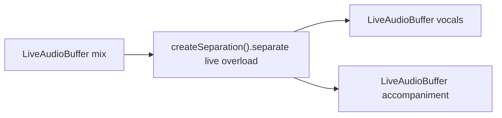

# Source separation (live overload)

> **Live overload** — not a streaming separation model.
>
> Live audio is sliced by mandatory `continuous_frames` segmentation; each committed chunk is separated natively with the same offline Spleeter/UVR weights into N live stem buffers. There is no separate online/streaming separation engine in sherpa-onnx.

## Introduction

On-device **live-pipeline** source separation (vocals vs accompaniment) via live overload on the offline engine. Stem order: `[0]=vocals`, `[1]=accompaniment` (UVR: non-vocals). Constants: `SEPARATION_STEM_LABELS`. For batch separation on offline buffers, see [separation-offline.md](separation-offline.md).

Import path: **`react-native-sherpa-onnx/separation`**.

Factory / detect / models: [separation-offline.md](separation-offline.md#api-reference).

## Quick start

```ts
import { createSeparation } from 'react-native-sherpa-onnx/separation';
import {
  createEmptyLiveAudioBuffer,
  finalizeLiveAudioBuffer,
} from 'react-native-sherpa-onnx/audiobuffer';

const sep = await createSeparation({
  modelSource: { kind: 'fs', path: '/absolute/path/to/uvr-model-dir' },
});

const sr = await sep.getSampleRate();
const numStems = await sep.getNumStems();
const liveIn = await createEmptyLiveAudioBuffer({ sampleRate: sr, channelCount: 1 });
const liveOuts = await Promise.all(
  Array.from({ length: numStems }, () =>
    createEmptyLiveAudioBuffer({ sampleRate: sr, channelCount: 1 })
  )
);

const handle = await sep.separate(liveIn, liveOuts, {
  segmentation: {
    mode: 'auto',
    policy: { evaluator: 'continuous_frames', checkpointIntervalMs: 500 },
  },
});

// Mic ingest → liveIn, then stop / finalize when done
const completion = await handle.completed;
console.log(`Separated ${completion.unitsWritten} samples (stem 0 reference)`);

await handle.stop();
await finalizeLiveAudioBuffer(liveOuts[0]!);
await finalizeLiveAudioBuffer(liveOuts[1]!);
await sep.destroy();
```

## Buffer matrix

| Role | Type | Notes |
| --- | --- | --- |
| **Audio in** | [`LiveAudioBuffer`](audiobuffer-streaming.md) | Mixed PCM (offline path uses `OfflineAudioBuffer`) |
| **Audio out × N** | [`LiveAudioBuffer`](audiobuffer-streaming.md) × N | One live stem per stem; offline uses `OfflineAudioBuffer` × N; MVP mono-downmixed |
| **Return** | `SeparationPipelineHandle` | Offline returns `SeparationResult` |
| **Engine** | Same `SeparationEngine` as offline (`createSeparation`) | `separate(Live, Live[], options)` |
| **Pipeline handle** | `SeparationPipelineHandle` | `stop` / `flush` / `reset` / `getStatus` / `completed` |

Mixed live/offline arguments throw `SEPARATION_INVALID_ARGUMENT`.

## Segmentation (Mandatory)

Live separation must cut the incoming audio stream into committed chunks before each offline separate step. `options.segmentation.policy` is **required** (`LIVE_OFFLINE_SEGMENTATION_REQUIRED` if missing or invalid). Commit-only — no partial stems between segment boundaries; chunking can introduce audible artifacts at edges.

**Modes:** `'auto'` only (policy required). `'off'` / `'manual'` are not supported on the live path.

| Evaluator | Supported | Notes |
| --- | --- | --- |
| `continuous_frames` | ✅ **Default** | Fixed checkpoints via `checkpointIntervalMs`; only supported evaluator |
| `speech_energy_silence` | ❌ | Silence cuts are rejected on this path |
| `speech_vad_model` | ❌ | Speech-only windows are rejected on this path |
| `speech_pyannote_segmentation` | ❌ | Not supported for separation live overload |

```ts
const handle = await sep.separate(liveIn, liveOuts, {
  segmentation: {
    mode: 'auto',
    policy: { evaluator: 'continuous_frames', checkpointIntervalMs: 500 },
  },
});
```

Full policy reference: [segmentation-engine.md](segmentation-engine.md). Offline path: [separation-offline.md](separation-offline.md#segmentation-optional).

## Models

Same packs as [separation-offline.md#models](separation-offline.md#models).

## Pipeline handle

`SeparationPipelineHandle` shares `stop` / `flush` / `reset` / `getStatus` / `completed` with other live pipelines — see [streaming-pipelines-overview.md](streaming-pipelines-overview.md).

## API reference

Factory, detection, and model init are the same as offline — see [separation-offline.md](separation-offline.md#api-reference).

### `sep.separate(audioIn, audioOuts, options)`

Starts a live overload pipeline: separates each committed audio chunk with offline Spleeter/UVR weights, writes mono-downmixed stems into N live output buffers, and returns a pipeline handle.

```ts
separate(
  audioIn: LiveAudioBufferIdSource,
  audioOuts: readonly LiveAudioBufferIdSource[],
  options: SeparationLivePipelineOptions
): Promise<SeparationPipelineHandle>;
```

**Constraints:** `audioOuts.length === getNumStems()`; all buffers must be `live_*`; `segmentation.policy.evaluator === 'continuous_frames'`.

```ts
const handle = await sep.separate(liveIn, liveOuts, {
  segmentation: {
    mode: 'auto',
    policy: { evaluator: 'continuous_frames', checkpointIntervalMs: 500 },
  },
  onSegment: (seg) => console.log(seg.segmentIndex),
});
```

## Pipeline composition



More patterns: [feature-pipelines.md#separation-live-overload-patterns](feature-pipelines.md#separation-live-overload-patterns).


## JS Events

| Callback | Payload | Fires when | Notes |
| --- | --- | --- | --- |
| `onSegment` | `SeparationLiveSegmentEvent` | after each committed chunk is separated | no `onProgress` on the live path |

Shapes: [Types](#types) · offline progress fields: [separation-offline.md](separation-offline.md#types).

```ts
const handle = await sep.separate(liveIn, liveOuts, {
  segmentation: {
    mode: 'auto',
    policy: { evaluator: 'continuous_frames', checkpointIntervalMs: 500 },
  },
  onSegment: (seg) => console.log(seg.segmentIndex),
});
```

## Types

### Live-only separation types (`react-native-sherpa-onnx/separation`)

| Type | Description |
| --- | --- |
| `SeparationLivePipelineOptions` | Mandatory `segmentation.policy` (`continuous_frames`); optional `onSegment` |
| `SeparationPipelineHandle` | Extends `StreamingPipelineHandle` — live run control surface |
| `StreamingPipelineCompletion` | `{ reason: 'completed' \| 'stopped' }` from `completed` |
| `StreamingPipelineStatus` | Snapshot from `getStatus()` |

Engine, detect, and offline result types: [separation-offline.md](separation-offline.md#types).

## Error codes

| Error code | Typical reason |
| --- | --- |
| `LIVE_OFFLINE_SEGMENTATION_REQUIRED` | Missing / invalid `segmentation.policy`, or evaluator not `continuous_frames`. |
| `SEPARATION_INVALID_ARGUMENT` | Live/offline overload mismatch, wrong stem count, etc. |
| `SEPARATION_*` / `DETECT_ERROR` / `OFFLINE_OOM` | Same codes as [offline separation](separation-offline.md#error-codes) where applicable. |

## Use case examples

<details>
<summary>Live stem separation while file ingest is still running</summary>

Start `separate` with mandatory `continuous_frames` checkpoints, then ingest a mix. Stem buffers receive audio as chunks commit — you do not wait for the whole mix before hearing/processing stems.

```ts
import { createSeparation } from 'react-native-sherpa-onnx/separation';
import {
  createEmptyLiveAudioBuffer,
  ingestFileToLiveAudioBuffer,
  finalizeLiveAudioBuffer,
  releasePipelineAudioBuffer,
} from 'react-native-sherpa-onnx/audiobuffer';

const sep = await createSeparation({ modelSource: { kind: 'fs', path: '/path/to/uvr' } });
const sr = await sep.getSampleRate();
const numStems = await sep.getNumStems();
const liveIn = await createEmptyLiveAudioBuffer({ sampleRate: sr, channelCount: 1 });
const liveOuts = await Promise.all(
  Array.from({ length: numStems }, () =>
    createEmptyLiveAudioBuffer({ sampleRate: sr, channelCount: 1 }),
  ),
);

const handle = await sep.separate(liveIn, liveOuts, {
  segmentation: {
    mode: 'auto',
    policy: { evaluator: 'continuous_frames', checkpointIntervalMs: 500 },
  },
  onSegment: (e) => console.log('stem commit', e.segmentIndex),
});

const ingest = await ingestFileToLiveAudioBuffer(liveIn, { kind: 'fs', path: '/path/to/mix.wav' });
await ingest.done;
await finalizeLiveAudioBuffer(liveIn);
await handle.completed;

for (const out of liveOuts) await finalizeLiveAudioBuffer(out);
await sep.destroy();
await releasePipelineAudioBuffer(liveIn);
for (const out of liveOuts) await releasePipelineAudioBuffer(out);
```

</details>

<details>
<summary>Play vocals early from the live stem ring</summary>

Attach a PCM player to stem 0 while separation continues writing later checkpoints — playback overlaps ongoing separation instead of waiting for offline batch completion.

```ts
import { createPcmPlayer } from 'react-native-sherpa-onnx/pcm';

const handle = await sep.separate(liveIn, liveOuts, {
  segmentation: {
    mode: 'auto',
    policy: { evaluator: 'continuous_frames', checkpointIntervalMs: 500 },
  },
});
const vocalsPlayer = await createPcmPlayer(liveOuts[0]!);
// start mic/file ingest into liveIn; vocalsPlayer drains frames as they arrive
await finalizeLiveAudioBuffer(liveIn);
await handle.completed;
await vocalsPlayer.stop();
```

</details>

<details>
<summary>Finalize all stems, then snapshot to offline buffers</summary>

After the pipeline settles, finalize each stem and convert to offline buffers for export or A/B comparison.

```ts
import { createOfflineAudioBufferFromLive, releasePipelineAudioBuffer } from 'react-native-sherpa-onnx/audiobuffer';

await finalizeLiveAudioBuffer(liveIn);
await handle.completed;
const offlineStems = [];
for (const live of liveOuts) {
  await finalizeLiveAudioBuffer(live);
  offlineStems.push(await createOfflineAudioBufferFromLive(live));
}
// ... export / play offlineStems[0] (vocals), offlineStems[1] (accompaniment)
```

</details>

## See also

- [Source separation (offline)](separation-offline.md)
- [Streaming pipelines — shared lifecycle](streaming-pipelines-overview.md)
- [Pipeline audio buffers — live / streaming](audiobuffer-streaming.md)
- [Speaker Identification (live overload)](speaker-identification-live.md) — same live-overload doc pattern
- [Memory and models](memory-and-models.md)

## Native crash diagnostics

If native code fails or the app crashes but the tombstone shows only a UI/GPU thread, inspect the SDK **last-activity ring buffer** (enabled by default when the native library loads). Full details: [native-diagnostics.md](./native-diagnostics.md) — Android log tag `SherpaNativeDiag`; iOS subsystem `com.sherpaonnx.diag`. Optional JS: `getNativeDiagnosticSnapshot` / `configureNativeDiagnostics` from `react-native-sherpa-onnx/diagnostics`.
