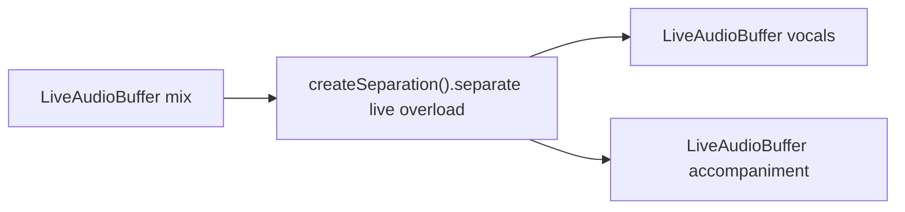

# Source separation (live overload)

> **Live overload** — not a streaming separation model.
>
> There is **no** online / sample-level incremental separation engine in sherpa-onnx and **no** `createStreamingSeparation` factory. This guide uses **`createSeparation`** (offline Spleeter/UVR weights) on **live buffers**: mandatory **`continuous_frames`** segmentation turns incoming audio into chunks; each chunk is separated offline into **N `LiveAudioBuffer` stems**.
>
> Contrast with features that have a **true streaming** engine (e.g. [stt-streaming.md](stt-streaming.md), [vad-streaming.md](vad-streaming.md), [enhancement-streaming.md](enhancement-streaming.md) via `createStreaming*`).

## Introduction

On-device **live-pipeline** source separation (vocals vs accompaniment) via live overload on the offline engine.

| Role | Type | Notes |
| --- | --- | --- |
| **Input** | [`LiveAudioBuffer`](audiobuffer-streaming.md) | Mixed PCM (mic, file ingest, or upstream live) |
| **Output** | [`LiveAudioBuffer`](audiobuffer-streaming.md) × N | One live stem buffer per stem; MVP writes **mono-downmixed** stems |
| **Engine** | Same `SeparationEngine` as offline (`createSeparation`) | `separate(Live, Live[], options)` → `SeparationPipelineHandle` |
| **Pipeline handle** | `SeparationPipelineHandle` | `stop` / `flush` / `reset` / `getStatus` / `completed` |

Import path: `react-native-sherpa-onnx/separation`

**Stem order:** `[0]=vocals`, `[1]=accompaniment` (UVR: non-vocals). Constants: `SEPARATION_STEM_LABELS`.

For **batch** separation on offline buffers, see [Source separation (offline)](separation-offline.md).

Shared handle lifecycle: [streaming-pipelines-overview.md](streaming-pipelines-overview.md).

## Quick start

```ts
import { createSeparation } from 'react-native-sherpa-onnx/separation';
import {
  createEmptyLiveAudioBuffer,
  finalizeLiveAudioBuffer,
} from 'react-native-sherpa-onnx/audiobuffer';

const sep = await createSeparation({
  modelSource: { kind: 'fs', path: '/absolute/path/to/uvr-model-dir' },
});

const sr = await sep.getSampleRate();
const numStems = await sep.getNumStems();
const liveIn = await createEmptyLiveAudioBuffer({ sampleRate: sr, channelCount: 1 });
const liveOuts = await Promise.all(
  Array.from({ length: numStems }, () =>
    createEmptyLiveAudioBuffer({ sampleRate: sr, channelCount: 1 })
  )
);

const handle = await sep.separate(liveIn, liveOuts, {
  segmentation: {
    mode: 'auto',
    policy: { evaluator: 'continuous_frames', checkpointIntervalMs: 500 },
  },
  // optional: onSegment fires on stem [0] (vocals) live buffer events
});

// Mic ingest → liveIn, then stop / finalize when done
const completion = await handle.completed;
console.log(`Separated ${completion.unitsWritten} samples (stem 0 reference)`);

await handle.stop();
await finalizeLiveAudioBuffer(liveOuts[0]!);
await finalizeLiveAudioBuffer(liveOuts[1]!);
await sep.destroy();
```

## Mandatory segmentation

`options.segmentation.policy` is **required** (`LIVE_OFFLINE_SEGMENTATION_REQUIRED` if missing or invalid). Live overload supports **`continuous_frames` only**.

`'off'` and `'manual'` modes are **not** supported on this path. Commit-only — no partial stems between segment boundaries.

> Offline separators are designed for whole-utterance batch inference. Chunking via segmentation can introduce **audible artifacts at segment boundaries**. Tune `checkpointIntervalMs` for RAM vs. boundary quality.

Policy details: [segmentation-engine.md](segmentation-engine.md).

## API reference

Factory, detection, and model init are the same as offline — see [separation-offline.md](separation-offline.md#api-reference).

### `sep.separate(LiveAudio, LiveAudio[], options)`

```ts
separate(
  audioIn: LiveAudioBufferIdSource,
  audioOuts: readonly LiveAudioBufferIdSource[],
  options: SeparationLivePipelineOptions
): Promise<SeparationPipelineHandle>;
```

**Constraints:** `audioOuts.length === getNumStems()`; all buffers must be `live_*`; `segmentation.policy.evaluator === 'continuous_frames'`.

```ts
type SeparationLivePipelineOptions = {
  segmentation: {
    policy: SegmentationPolicy & { evaluator: 'continuous_frames' };
    mode?: 'auto';
  };
  onSegment?: (segment: SpeechSegment) => void; // stem [0] events
};
```

## Pipeline handle

`SeparationPipelineHandle` shares `stop` / `flush` / `reset` / `getStatus` / `completed` with other live pipelines — see [streaming-pipelines-overview.md](streaming-pipelines-overview.md).

## Pipeline composition



More patterns: [feature-pipelines.md#separation-live-overload-patterns](feature-pipelines.md#separation-live-overload-patterns).

## Types and constants

```ts
import {
  type SeparationEngine,
  type SeparationLivePipelineOptions,
  type SeparationPipelineHandle,
} from 'react-native-sherpa-onnx/separation';
```

Model types and offline result types: [separation-offline.md](separation-offline.md#types-and-constants).

## Error codes

| Error code | Typical reason |
| --- | --- |
| `LIVE_OFFLINE_SEGMENTATION_REQUIRED` | Missing / invalid `segmentation.policy`, or evaluator not `continuous_frames`. |
| `SEPARATION_INVALID_ARGUMENT` | Live/offline overload mismatch, wrong stem count, etc. |
| `SEPARATION_*` / `DETECT_ERROR` / `OFFLINE_OOM` | Same codes as [offline separation](separation-offline.md#error-codes) where applicable. |

## See also

- [Source separation (offline)](separation-offline.md)
- [Streaming pipelines — shared lifecycle](streaming-pipelines-overview.md)
- [Pipeline audio buffers — live / streaming](audiobuffer-streaming.md)
- [Speaker Identification (live overload)](speaker-identification-live.md) — same live-overload doc pattern
- [Memory and models](memory-and-models.md)

## Native crash diagnostics

If native code fails or the app crashes but the tombstone shows only a UI/GPU thread, inspect the SDK **last-activity ring buffer** (enabled by default when the native library loads). Full details: [native-diagnostics.md](./native-diagnostics.md) — Android log tag `SherpaNativeDiag`; iOS subsystem `com.sherpaonnx.diag`. Optional JS: `getNativeDiagnosticSnapshot` / `configureNativeDiagnostics` from `react-native-sherpa-onnx/diagnostics`.
