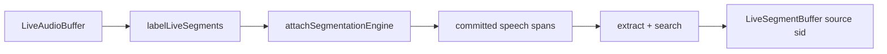

# Speaker Identification (live overload)

> **Live overload** — not a streaming SID model.
>
> Live audio is sliced by a mandatory segmentation policy; each committed utterance is labeled natively with the same offline speaker-embedding weights. There is no separate online/streaming speaker-ID model in sherpa-onnx.

## Introduction

On-device **named-speaker labeling** over a live mic or file stream. Each committed utterance is identified against the enrolled gallery and appended as labeled speech segments (`payload.source: 'sid'`). Enrollment stays offline.

Import path: **`react-native-sherpa-onnx/speaker-identification`**.

Factory / detect / enrollment / models: [speaker-identification-offline.md](speaker-identification-offline.md#api-reference).

## Quick start

```ts
import {
  createSpeakerIdentification,
} from 'react-native-sherpa-onnx/speaker-identification';
import {
  createEmptyLiveAudioBuffer,
  finalizeLiveAudioBuffer,
  releasePipelineAudioBuffer,
  startMicToLiveAudioBuffer,
  stopMicToLiveAudioBuffer,
} from 'react-native-sherpa-onnx/audiobuffer';
import {
  createLiveSegmentBuffer,
  releasePipelineSegmentBuffer,
} from 'react-native-sherpa-onnx/segmentbuffer';

// Assume `sid` was created and speakers were enrolled offline (see offline SID doc).

const audioIn = await createEmptyLiveAudioBuffer({
  sampleRate: 16000,
  channelCount: 1,
});
const labeledOut = await createLiveSegmentBuffer({
  sourceAudioBufferId: audioIn,
  spooling: { mode: 'on' },
  streamEvents: { segmentAppended: { enabled: true, minIntervalMs: 0 } },
  onSegmentAppended: (e) => {
    if (e.kind === 'speech' && e.payload?.source === 'sid') {
      console.log('[sid]', e.startSample, e.endSample, e.payload.speakerName);
    }
  },
});

const pipeline = await sid.labelLiveSegments(audioIn, labeledOut, {
  segmentation: {
    policy: {
      evaluator: 'speech_energy_silence',
      silenceThresholdMs: 500,
      energyThresholdDb: -40,
      minSegmentMs: 1000,
      maxSegmentMs: 120_000,
      hangoverMs: 300,
    },
  },
  threshold: 0.5,
  onLabeled: (e) => {
    console.log('[sid labeled]', e.segmentIndex, e.speakerName, `${e.durationMs}ms`);
  },
});

await startMicToLiveAudioBuffer(audioIn);
// … speak …
await stopMicToLiveAudioBuffer();
await finalizeLiveAudioBuffer(audioIn);
await pipeline.completed;

await releasePipelineSegmentBuffer(labeledOut);
await releasePipelineAudioBuffer(audioIn);
```

`finalizeLiveAudioBuffer(audioIn)` triggers terminal draining (detach segmentation with `flushFinal`, label remaining committed spans, finalize `labeledOut`, resolve `completed` with `reason: 'completed'`). Prefer that graceful path over an early `stop()` when the session ends naturally.

## Buffer matrix

| Role | Type | Notes |
| --- | --- | --- |
| **Audio in** | [`LiveAudioBuffer`](audiobuffer-streaming.md) | Mic / file ingest (offline path uses `OfflineAudioBuffer`) |
| **Segments in** | — (live) | Not used on live — SID attaches its own speech policy; offline `labelOfflineSegments` requires segments in |
| **Segments out** | [`LiveSegmentBuffer`](segmentbuffer-streaming.md) | Append while recording; offline uses `OfflineSegmentBuffer` |
| **Return** | `SpeakerIdentificationPipelineHandle` | Offline label returns `{ labeledCount, unknownCount }` |
| **Per-span callback** | `onLabeled` | Live: `SidLiveLabeledSegmentEvent` (no `totalSegments`); offline: `SidLabeledSegmentEvent` |
| **Engine** | Same `SpeakerIdentificationEngine` as offline | Enroll offline first, then `labelLiveSegments` |
| **Pipeline handle** | `SpeakerIdentificationPipelineHandle` | `stop` / `flush` / `reset` / `getStatus` / `completed` |

Mixed live/offline arguments throw `SID_INVALID_ARGUMENT`.

## Segmentation (Mandatory)

Live speaker identification must cut the incoming audio stream into committed utterances before each offline extract + search step. `options.segmentation.policy` is **required** (`LIVE_OFFLINE_SEGMENTATION_REQUIRED` if missing or `mode !== 'auto'`). SID owns the segmentation attach — you do not pass a pre-built VAD segment buffer.

**Modes:** `'auto'` only (policy required). `'off'` / `'manual'` are not supported on the live path.

| Evaluator | Supported | Notes |
| --- | --- | --- |
| `speech_energy_silence` | ✅ **Default** | Energy / silence cuts for speaker spans |
| `speech_vad_model` | ✅ | Model-based speech cuts; pass VAD pack via policy `modelPath` |
| `continuous_frames` | ❌ | Fixed windows are a poor fit for speaker labeling |
| `speech_pyannote_segmentation` | ❌ | Not in SID live `supportedEvaluators` |

```ts
const pipeline = await sid.labelLiveSegments(audioIn, labeledOut, {
  segmentation: {
    policy: { evaluator: 'speech_energy_silence', silenceThresholdMs: 500, minSegmentMs: 1000 },
  },
  threshold: 0.5,
});
```

Full policy reference: [segmentation-engine.md](segmentation-engine.md). Offline enrollment & label: [speaker-identification-offline.md](speaker-identification-offline.md).

## Pipeline handle

Same control surface as other streaming / live-overload features ([streaming-pipelines-overview.md](streaming-pipelines-overview.md)):

| Method | Behavior |
| --- | --- |
| `stop()` | Stop labeling, flush remaining committed spans into `segmentsOut`, finalize the Out buffer, resolve `completed` with `reason: 'stopped'`. |
| `flush()` | Label **already-committed** spans. Does not force a mid-utterance cut; the open tail is emitted on `stop` / input finalize. |
| `reset()` | Clears progress counters on the handle (`chunksProcessed` / `unitsRead` / `unitsWritten`) while the pipeline remains running. |
| `getStatus()` | `{ pipelineId, isRunning, chunksProcessed, unitsRead, unitsWritten, error }` (`unitsRead` = samples consumed for extract, `unitsWritten` = labeled segments appended). |
| `completed` | Resolves on graceful input finalize (`reason: 'completed'`) or `stop()` (`reason: 'stopped'`); rejects on fatal labeling errors (`code: 'STREAMING_PIPELINE_ERROR'`). |

## `sid` payload

Each labeled append uses the same contract as offline label:

```ts
payload: { source: 'sid', speakerName: string | null }
```

`speakerName` is `null` when search is below threshold / unknown. You can also subscribe via `createLiveSegmentBuffer({ onSegmentAppended })` in addition to `options.onLabeled`.

## API reference

Factory, detection, enrollment, and model init are the same as offline — see [speaker-identification-offline.md](speaker-identification-offline.md#api-reference).

### `sid.labelLiveSegments(audioIn, segmentsOut, options)`

Starts a live overload pipeline: attaches speech segmentation to `audioIn`, labels each committed utterance via offline extract + search, and appends results to `segmentsOut`. Returns a pipeline handle.

```ts
labelLiveSegments(
  audioIn: LiveAudioBufferIdSource,
  segmentsOut: LiveSegmentBufferIdSource,
  options: SpeakerIdentificationLiveLabelOptions
): Promise<SpeakerIdentificationPipelineHandle>;
```

**Constraints:** both buffers must be live; `segmentation.policy` required (`speech_energy_silence` or `speech_vad_model`).

```ts
const pipeline = await sid.labelLiveSegments(audioIn, labeledOut, {
  segmentation: {
    policy: { evaluator: 'speech_energy_silence', silenceThresholdMs: 500, minSegmentMs: 1000 },
  },
  threshold: 0.5,
  onLabeled: (e) => console.log(e.segmentIndex, e.speakerName),
});
```

## Optional `targetSegmentBuffer`

Pass a **live** segment buffer (`seg_live_*`) as `segmentsOut` to append labeled speech. Offline segment buffer ids are rejected (`SID_INVALID_ARGUMENT`).

## JS Events

| Callback | Payload | Fires when | Notes |
| --- | --- | --- | --- |
| `onLabeled` | `SidLiveLabeledSegmentEvent` | after each committed span is identified | no `onProgress` on the live path; no `totalSegments` |

Shapes: [Types](#types) · offline result fields: [speaker-identification-offline.md](speaker-identification-offline.md#types).

```ts
await sid.labelLiveSegments(audioIn, labeledOut, {
  segmentation: { policy: { evaluator: 'speech_energy_silence', minSegmentMs: 1000 } },
  threshold: 0.5,
  onLabeled: (e) => console.log(e.segmentIndex, e.speakerName, e.durationMs),
});
```

## Pipeline composition



Typical upstream: mic / file ingest into `LiveAudioBuffer`.
Typical downstream: UI timeline from `onLabeled` / `onSegmentAppended`, or finalize live segment Out → offline segment buffer for export.

More patterns: [feature-pipelines.md#speaker-identification-live-patterns](feature-pipelines.md#speaker-identification-live-patterns).

## Types

### Live-only SID types (`react-native-sherpa-onnx/speaker-identification`)

| Type | Description |
| --- | --- |
| `SpeakerIdentificationLiveLabelOptions` | Mandatory `segmentation.policy`; optional `threshold`, `onLabeled` |
| `SidLiveLabeledSegmentEvent` | Per-span live callback: `segmentIndex`, ranges, `durationMs`, `speakerName`, `confidence?` (no `totalSegments`) |
| `SpeakerIdentificationPipelineHandle` | Extends `StreamingPipelineHandle` + `instanceId` — live run control surface |
| `StreamingPipelineCompletion` | `{ reason: 'completed' \| 'stopped' }` from `completed` |
| `StreamingPipelineStatus` | Snapshot from `getStatus()` |

Engine, detect, enrollment, and offline result types: [speaker-identification-offline.md](speaker-identification-offline.md#types).

## Error codes

| Code / token | Typical reason |
| --- | --- |
| `LIVE_OFFLINE_SEGMENTATION_REQUIRED` | Missing `segmentation` / `policy`, or `mode !== 'auto'`. |
| `SID_INVALID_ARGUMENT` | Non-live audio or segment Out (use offline `labelOfflineSegments` instead). |
| `SID_INVALID_OPTIONS` | `onLabeled` provided but not a function. |
| `SID_LABEL_FAILED` | Segmentation engine did not produce an internal segment buffer. |
| `STREAMING_PIPELINE_ERROR` | Fatal error during labeling; `completed` rejects with this `code`. |
| `SPEAKER_EMBEDDING_*` / `SEGMENT_*` | Same native / segment codes as [offline SID](speaker-identification-offline.md#error-codes). |

## See also

- [Speaker Identification (offline)](speaker-identification-offline.md) — enroll / identify / offline label
- [Streaming pipelines — shared lifecycle](streaming-pipelines-overview.md)
- [Segmentation engine](segmentation-engine.md)
- [Pipeline audio buffers — streaming](audiobuffer-streaming.md)
- [Pipeline segment buffers — live / streaming](segmentbuffer-streaming.md)
- [Feature pipelines](feature-pipelines.md)

## Native crash diagnostics

If native code fails or the app crashes but the tombstone shows only a UI/GPU thread, inspect the SDK **last-activity ring buffer** (enabled by default when the native library loads). Full details: [native-diagnostics.md](./native-diagnostics.md) — Android log tag `SherpaNativeDiag`; iOS subsystem `com.sherpaonnx.diag`. Optional JS: `getNativeDiagnosticSnapshot` / `configureNativeDiagnostics` from `react-native-sherpa-onnx/diagnostics`.
