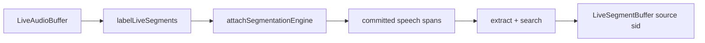

# Speaker Identification (live overload)

## Introduction

On-device **named-speaker labeling** over a live audio stream. SID owns speech segmentation, extracts an embedding per committed utterance, searches the enrolled manager, and appends labeled speech segments (`payload.source: 'sid'`) to a live segment Out buffer.

| Role | Type | Notes |
| --- | --- | --- |
| **Audio in** | [`LiveAudioBuffer`](audiobuffer-streaming.md) | Mic / file ingest |
| **Segments out** | [`LiveSegmentBuffer`](segmentbuffer-streaming.md) | Labeled speech; `payload.source: 'sid'` |
| **Engine** | Same `SpeakerIdentificationEngine` as offline | Enroll offline first, then `labelLiveSegments` |
| **Pipeline handle** | `SpeakerIdentificationPipelineHandle` | `stop` / `flush` / `reset` / `getStatus` / `completed` |

Import path: **`react-native-sherpa-onnx/speaker-identification`**.

This is a **live overload** of the offline embedding model (same weights / manager as [speaker-identification-offline.md](speaker-identification-offline.md)). There is no separate streaming SID model. Implementation is **JS orchestration** in this release (attach segmentation → drain committed spans → extract/search/append); the public handle shape matches other live overloads so a future native worker can replace the loop without changing the API (see [Native migration path](#native-migration-path)).

Enrollment stays offline (`enroll` / `enrollOfflineSegments`). Live SID only **labels**.

## Quick start

```ts
import {
  createSpeakerIdentification,
} from 'react-native-sherpa-onnx/speaker-identification';
import {
  createEmptyLiveAudioBuffer,
  finalizeLiveAudioBuffer,
  releasePipelineAudioBuffer,
  startMicToLiveAudioBuffer,
  stopMicToLiveAudioBuffer,
} from 'react-native-sherpa-onnx/audiobuffer';
import {
  createLiveSegmentBuffer,
  releasePipelineSegmentBuffer,
} from 'react-native-sherpa-onnx/segmentbuffer';

// Assume `sid` was created and speakers were enrolled offline (see offline SID doc).

const audioIn = await createEmptyLiveAudioBuffer({
  sampleRate: 16000,
  channelCount: 1,
});
const labeledOut = await createLiveSegmentBuffer({
  sourceAudioBufferId: audioIn,
  spooling: { mode: 'on' },
  streamEvents: { segmentAppended: { enabled: true, minIntervalMs: 0 } },
  onSegmentAppended: (e) => {
    if (e.kind === 'speech' && e.payload?.source === 'sid') {
      console.log('[sid]', e.startSample, e.endSample, e.payload.speakerName);
    }
  },
});

const pipeline = await sid.labelLiveSegments(audioIn, labeledOut, {
  segmentation: {
    policy: {
      evaluator: 'speech_energy_silence',
      silenceThresholdMs: 500,
      energyThresholdDb: -40,
      minSegmentMs: 1000,
      maxSegmentMs: 120_000,
      hangoverMs: 300,
    },
  },
  threshold: 0.5,
  onLabeled: (e) => {
    console.log('[sid labeled]', e.segmentIndex, e.speakerName, `${e.durationMs}ms`);
  },
});

const mic = await startMicToLiveAudioBuffer(audioIn);
// … speak …
await stopMicToLiveAudioBuffer(mic);
await finalizeLiveAudioBuffer(audioIn);
await pipeline.completed;

await releasePipelineSegmentBuffer(labeledOut);
await releasePipelineAudioBuffer(audioIn);
```

`finalizeLiveAudioBuffer(audioIn)` triggers terminal draining (detach segmentation with `flushFinal`, label remaining committed spans, finalize `labeledOut`, resolve `completed` with `reason: 'completed'`). Prefer that graceful path over an early `stop()` when the session ends naturally.

## Buffer matrix

| | Offline | Live overload |
| --- | --- | --- |
| **Audio in** | `OfflineAudioBuffer` | `LiveAudioBuffer` |
| **Segments in** | Required for `labelOfflineSegments` | **Not used** — SID attaches its own speech policy |
| **Segments out** | `OfflineSegmentBuffer` (empty → populated) | `LiveSegmentBuffer` (append while recording) |
| **Return** | `{ labeledCount, unknownCount }` | `SpeakerIdentificationPipelineHandle` |
| **Per-span callback** | `onLabeled` (`SidLabeledSegmentEvent`, includes `totalSegments`) | `onLabeled` (`SidLiveLabeledSegmentEvent`, no `totalSegments`) |

Mixed live/offline arguments throw `SID_INVALID_ARGUMENT`.

## Mandatory segmentation

`options.segmentation.policy` is **required** (`LIVE_OFFLINE_SEGMENTATION_REQUIRED` if missing or `mode !== 'auto'`). Supported evaluators:

- `speech_energy_silence`
- `speech_vad_model`

SID owns the attach — you do **not** pass a pre-built VAD segment In buffer. Policy tuning: [segmentation-engine.md](segmentation-engine.md).

## Pipeline handle

Same control surface as other streaming / live-overload features ([streaming-pipelines-overview.md](streaming-pipelines-overview.md)), with JS-backed semantics in this release:

| Method | Behavior |
| --- | --- |
| `stop()` | Stop the poll loop, detach segmentation (`flushFinal: true`), drain remaining committed spans, finalize `segmentsOut`, resolve `completed` with `reason: 'stopped'`. |
| `flush()` | Await labeling of **already-committed** spans. Does not force a mid-utterance cut; the open tail is emitted on `stop` / input finalize. |
| `reset()` | Soft JS counter reset only (`chunksProcessed` / `unitsRead` / `unitsWritten`). Native segmentation reset is not exposed (matches the intentional no-op on `OfflineLivePipelineWorker.reset`). |
| `getStatus()` | `{ pipelineId, isRunning, chunksProcessed, unitsRead, unitsWritten, error }` — JS-tracked counters (`unitsRead` = samples sliced, `unitsWritten` = labeled segments appended). |
| `completed` | Resolves on graceful input finalize (`reason: 'completed'`) or `stop()` (`reason: 'stopped'`); rejects on fatal labeling errors (`code: 'STREAMING_PIPELINE_ERROR'`). |

## `sid` payload

Each labeled append uses the same contract as offline label:

```ts
payload: { source: 'sid', speakerName: string | null }
```

`speakerName` is `null` when search is below threshold / unknown. You can also subscribe via `createLiveSegmentBuffer({ onSegmentAppended })` in addition to `options.onLabeled`.

## API reference

```ts
labelLiveSegments(
  audioIn: LiveAudioBufferIdSource,
  segmentsOut: LiveSegmentBufferIdSource,
  options: SpeakerIdentificationLiveLabelOptions
): Promise<SpeakerIdentificationPipelineHandle>
```

```ts
type SpeakerIdentificationLiveLabelOptions = {
  segmentation: {
    policy: SegmentationPolicy; // speech_energy_silence | speech_vad_model
    mode?: 'auto';
  };
  threshold?: number; // default 0.5
  onLabeled?: (event: SidLiveLabeledSegmentEvent) => void;
};

type SidLiveLabeledSegmentEvent = {
  segmentIndex: number;
  startSample: number;
  endSample: number;
  sampleRate: number;
  durationMs: number;
  speakerName: string | null;
  confidence?: number;
};
```

## Pipeline composition



Typical upstream: mic / file ingest into `LiveAudioBuffer`.  
Typical downstream: UI timeline from `onLabeled` / `onSegmentAppended`, or finalize live segment Out → offline segment buffer for export.

More patterns: [feature-pipelines.md#speaker-identification-live-patterns](feature-pipelines.md#speaker-identification-live-patterns).

## Error codes

| Code / token | Typical reason |
| --- | --- |
| `LIVE_OFFLINE_SEGMENTATION_REQUIRED` | Missing `segmentation` / `policy`, or `mode !== 'auto'`. |
| `SID_INVALID_ARGUMENT` | Non-live audio or segment Out (use offline `labelOfflineSegments` instead). |
| `SID_INVALID_OPTIONS` | `onLabeled` provided but not a function. |
| `SID_LABEL_FAILED` | Segmentation engine did not produce an internal segment buffer. |
| `STREAMING_PIPELINE_ERROR` | Fatal error during labeling; `completed` rejects with this `code`. |
| `SPEAKER_EMBEDDING_*` / `SEGMENT_*` | Same native / segment codes as [offline SID](speaker-identification-offline.md#error-codes). |

## Native migration path

Today the drain loop is JS (poll internal segmentation segment buffer → `getLiveAudioBufferSamplesSlice` → temp offline buffer → `extractFromOfflineAudio` → `manager.search` → `appendLiveSegment`).

A future release can keep the **identical** `labelLiveSegments` signature and handle while swapping the body for:

1. TurboModule `startSpeakerIdentificationOfflineLivePipeline(instanceId, audioIn, segmentsOut, { attachedSegmentationEngineId, segmentLiveBufferId, threshold })`
2. Kotlin / iOS `SpeakerIdentificationOfflineLivePipelineWorker` extending `OfflineLivePipelineWorker`
3. `completed` / `getStatus` backed by `createStreamingPipelineCompletionPromise` + native streaming pipeline registry

No public API change is required for that migration.

## See also

- [Speaker Identification (offline)](speaker-identification-offline.md) — enroll / identify / offline label
- [Streaming pipelines — shared lifecycle](streaming-pipelines-overview.md)
- [Segmentation engine](segmentation-engine.md)
- [Pipeline audio buffers — streaming](audiobuffer-streaming.md)
- [Pipeline segment buffers — live / streaming](segmentbuffer-streaming.md)
- [Feature pipelines](feature-pipelines.md)

## Native crash diagnostics

If native code fails or the app crashes but the tombstone shows only a UI/GPU thread, inspect the SDK **last-activity ring buffer** (enabled by default when the native library loads). Full details: [native-diagnostics.md](./native-diagnostics.md) — Android log tag `SherpaNativeDiag`; iOS subsystem `com.sherpaonnx.diag`. Optional JS: `getNativeDiagnosticSnapshot` / `configureNativeDiagnostics` from `react-native-sherpa-onnx/diagnostics`.
