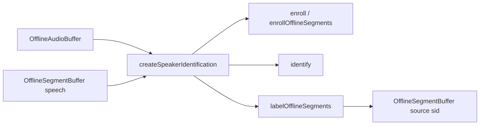

# Speaker Identification (offline)

## Introduction

On-device **named-speaker** enrollment and identification on a shared speaker-embedding foundation.

| Role | Type | Notes |
| --- | --- | --- |
| **Audio in** | [`OfflineAudioBuffer`](audiobuffer-offline.md) | Populated PCM (full clip or ranges via segment spans) |
| **Segments in / out** | [`OfflineSegmentBuffer`](segmentbuffer-offline.md) | Speech ranges (typically from VAD); Out gets `payload.source: 'sid'` |
| **Engine** | `SpeakerIdentificationEngine` via `createSpeakerIdentification` | Enroll / identify / verify / label; named-speaker manager under the hood |

Import path: **`react-native-sherpa-onnx/speaker-identification`**.

Model detect lives on **`react-native-sherpa-onnx/speaker-embedding`** (`detectSpeakerEmbeddingModel`). Most embedding internals stay package-local; apps use the SID surface for enrollment and search.

SID answers **who** spoke against an enrolled name list. It does **not** invent anonymous clusters — that is [Speaker Diarization](diarization.md) (planned). VAD still answers **when** speech happens; the app decides which spans belong together for enroll (for example every other interview turn).

There is **no live/streaming SID API** yet. “Live” usage is app orchestration: finalize live audio/segments → offline SID APIs (same idea as other offline engines before live overload).

## Quick start

```ts
import {
  createSpeakerIdentification,
} from 'react-native-sherpa-onnx/speaker-identification';
import { detectSpeakerEmbeddingModel } from 'react-native-sherpa-onnx/speaker-embedding';
import {
  createOfflineAudioBufferFromFile,
  releasePipelineAudioBuffer,
} from 'react-native-sherpa-onnx/audiobuffer';

const modelDir = {
  kind: 'fs' as const,
  path: '/absolute/path/to/speaker-embedding-model-dir',
};

const det = await detectSpeakerEmbeddingModel(modelDir, { modelType: 'auto' });
if (!det.success) {
  throw new Error(det.error ?? 'Speaker embedding detection failed');
}

const sid = await createSpeakerIdentification({
  modelSource: modelDir,
  modelType: (det.modelType as 'wespeaker' | '3d-speaker' | 'nemo' | 'auto') ?? 'auto',
  numThreads: 2,
  provider: 'cpu',
});

try {
  const aliceClip = await createOfflineAudioBufferFromFile({
    kind: 'fs',
    path: '/absolute/path/alice.wav',
  });
  const query = await createOfflineAudioBufferFromFile({
    kind: 'fs',
    path: '/absolute/path/query.wav',
  });

  await sid.enroll('alice', aliceClip);
  // Optional: average multiple clips
  // await sid.enroll('alice', [clipA, clipB]);

  const { name } = await sid.identify(query, { threshold: 0.5 });
  console.log(name); // 'alice' | null

  const ok = await sid.verify('alice', query, { threshold: 0.5 });
  console.log(ok);

  await releasePipelineAudioBuffer(aliceClip);
  await releasePipelineAudioBuffer(query);
} finally {
  await sid.destroy();
}
```

### Segment-buffer enroll + label

Symmetric to whole-buffer APIs: PCM audio **plus** speech ranges.

```ts
import {
  createEmptyOfflineSegmentBuffer,
  getOfflineSegmentBufferSegments,
  releasePipelineSegmentBuffer,
} from 'react-native-sherpa-onnx/segmentbuffer';

// aliceOnlySegs: OfflineSegmentBuffer with speech spans the app already filtered
// (e.g. even interview turns). Segment buffers alone have no samples.
await sid.enrollOfflineSegments('alice', interviewAudio, aliceOnlySegs);

const labeledOut = await createEmptyOfflineSegmentBuffer({
  sourceAudioBufferId: interviewAudio,
});

try {
  // Label many speech spans on a long timeline. If you only have one short clip
  // to identify against the enrolled speaker(s), use sid.identify(clip) instead —
  // enrollOfflineSegments does not require labelOfflineSegments on the query side.
  const { labeledCount, unknownCount } = await sid.labelOfflineSegments(
    interviewAudio,
    vadSegs, // speech spans from VAD (or manual)
    labeledOut,
    { threshold: 0.5 }
  );
  console.log({ labeledCount, unknownCount });

  const rows = await getOfflineSegmentBufferSegments(labeledOut);
  for (const row of rows) {
    if (row.kind === 'speech' && row.payload?.source === 'sid') {
      console.log(row.startSample, row.endSample, row.payload.speakerName);
    }
  }
} finally {
  await releasePipelineSegmentBuffer(labeledOut);
  await sid.destroy(); // end of SID session (omit if you keep reusing `sid`)
}
```

`labelOfflineSegments` does **not** mutate `vadSegs`. It stages a live segment buffer, then populates the empty `labeledOut` offline snapshot (same writeback pattern as offline VAD merge).

---

## Buffer matrix

| | Offline audio buffer(s) | Offline audio + segment buffer |
| --- | --- | --- |
| **Enroll** | `enroll(name, audio \| audio[])` | `enrollOfflineSegments(name, audioIn, segmentsIn)` |
| **Identify** | `identify(audio)` → `{ name }` | `labelOfflineSegments(audioIn, segmentsIn, segmentsOut)` |

Segment APIs always need the **PCM** buffer. Empty speech ranges and non-`speech` rows are skipped. `enrollOfflineSegments` rejects when no usable speech span remains.

---

## API reference

### Detection

#### `detectSpeakerEmbeddingModel(source, options?)`

Exported from **`react-native-sherpa-onnx/speaker-embedding`**.

```ts
function detectSpeakerEmbeddingModel(
  source: FileSource,
  options?: {
    modelType?: 'wespeaker' | '3d-speaker' | 'nemo' | 'auto';
    assetName?: string;
  }
): Promise<SpeakerEmbeddingDetectResult>;
```

Supported families: **WeSpeaker**, **3D-Speaker**, **NeMo** embedding packs (see [sherpa-onnx speaker-recognition models](https://github.com/k2-fsa/sherpa-onnx/releases/tag/speaker-recongition-models)). Prefer detect before `createSpeakerIdentification`.

### Factory

#### `createSpeakerIdentification(options)`

```ts
function createSpeakerIdentification(
  options: SpeakerIdentificationOptions
): Promise<SpeakerIdentificationEngine>;
```

`SpeakerIdentificationOptions` is the same union as speaker-embedding init (`initMode: 'auto' | 'custom'`, `modelSource` / `customConfig`, `numThreads`, `provider`, `debug`).

The extractor is **ref-counted** so a future diarization engine can share the same weights. Each SID instance still owns its own **named-speaker manager**.

### Engine methods

```ts
interface SpeakerIdentificationEngine {
  readonly instanceId: string;
  readonly managerId: string;
  readonly dim: number;

  enroll(
    name: string,
    audio: OfflineAudioBufferIdSource | OfflineAudioBufferIdSource[]
  ): Promise<void>;

  enrollOfflineSegments(
    name: string,
    audioIn: OfflineAudioBufferIdSource,
    segmentsIn: OfflineSegmentBufferIdSource
  ): Promise<void>;

  identify(
    audio: OfflineAudioBufferIdSource,
    options?: { threshold?: number }
  ): Promise<{ name: string | null }>;

  labelOfflineSegments(
    audioIn: OfflineAudioBufferIdSource,
    segmentsIn: OfflineSegmentBufferIdSource,
    segmentsOut: OfflineSegmentBufferIdSource,
    options?: { threshold?: number }
  ): Promise<{ labeledCount: number; unknownCount: number }>;

  verify(
    name: string,
    audio: OfflineAudioBufferIdSource,
    options?: { threshold?: number }
  ): Promise<boolean>;

  removeSpeaker(name: string): Promise<boolean>;
  listSpeakers(): Promise<string[]>;
  contains(name: string): Promise<boolean>;
  numSpeakers(): Promise<number>;
  destroy(): Promise<void>;
}
```

| Method | Behavior |
| --- | --- |
| `enroll` | Extract embedding(s) from whole buffer(s); native manager averages multiple clips (L2-normalized). Fails if the name already exists. |
| `enrollOfflineSegments` | Same average path, one embedding per non-empty speech span. |
| `identify` | Extract → search; `name` is `null` when below threshold / unknown. Default `threshold` is `0.5`. |
| `labelOfflineSegments` | Per speech span: extract → search → append `{ source: 'sid', speakerName }` into staging → populate empty `segmentsOut`. `speakerName == null` increments `unknownCount`. |
| `verify` | Cosine check against one enrolled name. |
| `destroy` | Releases manager + drops extractor ref-count. |

---

## Speech payload (`source: 'sid'`)

Labeled Out rows use the strict speech payload contract:

```ts
{ source: 'sid'; speakerName: string | null }
```

Allowed keys: `source`, `speakerName` only. See [segmentbuffer-offline.md](segmentbuffer-offline.md).

---

## Patterns

### Interview turns (app-filtered enroll)

VAD (or manual spans) produces speech segments. The app knows heuristically that every other segment is speaker A:

1. Build or filter an `OfflineSegmentBuffer` that contains **only** Alice’s spans (today: new live buffer → append selected spans → finalize/populate; segment buffers are not mutated in place).
2. `enrollOfflineSegments('alice', audio, aliceOnlySegs)`.
3. Repeat for Bob.
4. Later `labelOfflineSegments(audio, allVadSegs, labeledOut)` to stamp names on the full timeline.

SID does **not** decide which spans belong together; the app selects enroll input.

### Buffer-first embeddings

PCM stays native via buffer ids. Only the compact embedding (`dim` floats, typically ~256) crosses the TurboModule for enroll/search — not the full waveform.

### Persistence

Enrollment lives in the native manager for the process lifetime of the SID instance. Export/import of enrollments is **not** in this SDK surface yet; persist names + clips (or embeddings) in the app if you need cross-session memory.

---

## Out of scope (this release)

- Live overload / native SID worker
- `kind: 'diarization'` segment rows
- Score / top-N search results
- In-place mutation of VAD segment buffers
- Enroll from a segment buffer **without** PCM audio

---

## Pipeline composition

### Typical upstream

| Source / feature | Buffer or handle | Notes |
| --- | --- | --- |
| File decode path | `OfflineAudioBuffer` (`off_*`) | Enrollment / identify clips via `createOfflineAudioBufferFromFile(...)`. |
| Sample ingestion path | `OfflineAudioBuffer` (`off_*`) | App-owned PCM via `createOfflineAudioBufferFromSamples(...)`. |
| Offline / streaming VAD | `OfflineSegmentBuffer` (`seg_off_*`) | Speech ranges for `enrollOfflineSegments` / `labelOfflineSegments` (PCM still required). |
| App-filtered spans | `OfflineSegmentBuffer` (`seg_off_*`) | e.g. even interview turns rebuilt into a new offline segment snapshot. |

### Typical downstream

| Destination / feature | Buffer or handle | Notes |
| --- | --- | --- |
| Identify result | `{ name: string \| null }` | Whole-buffer `identify` — no segment Out. |
| Labeled timeline | `OfflineSegmentBuffer` (`seg_off_*`) | Empty `segmentsOut` filled with `payload.source: 'sid'`. |
| UI / export | Segment metadata | Read via `getOfflineSegmentBufferSegments(...)`. |
| Future diarization | Shared embedding engine | Same weights via extractor cache; anonymous clusters are **not** SID. |



More end-to-end patterns: [feature-pipelines.md#speaker-identification-offline-patterns](feature-pipelines.md#speaker-identification-offline-patterns).

## Types and constants

```ts
import {
  createSpeakerIdentification,
  type IdentifyResult,
  type LabelOfflineSegmentsResult,
  type SpeakerIdentificationEngine,
  type SpeakerIdentificationOptions,
  type SpeakerIdentificationThresholdOptions,
} from 'react-native-sherpa-onnx/speaker-identification';

import {
  detectSpeakerEmbeddingModel,
  SPEAKER_EMBEDDING_MODEL_TYPES,
  SpeakerEmbeddingErrorCode,
  type SpeakerEmbeddingDetectResult,
  type SpeakerEmbeddingModelType,
} from 'react-native-sherpa-onnx/speaker-embedding';
```

- **`SpeakerEmbeddingModelType`:** `'wespeaker' | '3d-speaker' | 'nemo'`
- **`IdentifyResult`:** `{ name: string | null }`
- **`LabelOfflineSegmentsResult`:** `{ labeledCount: number; unknownCount: number }`
- **`SpeakerIdentificationThresholdOptions`:** `{ threshold?: number }` (default `0.5`)

---

## Error codes

Typical **promise rejection `code`** strings from the native speaker-embedding layer (used under SID). Message text varies; prefer **`code`** for branching when catching. Some failures are plain JS `Error` messages from the SID wrapper (no native `code`).

| Error code | Explanation |
| --- | --- |
| `SPEAKER_EMBEDDING_DETECT_ERROR` | `detectSpeakerEmbeddingModel` failed or returned no usable layout. |
| `SPEAKER_EMBEDDING_INIT_ERROR` | Extractor init failed (invalid model path/type or native construct failure). |
| `SPEAKER_EMBEDDING_COMPUTE_ERROR` | Embedding extraction failed for an offline audio buffer / range. |
| `SPEAKER_EMBEDDING_MANAGER_ERROR` | Named-speaker manager create / add / search / verify / destroy failed. |
| `SPEAKER_EMBEDDING_BUFFER_NOT_FOUND` | Audio buffer id missing from the audio registry (released or never created). |
| `SPEAKER_EMBEDDING_BUFFER_KIND_MISMATCH` | A non-offline audio buffer was passed to offline extract. |
| `SPEAKER_EMBEDDING_BUFFER_EMPTY` | Offline audio buffer (or extracted range) has no samples. |
| `SPEAKER_EMBEDDING_INVALID_ARGUMENT` | Invalid `customConfig` / init arguments on the JS custom-path resolver. |
| `SEGMENT_INVALID_ARGUMENT` | Bad segment buffer id or invalid speech payload during `labelOfflineSegments` staging (`source: 'sid'`). |
| `SEGMENT_BUFFER_NOT_FOUND` | Segment In/Out or staging live buffer id missing from the segment registry. |
| `FILEIO_*` | File / URI resolution for **`FileSource`** before or during detect/init. |

JS-side SID guards (message match, not always a native `code`): empty speaker name, no audio buffers for `enroll`, no speech spans for `enrollOfflineSegments`, enroll when the name already exists, and calls after `destroy()`.

---

## See also

- [Pipeline audio buffers — offline](audiobuffer-offline.md)
- [Pipeline segment buffers — offline](segmentbuffer-offline.md) — speech payload `sid`
- [VAD streaming](vad-streaming.md) — speech boundaries (when)
- [Speaker diarization](diarization.md) — anonymous clustering (planned; shared embedding foundation)
- [Feature pipelines](feature-pipelines.md)
- [Model detect](model-detect.md)
- [Model setup](model-setup.md)
- [Download manager](download-manager.md) — `SpeakerEmbedding` category
- [Execution providers](execution-providers.md)

## Native crash diagnostics

If native code fails or the app crashes but the tombstone shows only a UI/GPU thread, inspect the SDK **last-activity ring buffer** (enabled by default when the native library loads). Full details: [native-diagnostics.md](./native-diagnostics.md) — Android log tag `SherpaNativeDiag`; iOS subsystem `com.sherpaonnx.diag`. Optional JS: `getNativeDiagnosticSnapshot` / `configureNativeDiagnostics` from `react-native-sherpa-onnx/diagnostics`.
