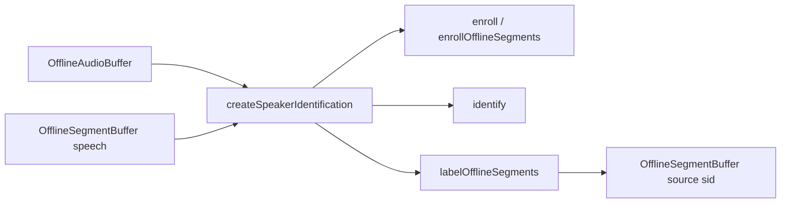

# Speaker Identification (offline)

## Introduction

On-device **named-speaker** enrollment and identification on a shared speaker-embedding foundation.

| Role | Type | Notes |
| --- | --- | --- |
| **Audio in** | [`OfflineAudioBuffer`](audiobuffer-offline.md) | Populated PCM (full clip or ranges via segment spans) |
| **Segments in / out** | [`OfflineSegmentBuffer`](segmentbuffer-offline.md) | Speech ranges (typically from VAD); Out gets `payload.source: 'sid'` |
| **Engine** | `SpeakerIdentificationEngine` via `createSpeakerIdentification` | Enroll / identify / verify / label; named-speaker manager under the hood |

Import path: **`react-native-sherpa-onnx/speaker-identification`**.

Model detect is available on the SID package (`detectSpeakerEmbeddingModel`) and on **`react-native-sherpa-onnx/speaker-embedding`** (shared foundation). Most embedding internals stay package-local; apps use the SID surface for enrollment and search.

SID answers **who** spoke against an enrolled name list. It does **not** invent anonymous clusters — that is [Speaker Diarization](diarization.md) (planned). VAD still answers **when** speech happens; the app decides which spans belong together for enroll (for example every other interview turn).

Live labeling is available via **`labelLiveSegments`** — see [speaker-identification-live.md](speaker-identification-live.md). Enrollment remains offline (`enroll` / `enrollOfflineSegments`).

## Quick start

```ts
import {
  createSpeakerIdentification,
  detectSpeakerEmbeddingModel,
} from 'react-native-sherpa-onnx/speaker-identification';
import {
  createOfflineAudioBufferFromFile,
  releasePipelineAudioBuffer,
} from 'react-native-sherpa-onnx/audiobuffer';

const modelDir = {
  kind: 'fs' as const,
  path: '/absolute/path/to/speaker-embedding-model-dir',
};

const det = await detectSpeakerEmbeddingModel(modelDir, { modelType: 'auto' });
if (!det.success) {
  throw new Error(det.error ?? 'Speaker embedding detection failed');
}

const sid = await createSpeakerIdentification({
  modelSource: modelDir,
  modelType: (det.modelType as 'wespeaker' | '3d-speaker' | 'nemo' | 'auto') ?? 'auto',
  numThreads: 2,
  provider: 'cpu',
});

try {
  const aliceClip = await createOfflineAudioBufferFromFile({
    kind: 'fs',
    path: '/absolute/path/alice.wav',
  });
  const query = await createOfflineAudioBufferFromFile({
    kind: 'fs',
    path: '/absolute/path/query.wav',
  });

  await sid.enroll('alice', aliceClip);
  // Optional: average multiple clips
  // await sid.enroll('alice', [clipA, clipB]);

  const { name } = await sid.identify(query, { threshold: 0.5 });
  console.log(name); // 'alice' | null

  const ok = await sid.verify('alice', query, { threshold: 0.5 });
  console.log(ok);

  await releasePipelineAudioBuffer(aliceClip);
  await releasePipelineAudioBuffer(query);
} finally {
  await sid.destroy();
}
```

### Segment-buffer enroll + label

Symmetric to whole-buffer APIs: PCM audio **plus** speech ranges.

```ts
import {
  createEmptyOfflineSegmentBuffer,
  getOfflineSegmentBufferSegments,
  releasePipelineSegmentBuffer,
} from 'react-native-sherpa-onnx/segmentbuffer';

// aliceOnlySegs: OfflineSegmentBuffer with speech spans the app already filtered
// (e.g. even interview turns). Segment buffers alone have no samples.
await sid.enrollOfflineSegments('alice', interviewAudio, aliceOnlySegs);

const labeledOut = await createEmptyOfflineSegmentBuffer({
  sourceAudioBufferId: interviewAudio,
});

try {
  // Label many speech spans on a long timeline. If you only have one short clip
  // to identify against the enrolled speaker(s), use sid.identify(clip) instead —
  // enrollOfflineSegments does not require labelOfflineSegments on the query side.
  const { labeledCount, unknownCount } = await sid.labelOfflineSegments(
    interviewAudio,
    vadSegs, // speech spans from VAD (or manual)
    labeledOut,
    {
      threshold: 0.5,
      onProgress: (p) =>
        console.log(
          `sid label ${p.currentSegment + 1}/${p.totalSegments} fraction=${p.fraction.toFixed(3)}`
        ),
      onLabeled: (e) =>
        console.log(
          `labeled ${e.segmentIndex + 1}/${e.totalSegments}`,
          e.speakerName
        ),
    }
  );
  console.log({ labeledCount, unknownCount });

  const rows = await getOfflineSegmentBufferSegments(labeledOut);
  for (const row of rows) {
    if (row.kind === 'speech' && row.payload?.source === 'sid') {
      console.log(row.startSample, row.endSample, row.payload.speakerName);
    }
  }
} finally {
  await releasePipelineSegmentBuffer(labeledOut);
  await sid.destroy(); // end of SID session (omit if you keep reusing `sid`)
}
```

`labelOfflineSegments` does **not** mutate `vadSegs`. It stages a live segment buffer, then populates the empty `labeledOut` offline snapshot (same writeback pattern as offline VAD merge).

---

## Buffer matrix

| | Offline audio buffer(s) | Offline audio + segment buffer |
| --- | --- | --- |
| **Enroll** | `enroll(name, audio \| audio[])` | `enrollOfflineSegments(name, audioIn, segmentsIn)` |
| **Identify** | `identify(audio)` → `{ name }` | `labelOfflineSegments(audioIn, segmentsIn, segmentsOut)` |

Segment APIs always need the **PCM** buffer. Empty speech ranges and non-`speech` rows are skipped. `enrollOfflineSegments` rejects when no usable speech span remains.

---

## API reference

### Detection

#### `detectSpeakerEmbeddingModel(source, options?)`

Available from **`react-native-sherpa-onnx/speaker-identification`** (DX re-export) and **`react-native-sherpa-onnx/speaker-embedding`** (shared foundation).

```ts
function detectSpeakerEmbeddingModel(
  source: FileSource,
  options?: {
    modelType?: 'wespeaker' | '3d-speaker' | 'nemo' | 'auto';
    assetName?: string;
  }
): Promise<SpeakerEmbeddingDetectResult>;
```

Supported families: **WeSpeaker**, **3D-Speaker**, **NeMo** embedding packs (see [sherpa-onnx speaker-recognition models](https://github.com/k2-fsa/sherpa-onnx/releases/tag/speaker-recongition-models)). Prefer detect before `createSpeakerIdentification`.

### Models and required files

| `modelType` | Required files | Optional | Custom-init keys |
| --- | --- | --- | --- |
| `wespeaker` | `*.onnx` (WeSpeaker embedding) | — | `model` |
| `3d-speaker` | `*.onnx` (3D-Speaker embedding) | — | `model` |
| `nemo` | `*.onnx` (NeMo speaker embedding) | — | `model` |

Validate category for custom path helpers: **`speakerEmbedding`**.

### Factory

#### `createSpeakerIdentification(options)`

```ts
function createSpeakerIdentification(
  options: SpeakerIdentificationOptions
): Promise<SpeakerIdentificationEngine>;
```

`SpeakerIdentificationOptions` is the same union as speaker-embedding init (`initMode: 'auto' | 'custom'`, `modelSource` / `customConfig`, `numThreads`, `provider`, `debug`).

The extractor is **ref-counted** so a future diarization engine can share the same weights. Each SID instance still owns its own **named-speaker manager**.

### Engine methods

```ts
interface SpeakerIdentificationEngine {
  readonly instanceId: string;
  readonly managerId: string;
  readonly dim: number;

  enroll(
    name: string,
    audio: OfflineAudioBufferIdSource | OfflineAudioBufferIdSource[]
  ): Promise<void>;

  enrollOfflineSegments(
    name: string,
    audioIn: OfflineAudioBufferIdSource,
    segmentsIn: OfflineSegmentBufferIdSource,
    options?: SpeakerIdentificationSegmentOptions
  ): Promise<void>;

  identify(
    audio: OfflineAudioBufferIdSource,
    options?: { threshold?: number }
  ): Promise<{ name: string | null }>;

  labelOfflineSegments(
    audioIn: OfflineAudioBufferIdSource,
    segmentsIn: OfflineSegmentBufferIdSource,
    segmentsOut: OfflineSegmentBufferIdSource,
    options?: SpeakerIdentificationLabelOptions
  ): Promise<{ labeledCount: number; unknownCount: number }>;

  /** Live overload — see speaker-identification-live.md */
  labelLiveSegments(
    audioIn: LiveAudioBufferIdSource,
    segmentsOut: LiveSegmentBufferIdSource,
    options: SpeakerIdentificationLiveLabelOptions
  ): Promise<SpeakerIdentificationPipelineHandle>;

  verify(
    name: string,
    audio: OfflineAudioBufferIdSource,
    options?: { threshold?: number }
  ): Promise<boolean>;

  removeSpeaker(name: string): Promise<boolean>;
  listSpeakers(): Promise<string[]>;
  contains(name: string): Promise<boolean>;
  numSpeakers(): Promise<number>;

  exportEnrollments(): Promise<SpeakerEnrollmentBundle>;
  importEnrollments(
    bundle: SpeakerEnrollmentBundle,
    options?: { replaceExisting?: boolean }
  ): Promise<{ imported: number; skipped: number }>;

  destroy(): Promise<void>;
}
```

| Method | Behavior |
| --- | --- |
| `enroll` | Extract embedding(s) from whole buffer(s); native manager averages multiple clips (L2-normalized). Fails if the name already exists. |
| `enrollOfflineSegments` | Same average path, one embedding per non-empty speech span. Optional `onProgress` (see below). |
| `identify` | Extract → search; `name` is `null` when below threshold / unknown. Default `threshold` is `0.5`. |
| `labelOfflineSegments` | Per speech span: extract → search → append `{ source: 'sid', speakerName }` into staging → populate empty `segmentsOut`. `speakerName == null` increments `unknownCount`. Optional `onProgress` + `onLabeled`. |
| `labelLiveSegments` | Live overload: attach speech segmentation, label each committed utterance into a live segment Out. See [speaker-identification-live.md](speaker-identification-live.md). |
| `verify` | Cosine check against one enrolled name. |
| `exportEnrollments` / `importEnrollments` | Cross-session enrollment snapshot — see [Persistence](#persistence). |
| `destroy` | Releases manager + drops extractor ref-count. |

`SpeakerIdentificationSegmentOptions` = `{ threshold?: number; onProgress?: (p: OrchestrationProgress) => void }` (enroll + label).  
`SpeakerIdentificationLabelOptions` = segment options + `{ onLabeled?: (e: SidLabeledSegmentEvent) => void }` (**label only**). Whole-buffer `identify` / `verify` only accept `{ threshold? }`.

---

## Offline progress (`onProgress`) and results (`onLabeled`)

### `onProgress` (start-of-step)

Multi-span SID paths support optional coarse offline progress via `onProgress` on `enrollOfflineSegments` and `labelOfflineSegments`. The payload is shared **`OrchestrationProgress`** (same fields as VAD offline / Alignment):

- Fires at the **start** of step `i` (before extract / search / append for that span).
- `fraction` follows `totalSegments > 0 ? currentSegment / totalSegments : 1`.
- `totalSegments` is the number of non-empty speech spans; `currentSegmentDurationMs` is that span’s duration.
- Zero usable speech spans → **no** progress events (`enrollOfflineSegments` rejects; `labelOfflineSegments` returns `{ labeledCount: 0, unknownCount: 0 }`).
- Non-function `onProgress` → `SID_INVALID_OPTIONS`. If the callback throws, the run aborts.

Whole-buffer `enroll` / `identify` / `verify` do **not** emit progress. Internal staging for `labelOfflineSegments` stays silent (no `onSegmentAppended`).

### `onLabeled` (per-span result — `labelOfflineSegments` only)

Fires **after** search + successful staging append for each speech span:

| Field | Meaning |
| --- | --- |
| `segmentIndex` / `totalSegments` | 0-based index and span count |
| `startSample` / `endSample` / `sampleRate` / `durationMs` | Span range |
| `speakerName` | Matched enrolled name, or `null` if below threshold / unknown |

Order per span: `onProgress` → extract/search/append → `onLabeled`. Enroll paths have **no** `onLabeled`. Non-function / throwing `onLabeled` behaves like `onProgress` (`SID_INVALID_OPTIONS` / abort + staging cleanup).

```ts
await sid.labelOfflineSegments(audio, vadSegs, labeledOut, {
  threshold: 0.5,
  onProgress: (p) => {
    console.log(
      `sid ${p.currentSegment + 1}/${p.totalSegments} fraction=${p.fraction.toFixed(3)}`
    );
  },
  onLabeled: (e) => {
    console.log(`result ${e.segmentIndex}:`, e.speakerName);
  },
});
```

---

## Speech payload (`source: 'sid'`)

Labeled Out rows use the strict speech payload contract:

```ts
{ source: 'sid'; speakerName: string | null }
```

Allowed keys: `source`, `speakerName` only. See [segmentbuffer-offline.md](segmentbuffer-offline.md).

---

## Patterns

### Interview turns (app-filtered enroll)

VAD (or manual spans) produces speech segments. The app knows heuristically that every other segment is speaker A:

1. Build or filter an `OfflineSegmentBuffer` that contains **only** Alice’s spans (rebuild via live staging → finalize/populate; segment buffers are not mutated in place).
2. `enrollOfflineSegments('alice', audio, aliceOnlySegs)`.
3. Repeat for Bob.
4. Later `labelOfflineSegments(audio, allVadSegs, labeledOut)` to stamp names on the full timeline.

SID does **not** decide which spans belong together; the app selects enroll input.

### Buffer-first embeddings

PCM stays native via buffer ids. Only the compact embedding (`dim` floats, typically ~256) crosses the TurboModule for enroll/search — not the full waveform.

### Persistence

The native manager cannot read embeddings back by name. SID keeps a **JS mirror** of vectors passed to `manager.add` on `enroll` / `enrollOfflineSegments` / `importEnrollments`, and clears it on `removeSpeaker` / `destroy`.

```ts
// After enroll…
const bundle = await sid.exportEnrollments();
// App stores JSON somewhere (file, key-value store, share) — SDK does not write files.
await saveJson('sid-enrollments.json', bundle);

// Later session, same embedding model:
const restored = await loadJson('sid-enrollments.json') as SpeakerEnrollmentBundle;
await sid.importEnrollments(restored);
// Name collision → throws (like enroll). Overwrite with:
await sid.importEnrollments(restored, { replaceExisting: true });
```

**`SpeakerEnrollmentBundle`:** `{ version: 1, dim, modelKey?, speakers: { name, embeddings: number[][] }[] }`.

- `dim` must match the current manager (else `SID_ENROLLMENT_DIM_MISMATCH`).
- When both the bundle and this SID instance have a `modelKey`, a mismatch rejects with `SID_ENROLLMENT_MODEL_MISMATCH`.
- Export only includes speakers enrolled through this SID instance’s enroll/import paths (not a raw native-only manager).
- Future: native readout via upstream `GetEmbedding` — [future-work/speaker-embedding-manager-upstream-export-import.md](future-work/speaker-embedding-manager-upstream-export-import.md).

---

## Out of scope

- `kind: 'diarization'` segment rows (see [diarization.md](diarization.md))
- Score / top-N search results
- In-place mutation of VAD segment buffers
- Enroll from a segment buffer **without** PCM audio
- Native embedding dump / Upstream `GetEmbedding` (export uses the JS mirror; see [future-work/speaker-embedding-manager-upstream-export-import.md](future-work/speaker-embedding-manager-upstream-export-import.md))
- Automatic file / cloud I/O for enrollment bundles (app-owned storage)

---

## Pipeline composition

### Typical upstream

| Source / feature | Buffer or handle | Notes |
| --- | --- | --- |
| File decode path | `OfflineAudioBuffer` (`off_*`) | Enrollment / identify clips via `createOfflineAudioBufferFromFile(...)`. |
| Sample ingestion path | `OfflineAudioBuffer` (`off_*`) | App-owned PCM via `createOfflineAudioBufferFromSamples(...)`. |
| Offline / streaming VAD | `OfflineSegmentBuffer` (`seg_off_*`) | Speech ranges for `enrollOfflineSegments` / `labelOfflineSegments` (PCM still required). |
| App-filtered spans | `OfflineSegmentBuffer` (`seg_off_*`) | e.g. even interview turns rebuilt into a new offline segment snapshot. |

### Typical downstream

| Destination / feature | Buffer or handle | Notes |
| --- | --- | --- |
| Identify result | `{ name: string \| null }` | Whole-buffer `identify` — no segment Out. |
| Labeled timeline | `OfflineSegmentBuffer` (`seg_off_*`) | Empty `segmentsOut` filled with `payload.source: 'sid'`. |
| UI / export | Segment metadata | Read via `getOfflineSegmentBufferSegments(...)`. |
| Future diarization | Shared embedding engine | Same weights via extractor cache; anonymous clusters are **not** SID — see [diarization.md](diarization.md). |



More end-to-end patterns: [feature-pipelines.md#speaker-identification-offline-patterns](feature-pipelines.md#speaker-identification-offline-patterns).

## Types and constants

```ts
import {
  createSpeakerIdentification,
  detectSpeakerEmbeddingModel,
  SPEAKER_EMBEDDING_MODEL_TYPES,
  SpeakerEmbeddingErrorCode,
  type IdentifyResult,
  type ImportEnrollmentsOptions,
  type ImportEnrollmentsResult,
  type LabelOfflineSegmentsResult,
  type OrchestrationProgress,
  type SidLabeledSegmentEvent,
  type SidLiveLabeledSegmentEvent,
  type SpeakerEmbeddingDetectResult,
  type SpeakerEmbeddingModelType,
  type SpeakerEnrollmentBundle,
  type SpeakerEnrollmentEntry,
  type SpeakerIdentificationEngine,
  type SpeakerIdentificationLabelOptions,
  type SpeakerIdentificationLiveLabelOptions,
  type SpeakerIdentificationOptions,
  type SpeakerIdentificationPipelineHandle,
  type SpeakerIdentificationSegmentOptions,
  type SpeakerIdentificationThresholdOptions,
} from 'react-native-sherpa-onnx/speaker-identification';
```

- **`SpeakerEmbeddingModelType`:** `'wespeaker' | '3d-speaker' | 'nemo'`
- **`IdentifyResult`:** `{ name: string | null }`
- **`LabelOfflineSegmentsResult`:** `{ labeledCount: number; unknownCount: number }`
- **`SpeakerEnrollmentBundle` / `SpeakerEnrollmentEntry`:** versioned enrollment snapshot for `exportEnrollments` / `importEnrollments`
- **`ImportEnrollmentsOptions` / `ImportEnrollmentsResult`:** `{ replaceExisting? }` → `{ imported, skipped }`
- **`SpeakerIdentificationThresholdOptions`:** `{ threshold?: number }` (default `0.5`)
- **`SpeakerIdentificationSegmentOptions`:** threshold + optional `onProgress`
- **`SpeakerIdentificationLabelOptions`:** segment options + optional `onLabeled`
- **`SidLabeledSegmentEvent`:** per-span offline label result (`speakerName`, ranges, `totalSegments`, …)
- **`SpeakerIdentificationLiveLabelOptions` / `SidLiveLabeledSegmentEvent` / `SpeakerIdentificationPipelineHandle`:** live overload — see [speaker-identification-live.md](speaker-identification-live.md)
- **`OrchestrationProgress`:** shared offline progress payload (`currentSegment`, `totalSegments`, `fraction`, …)

---

## Error codes

Typical **promise rejection `code`** strings from the native speaker-embedding layer (used under SID). Message text varies; prefer **`code`** for branching when catching. Some failures are plain JS `Error` messages from the SID wrapper (no native `code`).

| Error code | Explanation |
| --- | --- |
| `SPEAKER_EMBEDDING_DETECT_ERROR` | `detectSpeakerEmbeddingModel` failed or returned no usable layout. |
| `SPEAKER_EMBEDDING_INIT_ERROR` | Extractor init failed (invalid model path/type or native construct failure). |
| `SPEAKER_EMBEDDING_COMPUTE_ERROR` | Embedding extraction failed for an offline audio buffer / range. |
| `SPEAKER_EMBEDDING_MANAGER_ERROR` | Named-speaker manager create / add / search / verify / destroy failed. |
| `SPEAKER_EMBEDDING_BUFFER_NOT_FOUND` | Audio buffer id missing from the audio registry (released or never created). |
| `SPEAKER_EMBEDDING_BUFFER_KIND_MISMATCH` | A non-offline audio buffer was passed to offline extract. |
| `SPEAKER_EMBEDDING_BUFFER_EMPTY` | Offline audio buffer (or extracted range) has no samples. |
| `SPEAKER_EMBEDDING_INVALID_ARGUMENT` | Invalid `customConfig` / init arguments on the JS custom-path resolver. |
| `SID_INVALID_OPTIONS` | JS guard: `onProgress` / `onLabeled` provided but not a function (message includes this token). |
| `SID_ENROLLMENT_BUNDLE_INVALID` | JS guard: malformed `SpeakerEnrollmentBundle` (version, speakers, embeddings). |
| `SID_ENROLLMENT_DIM_MISMATCH` | JS guard: bundle `dim` ≠ current manager dim. |
| `SID_ENROLLMENT_MODEL_MISMATCH` | JS guard: bundle `modelKey` ≠ this SID instance’s model key. |
| `SEGMENT_INVALID_ARGUMENT` | Bad segment buffer id or invalid speech payload during `labelOfflineSegments` staging (`source: 'sid'`). |
| `SEGMENT_BUFFER_NOT_FOUND` | Segment In/Out or staging live buffer id missing from the segment registry. |
| `FILEIO_*` | File / URI resolution for **`FileSource`** before or during detect/init. |

JS-side SID guards (message match, not always a native `code`): empty speaker name, no audio buffers for `enroll`, no speech spans for `enrollOfflineSegments`, enroll/import when the name already exists, enrollment bundle validation, and calls after `destroy()`.

---

## See also

- [Pipeline audio buffers — offline](audiobuffer-offline.md)
- [Pipeline segment buffers — offline](segmentbuffer-offline.md) — speech payload `sid`
- [VAD streaming](vad-streaming.md) — speech boundaries (when)
- [Speaker Identification (live overload)](speaker-identification-live.md) — `labelLiveSegments`
- [Speaker diarization](diarization.md) — anonymous clustering (planned; shared embedding foundation)
- [Feature pipelines](feature-pipelines.md)
- [Model detect](model-detect.md)
- [Model setup](model-setup.md)
- [Download manager](download-manager.md) — `SpeakerEmbedding` category
- [Execution providers](execution-providers.md)

## Native crash diagnostics

If native code fails or the app crashes but the tombstone shows only a UI/GPU thread, inspect the SDK **last-activity ring buffer** (enabled by default when the native library loads). Full details: [native-diagnostics.md](./native-diagnostics.md) — Android log tag `SherpaNativeDiag`; iOS subsystem `com.sherpaonnx.diag`. Optional JS: `getNativeDiagnosticSnapshot` / `configureNativeDiagnostics` from `react-native-sherpa-onnx/diagnostics`.
