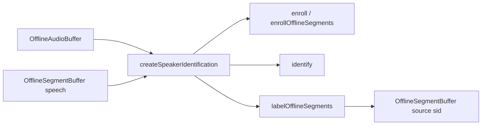

# Speaker Identification (offline)

## Introduction

On-device **named-speaker** enrollment and identification on a shared speaker-embedding foundation.

| Role | Type | Notes |
| --- | --- | --- |
| **Audio in** | [`OfflineAudioBuffer`](audiobuffer-offline.md) | Populated PCM (full clip or ranges via segment spans) |
| **Segments in / out** | [`OfflineSegmentBuffer`](segmentbuffer-offline.md) | Speech ranges (typically from VAD); Out gets `payload.source: 'sid'` |
| **Engine** | `SpeakerIdentificationEngine` via `createSpeakerIdentification` | Enroll / identify / verify / label; named-speaker manager under the hood |

Import path: **`react-native-sherpa-onnx/speaker-identification`**.

Model detect is available on the SID package (`detectSpeakerEmbeddingModel`) and on **`react-native-sherpa-onnx/speaker-embedding`** (shared foundation). Most embedding internals stay package-local; apps use the SID surface for enrollment and search.

SID answers **who** spoke against an enrolled name list. It does **not** invent anonymous clusters — that is [Speaker Diarization](diarization-offline.md) (offline available). VAD still answers **when** speech happens; the app decides which spans belong together for enroll (for example every other interview turn).

Live labeling is available via **`labelLiveSegments`** — see [speaker-identification-live.md](speaker-identification-live.md). Enrollment remains offline (`enroll` / `enrollOfflineSegments`).

## Quick start

```ts
import {
  createSpeakerIdentification,
  detectSpeakerEmbeddingModel,
} from 'react-native-sherpa-onnx/speaker-identification';
import {
  createOfflineAudioBufferFromFile,
  releasePipelineAudioBuffer,
} from 'react-native-sherpa-onnx/audiobuffer';

const modelDir = {
  kind: 'fs' as const,
  path: '/absolute/path/to/speaker-embedding-model-dir',
};

const det = await detectSpeakerEmbeddingModel(modelDir, { modelType: 'auto' });
if (!det.success) {
  throw new Error(det.error ?? 'Speaker embedding detection failed');
}

const sid = await createSpeakerIdentification({
  modelSource: modelDir,
  modelType: (det.modelType as 'wespeaker' | '3d-speaker' | 'nemo' | 'auto') ?? 'auto',
  numThreads: 2,
  provider: 'cpu',
});

try {
  const aliceClip = await createOfflineAudioBufferFromFile({
    kind: 'fs',
    path: '/absolute/path/alice.wav',
  });
  const query = await createOfflineAudioBufferFromFile({
    kind: 'fs',
    path: '/absolute/path/query.wav',
  });

  await sid.enroll('alice', aliceClip);
  const { name } = await sid.identify(query, { threshold: 0.5 });
  console.log(name); // 'alice' | null

  await releasePipelineAudioBuffer(aliceClip);
  await releasePipelineAudioBuffer(query);
} finally {
  await sid.destroy();
}
```

### Segment-buffer enroll + label

Symmetric to whole-buffer APIs: PCM audio **plus** speech ranges.

```ts
import {
  createEmptyOfflineSegmentBuffer,
  getOfflineSegmentBufferSegments,
  releasePipelineSegmentBuffer,
} from 'react-native-sherpa-onnx/segmentbuffer';

await sid.enrollOfflineSegments('alice', interviewAudio, aliceSpeechSegs);

const labeledOut = await createEmptyOfflineSegmentBuffer({
  sourceAudioBufferId: interviewAudio,
});

try {
  const { labeledCount, unknownCount } = await sid.labelOfflineSegments(
    interviewAudio, vadSegs, labeledOut, { threshold: 0.5 },
  );
  console.log({ labeledCount, unknownCount });

  const rows = await getOfflineSegmentBufferSegments(labeledOut);
  for (const row of rows) {
    if (row.kind === 'speech' && row.payload?.source === 'sid') {
      console.log(row.startSample, row.endSample, row.payload.speakerName);
    }
  }
} finally {
  await releasePipelineSegmentBuffer(labeledOut);
}
```

`labelOfflineSegments` does **not** mutate `vadSegs`. It stages a live segment buffer, then populates the empty `labeledOut` offline snapshot (same writeback pattern as offline VAD merge).

---

## Buffer matrix

| | Offline audio buffer(s) | Offline audio + segment buffer |
| --- | --- | --- |
| **Enroll** | `enroll(name, audio \| audio[])` | `enrollOfflineSegments(name \| names[], audioIn, segmentsIn)` |
| **Identify** | `identify(audio)` → `{ name }` | `labelOfflineSegments(audioIn, segmentsIn, segmentsOut)` |
| **Search embedding** | `search(embedding)` → `name \| null` | — (used by diarization cluster centroids) |
| **Verify** | `verify(name, audio)` → `boolean` | `verifyOfflineSegments(name \| names[], audioIn, segmentsIn)` → counts + per-span flags |

Segment APIs always need the **PCM** buffer. Empty speech ranges and non-`speech` rows are skipped. `enrollOfflineSegments` / `verifyOfflineSegments` reject when no usable speech span remains.

---

## API reference

### `detectSpeakerEmbeddingModel(source, options?)`

File-based detection **without** initializing the engine. Available from **`react-native-sherpa-onnx/speaker-identification`** (DX re-export) and **`react-native-sherpa-onnx/speaker-embedding`** (shared foundation). Unified detection: [model-detect.md](model-detect.md).

```ts
function detectSpeakerEmbeddingModel(
  source: FileSource,
  options?: {
    modelType?: 'wespeaker' | '3d-speaker' | 'nemo' | 'auto';
    assetName?: string;
  }
): Promise<SpeakerEmbeddingDetectResult>;
```

```ts
const det = await detectSpeakerEmbeddingModel(modelDir, { modelType: 'auto' });
if (!det.success) throw new Error(det.error ?? 'detection failed');
```

### `createSpeakerIdentification(options)`

Creates a `SpeakerIdentificationEngine`. Init modes: **`auto`** (default — `modelSource` + optional `modelType` / `quantization`) or **`custom`** (`customConfig: { model }`). The extractor is **ref-counted** so diarization can share the same weights; each SID instance owns its own **named-speaker manager**.

```ts
function createSpeakerIdentification(
  options: SpeakerIdentificationOptions
): Promise<SpeakerIdentificationEngine>;
```

```ts
const sid = await createSpeakerIdentification({
  modelSource: modelDir,
  modelType: 'wespeaker',
  numThreads: 2,
});
```

### `sid.enroll(name, audio)`

Enroll a named speaker from one or more offline audio buffers. Multiple clips are averaged (L2-normalized) by the native manager. Fails if the name already exists.

```ts
enroll(
  name: string,
  audio: OfflineAudioBufferIdSource | OfflineAudioBufferIdSource[]
): Promise<void>;
```

```ts
await sid.enroll('alice', aliceClip);
await sid.enroll('bob', [bobClipA, bobClipB]);
```

### `sid.enrollOfflineSegments(nameOrNames, audioIn, segmentsIn, options?)`

Enroll from speech spans in an offline segment buffer. A single `string` averages all spans under one name. A `string[]` maps one name per speech span (length must match the speech-span count); duplicate names are grouped and averaged.

```ts
enrollOfflineSegments(
  nameOrNames: string | string[],
  audioIn: OfflineAudioBufferIdSource,
  segmentsIn: OfflineSegmentBufferIdSource,
  options?: SpeakerIdentificationSegmentOptions
): Promise<void>;
```

```ts
await sid.enrollOfflineSegments('alice', interviewAudio, aliceSegs);
await sid.enrollOfflineSegments(['alice', 'bob', 'alice'], audio, vadSegs);
```

### `sid.identify(audio, options?)`

Extract an embedding from the audio buffer, search the enrolled gallery, and return the best match. `name` is `null` when below threshold / unknown. Default `threshold` is `0.5`.

```ts
identify(
  audio: OfflineAudioBufferIdSource,
  options?: { threshold?: number }
): Promise<{ name: string | null }>;
```

```ts
const { name } = await sid.identify(query, { threshold: 0.5 });
console.log(name); // 'alice' | null
```

### `sid.search(embedding, options?)`

Gallery search with a precomputed `Float32Array` (e.g. a diarization cluster centroid from `getClusterEmbeddings()`). Returns the best enrolled name above threshold, or `null`.

```ts
search(
  embedding: Float32Array,
  options?: { threshold?: number }
): Promise<string | null>;
```

```ts
const name = await sid.search(centroidVector, { threshold: 0.5 });
```

### `sid.labelOfflineSegments(audioIn, segmentsIn, segmentsOut, options?)`

Identify each speech span and write a labeled copy into an empty `segmentsOut` buffer (`payload.source: 'sid'`). Optional `onProgress` / `onLabeled` callbacks.

```ts
labelOfflineSegments(
  audioIn: OfflineAudioBufferIdSource,
  segmentsIn: OfflineSegmentBufferIdSource,
  segmentsOut: OfflineSegmentBufferIdSource,
  options?: SpeakerIdentificationLabelOptions
): Promise<{ labeledCount: number; unknownCount: number }>;
```

```ts
const { labeledCount, unknownCount } = await sid.labelOfflineSegments(
  audio, vadSegs, labeledOut, {
    threshold: 0.5,
    onLabeled: (e) => console.log(e.segmentIndex, e.speakerName),
  },
);
```

### `sid.verify(name, audio, options?)`

Cosine check of one offline audio buffer against one enrolled name. Default `threshold` is `0.5`.

```ts
verify(
  name: string,
  audio: OfflineAudioBufferIdSource,
  options?: { threshold?: number }
): Promise<boolean>;
```

```ts
const ok = await sid.verify('alice', queryClip, { threshold: 0.5 });
```

### `sid.verifyOfflineSegments(nameOrNames, audioIn, segmentsIn, options?)`

Per speech span: native verify against an enrolled name. A single `string` checks the same name on every span. A `string[]` maps one expected name per span. Optional `onProgress` / `onVerified`.

```ts
verifyOfflineSegments(
  nameOrNames: string | string[],
  audioIn: OfflineAudioBufferIdSource,
  segmentsIn: OfflineSegmentBufferIdSource,
  options?: SpeakerIdentificationVerifyOptions
): Promise<{ matchCount: number; mismatchCount: number; matches: boolean[] }>;
```

```ts
const { matchCount, mismatchCount, matches } = await sid.verifyOfflineSegments(
  ['alice', 'bob', 'alice'], audio, vadSegs, {
    onVerified: (e) => console.log(e.segmentIndex, e.expectedName, e.matched),
  },
);
```

### `sid.removeSpeaker(name)` / `sid.listSpeakers()` / `sid.contains(name)` / `sid.numSpeakers()`

Named-speaker manager helpers.

```ts
removeSpeaker(name: string): Promise<boolean>;
listSpeakers(): Promise<string[]>;
contains(name: string): Promise<boolean>;
numSpeakers(): Promise<number>;
```

```ts
await sid.removeSpeaker('alice');
const names = await sid.listSpeakers();
const has = await sid.contains('bob');
const count = await sid.numSpeakers();
```

### `sid.exportEnrollments()` / `sid.importEnrollments(bundle, options?)`

Cross-session enrollment snapshot. The SDK does **not** write files — apps store/load the `SpeakerEnrollmentBundle` JSON themselves.

```ts
exportEnrollments(): Promise<SpeakerEnrollmentBundle>;
importEnrollments(
  bundle: SpeakerEnrollmentBundle,
  options?: { replaceExisting?: boolean }
): Promise<{ imported: number; skipped: number }>;
```

```ts
const bundle = await sid.exportEnrollments();
await saveJson('sid-enrollments.json', bundle);

const restored = await loadJson('sid-enrollments.json');
await sid.importEnrollments(restored, { replaceExisting: true });
```

### `sid.destroy()`

Releases the named-speaker manager and drops the extractor ref-count. Do not call any method after this.

```ts
destroy(): Promise<void>;
```

```ts
await sid.destroy();
```

## Models and required files

| `modelType` | Required files | Custom-init keys |
| --- | --- | --- |
| `wespeaker` | `*.onnx` (WeSpeaker embedding) | `model` |
| `3d-speaker` | `*.onnx` (3D-Speaker embedding) | `model` |
| `nemo` | `*.onnx` (NeMo speaker embedding) | `model` |

Validate category: **`speakerEmbedding`**. Supported families: **WeSpeaker**, **3D-Speaker**, **NeMo** embedding packs (see [sherpa-onnx speaker-recognition models](https://github.com/k2-fsa/sherpa-onnx/releases/tag/speaker-recongition-models)).

Download via `ModelCategory.SpeakerEmbedding` (built-in GitHub source; see [download-manager.md](download-manager.md)).

---

## Offline JS events (`onProgress` / `onLabeled` / `onVerified`)

### `onProgress` (start-of-step)

Multi-span SID paths support optional coarse offline progress via `onProgress` on `enrollOfflineSegments`, `labelOfflineSegments`, and `verifyOfflineSegments`. The payload is shared **`OrchestrationProgress`** (same fields as VAD offline / Alignment):

- Fires at the **start** of step `i` (before extract / search-or-verify for that span).
- `fraction` follows `totalSegments > 0 ? currentSegment / totalSegments : 1`.
- `totalSegments` is the number of non-empty speech spans; `currentSegmentDurationMs` is that span's duration.
- Zero usable speech spans → **no** progress events (`enrollOfflineSegments` / `verifyOfflineSegments` reject; `labelOfflineSegments` returns `{ labeledCount: 0, unknownCount: 0 }`).
- Non-function `onProgress` → `SID_INVALID_OPTIONS`. If the callback throws, the run aborts.

Whole-buffer `enroll` / `identify` / `verify` do **not** emit progress. Internal staging for `labelOfflineSegments` stays silent (no `onSegmentAppended`).

### `onLabeled` (per-span result — `labelOfflineSegments` only)

Fires **after** search + successful staging append for each speech span:

| Field | Meaning |
| --- | --- |
| `segmentIndex` / `totalSegments` | 0-based index and span count |
| `startSample` / `endSample` / `sampleRate` / `durationMs` | Span range |
| `speakerName` | Matched enrolled name, or `null` if below threshold / unknown |

Order per span: `onProgress` → identify/append → `onLabeled`. Enroll paths have **no** `onLabeled`. Non-function / throwing `onLabeled` behaves like `onProgress` (`SID_INVALID_OPTIONS` / abort + staging cleanup).

```ts
await sid.labelOfflineSegments(audio, vadSegs, labeledOut, {
  threshold: 0.5,
  onProgress: (p) => console.log(`sid ${p.currentSegment + 1}/${p.totalSegments}`),
  onLabeled: (e) => console.log(`result ${e.segmentIndex}:`, e.speakerName),
});
```

### `onVerified` (per-span result — `verifyOfflineSegments` only)

Fires **after** native verify for each speech span. Fields match `onLabeled` ranges, plus `expectedName` (the name checked for that span) and `matched: boolean`. Order: `onProgress` → verify → `onVerified`. Non-function / throwing `onVerified` → `SID_INVALID_OPTIONS` / abort.

```ts
const { matchCount } = await sid.verifyOfflineSegments(
  ['alice', 'bob', 'alice'], audio, vadSegs, {
    onVerified: (e) => console.log(e.segmentIndex, e.expectedName, e.matched),
  },
);
```

---

## Speech payload (`source: 'sid'`)

Labeled Out rows use the strict speech payload contract:

```ts
{ source: 'sid'; speakerName: string | null }
```

Allowed keys: `source`, `speakerName` only. See [segmentbuffer-offline.md](segmentbuffer-offline.md).

---

## Persistence

The native manager cannot read embeddings back by name. SID keeps a **JS mirror** of vectors returned once from `enrollSpeakerOffline` (and from `importEnrollments`), and clears it on `removeSpeaker` / `destroy`.

```ts
const bundle = await sid.exportEnrollments();
await saveJson('sid-enrollments.json', bundle);

const restored = await loadJson('sid-enrollments.json') as SpeakerEnrollmentBundle;
await sid.importEnrollments(restored);
// Name collision → throws. Overwrite with:
await sid.importEnrollments(restored, { replaceExisting: true });
```

**`SpeakerEnrollmentBundle`:** `{ version: 1, dim, modelKey?, speakers: { name, embeddings: number[][] }[] }`.

- `dim` must match the current manager (else `SID_ENROLLMENT_DIM_MISMATCH`).
- When both the bundle and this SID instance have a `modelKey`, a mismatch rejects with `SID_ENROLLMENT_MODEL_MISMATCH`.
- Export only includes speakers enrolled through this SID instance's enroll/import paths.
- Future: native readout via upstream `GetEmbedding` — [future-work/speaker-embedding-manager-upstream-export-import.md](future-work/speaker-embedding-manager-upstream-export-import.md).

---

## Patterns

### Interview turns (per-span enroll names)

VAD (or manual spans) produces speech segments. When the app already knows who spoke each turn, pass a **name list** aligned to the speech-span order:

1. Segment once into an `OfflineSegmentBuffer` (all speakers).
2. Build `string[]` with one enrolled name per non-empty speech span (same length as the speech-span count after skipping silence/empty rows). Duplicate names are fine — those embeddings are averaged under that speaker.
3. `enrollOfflineSegments(['alice', 'bob', 'alice', …], audio, vadSegs)`.
4. Later `labelOfflineSegments(audio, vadSegs, labeledOut)` (or a fuller timeline) to stamp predicted names on spans.

SID does **not** invent the name list; the app supplies who each span belongs to for enrollment. A single `string` still averages every speech span under one speaker when you do not need per-span naming.

### Buffer-first embeddings

PCM stays native via buffer ids. Identify / label / verify / enroll use combined native TMs (`identifySpeakerOffline` / `verifySpeakerOffline` / `enrollSpeakerOffline`) so embeddings stay off the JS product hot path. Low-level extract/search still move compact `dim` floats (~256) across the TurboModule when apps need raw vectors — not the full waveform.

---

## Out of scope

- `kind: 'diarization'` segment rows (see [diarization-offline.md](diarization-offline.md))
- Score / top-N search results
- In-place mutation of VAD segment buffers
- Enroll from a segment buffer **without** PCM audio
- Native embedding dump / Upstream `GetEmbedding` (export uses the JS mirror; see [future-work/speaker-embedding-manager-upstream-export-import.md](future-work/speaker-embedding-manager-upstream-export-import.md))
- Automatic file / cloud I/O for enrollment bundles (app-owned storage)

---

## Pipeline composition

### Typical upstream

| Source / feature | Buffer or handle | Notes |
| --- | --- | --- |
| File decode path | `OfflineAudioBuffer` (`off_*`) | Enrollment / identify clips via `createOfflineAudioBufferFromFile(...)`. |
| Sample ingestion path | `OfflineAudioBuffer` (`off_*`) | App-owned PCM via `createOfflineAudioBufferFromSamples(...)`. |
| Offline / streaming VAD | `OfflineSegmentBuffer` (`seg_off_*`) | Speech ranges for `enrollOfflineSegments` / `labelOfflineSegments` (PCM still required). |
| App-filtered spans | `OfflineSegmentBuffer` (`seg_off_*`) | e.g. even interview turns rebuilt into a new offline segment snapshot. |

### Typical downstream

| Destination / feature | Buffer or handle | Notes |
| --- | --- | --- |
| Identify result | `{ name: string \| null }` | Whole-buffer `identify` — no segment Out. |
| Labeled timeline | `OfflineSegmentBuffer` (`seg_off_*`) | Empty `segmentsOut` filled with `payload.source: 'sid'`. |
| UI / export | Segment metadata | Read via `getOfflineSegmentBufferSegments(...)`. |
| Diarization | Shared embedding Runner | Same weights via C++ registry; anonymous clusters are **not** SID — see [diarization-offline.md](diarization-offline.md). |



More end-to-end patterns: [feature-pipelines.md#speaker-identification-offline-patterns](feature-pipelines.md#speaker-identification-offline-patterns).

## Types

### Core SID types (`react-native-sherpa-onnx/speaker-identification`)

| Type | Description |
| --- | --- |
| `SpeakerEmbeddingModelType` | `'wespeaker' \| '3d-speaker' \| 'nemo'` |
| `SPEAKER_EMBEDDING_MODEL_TYPES` | Readonly runtime list of model types |
| `SpeakerEmbeddingDetectResult` | Return of `detectSpeakerEmbeddingModel()` |
| `SpeakerIdentificationOptions` | Same union as speaker-embedding init (`initMode`, `modelSource` / `customConfig`, `numThreads`, `provider`, `debug`) |
| `SpeakerIdentificationEngine` | `enroll`, `enrollOfflineSegments`, `identify`, `search`, `labelOfflineSegments`, `labelLiveSegments`, `verify`, `verifyOfflineSegments`, manager helpers, `exportEnrollments`, `importEnrollments`, `destroy` |
| `IdentifyResult` | `{ name: string \| null }` |
| `LabelOfflineSegmentsResult` | `{ labeledCount: number; unknownCount: number }` |
| `VerifyOfflineSegmentsResult` | `{ matchCount: number; mismatchCount: number; matches: boolean[] }` |
| `SpeakerIdentificationThresholdOptions` | `{ threshold?: number }` (default `0.5`) |
| `SpeakerIdentificationSegmentOptions` | Threshold + optional `onProgress` |
| `SpeakerIdentificationLabelOptions` | Segment options + optional `onLabeled` |
| `SpeakerIdentificationVerifyOptions` | Segment options + optional `onVerified` |
| `SidLabeledSegmentEvent` | Per-span offline label result (`segmentIndex`, `totalSegments`, ranges, `speakerName`) |
| `SidVerifiedSegmentEvent` | Per-span offline verify result (`segmentIndex`, `totalSegments`, ranges, `expectedName`, `matched`) |
| `SpeakerEnrollmentBundle` | `{ version: 1, dim, modelKey?, speakers }` — cross-session snapshot |
| `SpeakerEnrollmentEntry` | `{ name: string; embeddings: number[][] }` |
| `ImportEnrollmentsOptions` | `{ replaceExisting?: boolean }` |
| `ImportEnrollmentsResult` | `{ imported: number; skipped: number }` |
| `OrchestrationProgress` | Shared offline progress payload (`currentSegment`, `totalSegments`, `fraction`, …) |
| `SpeakerEmbeddingErrorCode` | Error code object from the native speaker-embedding layer |

Live-only types (`SpeakerIdentificationLiveLabelOptions`, `SidLiveLabeledSegmentEvent`, `SpeakerIdentificationPipelineHandle`): [speaker-identification-live.md](speaker-identification-live.md#types).

### Related buffer types

| Type | Description |
| --- | --- |
| `OfflineAudioBufferIdSource` | Offline audio ref or handle passed to enroll / identify / label / verify |
| `OfflineSegmentBufferIdSource` | Offline segment ref or handle for speech spans / label output |

See [audiobuffer-offline.md](audiobuffer-offline.md) · [segmentbuffer-offline.md](segmentbuffer-offline.md).

---

## Error codes

| Error code | Explanation |
| --- | --- |
| `SPEAKER_EMBEDDING_DETECT_ERROR` | `detectSpeakerEmbeddingModel` failed or returned no usable layout. |
| `SPEAKER_EMBEDDING_INIT_ERROR` | Extractor init failed (invalid model path/type or native construct failure). |
| `SPEAKER_EMBEDDING_COMPUTE_ERROR` | Embedding extraction failed for an offline audio buffer / range. |
| `SPEAKER_EMBEDDING_MANAGER_ERROR` | Named-speaker manager create / add / search / verify / destroy failed. |
| `SPEAKER_EMBEDDING_BUFFER_NOT_FOUND` | Audio buffer id missing from the audio registry (released or never created). |
| `SPEAKER_EMBEDDING_BUFFER_KIND_MISMATCH` | A non-offline audio buffer was passed to offline extract. |
| `SPEAKER_EMBEDDING_BUFFER_EMPTY` | Offline audio buffer (or extracted range) has no samples. |
| `SPEAKER_EMBEDDING_INVALID_ARGUMENT` | Invalid `customConfig` / init arguments on the JS custom-path resolver. |
| `SID_INVALID_OPTIONS` | `onProgress` / `onLabeled` / `onVerified` provided but not a function. |
| `SID_ENROLLMENT_BUNDLE_INVALID` | Malformed `SpeakerEnrollmentBundle` (version, speakers, embeddings). |
| `SID_ENROLLMENT_DIM_MISMATCH` | Bundle `dim` ≠ current manager dim. |
| `SID_ENROLLMENT_MODEL_MISMATCH` | Bundle `modelKey` ≠ this SID instance's model key. |
| `SEGMENT_INVALID_ARGUMENT` | Bad segment buffer id or invalid speech payload during staging. |
| `SEGMENT_BUFFER_NOT_FOUND` | Segment In/Out or staging live buffer id missing from the segment registry. |
| `FILEIO_*` | File / URI resolution for `FileSource` before or during detect/init. |

JS-side SID guards (message match, not always a native `code`): empty speaker name, name-list length mismatch / empty list entries, no audio buffers for `enroll`, no speech spans for `enrollOfflineSegments` / `verifyOfflineSegments`, enroll/import when the name already exists, enrollment bundle validation, and calls after `destroy()`.

---

## See also

- [Pipeline audio buffers — offline](audiobuffer-offline.md)
- [Pipeline segment buffers — offline](segmentbuffer-offline.md) — speech payload `sid`
- [VAD streaming](vad-streaming.md) — speech boundaries (when)
- [Speaker Identification (live overload)](speaker-identification-live.md) — `labelLiveSegments`
- [Speaker diarization](diarization-offline.md) — anonymous clustering (offline shipped; shared embedding foundation)
- [Named diarization timeline](diarization-named-timeline.md) — map clusters to SID enrollments
- [Feature pipelines](feature-pipelines.md)
- [Model detect](model-detect.md)
- [Model setup](model-setup.md)
- [Download manager](download-manager.md) — `SpeakerEmbedding` category
- [Execution providers](execution-providers.md)

## Native crash diagnostics

If native code fails or the app crashes but the tombstone shows only a UI/GPU thread, inspect the SDK **last-activity ring buffer** (enabled by default when the native library loads). Full details: [native-diagnostics.md](./native-diagnostics.md) — Android log tag `SherpaNativeDiag`; iOS subsystem `com.sherpaonnx.diag`. Optional JS: `getNativeDiagnosticSnapshot` / `configureNativeDiagnostics` from `react-native-sherpa-onnx/diagnostics`.
