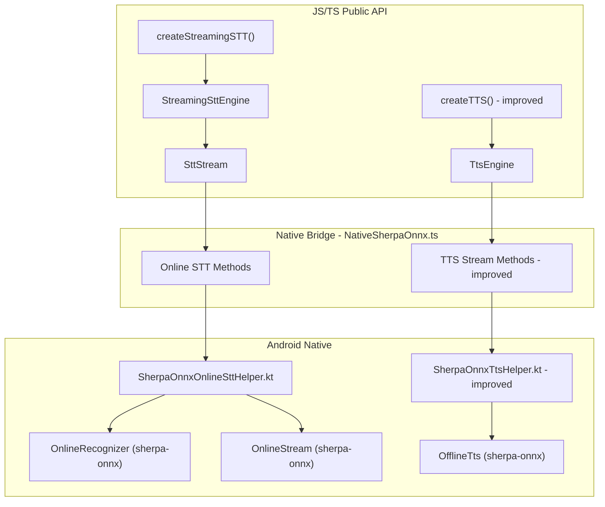

```mermaid
graph TD
  subgraph jsLayer [JS/TS Public API]
    createStreamingSTT["createStreamingSTT()"]
    StreamingSttEngine[StreamingSttEngine]
    SttStream[SttStream]
    createTTS["createTTS() - improved"]
    TtsEngine[TtsEngine]
  end

  subgraph bridgeLayer [Native Bridge - NativeSherpaOnnx.ts]
    OnlineSttMethods["Online STT Methods"]
    TtsStreamMethods["TTS Stream Methods - improved"]
  end

  subgraph androidLayer [Android Native]
    OnlineSttHelper[SherpaOnnxOnlineSttHelper.kt]
    TtsHelper[SherpaOnnxTtsHelper.kt - improved]
    OnlineRecognizer["OnlineRecognizer (sherpa-onnx)"]
    OnlineStreamNative["OnlineStream (sherpa-onnx)"]
    OfflineTts["OfflineTts (sherpa-onnx)"]
  end

  createStreamingSTT --> StreamingSttEngine
  StreamingSttEngine --> SttStream
  SttStream --> OnlineSttMethods
  OnlineSttMethods --> OnlineSttHelper
  OnlineSttHelper --> OnlineRecognizer
  OnlineSttHelper --> OnlineStreamNative

  createTTS --> TtsEngine
  TtsEngine --> TtsStreamMethods
  TtsStreamMethods --> TtsHelper
  TtsHelper --> OfflineTts
```