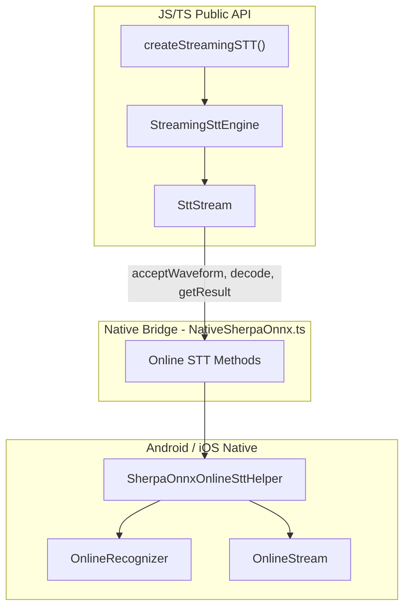

# Streaming Speech-to-Text (Online STT)

Real-time speech recognition with partial results and endpoint detection. Feed audio incrementally (e.g. from a microphone) and get low-latency, incremental transcripts.

**Import path:** `react-native-sherpa-onnx/stt`

---

## Table of Contents

- [Overview](#overview)
- [Quick Start](#quick-start)
- [API Reference](#api-reference)
  - [createStreamingSTT()](#createstreamingssttoptions)
  - [StreamingSttEngine](#streamingsttengine)
  - [SttStream](#sttstream)
  - [StreamingSttResult](#streamingsttresult)
  - [EndpointConfig](#endpointconfig)
  - [Helper Functions](#helper-functions)
  - [Types & Constants](#types--constants)
- [Detailed Examples](#detailed-examples)
- [Troubleshooting & Tuning](#troubleshooting--tuning)
- [Architecture Overview](#architecture-overview)
- [See Also](#see-also)

---

## Overview

| Feature | Status | Notes |
| --- | --- | --- |
| Streaming engine creation | ✅ | `createStreamingSTT()` → `StreamingSttEngine` |
| Stream creation per session | ✅ | `engine.createStream(hotwords?)` |
| Accept waveform | ✅ | `stream.acceptWaveform(samples, sampleRate)` |
| Incremental decode | ✅ | `stream.decode()` + `stream.getResult()` |
| Endpoint detection | ✅ | `stream.isEndpoint()` with configurable rules |
| Convenience one-call | ✅ | `stream.processAudioChunk()` — accept + decode + result in one call |
| Input normalization | ✅ | Adaptive scaling for varying mic levels (default on) |
| Auto model detection | ✅ | `modelType: 'auto'` with `detectSttModel` + online type mapping |
| Hotwords (transducer) | ✅ | Per-engine and per-stream |
| Multiple streams per engine | ✅ | Independent state per stream |

Use **only** with streaming-capable models. For offline (full-file) transcription, use [`createSTT()`](stt.md). For live microphone capture with automatic resampling, use the [PCM Live Stream API](pcm-live-stream.md).

**Supported online model types:** `transducer`, `paraformer`, `zipformer2_ctc`, `nemo_ctc`, `tone_ctc`.

---

## Quick Start

```typescript
import { createStreamingSTT } from 'react-native-sherpa-onnx/stt';

// 1) Create streaming engine
const engine = await createStreamingSTT({
  modelPath: { type: 'asset', path: 'models/streaming-zipformer-en' },
  modelType: 'transducer', // or 'auto' to detect
});

// 2) Create a stream (one per recognition session)
const stream = await engine.createStream();

// 3) Feed audio and get results
const { result, isEndpoint } = await stream.processAudioChunk(samples, 16000);
console.log('Partial:', result.text);
if (isEndpoint) console.log('Utterance ended');

// 4) Cleanup
await stream.release();
await engine.destroy();
```

---

## API Reference

### `createStreamingSTT(options)`

```ts
function createStreamingSTT(
  options: StreamingSttInitOptions
): Promise<StreamingSttEngine>;
```

Creates a streaming (online) STT engine backed by sherpa-onnx's `OnlineRecognizer`. Call `engine.destroy()` when done.

**Options (`StreamingSttInitOptions`):**

| Option | Type | Default | Description |
| --- | --- | --- | --- |
| `modelPath` | `ModelPathConfig` | — | `{ type: 'asset' \| 'file' \| 'auto', path }` |
| `modelType` | `OnlineSTTModelType \| 'auto'` | `'auto'` | `'transducer'`, `'paraformer'`, `'zipformer2_ctc'`, `'nemo_ctc'`, `'tone_ctc'`, or `'auto'` |
| `enableEndpoint` | `boolean` | `true` | Enable end-of-utterance detection |
| `endpointConfig` | `EndpointConfig` | — | Rules for utterance boundaries. See [EndpointConfig](#endpointconfig) |
| `decodingMethod` | `string` | `'greedy_search'` | `'greedy_search'` or `'modified_beam_search'` |
| `maxActivePaths` | `number` | `4` | Beam search size |
| `hotwordsFile` | `string` | — | Hotwords file path (transducer models) |
| `hotwordsScore` | `number` | `1.5` | Hotwords score |
| `numThreads` | `number` | `1` | Inference threads |
| `provider` | `string` | — | e.g. `'cpu'`, `'qnn'` |
| `ruleFsts` | `string` | — | Rule FST paths for ITN |
| `ruleFars` | `string` | — | Rule FAR paths for ITN |
| `blankPenalty` | `number` | — | Blank penalty |
| `debug` | `boolean` | `false` | Debug logging |
| `enableInputNormalization` | `boolean` | `true` | Adaptive scaling of input audio peak to ~0.8, helping with varying mic levels. Set `false` if audio is already normalized |

---

### `StreamingSttEngine`

| Member | Type | Description |
| --- | --- | --- |
| `instanceId` | `string` | Read-only engine ID |
| `createStream(hotwords?)` | `(hotwords?: string) => Promise<SttStream>` | Create a new stream. Optional inline `hotwords` string |
| `destroy()` | `() => Promise<void>` | Release recognizer and all streams |

---

### `SttStream`

One stream per recognition session (e.g. one utterance or recording).

| Method | Signature | Description |
| --- | --- | --- |
| `streamId` | `string` (read-only) | Stream ID |
| `acceptWaveform` | `(samples: number[], sampleRate: number) => Promise<void>` | Feed PCM samples (float in [-1, 1]) |
| `inputFinished` | `() => Promise<void>` | Signal that no more audio will be fed |
| `decode` | `() => Promise<void>` | Run decoding on buffered audio (call when `isReady()` is true) |
| `isReady` | `() => Promise<boolean>` | True if enough audio is buffered to decode |
| `getResult` | `() => Promise<StreamingSttResult>` | Current partial or final result (call after `decode()`) |
| `isEndpoint` | `() => Promise<boolean>` | True if end-of-utterance detected |
| `reset` | `() => Promise<void>` | Reset stream state for reuse (e.g. next utterance) |
| `release` | `() => Promise<void>` | Release native stream. Do not use after this |
| `processAudioChunk` | `(samples: number[], sampleRate: number) => Promise<{ result: StreamingSttResult; isEndpoint: boolean }>` | Convenience: accept + decode + result + endpoint in one call |

---

### `StreamingSttResult`

| Field | Type | Description |
| --- | --- | --- |
| `text` | `string` | Transcribed text (partial or final) |
| `tokens` | `string[]` | Token list |
| `timestamps` | `number[]` | Timestamps per token (model-dependent) |

---

### `EndpointConfig`

Three rules; the first match defines end-of-utterance. Omitted rules use sherpa-onnx defaults.

| Property | Type | Description |
| --- | --- | --- |
| `rule1` | `EndpointRule` | e.g. 2.4 s trailing silence, no speech required |
| `rule2` | `EndpointRule` | e.g. 1.4 s trailing silence, speech required |
| `rule3` | `EndpointRule` | e.g. max utterance length 20 s |

**`EndpointRule`:**

| Property | Type | Description |
| --- | --- | --- |
| `mustContainNonSilence` | `boolean` | Rule only matches when segment contains non-silence |
| `minTrailingSilence` | `number` | Min trailing silence in seconds |
| `minUtteranceLength` | `number` | Min/max utterance length in seconds |

---

### Helper Functions

**`getOnlineTypeOrNull(detectedType)`** — Check if a detected STT model type supports streaming. Returns the `OnlineSTTModelType` or `null` if offline-only (e.g. Whisper, SenseVoice).

```typescript
import { getOnlineTypeOrNull } from 'react-native-sherpa-onnx/stt';

const onlineType = getOnlineTypeOrNull('transducer');
if (onlineType) {
  // Model supports streaming
} else {
  // Offline only
}
```

**`mapDetectedToOnlineType(detectedType)`** — Same mapping but throws if not supported. Use when you already know the model is streaming-capable.

---

### Types & Constants

```ts
import {
  createStreamingSTT,
  mapDetectedToOnlineType,
  getOnlineTypeOrNull,
  ONLINE_STT_MODEL_TYPES,
} from 'react-native-sherpa-onnx/stt';

import type {
  StreamingSttEngine,
  StreamingSttInitOptions,
  StreamingSttResult,
  SttStream,
  EndpointConfig,
  EndpointRule,
  OnlineSTTModelType,
} from 'react-native-sherpa-onnx/stt';
```

- **`OnlineSTTModelType`:** `'transducer' | 'paraformer' | 'zipformer2_ctc' | 'nemo_ctc' | 'tone_ctc'`
- **`ONLINE_STT_MODEL_TYPES`:** Readonly array of all supported online model types

---

## Detailed Examples

### Mic → chunks → partial results → endpoint

```typescript
const engine = await createStreamingSTT({
  modelPath: { type: 'asset', path: 'models/streaming-zipformer-en' },
  modelType: 'transducer',
  enableEndpoint: true,
});

const stream = await engine.createStream();

async function onAudioChunk(samples: number[], sampleRate: number) {
  await stream.acceptWaveform(samples, sampleRate);
  while (await stream.isReady()) {
    await stream.decode();
    const result = await stream.getResult();
    if (result.text) updateUI(result.text);
    if (await stream.isEndpoint()) {
      onUtteranceEnd();
      await stream.reset(); // reuse for next utterance
    }
  }
}

// When recording stops
await stream.inputFinished();
await stream.release();
await engine.destroy();
```

### Using `processAudioChunk` (simpler)

```typescript
for (const chunk of audioChunks) {
  const { result, isEndpoint } = await stream.processAudioChunk(chunk, 16000);
  if (result.text) setTranscript(t => t + result.text);
  if (isEndpoint) break;
}
```

### Endpoint tuning

```typescript
const engine = await createStreamingSTT({
  modelPath: { type: 'asset', path: 'models/streaming-zipformer-en' },
  modelType: 'transducer',
  endpointConfig: {
    rule1: { mustContainNonSilence: false, minTrailingSilence: 1.0, minUtteranceLength: 0 },
    rule2: { mustContainNonSilence: true, minTrailingSilence: 0.8, minUtteranceLength: 0 },
    rule3: { mustContainNonSilence: false, minTrailingSilence: 0, minUtteranceLength: 30 },
  },
});
```

### Hotwords (transducer)

```typescript
const engine = await createStreamingSTT({
  modelPath: { type: 'asset', path: 'models/streaming-zipformer-en' },
  modelType: 'transducer',
  hotwordsFile: '/path/to/hotwords.txt',
  hotwordsScore: 1.5,
});

// Optionally pass per-stream hotwords
const stream = await engine.createStream('inline hotwords string');
```

### One engine, multiple streams

```typescript
const engine = await createStreamingSTT({ ... });
const streamA = await engine.createStream();
const streamB = await engine.createStream();
// Use independently; release each when done
await streamA.release();
await streamB.release();
await engine.destroy();
```

### Model type detection for streaming

```typescript
import { detectSttModel } from 'react-native-sherpa-onnx/stt';
import { getOnlineTypeOrNull, createStreamingSTT } from 'react-native-sherpa-onnx/stt';

const detection = await detectSttModel({ type: 'asset', path: 'models/my-model' });
const onlineType = getOnlineTypeOrNull(detection.modelType);

if (onlineType) {
  const engine = await createStreamingSTT({
    modelPath: { type: 'asset', path: 'models/my-model' },
    modelType: onlineType,
  });
  // ... use for streaming ...
} else {
  // Model is offline-only; use createSTT() instead
}
```

---

## Troubleshooting & Tuning

| Issue | Solution |
| --- | --- |
| "Unsupported streaming model type" | Only `transducer`, `paraformer`, `zipformer2_ctc`, `nemo_ctc`, `tone_ctc` support streaming. Whisper, SenseVoice, etc. are offline-only |
| No partial results | Ensure `isReady()` is true before calling `decode()`. Feed enough audio |
| Endpoint fires too early/late | Adjust `endpointConfig` rules (trailing silence, utterance length) |
| Quiet/loud audio from mic | `enableInputNormalization: true` (default) handles this. Set `false` only for pre-normalized audio |
| Methods throw after release | Don't use a stream after `release()` or engine after `destroy()` |
| Bridge overhead | Use `processAudioChunk()` to reduce round-trips (one call vs. separate accept/decode/getResult) |

**Performance tips:**

- Use a single stream per session; call `reset()` for the next utterance
- For transducer models, `tone_ctc` and `zipformer2_ctc` are lighter alternatives
- Fewer threads (`numThreads: 1`) can be better on mobile to avoid contention

**Streaming model types and assets:**

| Type | Files |
| --- | --- |
| `transducer` | encoder + decoder + joiner + tokens.txt |
| `paraformer` | encoder + decoder + tokens.txt |
| `zipformer2_ctc` / `nemo_ctc` | model*.onnx + tokens.txt |
| `tone_ctc` | model.onnx + tokens.txt (folder name contains `t-one`, `t_one`, or standalone `tone`) |

---

## Architecture Overview



---

## See Also

- [STT (Offline)](stt.md) — Full-file transcription
- [PCM Live Stream](pcm-live-stream.md) — Microphone capture for live transcription
- [Hotwords](hotwords.md) — Contextual biasing for transducer models
- [Model Setup](model-setup.md) — Model discovery and paths
- [Execution Providers](execution-providers.md) — QNN, NNAPI, XNNPACK, Core ML
