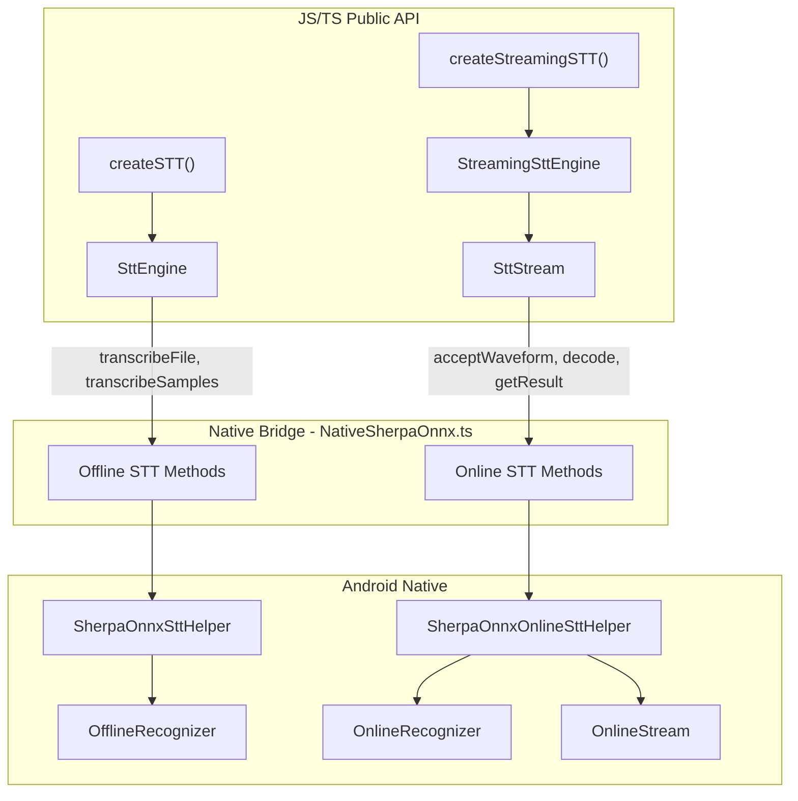

# Streaming (Online) Speech-to-Text

This guide covers the **streaming STT** API for real-time recognition with partial results and endpoint detection. Use it when you feed audio incrementally (e.g. from a microphone) and want low-latency, incremental transcripts.

**Import path:** `react-native-sherpa-onnx/stt` (streaming is not exported from the main package).

## Table of contents

- [Quick usage](#quick-usage)
- [API reference](#api-reference)
- [Advanced examples & tips](#advanced-examples--tips)
- [Internal Architecture Overview](#internal-architecture-overview)

---

## Quick usage

```typescript
import { createStreamingSTT } from 'react-native-sherpa-onnx/stt';

// 1) Create streaming engine (use modelType: 'auto' to detect from directory)
const engine = await createStreamingSTT({
  modelPath: { type: 'asset', path: 'models/sherpa-onnx-streaming-zipformer-en-2023-06-26' },
  modelType: 'transducer', // or 'auto' to detect
});

// 2) Create a stream (one stream per recognition session)
const stream = await engine.createStream();

// 3) Feed audio chunks and get partial/final results
const samples = getPcmSamplesFromMic(); // float[] in [-1, 1], e.g. 16 kHz
await stream.acceptWaveform(samples, 16000);

if (await stream.isReady()) {
  await stream.decode();
  const result = await stream.getResult();
  console.log('Partial:', result.text);
  if (await stream.isEndpoint()) {
    console.log('Utterance ended');
  }
}

// 4) Cleanup
await stream.release();
await engine.destroy();
```

**Convenience: one call per chunk** (fewer bridge round-trips):

```typescript
const { result, isEndpoint } = await stream.processAudioChunk(samples, 16000);
console.log(result.text);
if (isEndpoint) console.log('Utterance ended');
```

---

## API reference

### `createStreamingSTT(options)`

```ts
function createStreamingSTT(
  options: StreamingSttInitOptions
): Promise<StreamingSttEngine>;
```

Creates a **streaming (online) STT engine** backed by sherpa-onnx’s `OnlineRecognizer`. You must call `engine.destroy()` when done. Use **only** with streaming-capable models. Pass `modelType: 'auto'` to detect the model type from the directory (uses `detectSttModel` and maps to an online type).

**Options (`StreamingSttInitOptions`):**

| Option | Type | Description |
|--------|------|-------------|
| `modelPath` | `ModelPathConfig` | `{ type: 'asset' \| 'file' \| 'auto', path: string }`. Resolved to an absolute path before init. |
| `modelType` | `OnlineSTTModelType \| 'auto'` | One of: `'transducer'`, `'paraformer'`, `'zipformer2_ctc'`, `'nemo_ctc'`, `'tone_ctc'`, or `'auto'` to detect. Default: `'auto'`. |
| `enableEndpoint` | `boolean` | Enable endpoint (end-of-utterance) detection. Default: `true`. |
| `endpointConfig` | `EndpointConfig` | Optional. Rules for when an utterance is considered finished. See [EndpointConfig](#endpointconfig). |
| `decodingMethod` | `'greedy_search' \| 'modified_beam_search'` | Default: `'greedy_search'`. |
| `maxActivePaths` | `number` | Beam search size. Default: `4`. |
| `hotwordsFile` | `string` | Path to hotwords file (transducer models). |
| `hotwordsScore` | `number` | Hotwords score. Default: `1.5`. |
| `numThreads` | `number` | Inference threads. Default: `1`. |
| `provider` | `string` | e.g. `'cpu'`. |
| `ruleFsts` | `string` | Path(s) to rule FSTs for ITN. |
| `ruleFars` | `string` | Path(s) to rule FARs for ITN. |
| `blankPenalty` | `number` | Blank penalty. |
| `debug` | `boolean` | Enable debug logging. Default: `false`. |
| `enableInputNormalization` | `boolean` | When `true` (default), audio chunks passed to `processAudioChunk()` are adaptively scaled so the peak is ~0.8, which helps with varying device input levels (e.g. quiet mics on iOS, different Android devices). Set to `false` if your audio is already in the expected range [-1, 1] and you want to pass it through unchanged [Input normalization](#input-normalization) |

**Returns:** `Promise<StreamingSttEngine>`.

---

### `StreamingSttEngine`

| Member | Type | Description |
|--------|------|-------------|
| `instanceId` | `string` | Read-only engine id. |
| `createStream(hotwords?)` | `(hotwords?: string) => Promise<SttStream>` | Creates a new stream. Optional `hotwords` string. |
| `destroy()` | `() => Promise<void>` | Releases the recognizer and all streams. Call when done. |

---

### `SttStream`

Created by `engine.createStream()`. One stream per recognition session (e.g. one per utterance or recording).

| Method | Signature | Description |
|--------|-----------|-------------|
| `streamId` | `string` (read-only) | Stream id. |
| `acceptWaveform` | `(samples: number[], sampleRate: number) => Promise<void>` | Feed PCM samples (float in [-1, 1]). |
| `inputFinished` | `() => Promise<void>` | Signal that no more audio will be fed. |
| `decode` | `() => Promise<void>` | Run decoding on buffered audio. Call when `isReady()` is true. |
| `isReady` | `() => Promise<boolean>` | True if there is enough audio to decode. |
| `getResult` | `() => Promise<StreamingSttResult>` | Current partial or final result. Call after `decode()`. |
| `isEndpoint` | `() => Promise<boolean>` | True if end-of-utterance was detected. |
| `reset` | `() => Promise<void>` | Reset stream state for reuse. |
| `release` | `() => Promise<void>` | Release native stream. Do not use the stream after this. |
| `processAudioChunk` | `(samples: number[], sampleRate: number) => Promise<{ result: StreamingSttResult; isEndpoint: boolean }>` | Convenience: accept + decode while ready + get result and endpoint in one call. |

---

### `StreamingSttResult`

| Field | Type | Description |
|-------|------|-------------|
| `text` | `string` | Transcribed text (partial or final). |
| `tokens` | `string[]` | Token list. |
| `timestamps` | `number[]` | Timestamps per token (model-dependent). |

---

### `EndpointConfig`

Optional. Three rules; the first match defines end-of-utterance. Omitted rules use sherpa-onnx defaults.

| Property | Type | Description |
|----------|------|-------------|
| `rule1` | `EndpointRule` | e.g. 2.4 s trailing silence, no speech required. |
| `rule2` | `EndpointRule` | e.g. 1.4 s trailing silence, speech required. |
| `rule3` | `EndpointRule` | e.g. max utterance length 20 s. |

**`EndpointRule`:**

| Property | Type | Description |
|----------|------|-------------|
| `mustContainNonSilence` | `boolean` | If true, rule only matches when the segment contains non-silence. |
| `minTrailingSilence` | `number` | Min trailing silence in seconds. |
| `minUtteranceLength` | `number` | Min (or max, depending on rule) utterance length in seconds. |

---

### Types and constants

- **`OnlineSTTModelType`:** `'transducer' | 'paraformer' | 'zipformer2_ctc' | 'nemo_ctc' | 'tone_ctc'`
- **`ONLINE_STT_MODEL_TYPES`:** Readonly array of supported online model types.

Import from `react-native-sherpa-onnx/stt`:

```ts
import {
  createStreamingSTT,
  mapDetectedToOnlineType,
  getOnlineTypeOrNull,
  ONLINE_STT_MODEL_TYPES,
} from 'react-native-sherpa-onnx/stt';
import type {
  StreamingSttEngine,
  StreamingSttInitOptions,
  StreamingSttResult,
  SttStream,
  EndpointConfig,
  EndpointRule,
  OnlineSTTModelType,
} from 'react-native-sherpa-onnx/stt';
```

### Checking if a model supports streaming

Use **`getOnlineTypeOrNull(detectedType)`** to check whether a detected STT model type (e.g. from `detectSttModel`) can be used with streaming (live transcription). Returns the corresponding `OnlineSTTModelType` or `null` if the model is offline-only (e.g. Whisper, SenseVoice).

```ts
import { getOnlineTypeOrNull, createStreamingSTT } from 'react-native-sherpa-onnx/stt';

const detectedType = 'transducer'; // or from detectSttModel().modelType
const onlineType = getOnlineTypeOrNull(detectedType);
if (onlineType !== null) {
  // Model supports streaming; e.g. show "Live Transcription" and create engine with modelType: onlineType
  const engine = await createStreamingSTT({ modelPath: { type: 'asset', path: '...' }, modelType: onlineType });
} else {
  // Model is offline-only; disable or hide live UI
}
```

**`mapDetectedToOnlineType(detectedType)`** does the same mapping but throws if the type is not supported for streaming. Use it when you already know the model is streaming-capable (e.g. after checking with `getOnlineTypeOrNull`) and need the typed `OnlineSTTModelType` for `createStreamingSTT`.

---

## Advanced examples & tips

### Typical loop: mic → chunks → partial results → endpoint

```typescript
const engine = await createStreamingSTT({
  modelPath: { type: 'asset', path: 'models/streaming-zipformer-en' },
  modelType: 'transducer',
  enableEndpoint: true,
});

const stream = await engine.createStream();

async function onAudioChunk(samples: number[], sampleRate: number) {
  await stream.acceptWaveform(samples, sampleRate);
  while (await stream.isReady()) {
    await stream.decode();
    const result = await stream.getResult();
    if (result.text) updateUI(result.text);
    if (await stream.isEndpoint()) {
      onUtteranceEnd();
      await stream.reset(); // optional: reuse stream for next utterance
    }
  }
}

// When recording stops
await stream.inputFinished();
// optionally decode until ready and get final result
await stream.release();
await engine.destroy();
```

### Using `processAudioChunk` for simpler code

If you don’t need fine-grained control, use one call per chunk:

```typescript
for (const chunk of audioChunks) {
  const { result, isEndpoint } = await stream.processAudioChunk(chunk, 16000);
  if (result.text) setTranscript((t) => t + result.text);
  if (isEndpoint) break;
}
```

### Endpoint tuning

Tighten or loosen when the engine considers an utterance finished:

```typescript
await createStreamingSTT({
  modelPath: { type: 'asset', path: 'models/streaming-zipformer-en' },
  modelType: 'transducer',
  enableEndpoint: true,
  endpointConfig: {
    rule1: {
      mustContainNonSilence: false,
      minTrailingSilence: 1.0,  // shorter silence = faster end
      minUtteranceLength: 0,
    },
    rule2: {
      mustContainNonSilence: true,
      minTrailingSilence: 0.8,
      minUtteranceLength: 0,
    },
    rule3: {
      mustContainNonSilence: false,
      minTrailingSilence: 0,
      minUtteranceLength: 30,  // max 30 s per utterance
    },
  },
});
```

### Hotwords (transducer)

For transducer (and compatible) models you can pass a hotwords file at init and/or a hotwords string per stream:

```typescript
const engine = await createStreamingSTT({
  modelPath: { type: 'asset', path: 'models/streaming-zipformer-en' },
  modelType: 'transducer',
  hotwordsFile: '/path/to/hotwords.txt',
  hotwordsScore: 1.5,
});

const stream = await engine.createStream('optional inline hotwords');
```

### One engine, multiple streams

You can create multiple streams from one engine (e.g. for different channels or segments). Each stream has its own state; release each when done.

```typescript
const engine = await createStreamingSTT({ ... });
const streamA = await engine.createStream();
const streamB = await engine.createStream();
// use streamA and streamB independently
await streamA.release();
await streamB.release();
await engine.destroy();
```

### Model types and assets

Streaming models differ from offline (e.g. Whisper, SenseVoice). Use **streaming** model assets and set `modelType` to one of (or use `'auto'` to detect):

- `transducer` – encoder + decoder + joiner (+ `tokens.txt`)
- `paraformer` – encoder + decoder (+ `tokens.txt`)
- `zipformer2_ctc` / `nemo_ctc` – single `model*.onnx` + `tokens.txt`
- `tone_ctc` – single `model.onnx` + `tokens.txt`; folder name usually contains `t-one`, `t_one`, or the word `tone` (e.g. `sherpa-onnx-streaming-t-one-russian-2025-09-08`). The string `tone` is matched only as a standalone word (not e.g. inside "cantonese").

The SDK resolves `modelPath` via `resolveModelPath`; for assets use `{ type: 'asset', path: 'models/...' }`. With `modelType: 'auto'`, the SDK calls `detectSttModel` and maps the detected type to a streaming type (unsupported types such as whisper throw a clear error).

### Input normalization

By default, `processAudioChunk()` applies **adaptive input normalization**: it scales each chunk so the peak is about 0.8, which improves recognition when the microphone or device delivers very quiet or very loud input (e.g. on some iOS devices or simulators). If your audio source already provides samples in the expected range [-1, 1] (e.g. from a pre-normalized file or another SDK), you can disable this to avoid double-scaling:

```typescript
const engine = await createStreamingSTT({
  modelPath: { type: 'asset', path: 'models/streaming-zipformer-en' },
  modelType: 'transducer',
  enableInputNormalization: false,  // pass audio through unchanged
});
```

### Cleanup and guards

- Always call `stream.release()` and `engine.destroy()` when done to free native resources.
- After `destroy()` or `release()`, calling methods on that engine/stream will throw.
- Use a single stream per “session” (e.g. one utterance); call `reset()` to reuse the same stream for the next utterance if desired.

## Internal Architecture Overview - batch vs streaming split

STT uses two JS engines (batch and streaming) with three native helper -  one for offline and two for online:

### STT (Speech-to-Text)

