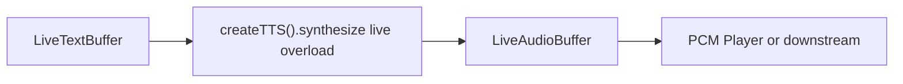

# TTS (live overload)

> **Live overload** — not a streaming TTS model.
>
> Live text is sliced by mandatory text segmentation; each committed chunk is synthesized natively with the same offline TTS weights into a live audio buffer. There is no separate online/streaming TTS engine in sherpa-onnx.

## Introduction

On-device **live-pipeline** synthesis via live overload on the offline TTS engine. Useful when text arrives continuously (e.g. from a live STT buffer or network stream) and you want high-fidelity offline models (VITS, Kokoro, Pocket, Zipvoice, Matcha, Supertonic, …) without native online decoding.

Import path: **`react-native-sherpa-onnx/tts`**.

Factory / detect / models: [tts-offline.md](tts-offline.md#api-reference).

Shared handle lifecycle: [streaming-pipelines-overview.md](streaming-pipelines-overview.md).

## Quick start

```ts
import { createTTS } from 'react-native-sherpa-onnx/tts';
import {
  createEmptyLiveAudioBuffer,
  finalizeLiveAudioBuffer,
  releasePipelineAudioBuffer,
} from 'react-native-sherpa-onnx/audiobuffer';
import {
  createLiveTextBuffer,
  finalizeLiveTextBuffer,
  releasePipelineTextBuffer,
} from 'react-native-sherpa-onnx/textbuffer';

const tts = await createTTS({
  modelSource: { kind: 'fs', path: '/absolute/path/to/vits-piper-en' },
  modelType: 'vits',
});

const sr = await tts.getSampleRate();
const textIn = await createLiveTextBuffer();
const audioOut = await createEmptyLiveAudioBuffer({
  sampleRate: sr,
  channelCount: 1,
});

const handle = await tts.synthesize(textIn, audioOut, {
  segmentation: {
    mode: 'auto',
    policy: { evaluator: 'text_synthetic_auto', maxLengthChars: 500 },
  },
  // sid?, speed?, lang?, voiceClone?, onSegment? — see Types
});

// Append / stream text into textIn, then finalize when the session ends
await finalizeLiveTextBuffer(textIn);
const completion = await handle.completed;
console.log(`Synthesized ${completion.unitsWritten} samples`);

await finalizeLiveAudioBuffer(audioOut);
await releasePipelineTextBuffer(textIn);
await releasePipelineAudioBuffer(audioOut);
await tts.destroy();
```

`finalizeLiveTextBuffer(textIn)` drains remaining text spans and lets `completed` resolve. Prefer that over an early `stop()` when the session ends naturally.

## Buffer matrix

| Role | Type | Notes |
| --- | --- | --- |
| **Text in** | [`LiveTextBuffer`](textbuffer-streaming.md) (`txt_live_*`) | Offline uses `OfflineTextBuffer` (`txt_off_*`) |
| **Audio out** | [`LiveAudioBuffer`](audiobuffer-streaming.md) (`live_*`) | Sample rate must match model; offline uses empty `OfflineAudioBuffer` (`off_*`) |
| **Return** | `TtsPipelineHandle` | Offline: `TtsSynthesisResult` / void path |
| **Engine** | Same `TtsEngine` as offline (`createTTS`) | `synthesize(LiveText, LiveAudio, options)` |
| **Pipeline handle** | `TtsPipelineHandle` | `stop` / `flush` / `reset` / `getStatus` / `completed` |

Mixed live/offline arguments throw `TTS_INVALID_ARGUMENT`.

## Segmentation (Mandatory)

Live TTS must cut the incoming text stream into committed chunks before each offline synthesize step. `options.segmentation.policy` is **required** (`LIVE_OFFLINE_SEGMENTATION_REQUIRED` if missing or `mode` is `'off'`). Commit-only — no partial audio between boundaries.

**Modes:** `'auto'` only (policy required). `'off'` / `'manual'` are not supported on the live path.

| Evaluator | Supported | Notes |
| --- | --- | --- |
| `text_synthetic_auto` | ✅ **Default** | Sentence / length commits on the live text buffer; typical `maxLengthChars: 500` |
| `text_punctuation_assisted` | ✅ | Needs `policy.punctuationInstanceId`; then same split as synthetic |
| Speech / frame evaluators | ❌ | Audio-domain policies are not used for TTS live overload |

Text-domain engines commit on the `LiveTextBuffer` itself — no separate `seg_live_*` input.

```ts
await tts.synthesize(textIn, audioOut, {
  segmentation: {
    mode: 'auto',
    policy: { evaluator: 'text_synthetic_auto', maxLengthChars: 500 },
  },
});
```

Full policy reference: [segmentation-engine.md](segmentation-engine.md). Offline Auto: [tts-offline.md](tts-offline.md#segmentation-optional).

## Models

Same packs as offline — see [tts-offline.md — Models](tts-offline.md#models).

## Pipeline handle

Same control surface as other streaming / live-overload features ([streaming-pipelines-overview.md](streaming-pipelines-overview.md)):

| Method | Behavior |
| --- | --- |
| `stop()` | Stop synthesis, flush remaining committed spans, resolve `completed` with `reason: 'stopped'`. |
| `flush()` | Synthesize **already-committed** text spans. Open tail emits on `stop` / input finalize. |
| `reset()` | Clears progress counters while the pipeline remains running. |
| `getStatus()` | `{ pipelineId, isRunning, chunksProcessed, unitsRead, unitsWritten, error }` |
| `completed` | Resolves on graceful finalize (`completed`) or `stop()` (`stopped`); rejects on fatal errors (`STREAMING_PIPELINE_ERROR`). |

## API reference

Factory, detection, and model init are the same as offline — see [tts-offline.md](tts-offline.md#api-reference).

### `tts.synthesize(LiveText, LiveAudio, options)`

Starts a live overload pipeline: reads committed text segments from `textIn`, synthesizes each with offline weights, writes PCM into `audioOut`.

```ts
synthesize(
  textIn: LiveTextBufferIdSource,
  audioOut: LiveAudioBufferIdSource,
  options: TtsLivePipelineOptions
): Promise<TtsPipelineHandle>;
```

**Constraints:** both buffers must be live; `audioOut.sampleRate` must equal `await tts.getSampleRate()`; `segmentation.policy` required with a text-domain evaluator.

```ts
const handle = await tts.synthesize(textIn, audioOut, {
  segmentation: {
    mode: 'auto',
    policy: { evaluator: 'text_synthetic_auto', maxLengthChars: 500 },
  },
  sid: 0,
  speed: 1.0,
});
```

## Pipeline composition



More patterns: [feature-pipelines.md](feature-pipelines.md) · shared lifecycle: [streaming-pipelines-overview.md](streaming-pipelines-overview.md).

## JS Events

| Callback | Payload | Fires when | Notes |
| --- | --- | --- | --- |
| `onSegment` | `TtsLiveSegmentEvent` | after each committed text span is synthesized | no `onProgress` on the live path |

Shapes: [Types](#types) · offline progress fields: [tts-offline.md](tts-offline.md#types).

```ts
const handle = await tts.synthesize(textIn, audioOut, {
  segmentation: {
    mode: 'auto',
    policy: { evaluator: 'text_synthetic_auto', maxLengthChars: 500 },
  },
  onSegment: (e) => console.log(e.segmentIndex),
});
```

## Types

### Live-only TTS types (`react-native-sherpa-onnx/tts`)

| Type | Description |
| --- | --- |
| `TtsLivePipelineOptions` | Extends `LiveOfflinePipelineBaseOptions` with mandatory `segmentation.policy`; plus `sid?`, `speed?`, `lang?`, `voiceClone?`, `onSegment?` |
| `TtsPipelineHandle` | Extends `StreamingPipelineHandle` — control surface for the live run |

Model types, offline `synthesize` options, and detect results: [tts-offline.md](tts-offline.md#types).

## Error codes

| Error code | Typical reason |
| --- | --- |
| `LIVE_OFFLINE_SEGMENTATION_REQUIRED` | Missing / invalid `segmentation.policy`, or `mode` is `'off'`. |
| `TTS_INVALID_ARGUMENT` | Live/offline overload mismatch (mixed buffer kinds). |
| `STREAMING_PIPELINE_ERROR` | Fatal error during the run; `completed` rejects with this `code`. |
| `TTS_*` / `DETECT_ERROR` / `OFFLINE_OOM` | Same codes as [offline TTS](tts-offline.md#error-codes) where applicable. |

## Use case examples

<details>
<summary>Append text while PCM playback already drains synthesized audio</summary>

Start live TTS and a player on the output ring first, then keep appending text segments — audio starts playing before you finalize the text buffer or await `completed`.

```ts
import { createTTS } from 'react-native-sherpa-onnx/tts';
import {
  createEmptyLiveAudioBuffer,
  finalizeLiveAudioBuffer,
  releasePipelineAudioBuffer,
} from 'react-native-sherpa-onnx/audiobuffer';
import {
  createLiveTextBuffer,
  appendLiveTextSegment,
  finalizeLiveTextBuffer,
  releasePipelineTextBuffer,
} from 'react-native-sherpa-onnx/textbuffer';
import { createPcmPlayer } from 'react-native-sherpa-onnx/pcm';

const tts = await createTTS({
  modelSource: { kind: 'fs', path: '/path/to/tts-model' },
  modelType: 'auto',
});
const sr = await tts.getSampleRate();
const textIn = await createLiveTextBuffer({ maxSegments: 256 });
const audioOut = await createEmptyLiveAudioBuffer({ sampleRate: sr, channelCount: 1 });

const pipeline = await tts.synthesize(textIn, audioOut, {
  segmentation: {
    mode: 'auto',
    policy: { evaluator: 'text_synthetic_auto', maxLengthChars: 200 },
  },
});
const player = await createPcmPlayer(audioOut);

await appendLiveTextSegment(textIn, 'Hello from live TTS.');
await appendLiveTextSegment(textIn, 'More sentences keep synthesizing while playback continues.');
// player is already draining frames — do not await pipeline.completed yet

await finalizeLiveTextBuffer(textIn);
await pipeline.completed;
await finalizeLiveAudioBuffer(audioOut);
await player.stop();
await tts.destroy();
await releasePipelineTextBuffer(textIn);
await releasePipelineAudioBuffer(audioOut);
```

</details>

<details>
<summary>Flush mid-session, then finalize and await completion</summary>

Force a mid-run flush so pending phoneme/audio tails land in the output buffer, then finalize input and await the pipeline for teardown sequencing.

```ts
await appendLiveTextSegment(textIn, 'One more line before we wind down.');
await pipeline.flush();
await finalizeLiveTextBuffer(textIn);
const done = await pipeline.completed;
console.log('units written', done.unitsWritten);
await finalizeLiveAudioBuffer(audioOut);
```

</details>

<details>
<summary>Sentence-sized commits with `text_synthetic_auto`</summary>

Use auto text segmentation so each committed sentence synthesizes as it arrives — useful for chat-style token streams that never form one giant offline string.

```ts
const pipeline = await tts.synthesize(textIn, audioOut, {
  sid: 0,
  speed: 1.0,
  segmentation: {
    mode: 'auto',
    policy: { evaluator: 'text_synthetic_auto', maxLengthChars: 120 },
  },
  onSegment: (e) => console.log('synth commit', e.segmentIndex),
});

for (const line of chatLines) {
  await appendLiveTextSegment(textIn, line);
}
await finalizeLiveTextBuffer(textIn);
await pipeline.completed;
```

</details>

## See also

- [Text-to-Speech (offline)](tts-offline.md)
- [Streaming pipelines — shared lifecycle](streaming-pipelines-overview.md)
- [Segmentation engine](segmentation-engine.md)
- [Pipeline text buffers — live](textbuffer-streaming.md)
- [Pipeline audio buffers — live / streaming](audiobuffer-streaming.md)
- [PCM Player](pcm-player.md)
- [Memory and models](memory-and-models.md)

## Native crash diagnostics

If native code fails or the app crashes but the tombstone shows only a UI/GPU thread, inspect the SDK **last-activity ring buffer** (enabled by default when the native library loads). Full details: [native-diagnostics.md](./native-diagnostics.md) — Android log tag `SherpaNativeDiag`; iOS subsystem `com.sherpaonnx.diag`. Optional JS: `getNativeDiagnosticSnapshot` / `configureNativeDiagnostics` from `react-native-sherpa-onnx/diagnostics`.
