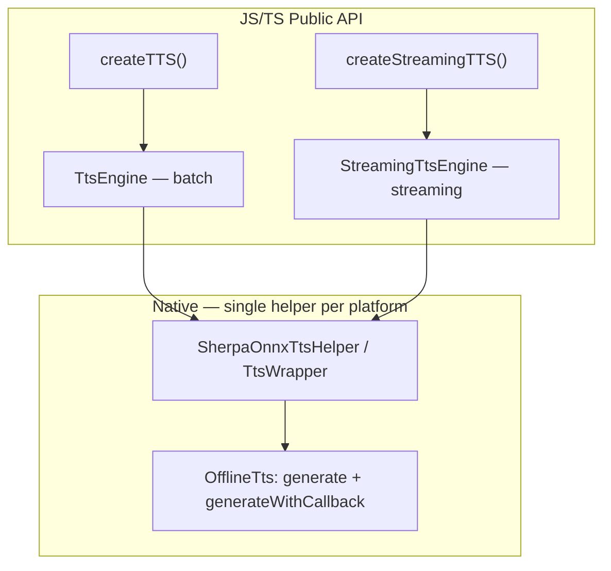

# Streaming Text-to-Speech

Incremental speech generation with chunk callbacks. Use for lower time-to-first-byte, playback while generating, or piping into another audio pipeline.

**Import path:** `react-native-sherpa-onnx/tts`

---

## Table of Contents

- [Overview](#overview)
- [Quick Start](#quick-start)
- [API Reference](#api-reference)
  - [createStreamingTTS()](#createstreamingttsoptions)
  - [StreamingTtsEngine](#streamingttsengine)
  - [generateSpeechStream()](#generatespeechstream)
  - [TtsStreamHandlers](#ttsstreamhandlers)
  - [TtsStreamChunk / TtsStreamEnd / TtsStreamError](#ttsstreamchunk--ttsstreamend--ttsstreamerror)
  - [TtsStreamController](#ttsstreamcontroller)
  - [Types & Imports](#types--imports)
- [Detailed Examples](#detailed-examples)
- [Troubleshooting & Tuning](#troubleshooting--tuning)
- [Architecture Overview](#architecture-overview)
- [See Also](#see-also)

---

## Overview

| Feature | Status | Notes |
| --- | --- | --- |
| Streaming engine creation | ✅ | `createStreamingTTS()` → `StreamingTtsEngine` |
| Chunk callbacks | ✅ | `onChunk`, `onEnd`, `onError` |
| Cancel mid-stream | ✅ | `controller.cancel()` |
| Native PCM playback | ✅ | `startPcmPlayer()` / `writePcmChunk()` / `stopPcmPlayer()` |
| Per-instance routing | ✅ | Events tagged with `instanceId` and `requestId` |
| Voice cloning (streaming) | ✅ | Kotlin engines (e.g. Pocket) only; **not** Zipvoice |

`createStreamingTTS()` creates a streaming-only engine. Use `createTTS()` for batch one-shot synthesis (`generateSpeech`, `generateSpeechWithTimestamps`). Both share the same underlying native helper — one active stream per engine at a time.

---

## Quick Start

```typescript
import { createStreamingTTS } from 'react-native-sherpa-onnx/tts';

const tts = await createStreamingTTS({
  modelPath: { type: 'asset', path: 'models/sherpa-onnx-vits-piper-en' },
  modelType: 'vits',
});

const controller = await tts.generateSpeechStream(
  'Hello, this is streaming TTS.',
  undefined,
  {
    onChunk: (chunk) => {
      // chunk.samples: float[], chunk.sampleRate, chunk.progress (0..1), chunk.isFinal
      playPcmSamples(chunk.samples, chunk.sampleRate);
    },
    onEnd: (event) => {
      if (event.cancelled) console.log('Cancelled');
      else console.log('Done');
    },
    onError: (event) => console.error('TTS error:', event.message),
  }
);

await tts.destroy();
```

---

## API Reference

### `createStreamingTTS(options)`

```ts
function createStreamingTTS(
  options: TTSInitializeOptions | ModelPathConfig
): Promise<StreamingTtsEngine>;
```

Creates a streaming TTS engine. Same init options as `createTTS()` (see [tts.md](tts.md#createttsoptions)). Call `engine.destroy()` when done.

---

### `StreamingTtsEngine`

| Member | Description |
| --- | --- |
| `instanceId` | Read-only engine ID |
| `generateSpeechStream(text, options, handlers)` | Start streaming generation; returns `TtsStreamController` |
| `cancelSpeechStream()` | Cancel the current stream |
| `startPcmPlayer(sampleRate, channels)` | Start built-in PCM playback |
| `writePcmChunk(samples)` | Write float PCM samples to player (from `onChunk`) |
| `stopPcmPlayer()` | Stop the PCM player |
| `getModelInfo()`, `getSampleRate()`, `getNumSpeakers()` | Model info |
| `destroy()` | Release native resources |

---

### `generateSpeechStream()`

```ts
tts.generateSpeechStream(
  text: string,
  options: TtsGenerationOptions | undefined,
  handlers: TtsStreamHandlers
): Promise<TtsStreamController>;
```

Start streaming TTS. Only one stream per engine at a time — starting another while active rejects with `TTS_STREAM_ERROR`.

**Parameters:**

| Parameter | Type | Description |
| --- | --- | --- |
| `text` | `string` | Text to synthesize |
| `options` | `TtsGenerationOptions \| undefined` | Same options as `generateSpeech()`: `sid`, `speed`, `silenceScale`, `referenceAudio`, `referenceText`, `numSteps`, `extra` |
| `handlers` | `TtsStreamHandlers` | Callbacks: `onChunk`, `onEnd`, `onError` |

---

### `TtsStreamHandlers`

| Property | Type | Description |
| --- | --- | --- |
| `onChunk?` | `(chunk: TtsStreamChunk) => void` | Called for each audio chunk |
| `onEnd?` | `(event: TtsStreamEnd) => void` | Called when generation finishes or is cancelled. Listeners auto-removed |
| `onError?` | `(event: TtsStreamError) => void` | Called on error. Listeners auto-removed |

---

### `TtsStreamChunk` / `TtsStreamEnd` / `TtsStreamError`

**`TtsStreamChunk`:**

| Field | Type | Description |
| --- | --- | --- |
| `instanceId?` | `string` | Engine instance ID |
| `requestId?` | `string` | Request ID for this generation |
| `samples` | `number[]` | PCM samples, float in [-1, 1] |
| `sampleRate` | `number` | Sample rate in Hz |
| `progress` | `number` | Progress 0…1 |
| `isFinal` | `boolean` | True for the last chunk |

**`TtsStreamEnd`:**

| Field | Type | Description |
| --- | --- | --- |
| `instanceId?` | `string` | Engine instance ID |
| `requestId?` | `string` | Request ID |
| `cancelled` | `boolean` | True if generation was cancelled |

**`TtsStreamError`:**

| Field | Type | Description |
| --- | --- | --- |
| `instanceId?` | `string` | Engine instance ID |
| `requestId?` | `string` | Request ID |
| `message` | `string` | Error message |

---

### `TtsStreamController`

Returned by `generateSpeechStream()`.

| Method | Signature | Description |
| --- | --- | --- |
| `cancel` | `() => Promise<void>` | Stop generation and remove listeners |
| `unsubscribe` | `() => void` | Remove listeners only |

Listeners are **automatically** removed when `onEnd` or `onError` fires. Call `unsubscribe()` manually if you discard the controller without waiting (e.g. on navigation).

---

### Types & Imports

```ts
import { createStreamingTTS } from 'react-native-sherpa-onnx/tts';
import type {
  StreamingTtsEngine,
  TtsStreamController,
  TtsStreamHandlers,
  TtsStreamChunk,
  TtsStreamEnd,
  TtsStreamError,
  TtsGenerationOptions,
} from 'react-native-sherpa-onnx/tts';
```

---

## Detailed Examples

### Play while generating (low latency)

```typescript
const tts = await createStreamingTTS({
  modelPath: { type: 'asset', path: 'models/vits-piper-en' },
  modelType: 'vits',
});

const sampleRate = await tts.getSampleRate();
await tts.startPcmPlayer(sampleRate, 1);

const controller = await tts.generateSpeechStream(longText, { speed: 1.0 }, {
  onChunk: (chunk) => {
    if (chunk.samples.length > 0) tts.writePcmChunk(chunk.samples);
  },
  onEnd: () => tts.stopPcmPlayer(),
  onError: (err) => {
    tts.stopPcmPlayer();
    console.error(err.message);
  },
});

// To cancel: await controller.cancel();
```

### Cancel and cleanup

```typescript
const controller = await tts.generateSpeechStream(text, undefined, handlers);

// User taps "Stop"
await controller.cancel();
```

### Record streamed audio

```typescript
const chunks: number[] = [];
let sampleRate = 0;

await tts.generateSpeechStream(text, undefined, {
  onChunk: (chunk) => {
    sampleRate = chunk.sampleRate;
    chunks.push(...chunk.samples);
  },
  onEnd: async () => {
    if (chunks.length > 0) {
      await saveAudioToFile({ samples: chunks, sampleRate }, outputPath);
    }
  },
  onError: () => {},
});
```

### Back-to-back requests

Only one stream per engine at a time. Wait for `onEnd` (or cancel) before starting the next:

```typescript
// Option A: sequential on one engine
await controller1.cancel(); // or wait for onEnd
const controller2 = await tts.generateSpeechStream(nextText, undefined, handlers);

// Option B: multiple engines for concurrent voices
const ttsA = await createStreamingTTS({ ... });
const ttsB = await createStreamingTTS({ ... });
```

---

## Troubleshooting & Tuning

| Issue | Solution |
| --- | --- |
| `TTS_STREAM_ERROR` starting second stream | Wait for `onEnd`/`onError` or `cancel()` the active stream first |
| No `onChunk` calls | Check that handlers are passed correctly; ensure text is non-empty |
| Memory grows for long sessions | Avoid accumulating all chunks in JS; write to file incrementally or use native playback |
| Listener leak warnings | Call `unsubscribe()` on unmount if `onEnd`/`onError` hasn't fired yet |
| Streaming with reference audio | Not supported for Zipvoice; use `generateSpeech()` instead |

**Tips:**

- Keep `onChunk` lightweight — forward to native PCM player, don't do heavy processing
- Chunk sizes vary by model; don't assume fixed sizes
- Events include `instanceId` and `requestId` for safe multi-engine routing

---

## Architecture Overview



One native TTS helper on each platform serves both batch and streaming. Streaming uses `generateTtsStream` with `requestId` for event routing; events `ttsStreamChunk`, `ttsStreamEnd`, `ttsStreamError` include `requestId` so the JS layer matches them to the correct request.

---

## See Also

- [TTS (Batch)](tts.md) — Full-buffer generation, save/share, voice cloning
- [Audio Conversion](audio-conversion.md) — Convert formats (MP3, FLAC, WAV)
- [Model Setup](model-setup.md) — Model discovery and paths
- [Download Manager](download-manager.md) — Download models in-app
