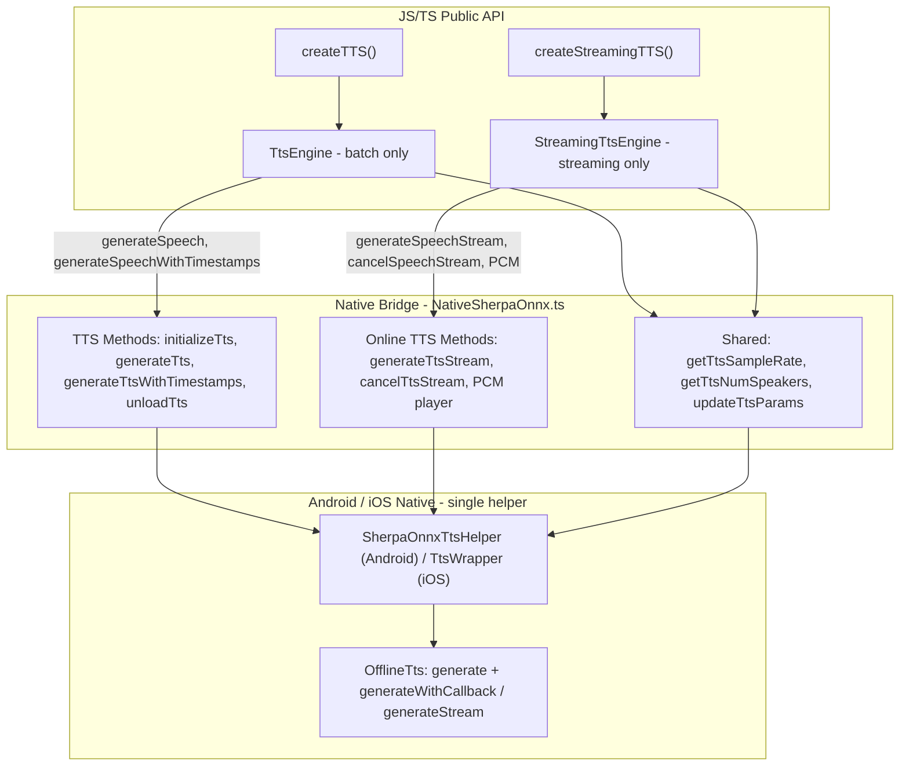

# Streaming Text-to-Speech

This guide covers the **streaming TTS** API: generate speech incrementally and receive audio chunks as they are produced. Use it for lower time-to-first-byte, playback while generating, or piping into another audio pipeline.

**Import path:** `react-native-sherpa-onnx/tts` (TTS is not exported from the main package).

## Table of contents

- [Quick usage](#quick-usage)
- [API reference](#api-reference)
- [Advanced examples & tips](#advanced-examples--tips)
- [Internal Architecture Overview](#internal-architecture-overview-batch-vs-streaming-split)

---

## Quick usage

```typescript
import { createStreamingTTS } from 'react-native-sherpa-onnx/tts';

// 1) Create streaming TTS engine (use createTTS() for batch one-shot synthesis)
const tts = await createStreamingTTS({
  modelPath: { type: 'asset', path: 'models/sherpa-onnx-vits-piper-en' },
  modelType: 'vits', // or 'auto' to detect
});

// 2) Generate speech in streaming mode with handlers
const controller = await tts.generateSpeechStream(
  'Hello, this is streaming TTS.',
  undefined,
  {
    onChunk: (chunk) => {
      // chunk.samples: float[] in [-1, 1], chunk.sampleRate, chunk.progress, chunk.isFinal
      playPcmSamples(chunk.samples, chunk.sampleRate);
    },
    onEnd: (event) => {
      if (event.cancelled) console.log('Cancelled');
      else console.log('Done');
    },
    onError: (event) => console.error('TTS error:', event.message),
  }
);

// Optional: cancel or stop listening
// await controller.cancel();
// controller.unsubscribe();

await tts.destroy();
```

**Using the built-in PCM player** (play chunks as they arrive):

```typescript
const sampleRate = await tts.getSampleRate();
await tts.startPcmPlayer(sampleRate, 1);

const controller = await tts.generateSpeechStream(text, undefined, {
  onChunk: (chunk) => {
    if (chunk.samples.length > 0) tts.writePcmChunk(chunk.samples);
  },
  onEnd: () => tts.stopPcmPlayer(),
  onError: () => tts.stopPcmPlayer(),
});

// When done or on cancel
await tts.stopPcmPlayer();
controller.unsubscribe();
```

---

## API reference

### `createStreamingTTS(options)`

```ts
function createStreamingTTS(
  options: TTSInitializeOptions | ModelPathConfig
): Promise<StreamingTtsEngine>;
```

Creates a **streaming TTS engine** for incremental generation with chunk callbacks and PCM playback. Use `createTTS()` from the same package for batch one-shot synthesis (`generateSpeech`, `generateSpeechWithTimestamps`). Call `engine.destroy()` when done.

---

### `StreamingTtsEngine.generateSpeechStream(text, options, handlers)`

```ts
tts.generateSpeechStream(
  text: string,
  options: TtsGenerationOptions | undefined,
  handlers: TtsStreamHandlers
): Promise<TtsStreamController>;
```

Starts **streaming** TTS for the given text. Audio is delivered via the `onChunk` callback as it is generated. Returns a **controller** to cancel or unsubscribe. Only one stream per engine can run at a time; starting another while one is active rejects with `TTS_STREAM_ERROR`.

**Parameters:**

| Parameter | Type | Description |
|-----------|------|-------------|
| `text` | `string` | Text to synthesize. |
| `options` | `TtsGenerationOptions \| undefined` | Optional generation options (see below). |
| `handlers` | `TtsStreamHandlers` | Callbacks: `onChunk`, `onEnd`, `onError`. |

**`TtsGenerationOptions`** (same as for `generateSpeech`):

| Option | Type | Description |
|--------|------|-------------|
| `sid` | `number` | Speaker ID for multi-speaker models. Default: `0`. |
| `speed` | `number` | Speed multiplier. 1.0 = normal. Default: `1.0`. |
| `silenceScale` | `number` | Silence scale at generate time. |
| `referenceAudio` | `{ samples: number[]; sampleRate: number }` | For voice cloning (e.g. Pocket TTS). |
| `referenceText` | `string` | Transcript of reference audio (Pocket TTS). |
| `numSteps` | `number` | e.g. flow-matching steps (Pocket). |
| `extra` | `Record<string, string>` | Model-specific options. |

**Returns:** `Promise<TtsStreamController>`.

---

### `TtsStreamHandlers`

| Property | Type | Description |
|----------|------|-------------|
| `onChunk?` | `(chunk: TtsStreamChunk) => void` | Called for each audio chunk. |
| `onEnd?` | `(event: TtsStreamEnd) => void` | Called when generation finishes or is cancelled. Listeners are auto-removed after this. |
| `onError?` | `(event: TtsStreamError) => void` | Called on error. Listeners are auto-removed after this. |

---

### `TtsStreamChunk`

| Field | Type | Description |
|-------|------|-------------|
| `instanceId?` | `string` | Engine instance id (for multi-instance routing). |
| `requestId?` | `string` | Request id for this generation (distinguishes concurrent streams). |
| `samples` | `number[]` | PCM samples, float in [-1, 1]. |
| `sampleRate` | `number` | Sample rate in Hz. |
| `progress` | `number` | Progress 0…1. |
| `isFinal` | `boolean` | True for the last chunk. |

---

### `TtsStreamEnd`

| Field | Type | Description |
|-------|------|-------------|
| `instanceId?` | `string` | Engine instance id. |
| `requestId?` | `string` | Request id. |
| `cancelled` | `boolean` | True if generation was cancelled. |

---

### `TtsStreamError`

| Field | Type | Description |
|-------|------|-------------|
| `instanceId?` | `string` | Engine instance id. |
| `requestId?` | `string` | Request id. |
| `message` | `string` | Error message. |

---

### `TtsStreamController`

Returned by `generateSpeechStream`. Use it to cancel or remove listeners.

| Method | Signature | Description |
|--------|-----------|-------------|
| `cancel` | `() => Promise<void>` | Stops the ongoing generation and removes event listeners. |
| `unsubscribe` | `() => void` | Removes event listeners only. Call after completion or when you no longer need the stream. |

Listeners are **automatically** removed when `onEnd` or `onError` is invoked. Call `unsubscribe()` manually if you discard the controller without waiting for end/error (e.g. navigation away).

---

### `StreamingTtsEngine` (summary)

| Member | Description |
|--------|-------------|
| `instanceId` | Read-only engine id. |
| `generateSpeechStream(text, options, handlers)` | Start streaming generation; returns `TtsStreamController`. |
| `cancelSpeechStream()` | Cancel the current stream. |
| `startPcmPlayer(sampleRate, channels)` | Start built-in PCM playback (e.g. mono = 1). |
| `writePcmChunk(samples)` | Write float PCM samples to the player. Use from `onChunk`. |
| `stopPcmPlayer()` | Stop and release the PCM player. |
| `getModelInfo()`, `getSampleRate()`, `getNumSpeakers()` | Model info and sample rate. |
| `destroy()` | Release native resources. |

---

### Types and imports

Import from `react-native-sherpa-onnx/tts`:

```ts
import { createStreamingTTS } from 'react-native-sherpa-onnx/tts';
import type {
  StreamingTtsEngine,
  TtsStreamController,
  TtsStreamHandlers,
  TtsStreamChunk,
  TtsStreamEnd,
  TtsStreamError,
  TtsGenerationOptions,
} from 'react-native-sherpa-onnx/tts';
```

---

## Advanced examples & tips

### Play while generating (low latency)

Start the PCM player at the model’s sample rate, then feed chunks from `onChunk`:

```typescript
const tts = await createStreamingTTS({ modelPath: { type: 'asset', path: 'models/vits-piper-en' }, modelType: 'vits' });
const sampleRate = await tts.getSampleRate();
await tts.startPcmPlayer(sampleRate, 1);

const controller = await tts.generateSpeechStream(longText, { speed: 1.0 }, {
  onChunk: (chunk) => {
    if (chunk.samples.length > 0) tts.writePcmChunk(chunk.samples);
  },
  onEnd: (e) => {
    tts.stopPcmPlayer();
    if (e.cancelled) console.log('Cancelled');
  },
  onError: (err) => {
    tts.stopPcmPlayer();
    console.error(err.message);
  },
});

// To cancel mid-stream:
// await controller.cancel();
```

### Cancel and cleanup

Use the controller to cancel and ensure listeners are removed:

```typescript
const controller = await tts.generateSpeechStream(text, undefined, handlers);

// User taps "Stop"
await controller.cancel();  // stops generation and unsubscribes
```

If you don’t call `cancel()`, call `controller.unsubscribe()` when you’re done (e.g. on screen unmount) to avoid leaking listeners. After `onEnd` or `onError`, listeners are removed automatically.

### Multiple requests on one engine

Only one **stream** can be active per engine at a time. For concurrent or back-to-back requests:

- **Option A:** Use one engine and wait for `onEnd` (or cancel) before calling `generateSpeechStream` again.
- **Option B:** Create multiple engines (e.g. one per “voice” or channel) and call `generateSpeechStream` on different instances.

Events are tagged with `instanceId` and `requestId`, so you can safely use multiple engines and still route events correctly.

### Speed and speaker

Pass the same options as for non-streaming `generateSpeech`:

```typescript
await tts.generateSpeechStream(
  'Faster speech.',
  { speed: 1.5, sid: 0 },
  handlers
);
```

### Error handling

Always implement `onError` so failures are visible and you can stop playback or UI:

```typescript
{
  onChunk: (chunk) => play(chunk.samples, chunk.sampleRate),
  onEnd: (e) => { if (!e.cancelled) setStatus('done'); },
  onError: (e) => {
    setStatus('error');
    setError(e.message);
  },
}
```

### Recording or saving streamed audio

Accumulate samples from `onChunk` and pass to your save/record API (e.g. WAV writer or `saveAudioToFile` with the full buffer after `onEnd`):

```typescript
const chunks: number[] = [];
let sampleRate = 0;

const controller = await tts.generateSpeechStream(text, undefined, {
  onChunk: (chunk) => {
    sampleRate = chunk.sampleRate;
    chunks.push(...chunk.samples);
  },
  onEnd: async () => {
    if (chunks.length > 0) {
      await saveAudioToFile({ samples: chunks, sampleRate }, outputPath);
    }
  },
  onError: () => {},
});
```

### Cleanup and guards

- Call `tts.destroy()` when the engine is no longer needed.
- After `destroy()`, calling any engine method will throw.
- Only one active streaming generation per engine; starting a second one before the first finishes rejects with `TTS_STREAM_ERROR`.

## Internal Architecture Overview – batch vs streaming split

TTS uses two JS engines (batch and streaming) with a single native helper:



On both Android and iOS, **one** native TTS helper serves both batch (`createTTS`) and streaming (`createStreamingTTS`). Streaming uses `generateTtsStream` (with `requestId` for event routing), `cancelTtsStream`, and optional PCM player APIs; events `ttsStreamChunk`, `ttsStreamEnd`, and `ttsStreamError` include `requestId` so the JS layer can match them to the correct request.