# Sherpa ONNX Example App

This app is the integration playground for [react-native-sherpa-onnx](../README.md) inside the monorepo `example/` folder. It is used to validate model setup, runtime behavior, and UI flows against the current SDK APIs on Android and iOS.

The screens cover both offline and streaming pipelines, including STT, TTS, enhancement, source separation, punctuation, VAD, timestamp/alignment generation, spoken language identification, and model lifecycle workflows such as runtime downloads and extraction. The app also includes pipeline buffer flows (audio/text/segment buffers), live ingestion paths, and execution-provider diagnostics in Settings.

For SDK-level feature docs, start from [docs/README.md](../docs/README.md) and then open the feature guides linked in each section below.

## Run and setup

Run all commands from `example/`:

```sh
yarn install
yarn start
```

Android:

```sh
yarn android
```

iOS:

```sh
bundle install
yarn ios
```

## Bundling models & test assets (offline / without download manager)

If you do not want to download models at runtime via the **Download Manager Showcase**, you can bundle model folders and test assets directly into the application before building.

### Folder locations

| Asset type | Android location | iOS location |
| --- | --- | --- |
| **Models** | `android/app/src/main/assets/models/<model-id>/` | `ios/sherpa_models/models/<model-id>/` |
| **Test audio WAVs** | `android/app/src/main/assets/test_wavs/` | `ios/sherpa_models/test_wavs/` |
| **Codec samples** | `android/app/src/main/assets/test_codec/` | `ios/sherpa_models/test_codec/` |

> **Cross-Platform Sharing:** You do not need to duplicate large model files into both platform folders manually:
> - **iOS Build (`Xcode`):** The Xcode build phase automatically pulls models and test audios from both `android/app/src/main/assets/models/` and `ios/sherpa_models/models/` into the iOS app bundle (`App.app/models/`).
> - **Android Build (`Gradle`):** The `syncModelsFromIos` task automatically detects and copies any models placed in `ios/sherpa_models/models/` into the Android assets directory before compilation.
>
> Placing a model in either location (or both) makes it discoverable via `listAssetModels()` and immediately usable offline across all feature screens.

## Download manager showcase


|  |  |  |
| --- | --- | --- |
|     |     |     |


This screen exercises the runtime model delivery flow from [docs/download-manager.md](../docs/download-manager.md). It covers refresh, metadata lookup, download, extraction, pause/resume for both download and extraction phases, cleanup of incomplete state, and deletion of installed models. It is the main screen for testing real-world model lifecycle behavior before opening STT/TTS/VAD feature screens.

## Speech-to-Text (offline)


|  |  |  |
| --- | --- | --- |
|     |     |     |


This screen initializes offline STT engines and runs file-based transcription through pipeline buffers. It can work with bundled assets and downloaded model folders, detects STT model type, and supports offline text buffer inspection (text/tokens/timestamps/durations and metadata fields). It also includes playback and route-selection hooks used during local verification of [docs/stt-offline.md](../docs/stt-offline.md).

## Text-to-Speech (offline)


|  |  |  |
| --- | --- | --- |
|     |     |     |


This screen focuses on offline synthesis with [docs/tts-offline.md](../docs/tts-offline.md) APIs. It supports model detection/initialization, synthesis options, optional voice-cloning inputs for supported model families, playback through PCM, and saving generated audio with [docs/audio-conversion.md](../docs/audio-conversion.md). It also exposes segmented synthesis toggles used for memory-conscious runs.

## Speech-to-Text (streaming)


|  |  |  |
| --- | --- | --- |
|     |     |     |


This screen streams long files through LiveAudioBuffer to LiveTextBuffer with a streaming STT engine, mainly for low-latency transcript updates and avoiding large offline decode peaks. It shows segment count, committed transcript, and partial transcript state while ingesting audio, matching [docs/stt-streaming.md](../docs/stt-streaming.md).

## Text-to-Speech (streaming)


|  |  |  |
| --- | --- | --- |
|     |     |     |


This screen tests live TTS by pushing text chunks into a live text pipeline and synthesizing into a live audio buffer. It is used to validate low time-to-first-audio behavior, flush/cancel lifecycle, and final buffer playback, aligned with the live-overload guidance in [docs/tts-offline.md](../docs/tts-offline.md).

## Offline Pipeline Showcase (File -> STT -> TTS -> playback)


|  |  |  |
| --- | --- | --- |
|     |     |     |


This screen demonstrates an end-to-end offline chain from file input to offline STT, then offline TTS, followed by playback/final output handling. It is the reference for batch-style orchestration and segmented offline processing flows in a single pipeline scenario.

## Live Pipeline Showcase (Mic/File -> STT -> TTS -> playback)


|  |  |  |
| --- | --- | --- |
|     |     |     |


This screen demonstrates an end-to-end live pipeline: source input (mic/file) to streaming STT, then incremental TTS, then PCM playback with runtime metrics and finalize/save output flow. It is the main integration example for live buffer chaining and low-latency pipeline orchestration.

## Alignment (subtitles/timestamps)


|  |  |  |
| --- | --- | --- |
|     |     |     |


This screen generates subtitle/timestamp segments from audio and transcript inputs. It validates alignment modes (`proportional`, `estimated`, and `accurate`) and includes anchor/VAD-assisted workflows where applicable. See [docs/alignment-offline.md](../docs/alignment-offline.md), [docs/segmentation-engine.md](../docs/segmentation-engine.md), and [docs/vad-streaming.md](../docs/vad-streaming.md).

## Speech enhancement (offline)


|  |  |  |
| --- | --- | --- |
|     |     |     |


This screen runs offline enhancement over prepared input buffers, supports segmented mode toggles, and allows saving/playback of enhanced output. It is used for validating GTCRN/DPDFNet model behavior via [docs/enhancement-offline.md](../docs/enhancement-offline.md).

## Speech enhancement (streaming)


|  |  |  |
| --- | --- | --- |
|     |     |     |


This screen streams source audio through live enhancement pipelines, including ingest controls and output finalization. It is mainly used to test long-input handling and live pipeline lifecycle from [docs/enhancement-streaming.md](../docs/enhancement-streaming.md).

## Voice Activity Detection


|  |  |  |
| --- | --- | --- |
|     |     |     |


This screen supports both live and offline VAD flows, including file and microphone input for live mode, plus segment timeline inspection and status polling. It validates segment buffer behavior and VAD summaries against [docs/vad-streaming.md](../docs/vad-streaming.md).

## Punctuation (offline)


|  |  |  |
| --- | --- | --- |
|     |     |     |


This screen tests offline CT-Transformer punctuation with text buffers, model detection, optional segmented processing, and copy/export flows for punctuated output. It maps to [docs/punctuation-offline.md](../docs/punctuation-offline.md).

## Punctuation (streaming)


|  |  |  |
| --- | --- | --- |
|     |     |     |


This screen runs online punctuation over live text buffers. It shows incremental input append, optional segmentation attach mode, pipeline completion, and final live output extraction, aligned with [docs/punctuation-streaming.md](../docs/punctuation-streaming.md).

## File I/O showcase


|  |  |  |
| --- | --- | --- |
|     |     |     |


This screen validates file and conversion workflows, including loading local assets/files and exporting generated or transformed audio outputs. It is the UI reference for [docs/fileio.md](../docs/fileio.md) and [docs/audio-conversion.md](../docs/audio-conversion.md).

**Codec sandbox (`test_codec/`):** bundled samples for probe/decode/encode round-trips. Add files listed in `example/android/app/src/main/assets/test_codec/README.md` (Android) and `example/ios/sherpa_models/test_codec/README.md` (iOS), then rebuild. Android FileSource: `{ kind: 'app', base: 'apkAsset', path: 'test_codec/sample.<ext>' }` (APK `assets/`, not sandbox `files/`).

## Audio visualization showcase


|  |  |  |
| --- | --- | --- |
| Static (`levels`) | Heatmap (`frames`) | Pseudo-3D (`frames`, Skia) |


Open **Audio visualization** from Home. The screen runs one `computeAudioVisualizationProfile` call (timeline enabled), then renders SDK data in four tabs: **Static**, **Animated**, **Heatmap**, and **3D**.

- **Static** — mirrored bar chart from global `levels`.
- **Animated** — same bars driven by timeline frame index (playback scrub).
- **Heatmap** — time × frequency grid from `frames`.
- **3D** — example UI only: isometric bars in Skia from per-frame levels; not a native SDK 3D feature.

Implementation: `example/src/screens/audio-visualization/AudioVisualizationScreen.tsx` and `example/src/components/SpectrumBarsView.tsx`, `SpectrumHeatmapView.tsx`, `Spectrum3DView.tsx`. API reference: [docs/audio-visualization.md](../docs/audio-visualization.md).

## Segmentation showcase


|  |  |  |
| --- | --- | --- |
|  |  |  |


This screen demonstrates segmentation policies for audio and text pipelines to keep processing bounded and memory usage predictable on long inputs. It maps to [docs/segmentation-engine.md](../docs/segmentation-engine.md).

## Settings and provider diagnostics


|  |  |  |
| --- | --- | --- |
|     |     |     |


The Settings screen (gear button on Home) provides runtime diagnostics for acceleration backends and provider availability. It exposes checks for QNN, NNAPI, XNNPACK, Core ML, and available providers, plus app/SDK version display. This is used for environment verification before running model-heavy screens. See [docs/execution-providers.md](../docs/execution-providers.md).

## Source separation (offline)

| 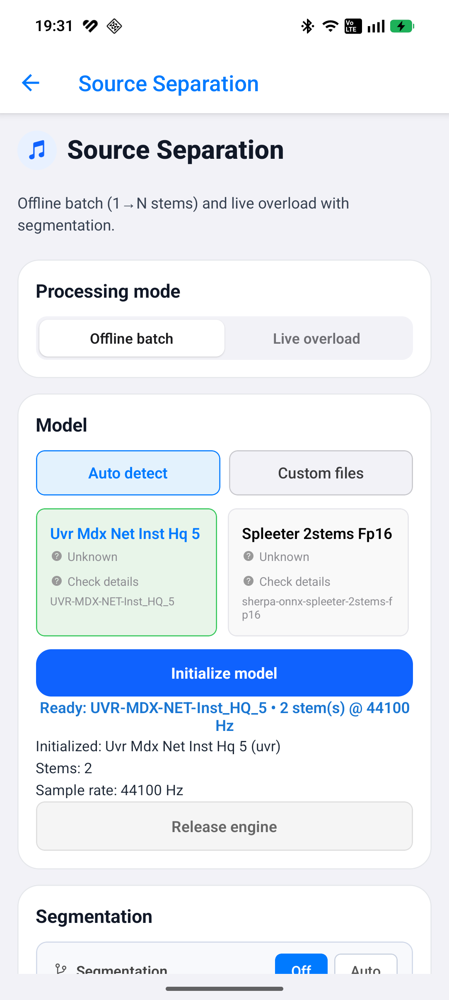 | 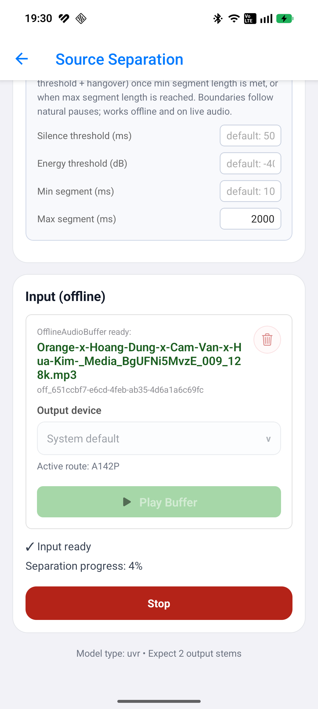 | 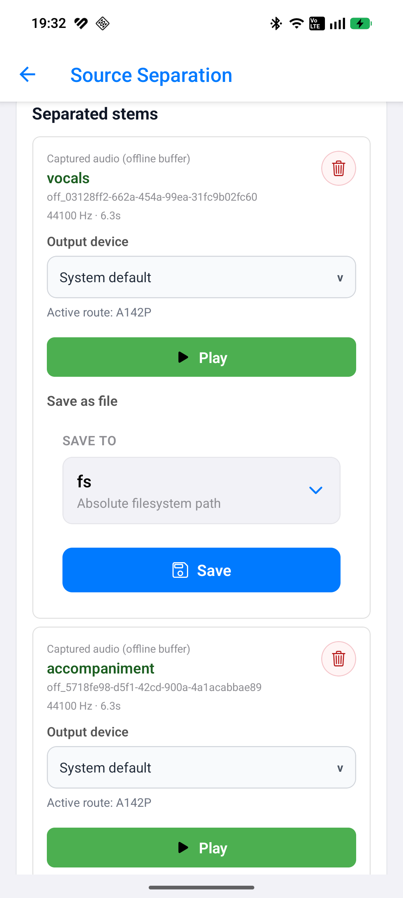 |
| --- | --- | --- |

This screen initializes offline separation engines (Spleeter or UVR) with auto or custom init, ingests a mixed audio file into an offline input buffer, and runs batch separation into N empty stem output buffers (vocals + accompaniment by default). It supports optional offline segmentation (`mode: 'auto'`) for long mixes, per-stem playback and save, and progress display during segmented runs. Models can come from bundled assets, the download manager (`ModelCategory.Separation`), or local folders — see [docs/separation-offline.md](../docs/separation-offline.md), [docs/model-detect.md](../docs/model-detect.md), and [ios/sherpa_models/README.md](./ios/sherpa_models/README.md) for iOS bundle layout.

## Source separation (live overload)

| 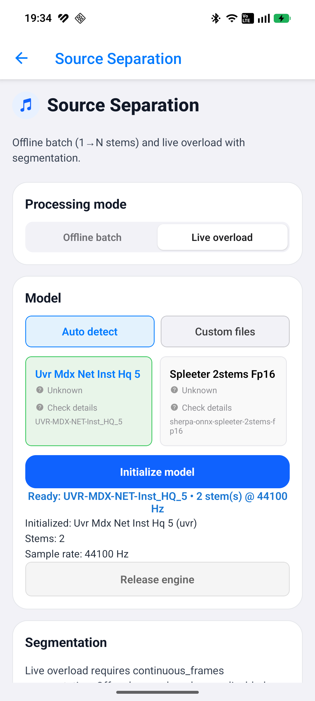 | 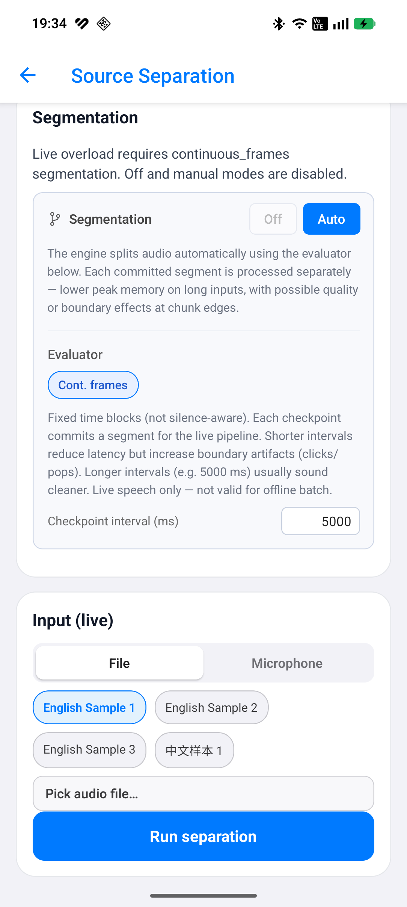 | 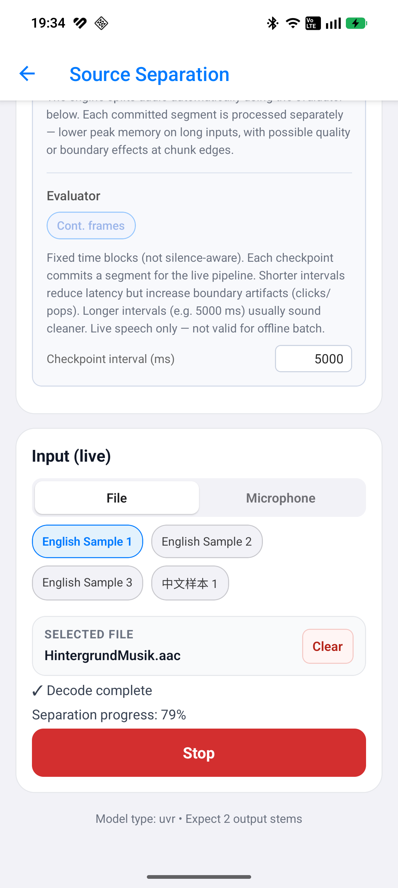 |
| --- | --- | --- |

This screen streams mixed audio from a file or microphone into live input buffers, runs separation via live overload into N live stem output buffers, and shows phased progress (decode → separation). Segmentation uses mandatory `continuous_frames` policy (configurable checkpoint interval). It validates stop/restart lifecycle, finalize/flush ordering, and stem playback from live buffers. See [docs/separation-streaming.md](../docs/separation-streaming.md), [docs/segmentation-engine.md](../docs/segmentation-engine.md), and [docs/memory-and-models.md](../docs/memory-and-models.md).

## Speaker identification

| 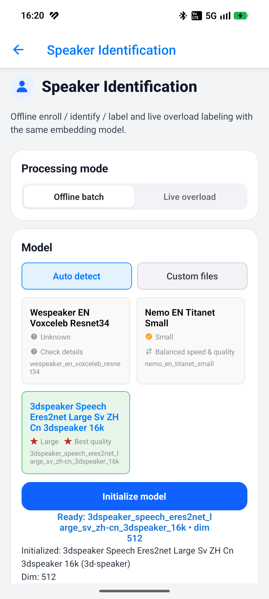 | 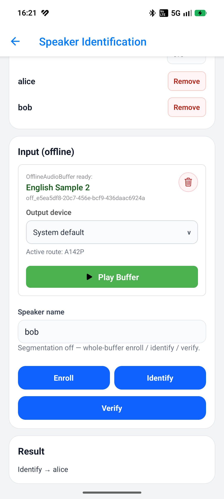 | 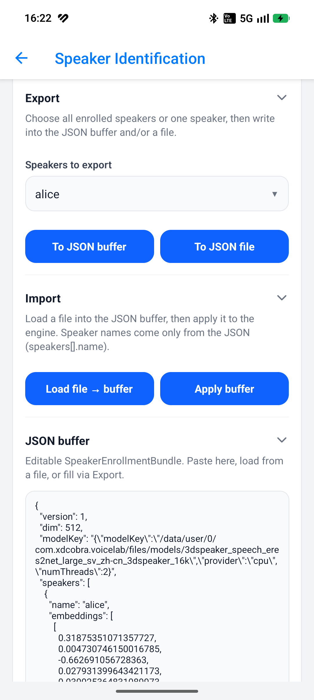 |
| --- | --- | --- |

This screen enrolls named speakers from offline audio, then identify / verify / label speech segments. Toggle **Offline batch** vs **Live overload** (same embedding weights). Auto or custom model init (`ModelCategory.SpeakerEmbedding`). Offline segmentation can be Off (whole-buffer) or Auto (`segmentOfflineBuffer` → `enrollOfflineSegments` / `labelOfflineSegments`). Live labeling requires mandatory speech segmentation (`speech_energy_silence` / `speech_vad_model`) over file ingest or mic. Includes export/import of the enrollment JSON bundle. See [docs/speaker-identification-offline.md](../docs/speaker-identification-offline.md) and [docs/speaker-identification-live.md](../docs/speaker-identification-live.md).

## Spoken language identification (offline)

| 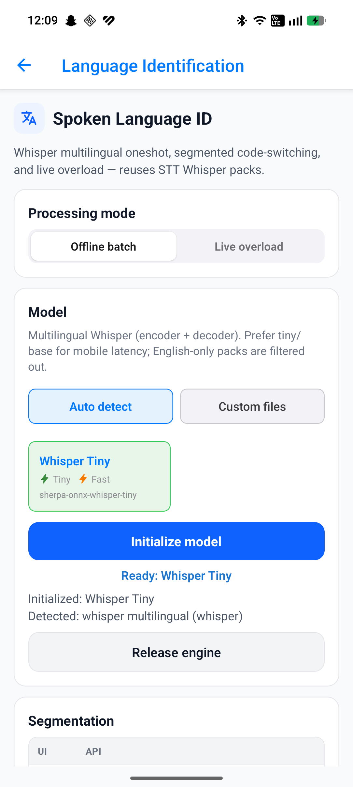 | 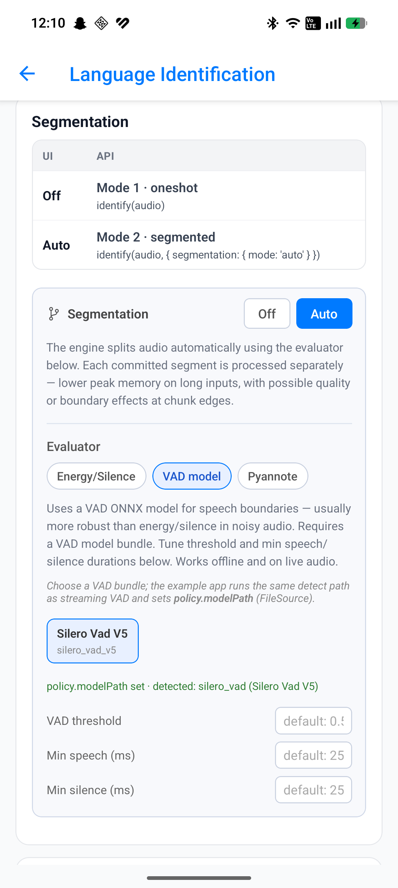 | 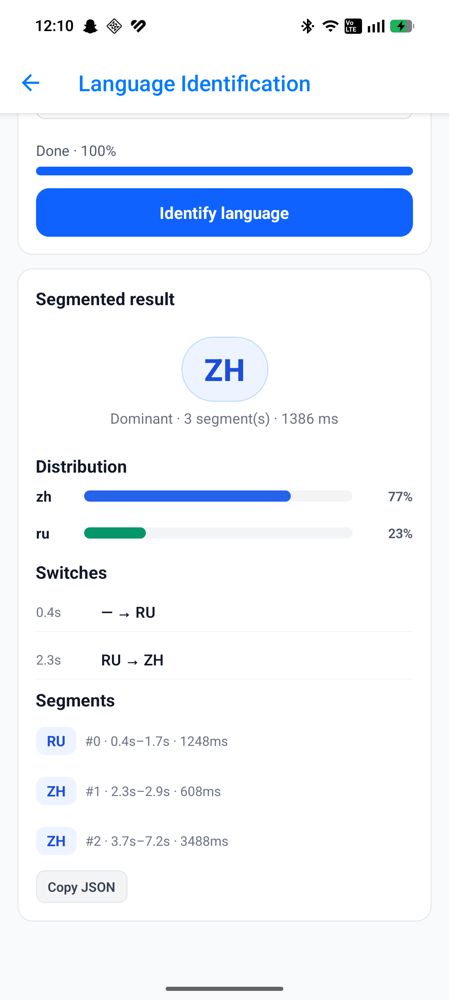 |
| --- | --- | --- |

Home → **Language identification (SLID)** → **Offline batch**. Initializes multilingual Whisper (`createLanguageIdentification` / `ModelCategory.LanguageId`, reusing STT Whisper packs). Segmentation **Off** = Mode 1 oneshot `identify(audio)` (★ English Sample 1); **Auto** = Mode 2 segmented code-switching with distribution bars, switch timeline, and per-segment list (★ ZH↔EN meeting / `2-zh-en.wav`). See [docs/language-identification.md](../docs/language-identification.md).

## Spoken language identification (live overload)

| 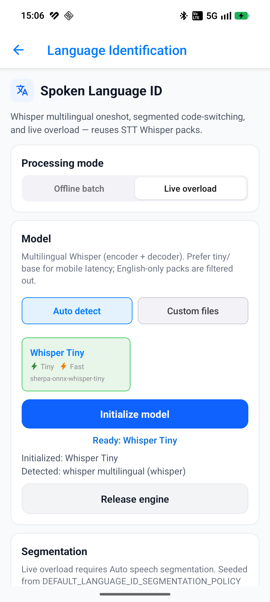 | 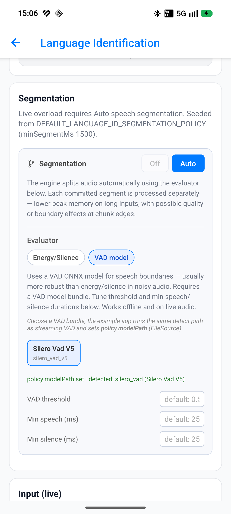 | 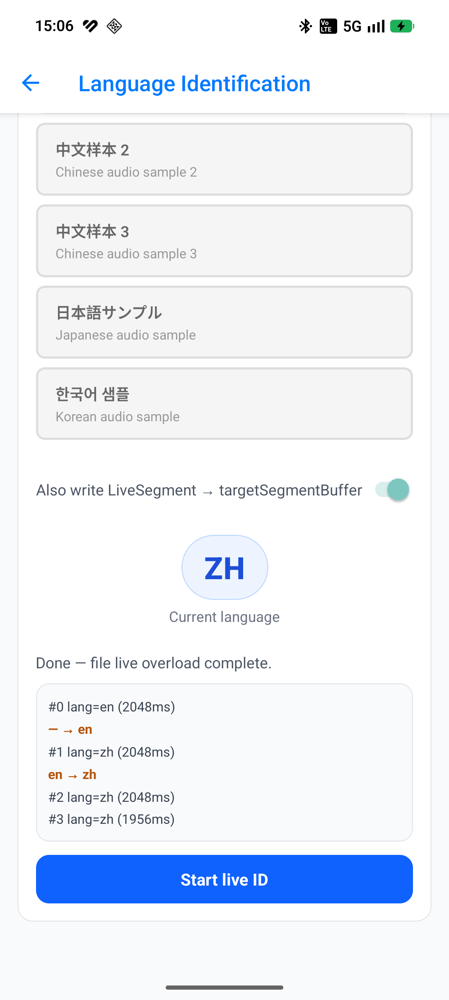 |
| --- | --- | --- |

Same screen, toggle **Live overload**. Mode 3 `identify(liveAudio, liveText, { segmentation })` with mandatory speech segmentation (seeded `minSegmentMs: 1500`). File (★ ZH↔EN) or mic ingest; current-language chip + `onLanguageChanged` event log; optional live `targetSegmentBuffer` for `LanguageIdSpeechSegmentPayload`. See [docs/language-identification.md](../docs/language-identification.md) and [docs/streaming-pipelines-overview.md](../docs/streaming-pipelines-overview.md).

## Speaker diarization (offline)

| 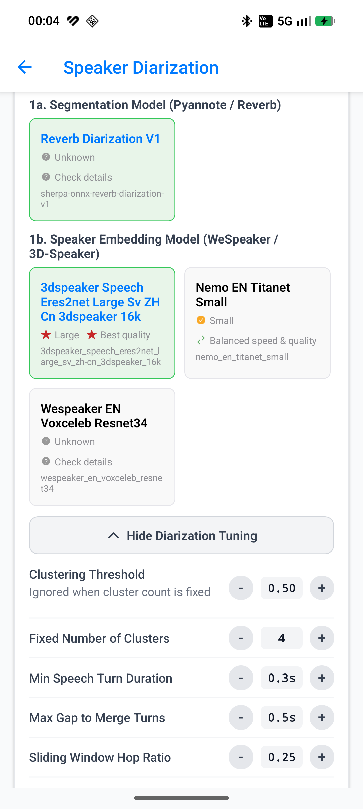 | 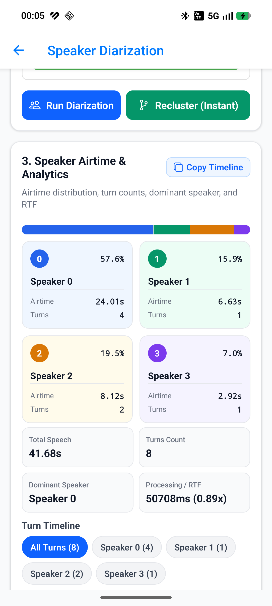 | 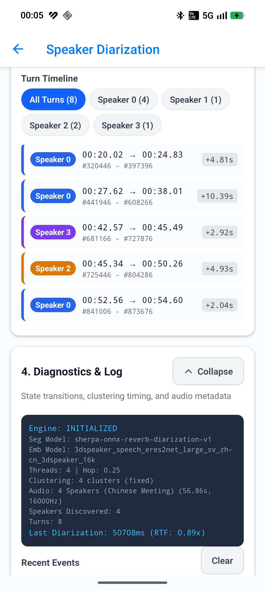 |
| --- | --- | --- |

This screen evaluates multi-speaker audio recordings with offline diarization engines (Pyannote segmentation or Reverb models). It ingests full audio into offline buffers, runs speaker clustering, and extracts timestamps and speaker labels into an offline segment buffer (`kind: 'diarization'`). It also demonstrates integration with Speaker Identification (SID) via `mapDiarizationToNames` to resolve anonymous speaker clusters into enrolled names. See [docs/diarization-offline.md](../docs/diarization-offline.md) and [docs/diarization-named-timeline.md](../docs/diarization-named-timeline.md).

## Speaker diarization (streaming)

| 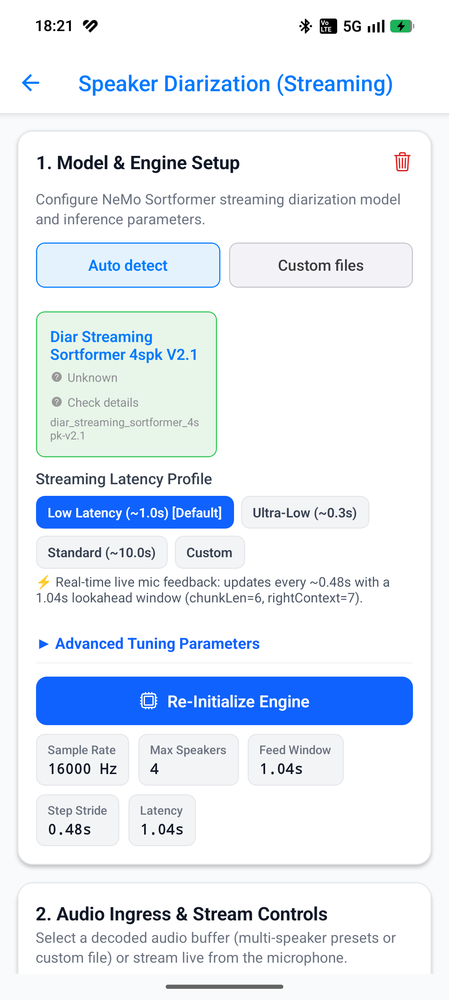 | 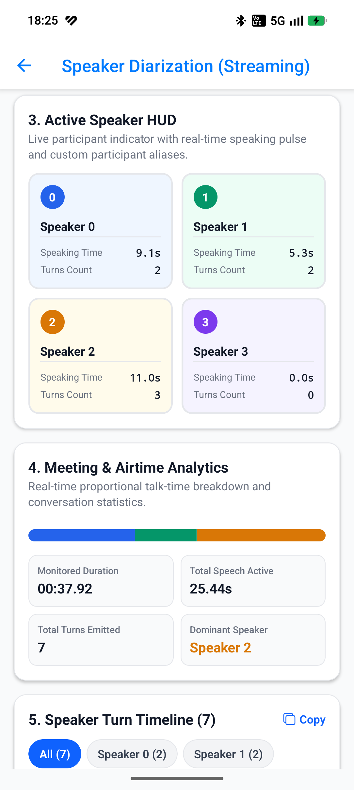 | 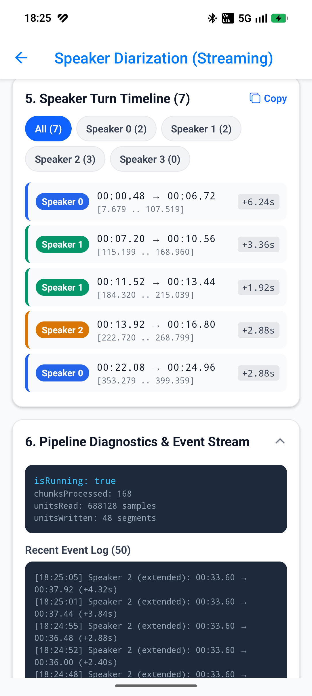 |
| --- | --- | --- |

This screen demonstrates true real-time streaming speaker diarization powered by Sortformer ONNX models. It streams live audio from a microphone or test audio files directly into the native streaming engine, outputting speaker segments to a `LiveSegmentBuffer` in real time. Features include an active speaker HUD with customizable speaker aliases, meeting analytics (speaking percentages, talk times, turn counts), runtime parameter tuning (onset/offset thresholds, min durations), and full pipeline lifecycle controls (start, flush, reset, stop). See [docs/diarization-streaming.md](../docs/diarization-streaming.md).
